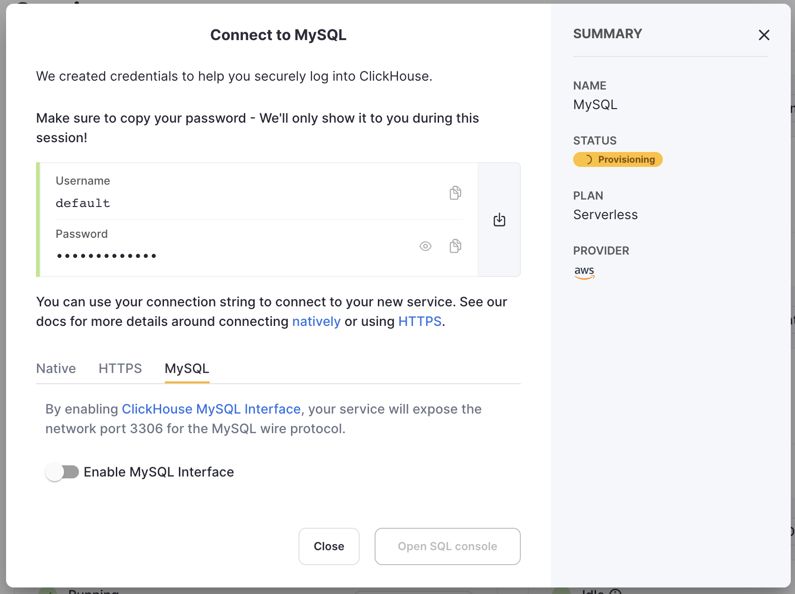
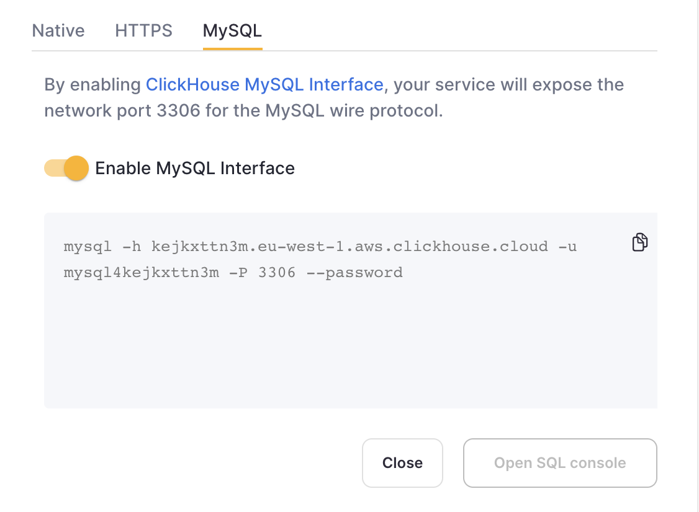
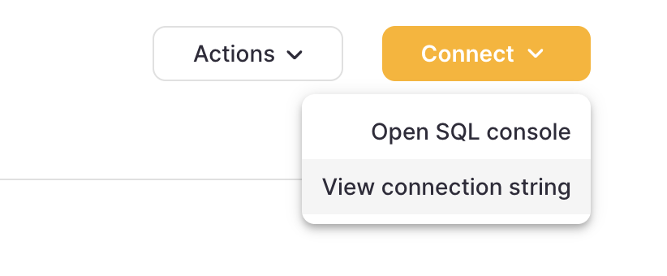
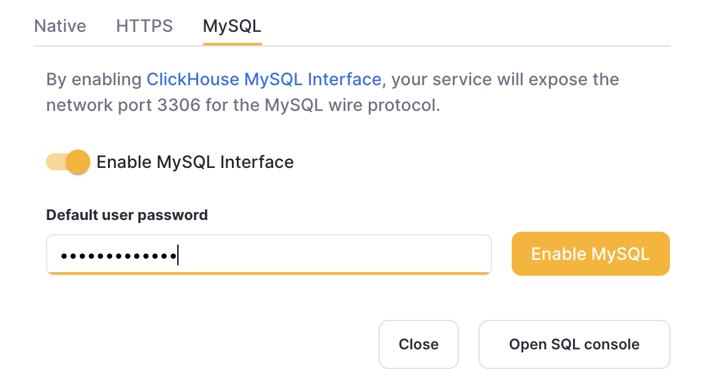
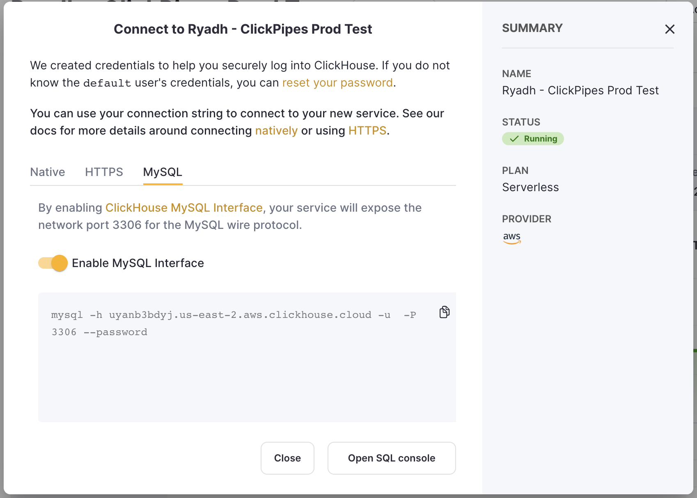

<br/>
1. After creating your ClickHouse Cloud Service, on the `Connect your app` screen, select MySQL from the drop down.
<br/>

<div class="eighty-percent">

</div>

2. Toggle the switch to enable the MySQL interface for this specific service. This will expose port `3306` for this service and prompt you with your MySQL connection screen that include your unique MySQL username. 

<br/>
<div class="eighty-percent">

</div>
<br/>

Alternatively, in order to enable the MySQL interface for an existing service:

3. Ensure your service is in `Running` state then click on the service you want to enable the MySQL interface for. Select "Connect" from the left menu:

<br/>
<div class="eighty-percent">

</div>
<br/>


4. Select MySQL from the `Connect With` drop down.

<br/>

<br/>

5. Toggle the switch to enable the MySQL interface for this specific service. This will expose port `3306` for this service and prompt you with your MySQL connection screen that include your unique MySQL username. 



## Creating multiple MySQL users in ClickHouse Cloud {#creating-multiple-mysql-users-in-clickhouse-cloud}

By default, there is a built-in `mysql4<subdomain>` user, which uses the same password as the `default` one. The `<subdomain>` part is the first segment of your ClickHouse Cloud hostname. This format is necessary to work with the tools that implement secure connection, but don't provide [SNI information in their TLS handshake](https://www.cloudflare.com/learning/ssl/what-is-sni), which makes it impossible to do the internal routing without an extra hint in the username (MySQL console client is one of such tools).

Because of this, we _highly recommend_ following the `mysql4<subdomain>_<username>` format when creating a new user intended to be used with the MySQL interface, where `<subdomain>` is a hint to identify your Cloud service, and `<username>` is an arbitrary suffix of your choice.

:::tip
For ClickHouse Cloud hostname like `foobar.us-east1.aws.clickhouse.cloud`, the `<subdomain>` part equals to `foobar`, and a custom MySQL username could look like `mysql4foobar_team1`.
:::

You can create extra users to use with the MySQL interface if, for example, you need to apply extra settings.

1. Optional - create a [settings profile](/sql-reference/statements/create/settings-profile) to apply for your custom user. For example, `my_custom_profile` with an extra setting which will be applied by default when we connect with the user we create later:

    ```sql
    CREATE SETTINGS PROFILE my_custom_profile SETTINGS prefer_column_name_to_alias=1;
    ```

    `prefer_column_name_to_alias` is used just as an example, you can use other settings there.
2. [Create a user](/sql-reference/statements/create/user) using the following format: `mysql4<subdomain>_<username>` ([see above](#creating-multiple-mysql-users-in-clickhouse-cloud)). The password must be in double SHA1 format. For example:

    ```sql
    CREATE USER mysql4foobar_team1 IDENTIFIED WITH double_sha1_password BY 'YourPassword42$';
    ```

    or if you want to use a custom profile for this user:

    ```sql
    CREATE USER mysql4foobar_team1 IDENTIFIED WITH double_sha1_password BY 'YourPassword42$' SETTINGS PROFILE 'my_custom_profile';
    ```

    where `my_custom_profile` is the name of the profile you created earlier.
3. [Grant](/sql-reference/statements/grant) the new user the necessary permissions to interact with the desired tables or databases. For example, if you want to grant access to `system.query_log` only:

    ```sql
    GRANT SELECT ON system.query_log TO mysql4foobar_team1;
    ```

4. Use the created user to connect to your ClickHouse Cloud service with the MySQL interface.

### Troubleshooting multiple MySQL users in ClickHouse Cloud {#troubleshooting-multiple-mysql-users-in-clickhouse-cloud}

If you created a new MySQL user, and you see the following error while connecting via MySQL CLI client:

```
ERROR 2013 (HY000): Lost connection to MySQL server at 'reading authorization packet', system error: 54
```

In this case, ensure that the username follows the `mysql4<subdomain>_<username>` format, as described ([above](#creating-multiple-mysql-users-in-clickhouse-cloud)).
