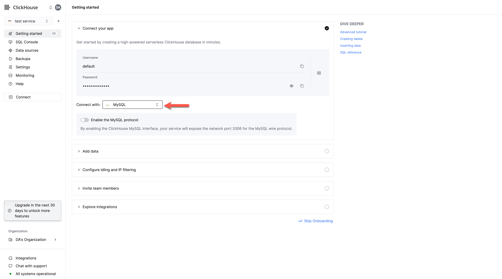
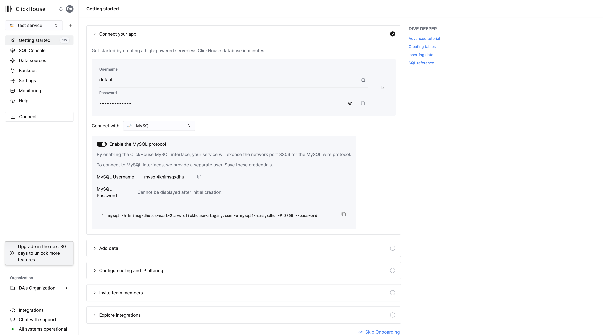
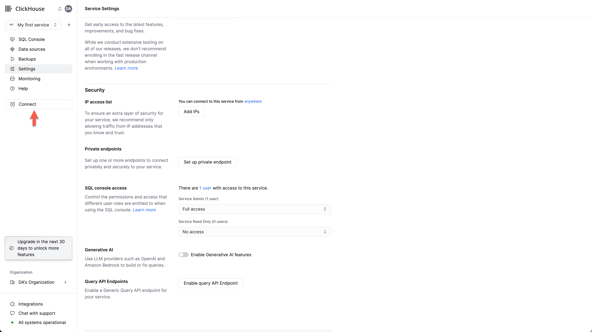
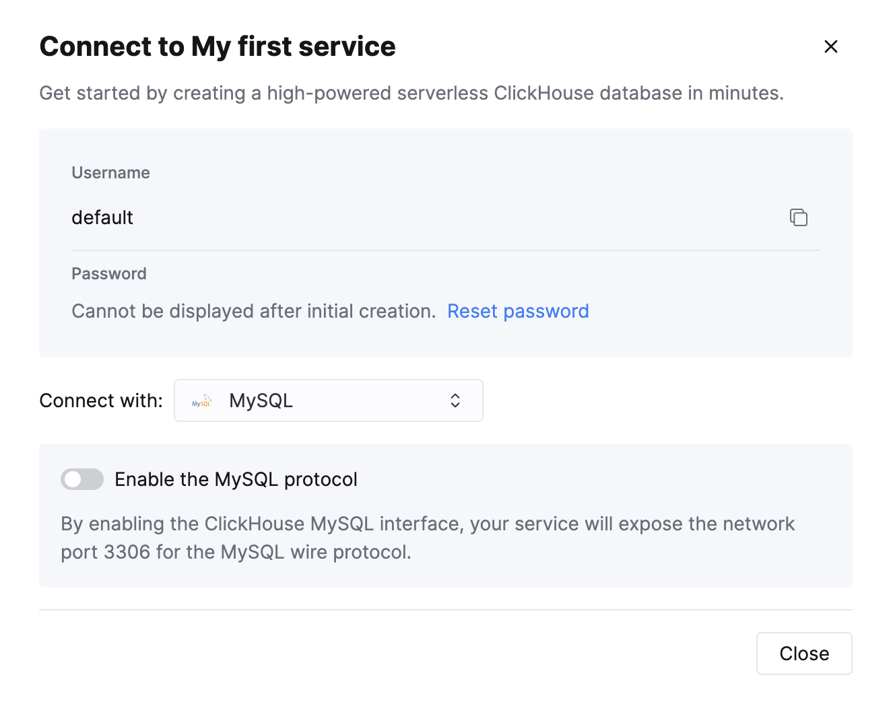
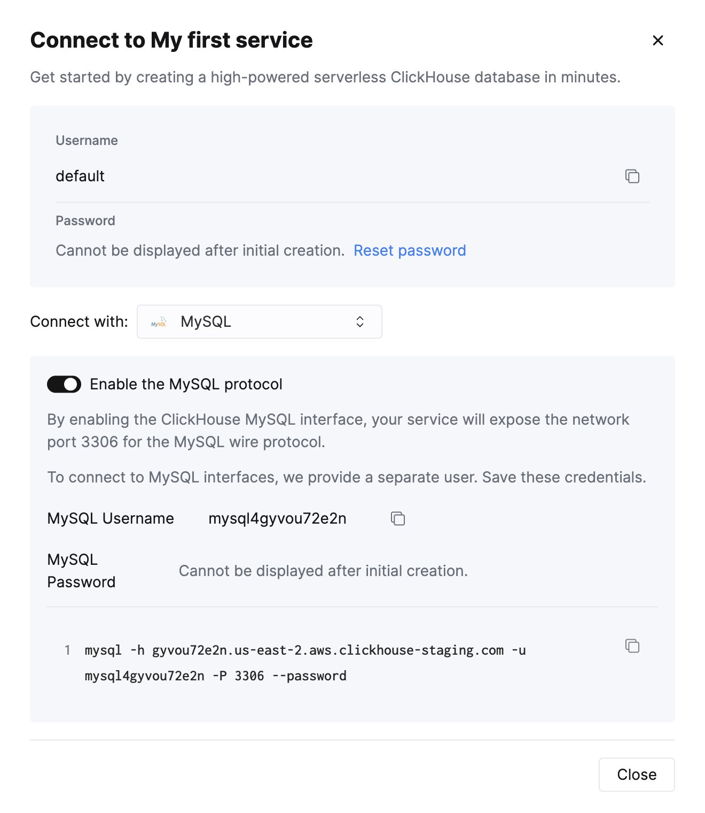

1. After creating your ClickHouse Cloud Service, on the credentials screen, select the MySQL tab

2. Toggle the switch to enable the MySQL interface for this specific service. This will expose port `3306` for this service and prompt you with your MySQL connection screen that include your unique MySQL username. The password will be the same as the service's default user password.

Alternatively, in order to enable the MySQL interface for an existing service:
3. Ensure your service is in `Running` state then click on the "View connection string" button for the service you want to enable the MySQL interface for

4. Toggle the switch to enable the MySQL interface for this specific service. This will prompt you to enter the default password.

5. After entering the password, you will get prompted the MySQL connection string for this service

