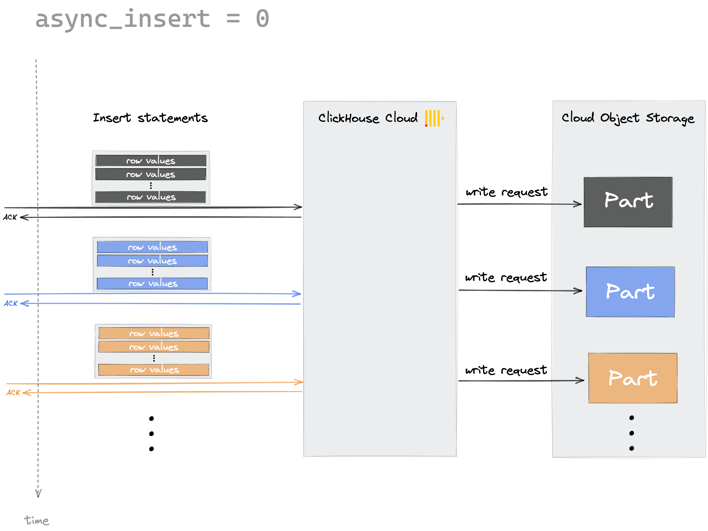
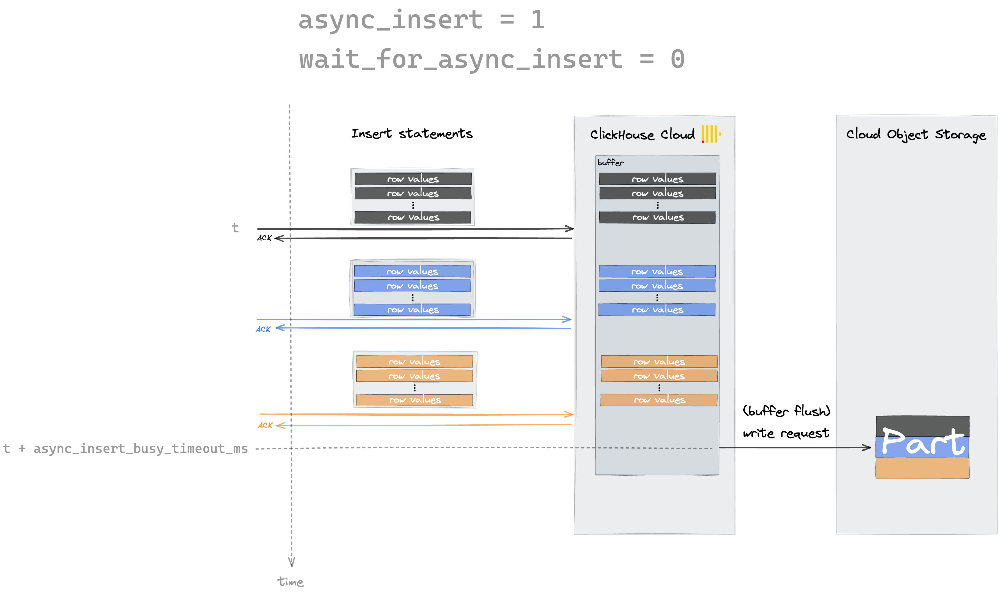
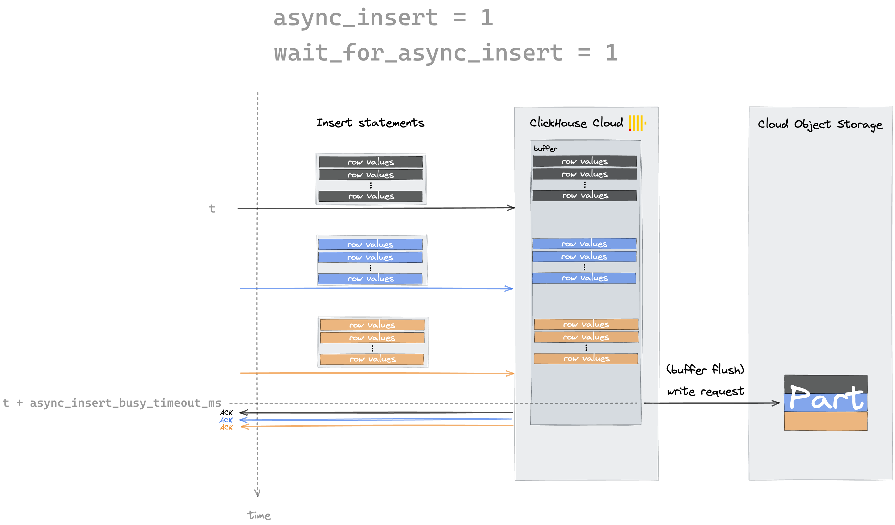

Inserting data into ClickHouse in large batches is a best practice.  It saves compute cycles and disk I/O, and therefore it saves money.  If your usecase allows you to batch your inserts external to ClickHouse, then that is one option.  If you would like ClickHouse to create the batches, then you can use the asynchronous INSERT mode described here.

Use asynchronous inserts as an alternative to both batching data on the client-side and keeping the insert rate at around one insert query per second by enabling the [async_insert](/docs/en/operations/settings/settings.md/#async-insert) setting. This causes ClickHouse to handle the batching on the server-side.

By default, ClickHouse is writing data synchronously.
Each insert sent to ClickHouse causes ClickHouse to immediately create a part containing the data from the insert.
This is the default behavior when the async_insert setting is set to its default value of 0:



By setting async_insert to 1, ClickHouse first stores the incoming inserts into an in-memory buffer before flushing them regularly to disk.

There are three possible conditions that can cause ClickHouse to flush the buffer to disk:
- buffer size has reached N KB in size (N is configurable via [async_insert_max_data_size](/docs/en/operations/settings/settings.md/#async-insert-max-data-size))
- at least N second(s) has passed since the last buffer flush (N is configurable via [async_insert_busy_timeout_ms](/docs/en/operations/settings/settings.md/#async-insert-busy-timeout-ms))
- at least N insert queries per block have been received (N is configurable via [async_insert_max_query_number](/docs/en/operations/settings/settings.md/#async-insert-max-query-number))

Everytime any of the conditions above are met, ClickHouse will flush its in-memory buffer to disk.

:::note
Your data is available for read queries once the data is written to a part on storage.
Keep that in mind, when you want to modify the async_insert_busy_timeout_ms (default value:  1 second in the cloud) or the async_insert_max_data_size (default value: 100KB) settings.
:::

With the [wait_for_async_insert](/docs/en/operations/settings/settings.md/#wait-for-async-insert) setting, you can configure if you want an insert statement to return with an acknowledgment either immediately after the data got inserted into the buffer (wait_for_async_insert = 0) or by default, after the data got written to a part after flushing from buffer (wait_for_async_insert = 1).

The following two diagrams illustrate the two settings for async_insert and wait_for_async_insert:






### Enabling asynchronous inserts

Asynchronous inserts can be enabled for a particular user, or for a specific query:

- Enabling asynchronous inserts at the user level.  This example uses the user `default`, if you create a different user then substitute that username:
  ```sql
  ALTER USER default SETTINGS async_insert = 1
  ```
- You can specify the asynchronous insert settings by using the SETTINGS clause of insert queries:
  ```sql
  INSERT INTO YourTable SETTINGS async_insert=1, wait_for_async_insert=0 VALUES (...)
  ```
- You can also specify asynchronous insert settings as connection parameters when using a ClickHouse programming language client.

  As an example, this is how you can do that within a JDBC connection string when you use the ClickHouse Java JDBC driver for connecting to ClickHouse Cloud :
  ```bash
  "jdbc:ch://HOST.clickhouse.cloud:8443/?user=default&password=PASSWORD&ssl=true&custom_http_params=async_insert=1,wait_for_async_insert=0"
  ```

:::note Automatic deduplication is disabled when using asynchronous inserts
Manual batching (see [section above](#ingest-data-in-bulk))) has the advantage that it supports the [built-in automatic deduplication](/docs/en/engines/table-engines/mergetree-family/replication.md) of table data if (exactly) the same insert statement is sent multiple times to ClickHouse Cloud, for example, because of an automatic retry in client software because of some temporary network connection issues.

Asynchronous inserts don't support this built-in automatic deduplication of table data.
:::
