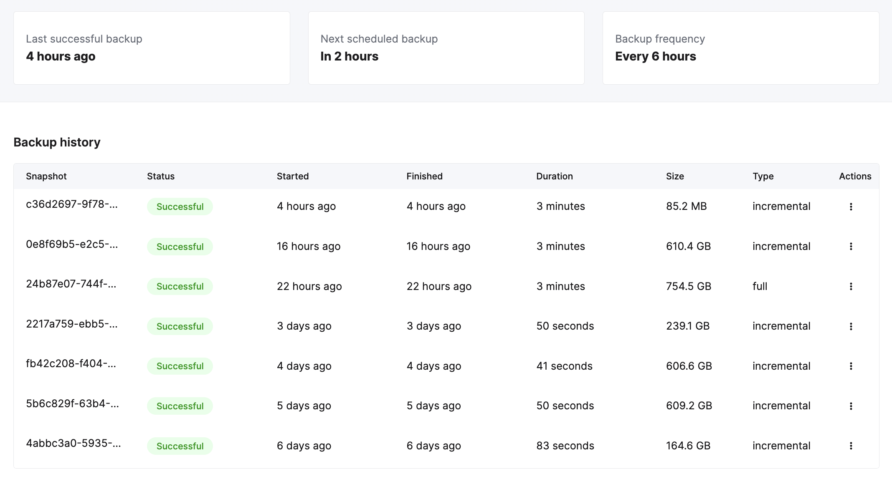

# Backups

:::note
Please do not use the `BACKUP` and `RESTORE` commands when working with ClickHouse Cloud services. Cloud backups should be managed from the UI.
:::

Database backups provide a safety net by ensuring that if data is lost for any unforeseen reason, the service can be restored to a previous state from the last successful backup. This minimizes downtime and prevents business critical data from being permanently lost. This guide covers how backups work in ClickHouse Cloud, what options you have to configure backups for your service, and how to restore from a backup.

## How backups work in ClickHouse Cloud

ClickHouse Cloud backups are a combination of "full" and "incremental" backups that constitute a backup chain. The chain starts with a full backup, and incremental backups are then taken over the next several scheduled time periods to create a sequence of backups. Once a backup chain reaches a certain length, a new chain is started. This entire chain of backups can then be utilized to restore data to a new service if needed. Once all backups included in a specific chain are past the retention timeframe set for the service (more on retention below), the chain is discarded.

In the screenshot below, the solid line squares show full backups and the dotted line squares show incremental backups. The solid line rectangle around the squares denotes the retention period and the backups that are visible to the end user, which can be used for a backup restore. In the scenario below, backups are being taken every 24 hours and are retained for 2 days.

On Day 1, a full backup is taken to start the backup chain. On Day 2, an incremental backup is taken and now we have a full and incremental backup available to restore from. By Day 7, we have one full backup and six incremental backups in the chain, with the most recent two incremental backups visible to the user. On Day 8, we take a new full backup, and on Day 9, once we have two backups in the new chain, the previous chain is discarded.


*Default backup policy and retention for the **Production** tier in Clickhouse Cloud*

## Default backup policy

ClickHouse Cloud creates a backup of your service every 24 hours. Backups for **Production** services are retained for 2 days, while backups for **Development** services are retained for 1 day. If you do not customize the backup schedule as described below, this is the backup schedule and retention policy for your service. There is no cost for default backups in ClickHouse Cloud.

## Configurable backups

ClickHouse Cloud allows you to configure the schedule for your backups for **Production** and **Dedicated** tier services. Backups can be configured along the following dimensions based on your business needs.

- **Retention**: Duration in days, for which each backup will be retained. Retention can be specified as low as 1 day, and as high as 30 days with several values to pick in between.
- **Frequency**: Frequency allows you to specify the time duration between subsequent backups. For instance, a frequency of "every 12 hours" means that backups will be spaced 12 hours apart. Frequency can range from "every 6 hours" to "every 48 hours" in the following hourly increments: 6, 8, 12, 16, 20, 24, 36, 48.
- **Start Time**: Start time for when you want to schedule backups each day. Specifying a start time implies that the backup "Frequency" will default to once every 24 hours.  Clickhouse Cloud will start the backup within an hour of the specified start time.

:::note
The custom schedule will override the default backup policy in ClickHouse Cloud for your given service.
:::

To configure the backup schedule for a service, go to the **Settings** tab in the console and click on **Change backup configuration**.


This opens another window where you can choose values for retention, frequency, and start time. You will need to save the chosen settings for them to take effect.


:::note
Start time and frequency are mutually exclusive. Start time takes precedence. 
:::

:::note
Changing the backups schedule can cause higher monthly charges for storage as some of the backups might not be covered in the default backups for the service. See “Understanding backup cost” section below.
:::

## Backup status list

Your service will be backed up based on the set schedule - whether it is the default daily schedule or a custom schedule picked by you. All available backups can be viewed from the **Backups** tab of the service. From here, you can see the status of the backup, the duration, as well as the size of the backup. You can also restore a specific backup using the **Actions** column.



## Understanding backup cost

ClickHouse Cloud includes two backups for free, but choosing a schedule that requires retaining more data, or causes more frequent backups can cause additional storage charges for backups. If you do not change the default settings, you will not incur any backup cost.

To understand the backup cost, you can view the backup cost per service from the usage screen (as shown below). Once you have backups running for a few days with a customized schedule, you can get an idea of the cost and extrapolate to get the monthly cost for backups.


Estimating the total cost for your backups requires you to set a schedule. We are also working on updating our [pricing calculator](https://clickhouse.com/pricing), so you can get a monthly cost estimate before setting a schedule. You will need to provide the following inputs in order to estimate the cost:
- Size of full and incremental backups
- Desired frequency
- Desired retention
- Cloud provider and region

:::note
Keep in mind that the estimated cost for backups will change as the size of the data in the service changes (grows) over time.
:::


## Restore a backup​

Backups are restored to a new ClickHouse Cloud service, not to the existing service from which the backup was taken.

After clicking on the **Restore** backup icon, you can specify the service name of the new service that will be created, and then restore this backup:


The new service will show in the services list as `Provisioning` until it is ready:


## Working with your restored service

After a backup has been restored, you will now have two similar services: the **original service** that needed to be restored, and a new **restored service** that was restored from a backup of the original.

Once the backup restore is complete, you should do one of the following:
- Use the new restored service and remove the original service.
- Migrate data from the new restored service back to the original service and remove the new restored service.

### Use the **new restored service**

To use the new service, perform these steps:

1. Verify that the new service has the IP Access List entries required by your use cases.
1. Verify that the new service contains the data that you need.
1. Remove the original service.

### Migrate data from the **new restored service** back to the **original service**

Suppose you cannot work with the newly restored service for any reason; for example, if you have users or applications that connect to the existing service. You may decide to migrate the newly restored data into the original service. The migration can be accomplished by following these steps:

**Allow remote access to the newly restored service**

The new service should be restored from a backup with the same IP Allow List as the original service. This is required as connections will not be allowed to other ClickHouse Cloud services unless you had allowed access from **Anywhere**. Modify the allow list and allow access from **Anywhere** temporarily. See the [IP Access List](/docs/en/cloud/security/setting-ip-filters) docs for details.

**On the newly restored ClickHouse service (the system that hosts the restored data)**

:::note
You will need to reset the password for the new service in order to access it. You can do that from the service list **Settings** tab.
:::

Add a read only user that can read the source table (`db.table` in this example):

  ```sql
  CREATE USER exporter
  IDENTIFIED WITH SHA256_PASSWORD BY 'password-here'
  SETTINGS readonly = 1;
  ```

  ```sql
  GRANT SELECT ON db.table TO exporter;
  ```

Copy the table definition:

  ```sql
  select create_table_query
  from system.tables
  where database = 'db' and table = 'table'
  ```

**On the destination ClickHouse Cloud system (the one that had the damaged table):**

Create the destination database:
  ```sql
  CREATE DATABASE db
  ```

Using the `CREATE TABLE` statement from the source, create the destination:

:::tip
Change the `ENGINE` to `ReplicatedMergeTree` without any parameters when you run the `CREATE` statement.  ClickHouse Cloud always replicates tables and provides the correct parameters.
:::

  ```sql
  CREATE TABLE db.table ...
  # highlight-next-line
  ENGINE = ReplicatedMergeTree
  ORDER BY ...
  ```

Use the `remoteSecure` function to pull the data from the newly restored ClickHouse Cloud service into your original service:

  ```sql
  INSERT INTO db.table SELECT * FROM
  remoteSecure('source-hostname', db, table, 'exporter', 'password-here')
  ```

After you have successfully inserted the data into your original service, make sure to verify the data in the service. You should also delete the new  service once the data is verified.

## Undeleting or undropping tables

The `UNDROP` command is not supported in ClickHouse Cloud. If you accidentally `DROP` a table, the best course of action is to restore your last backup and recreate the table from the backup. 

To prevent users from accidentally dropping tables, you can use [`GRANT` statements](/docs/en/sql-reference/statements/grant) to revoke permissions for the [`DROP TABLE` command](/docs/en/sql-reference/statements/drop#drop-table) for a specific user or role.

Additionally, to prevent accidental deletion of data, please note that it is not possible to drop tables >`1TB` in size in ClickHouse Cloud. Please contact support@clickhouse.com if you wish to drop tables greater than this threshold.
