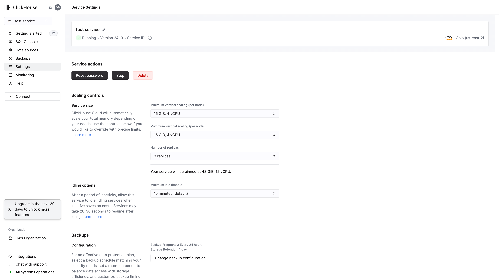

# Automatic Scaling

ClickHouse Cloud provides auto-scaling of your services. The scaling of ClickHouse Cloud Production services can be adjusted by organization members with the **Admin** role on the service **Settings** page.  Development services are always set to auto-scale and pause when idle.

## Adjust scaling

In Advanced scaling you can set the minimum and maximum **Total memory** and choose whether or not to allow automatic pausing of your service when it is inactive.

:::tip Total Memory
The amount of **Total memory** needed by your service cannot generally be determined until after a few days of the service running with its normal use.  We recommend waiting a few days before setting the minimum and maximum memory settings.
:::

:::tip Automatic pausing
Use automatic pausing only if your use case can handle a delay before responding to queries, as when a service is paused connections to the service will time out.  Automatic pausing is ideal for services that are used infrequently and where a delay can be tolerated.
:::
