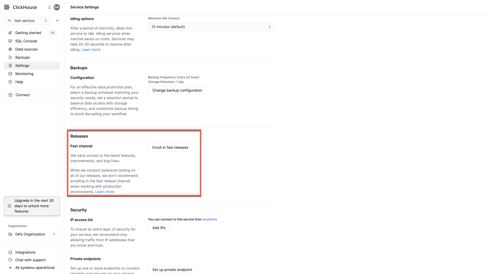
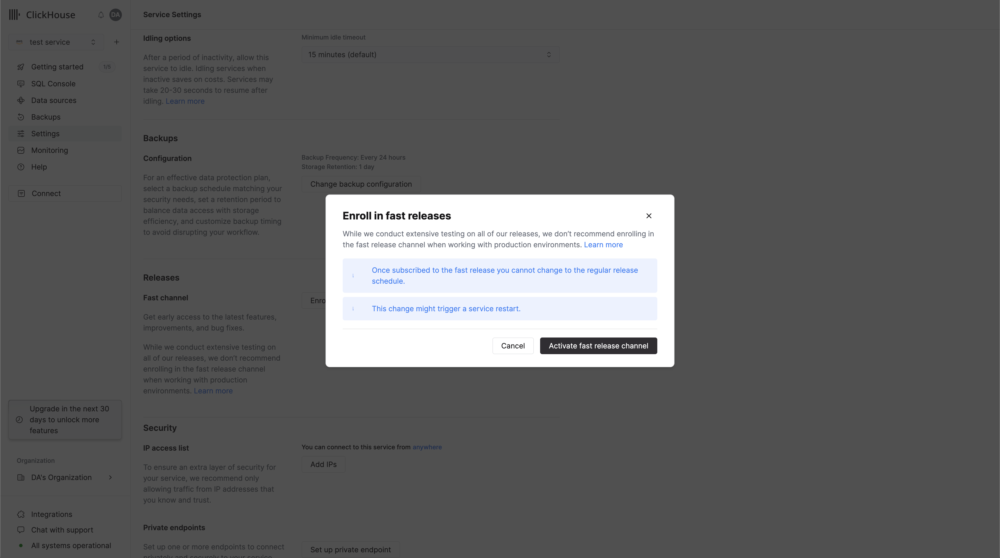
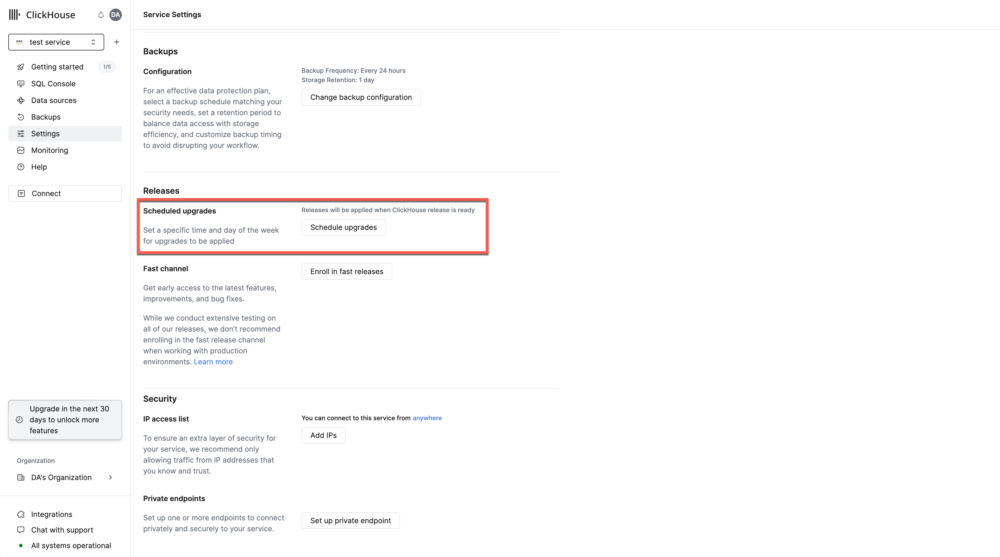
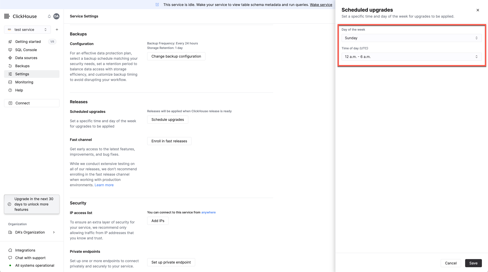

import EnterprisePlanFeatureBadge from '@theme/badges/EnterprisePlanFeatureBadge'

# Upgrades

With ClickHouse Cloud you never have to worry about patching and upgrades. We roll out upgrades that include fixes, new features and performance improvements on a periodic basis. For the full list of what is new with ClickHouse refer to our [Cloud changelog](/docs/en/cloud/reference/changelog.md).

## Version compatibility

When you create a service, the [`compatibility` setting](/docs/en/operations/settings/settings#compatibility) is set to the most up-to-date ClickHouse version offered on ClickHouse Cloud at the time your service is initially provisioned. 

The `compatibility` setting allows you to use default values of settings from previous versions. When your service is upgraded to a new version, the version specified for the `compatibility` setting does not change. This means that default values for settings that existed when you first created your service will not change (unless you have already overriden those default values, in which case they will persist after the upgrade).

You cannot manage the `compatibility` setting for your service. You must [contact support](https://clickhouse.com/support/program) if you would like to change the version set for your `compatibility` setting.

## Maintenance mode

At times, it may be necessary for us to update your service, which could require us to disable certain features such as scaling or idling. In rare cases, we may need to take action on a service that is experiencing issues and bring it back to a healthy state. During such maintenance, you will see a banner on the service page that says _"Maintenance in progress"_. You may still be able to use the service for queries during this time. 

You will not be charged for the time that the service is under maintenance. _Maintenance mode_ is a rare occurrence and should not be confused with regular service upgrades.

## Release channels (upgrade schedule)

You are able to specify the upgrade schedule for your ClickHouse Cloud service by subscribing to a specific release channel.

### Fast release channel (early upgrades)

Besides the regular upgrade schedule, we offer a **Fast release** channel if you would like your services to receive updates ahead of the regular release schedule. Specifically, services will:

- Receive the latest ClickHouse releases
- More frequent upgrades as new releases are tested

You can modify the release schedule of the service in the Cloud console as shown below:

 

 

This **Fast release** channel is suitable for testing new features in non-critical environments. **It is not recommended for production workloads with strict uptime and reliability requirements.**

:::note
Basic services are upgraded soon after the Fast release channel.
:::

### Regular release channel

- Recommended for production environments
- New minor versions are released at least two weeks after the **Fast release** channel
- New patch versions are released at least two days after the **Fast release** channel

## Scheduled upgrades

<EnterprisePlanFeatureBadge feature="Scheduled upgrades" linking_verb_are="true"/>

Users can configure an upgrade window for services in the Enterprise tier. 

Select the service for which you wish to specify an upgrade scheduled, followed by `Settings` from the left menu. Scroll to `Scheduled upgrades`. 

 

Selecting this option will allow users to select the day of the week/time window for database and cloud upgrades.

 
