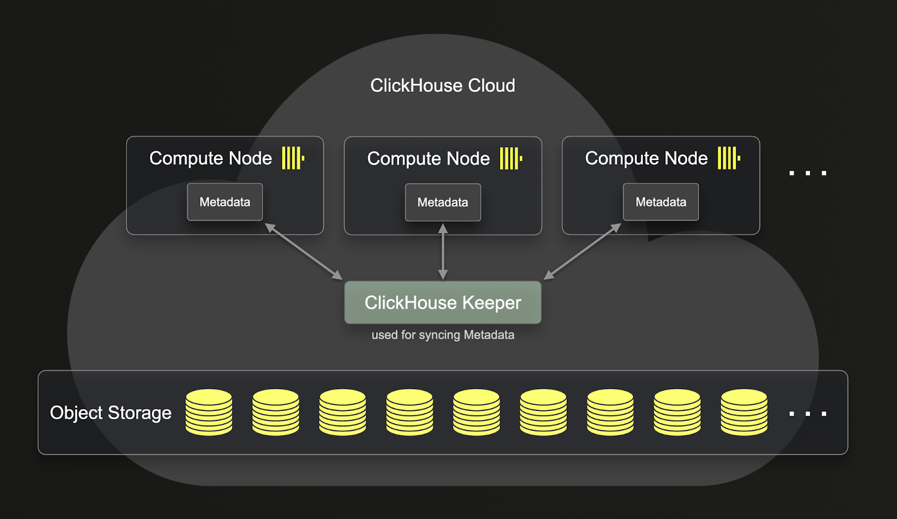
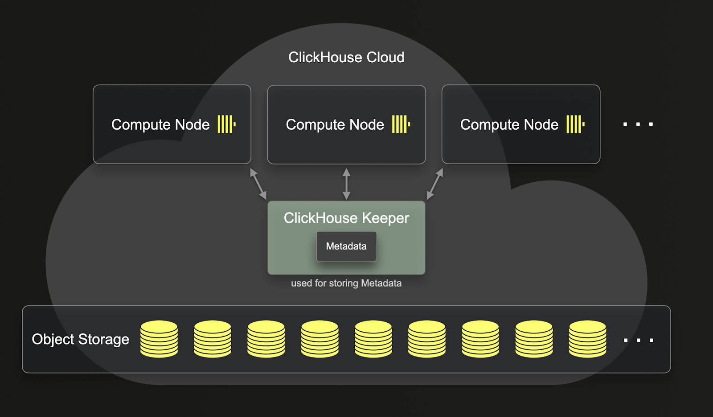

# SharedMergeTree Table Engine

*\* Available exclusively in ClickHouse Cloud (and first party partner cloud services)*

The SharedMergeTree table engine family is a cloud-native replacement of the ReplicatedMergeTree engines that is optimized to work on top of shared storage (e.g. Amazon S3, Google Cloud Storage, MinIO, Azure Blob Storage). There is a SharedMergeTree analog for every specific MergeTree engine type, i.e. ReplacingSharedMergeTree replaces ReplacingReplicatedMergeTree.

The SharedMergeTree table engine family powers ClickHouse Cloud. For an end-user, nothing needs to be changed to start using the SharedMergeTree engine family instead of the ReplicatedMergeTree based engines. It provides the following additional benefits:

- Higher insert throughput
- Improved throughput of background merges
- Improved throughput of mutations
- Faster scale-up and scale-down operations
- More lightweight strong consistency for select queries

A significant improvement that the SharedMergeTree brings is that it provides a deeper separation of compute and storage compared to the ReplicatedMergeTree. You can see below how the ReplicatedMergeTree separate the compute and storage:



As you can see, even though the data stored in the ReplicatedMergeTree are in object storage, the metadata still resides on each of the clickhouse-servers. This means that for every replicated operation, metadata also needs to be replicated on all replicas.



Unlike ReplicatedMergeTree, SharedMergeTree doesn't require replicas to communicate with each other. Instead, all communication happens through shared storage and clickhouse-keeper. SharedMergeTree implements asynchronous leaderless replication and uses clickhouse-keeper for coordination and metadata storage. This means that metadata doesn’t need to be replicated as your service scales up and down. This leads to faster replication, mutation, merges and scale-up operations. SharedMergeTree allows for hundreds of replicas for each table, making it possible to dynamically scale without shards. A distributed query execution approach is used in ClickHouse Cloud to utilize more compute resources for a query.

## Introspection

Most of the system tables used for introspection of ReplicatedMergeTree exist for SharedMergeTree, except for `system.replication_queue` and `system.replicated_fetches` as there is no replication of data and metadata that occurs. However, SharedMergeTree has corresponding alternatives for these two tables.

**system.virtual_parts**

This table serves as a SharedMergeTree’s alternative to `system.replication_queue`. It stores information about the most recent set of current parts, as well as future parts in progress such as merges, mutations, and dropped partitions.


**system.shared_merge_tree_fetches**

This table is a SharedMergeTree’s alternative to `system.replicated_fetches`. It contains information about current in-progress fetches of primary keys and checksums into memory.

## Enabling SharedMergeTree

`SharedMergeTree` is the default table engine in all development services and can be enabled in production environments via support request: https://clickhouse.cloud/support.

For services that support SharedMergeTree table engine, you don’t need to enable anything manually. You can create tables the same way as you did before and it will automatically use a SharedMergeTree-based table engine corresponding to the engine specified in your CREATE TABLE query.

```sql
CREATE TABLE my_table(
 key UInt64,
 value String
)
ENGINE = MergeTree
ORDER BY key 
```

This will create the table `my_table` using the SharedMergeTree table engine.

You don’t need to specify `ENGINE=MergeTree` as `default_table_engine=MergeTree` in ClickHouse Cloud. The following query is identical to the query above.

```sql
CREATE TABLE my_table(
 key UInt64,
 value String
)
ORDER BY key 
```

If you use Replacing, Collapsing, Aggregating, Summing, VersionedCollapsing, or the Graphite MergeTree tables it will be automatically converted to the corresponding SharedMergeTree based table engine.

```sql
CREATE TABLE myFirstReplacingMT
(
    `key` Int64,
    `someCol` String,
    `eventTime` DateTime
)
ENGINE = ReplacingMergeTree
ORDER BY key;
```

For a given table, you can check which table engine was used with the `CREATE TABLE` statement with `SHOW CREATE TABLE`:
``` sql
SHOW CREATE TABLE myFirstReplacingMT;
```

```sql
CREATE TABLE default.myFirstReplacingMT 
( `key` Int64, `someCol` String, `eventTime` DateTime ) 
ENGINE = SharedReplacingMergeTree('/clickhouse/tables/{uuid}/{shard}', '{replica}') 
ORDER BY key 
SETTINGS index_granularity = 8192
```

## Settings

Some settings behavior is significantly changed:

- `insert_quorum` -- all inserts to SharedMergeTree are quorum inserts (written to shared storage) so this setting is not needed when using SharedMergeTree table engine. 
- `insert_quorum_parallel` -- all inserts to SharedMergeTree are quorum inserts (written to shared storage)
- `select_sequential_consistency` -- doesn't require quorum inserts, can request additional requests to `clickhouse-keeper` on `SELECT` queries

## Related Content

- [ClickHouse Cloud boosts performance with SharedMergeTree and Lightweight Updates](https://clickhouse.com/blog/clickhouse-cloud-boosts-performance-with-sharedmergetree-and-lightweight-updates)
