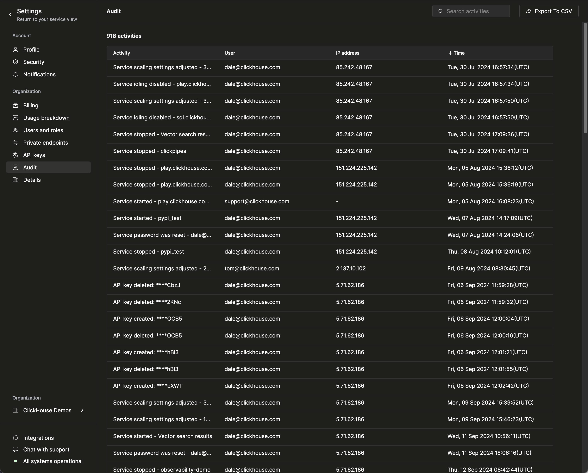

In ClickHouse Cloud, you can use the **Activity** tab on the left menu to see what changes have been made to your ClickHouse Cloud organization - including who made the change and when it occurred.

 

The **Activity** page displays a table containing a list of events logged about your organization. By default, this list is sorted in a reverse-chronological order (most-recent event at the top). Change the order of the table by clicking on the columns headers. Each item of the table contains the following fields:

- **Activity:** A text snippet describing the event
- **User:** The user that initiated the event
- **IP Address:** When applicable, this flied lists the IP Address of the user that initiated the event
- **Time:** The timestamp of the event

 

You can use the search bar provided to isolate events based on some criteria like for example service name or IP address. You can also export this information in a CSV format for distribution or analysis in an external tool.

## List of events logged

The different types of events captured for the organization are grouped in 3 categories: **Service**, **Organization** and **User**. The list of events logged contains:

### Service

- Service created
- Service deleted
- Service stopped
- Service started
- Service name changed
- Service IP access list changed
- Service password reset

### Organization

- Organization created
- Organization deleted
- Organization name changed

### User

- User role changed
- User removed from organization
- User invited to organization
- User joined organization
- User invitation deleted
- User left organization
