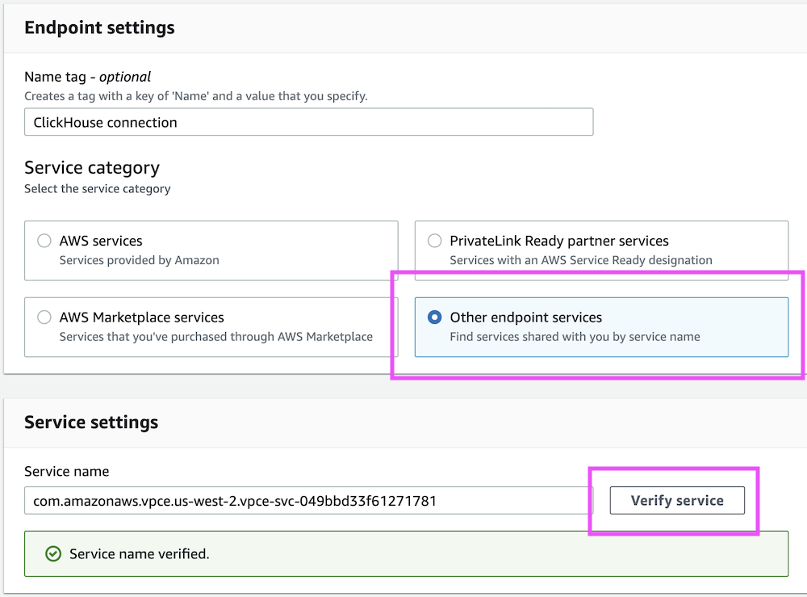

# AWS PrivateLink

You can use [AWS PrivateLink](https://aws.amazon.com/privatelink/) to provide connectivity between VPCs, AWS services, your on-premises systems, and ClickHouse Cloud without having your traffic go across the internet. This document describes how to connect to ClickHouse Cloud using AWS PrivateLink, and how to disable access to your ClickHouse Cloud services from addresses other than AWS PrivateLink addresses using ClickHouse Cloud IP Access Lists.

:::note Only available in production environments
AWS PrivateLink is only available in ClickHouse Cloud Production services. Development services are not supported.
:::

## Prerequisities

Before you get started you will need:

1. An AWS account.
1. An API key with the necessary permissions to create and manage private links.

## Steps

Follow these steps at connect your ClickHouse Cloud to your AWS PrivateLinks.

### 1. Get a service Name

First, set the following environment variables before running any commands:

```shell
REGION=<Your region code using the AWS format>
PROVIDER=aws
KEY_ID=<Your key ID>
KEY_SECRET=<Your key secret>
ORG_ID=<Your ClickHouse organization ID>
```

Next, get an instance ID from your region:

```shell
export INSTANCE_ID=$(curl --silent --user $KEY_ID:$KEY_SECRET \
https://api.clickhouse.cloud/v1/organizations/$ORG_ID/services | \
jq ".result[] | select (.region==\"${REGION}\" and .provider==\"${PROVIDER}\") | .id " -r | \
head -1)
```

Obtain an AWS Service Name for your Private Link configuration:

```bash
curl --silent --user $KEY_ID:$KEY_SECRET \
https://api.clickhouse.cloud/v1/organizations/$ORG_ID/services/$INSTANCE_ID/privateEndpointConfig | \
jq .result
```

This command should return something like:

```result
{
    ...
    "endpointServiceId": "com.amazonaws.vpce.yy-xxxx-N.vpce-svc-xxxxxxxxxxxx",
    ...
}
```

Make a note of the `endpointServiceId` and [move onto step 2](#2-create-a-service-endpoint).

### 2. Create a service endpoint

Next, you need to create a service endpoint using the `endpointServiceId` from previous step. Open the the AWS console and Go to **VPC** → **Endpoints** → **Create endpoints**. 

Select **Other endpoint services** and use the `endpointServiceId` you got from the previous step. Once you're done, click **Verify service**:



Next, select your VPC and subnets:


As an optional step, assign Security groups/Tags:

:::note Ports
Make sure that ports `8443` and `9440` are allowed in the security group.
:::

After creating the VPC Endpoint, make a note of the `Endpoint ID` value; you'll need it for an upcoming step.


#### AWS CloudFormation

Make sure to use correct subnet IDs, security groups, and VPC ID.

```response
Resources:
  ClickHouseInterfaceEndpoint:
    Type: 'AWS::EC2::VPCEndpoint'
    Properties:
      VpcEndpointType: Interface
      PrivateDnsEnabled: false
      ServiceName: <use endpointServiceId from 'Obtain AWS Service Name for Private Link' step>
      VpcId: vpc-vpc_id
      SubnetIds:
        - subnet-subnet_id1
        - subnet-subnet_id2
        - subnet-subnet_id3
      SecurityGroupIds:
        - sg-security_group_id1
        - sg-security_group_id2
        - sg-security_group_id3
```

#### Terraform

```json
resource "aws_vpc_endpoint" "this" {
  vpc_id            = var.vpc_id
  service_name      = "<use endpointServiceId from 'Obtain AWS Service Name for Private Link' step>"
  vpc_endpoint_type = "Interface"
  security_group_ids = [
    Var.security_group_id1,var.security_group_id2, var.security_group_id3,
  ]
  subnet_ids          = [var.subnet_id1,var.subnet_id2,var.subnet_id3]
  private_dns_enabled = false
}
```

#### Modify Private DNS Name for Endpoint

This step injects private DNS zone `<region code>.vpce.aws.clickhouse.cloud` configuration into AWS VPC.

:::note DNS resolver
If you use own DNS resolver, create a `<region code>.vpce.aws.clickhouse.cloud` DNS zone and point a wildcard record `*.<region code>.vpce.aws.clickhouse.cloud` to the Endpoint ID IP addresses.
:::

#### AWS Console

Navigate to **VPC Endpoints**, right click the VPC Endpoint, then select **Modify private DNS name**:


On the page that opens, select **Enable private DNS names**:


#### AWS CloudFormation

Update the `CloudFormation` template and set `PrivateDnsEnabled` to `true`:

```json
PrivateDnsEnabled: true
```

Apply the changes.

#### Terraform

- Change the `aws_vpc_endpoint` resource in Terraform code and set `private_dns_enabled` to `true`:

```json
private_dns_enabled = true
```

Apply the changes.

### 3. Add Endpoint ID to ClickHouse Cloud organization

Set the following environment variables before running any commands:

```bash
PROVIDER=aws
KEY_ID=<Key ID>
KEY_SECRET=<Key secret>
ORG_ID=<please set ClickHouse organization ID>
ENDPOINT_ID=<Endpoint ID from previous step>
REGION=<region code, please use AWS format>
```

Set the `VPC_ENDPOINT` environment variable using data from the previous step.

To add an endpoint, run:

```bash
cat <<EOF | tee pl_config_org.json
{
  "privateEndpoints": {
    "add": [
      {
        "cloudProvider": "aws",
        "id": "${ENDPOINT_ID}",
        "description": "An aws private endpoint",
        "region": "${REGION}"
      }
    ]
  }
}
EOF

curl --silent --user $KEY_ID:$KEY_SECRET \
-X PATCH -H "Content-Type: application/json" \
https://api.clickhouse.cloud/v1/organizations/$ORG_ID \
-d @pl_config_org.json
```

To remove an endpoint, run:

```bash
cat <<EOF | tee pl_config_org.json
{
  "privateEndpoints": {
    "remove": [
      {
        "cloudProvider": "aws",
        "id": "${ENDPOINT_ID}",
        "region": "${REGION}"
      }
    ]
  }
}
EOF

curl --silent --user $KEY_ID:$KEY_SECRET \
-X PATCH -H "Content-Type: application/json" \
https://api.clickhouse.cloud/v1/organizations/$ORG_ID \
-d @pl_config_org.json
```

### 4. Add Endpoint ID to service(s) allow list

You need to add an Endpoint ID to the allow-list for each instance that should be available using PrivateLink.

Set the following environment variables before running any commands:

```bash
PROVIDER=aws
KEY_ID=<Key ID>
KEY_SECRET=<Key secret>
ORG_ID=<please set ClickHouse organization ID>
ENDPOINT_ID=<Endpoint ID from previous step>
INSTANCE_ID=<Instance ID>
```

To add an endpoint ID to an allow-list:

```bash
cat <<EOF | tee pl_config.json
{
  "privateEndpointIds": {
    "add": [
      "${ENDPOINT_ID}"
    ]
  }
}
EOF

curl --silent --user $KEY_ID:$KEY_SECRET \
-X PATCH -H "Content-Type: application/json" \
https://api.clickhouse.cloud/v1/organizations/$ORG_ID/services/$INSTANCE_ID \
-d @pl_config.json | jq
```

To remove an endpoint ID from an allow-list:

```bash
cat <<EOF | tee pl_config.json
{
  "privateEndpointIds": {
    "remove": [
      "${ENDPOINT_ID}"
    ]
  }
}
EOF

curl --silent --user $KEY_ID:$KEY_SECRET \
-X PATCH -H "Content-Type: application/json" \
https://api.clickhouse.cloud/v1/organizations/$ORG_ID/services/$INSTANCE_ID \
-d @pl_config.json | jq
```

### 5. Accessing an instance using PrivateLink

Each instance with configured a Private Link filter has a public and private endpoint. In order to connect to your service using PrivateLink you need to use the private endpoint `privateDnsHostname`.

:::note
The private DNS hostname is only available from your AWS VPC. Do not try to resolve a DNS host from a local machine.
:::

#### Getting Private DNS Hostname

Set the following environment variables before running any commands:

```bash
KEY_ID=<Key ID>
KEY_SECRET=<Key secret>
ORG_ID=<please set ClickHouse organization ID>
INSTANCE_ID=<Instance ID>
```

```bash
curl --silent --user $KEY_ID:$KEY_SECRET \
https://api.clickhouse.cloud/v1/organizations/$ORG_ID/services/$INSTANCE_ID/privateEndpointConfig | \
jq .result
```

This should output something like:

```result
{
  "endpointServiceId": "com.amazonaws.vpce.yy-xxxx-N.vpce-svc-xxxxxxxxxxxx",
  "privateDnsHostname": "xxxxxxx.yy-xxxx-N.vpce.aws.clickhouse.cloud"
}
```

In this example connection to `xxxxxxx.yy-xxxx-N.vpce.aws.clickhouse.cloud` host name will be routed to PrivateLink, but `xxxxxxx.yy-xxxx-N.aws.clickhouse.cloud` will be routed over the internet.

## Troubleshooting

### Multiple PrivateLinks in one region

If you require two or more AWS Private Links within the same AWS region, then please note: In ClickHouse, we have a VPC Endpoint service at a regional level. When you setup two or more VPC Endpoints in the same VPC - from the AWS VPC perspective - you are utilizing just a single AWS Private Link. In such a situation where you need two or more AWS Private Links configured within the same region, please just create just one VPC Endpoint in your VPC, and request that ClickHouse configure the same VPC Endpoint ID for all of your ClickHouse services in the same AWS region.

### Connection to private endpoint timed out

- Please attach security group to VPC Endpoint.
- Please verify `inbound` rules on security group attached to Endpoint and allow ClickHouse ports.
- Please verify `outbound` rules on security group attached to VM which is used to connectivity test and allow connections to ClickHouse ports.

### Private Hostname: Not found address of host

- Please check "Private DNS names" option is enabled, visit [step](#modify-private-dns-name-for-endpoint) for details

### Connection reset by peer

- Most likely Endpoint ID was not added to service allow list, please visit [step](#add-endpoint-id-to-services-allow-list)

### Checking Endpoint filters

Set the following environment variables before running any commands:

```bash
KEY_ID=<Key ID>
KEY_SECRET=<Key secret>
ORG_ID=<please set ClickHouse organization ID>
INSTANCE_ID=<Instance ID>
```

```shell
curl --silent --user $KEY_ID:$KEY_SECRET \
-X GET -H "Content-Type: application/json" \
https://api.clickhouse.cloud/v1/organizations/$ORG_ID/services/$INSTANCE_ID | \
jq .result.privateEndpointIds
```
