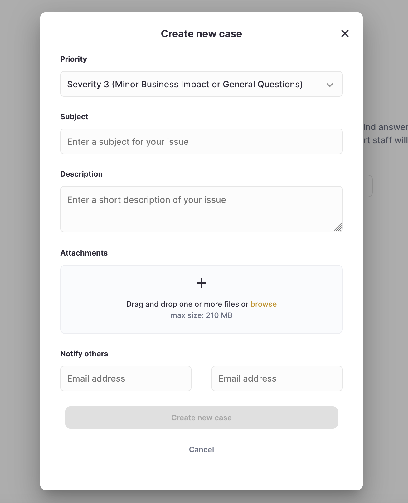

## Intro
If you are a registered user, ClickHouse enables you to view and correct your account personal data, which includes your contact information and, depending on your role, may include the contact information of other users in your organization, details of API keys and other information, on a self-serve basis directly from the ClickHouse user interface (UI).

**What is a Data Subject Access Request (DSAR)**
Depending on where you are located, applicable law may also provide you additional rights as to personal data that ClickHouse holds about you (Data Subject Rights), as described in the ClickHouse Privacy Policy.  The process for exercising Data Subject Rights is known as a Data Subject Access Request (DSAR).

**Scope of Personal Data**
Please review ClickHouse’s Privacy Policy for details on personal data that ClickHouse collects and how it may be used.

## Self Service
By default, ClickHouse empowers users to view their personal data directly from the ClickHouse user interface (UI).

Included below is a summary of data ClickHouse collects when setting up an account and using the service and where specific personal data can be viewed within the ClickHouse UI.

| Location/URL | Description | Personal Data |
|-------------|----------------|-----------------------------------------|
| https://auth.clickhouse.cloud/u/signup/ | Account registration | email, password |
| https://clickhouse.cloud/profile | General user profile details |  name, email |
| https://clickhouse.cloud/organizations/OrgID/members | List of users in an organization | name, email |
| https://clickhouse.cloud/organizations/OrgID/keys | List of API keys and who created them | email |
| https://clickhouse.cloud/organizations/OrgID/activity | Activity log, listing actions by individual users | email |
| https://clickhouse.cloud/organizations/OrgID/admin/billing | Billing information and invoices | billing address, email |
| https://control-plane.clickhouse-dev.com/support | Interactions with ClickHouse Support | name, email |

Note: URLs with `OrgID` need to be updated to reflect the OrgID for your specific account.

### Current Customers
If you have an account with us, the self-service option above has not resolved your personal-data issue, and you wish to make a Data Subject Access Request pursuant to the Privacy Policy, please log into your ClickHouse account and open a [support case](https://clickhouse.cloud/support). This enables us to validate your identity and reduce steps to complete your request. 

Please be sure to include the following details in your support case:

| Field | Text to include in your request |
|-------------|---------------------------------------------------|
| Subject | Data Subject Access Request (DSAR) |
| Description | Detailed description of the information you’d like ClickHouse to look for, collect, and/or provide. |

### Individuals Without an Account
If you do not have an account with us, the self-service option above has not resolved your personal-data issue, and you wish to make a Data Subject Access Request pursuant to the Privacy Policy, you may submit these requests by email to [privacy@clickhouse.com](mailto:privacy@clickhouse.com).

## Identity Verification

Should you submit a Data Subject Access Request through email, we may request specific information from you to help us confirm your identity and process your request. Applicable law may require or permit us to decline your request. If we decline your request, we will tell you why, subject to legal restrictions. 

For more information, please review the [ClickHouse Privacy Policy](https://clickhouse.com/legal/privacy-policy)
