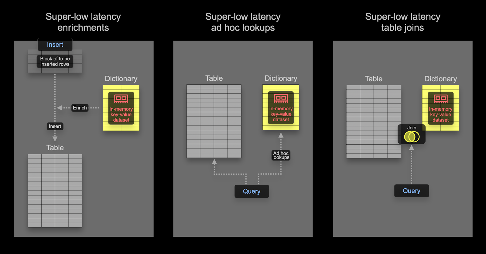

# Dictionary

A dictionary in ClickHouse provides an in-memory [key-value](https://en.wikipedia.org/wiki/Key%E2%80%93value_database) representation of data from various [internal and external sources](/en/sql-reference/dictionaries#dictionary-sources), optimizing for super-low latency lookup queries.

Dictionaries are useful for:
- Improving the performance of queries, especially when used with `JOIN`s
- Enriching ingested data on the fly without slowing down the ingestion process



## Speeding up joins using a Dictionary

Dictionaries can be used to speed up a specific type of `JOIN`: the [`LEFT ANY` type](/en/sql-reference/statements/select/join#supported-types-of-join) where the join key needs to match the key attribute of the underlying key-value storage.


If this is the case, ClickHouse can exploit the dictionary to perform a [Direct Join](https://clickhouse.com/blog/clickhouse-fully-supports-joins-direct-join-part4#direct-join). This is ClickHouse's fastest join algorithm and is applicable when the underlying [table engine](/en/engines/table-engines) for the right-hand side table supports low-latency key-value requests. ClickHouse has three table engines providing this: [Join](/en/engines/table-engines/special/join) (that is basically a pre-calculated hash table), [EmbeddedRocksDB](/en/engines/table-engines/integrations/embedded-rocksdb) and [Dictionary](/en/engines/table-engines/special/dictionary). We will describe the dictionary-based approach, but the mechanics are the same for all three engines.

The direct join algorithm requires that the right table is backed by a dictionary, such that the to-be-joined data from that table is already present in memory in the form of a low-latency key-value data structure.

### Example

Using the StackOverflow dataset, let's answer the question:
*What is the most controversial post concerning SQL on Hacker News?*

We will define controversial as when posts have a similar number of up and down votes. We compute this absolute difference, where a value closer to 0 means more controversy. We'll assume the post must have at least 10 up and down votes - posts which people don't vote on aren't very controversial.

With our data normalized, this query currently requires a `JOIN` using the `posts` and `votes` table:

```sql
WITH PostIds AS
(
   	 SELECT Id
   	 FROM posts
   	 WHERE Title ILIKE '%SQL%'
)
SELECT
    Id,
    Title,
    UpVotes,
    DownVotes,
    abs(UpVotes - DownVotes) AS Controversial_ratio 
FROM posts
INNER JOIN
(
    SELECT
   	 PostId,
   	 countIf(VoteTypeId = 2) AS UpVotes,
   	 countIf(VoteTypeId = 3) AS DownVotes
    FROM votes
    WHERE PostId IN (PostIds)
    GROUP BY PostId
    HAVING (UpVotes > 10) AND (DownVotes > 10)
) AS votes ON posts.Id = votes.PostId
WHERE Id IN (PostIds)
ORDER BY Controversial_ratio ASC
LIMIT 1

Row 1:
──────
Id:              	25372161
Title:           	How to add exception handling to SqlDataSource.UpdateCommand
UpVotes:         	13
DownVotes:       	13
Controversial_ratio: 0

1 rows in set. Elapsed: 1.283 sec. Processed 418.44 million rows, 7.23 GB (326.07 million rows/s., 5.63 GB/s.)
Peak memory usage: 3.18 GiB.
```

>**Use smaller datasets on the right side of `JOIN`**: This query may seem more verbose than is required, with the filtering on `PostId`s occurring in both the outer and sub queries. This is a performance optimization which ensures the query response time is fast. For optimal performance, always ensure the right side of the `JOIN` is the smaller set and as small as possible. For tips on optimizing JOIN performance and understanding the algorithms available, we recommend [this series of blog articles](https://clickhouse.com/blog/clickhouse-fully-supports-joins-part1).

While this query is fast, it relies on us to write the `JOIN` carefully to achieve good performance. Ideally, we would simply filter the posts to those containing “SQL”, before looking at the `UpVote` and `DownVote` counts for the subset of blogs to compute our metric. 

#### Applying a dictionary

To demonstrate these concepts, we use a dictionary for our vote data. Since dictionaries are usually held in memory ([ssd_cache](/en/sql-reference/dictionaries#ssd_cache) is the exception), users should be cognizant of the size of the data. Confirming our `votes` table size:

```sql
SELECT table,
	formatReadableSize(sum(data_compressed_bytes)) AS compressed_size,
	formatReadableSize(sum(data_uncompressed_bytes)) AS uncompressed_size,
	round(sum(data_uncompressed_bytes) / sum(data_compressed_bytes), 2) AS ratio
FROM system.columns
WHERE table IN ('votes')
GROUP BY table

┌─table───────────┬─compressed_size─┬─uncompressed_size─┬─ratio─┐
│ votes │ 1.25 GiB    	│ 3.79 GiB      	│  3.04 │
└─────────────────┴─────────────────┴───────────────────┴───────┘
```

Data will be stored uncompressed in our dictionary, so we need at least 4GB of memory if we were to store all columns (we won’t) in a dictionary. The dictionary will be replicated across our cluster, so this amount of memory needs to be reserved *per node*.

> In the example below the data for our dictionary originates from a ClickHouse table. While this represents the most common source of dictionaries, [a number of sources](/en/sql-reference/dictionaries#dictionary-sources) are supported including files, http and databases including [Postgres](/en/sql-reference/dictionaries#postgresql). As we'll show, dictionaries can be automatically refreshed providing an ideal way to ensure small datasets subject to frequent changes are available for direct joins.

Our dictionary requires a primary key on which lookups will be performed. This is conceptually identical to a transactional database primary key and should be unique. Our above query requires a lookup on the join key - `PostId`. The dictionary should in turn be populated with the total of the up and down votes per `PostId` from our `votes` table. Here's the query to obtain this dictionary data:

```sql
SELECT PostId,
   countIf(VoteTypeId = 2) AS UpVotes,
   countIf(VoteTypeId = 3) AS DownVotes
FROM votes
GROUP BY PostId
```

To create our dictionary requires the following DDL - note the use of our above query: 

```sql
CREATE DICTIONARY votes_dict
(
  `PostId` UInt64,
  `UpVotes` UInt32,
  `DownVotes` UInt32
)
PRIMARY KEY PostId
SOURCE(CLICKHOUSE(QUERY 'SELECT PostId, countIf(VoteTypeId = 2) AS UpVotes, countIf(VoteTypeId = 3) AS DownVotes FROM votes GROUP BY PostId'))
LIFETIME(MIN 600 MAX 900)
LAYOUT(HASHED())

0 rows in set. Elapsed: 36.063 sec.
```

> In self-managed OSS, the above command needs to be executed on all nodes. In ClickHouse Cloud, the dictionary will automatically be replicated to all nodes. The above was executed on a ClickHouse Cloud node with 64GB of RAM, taking 36s to load.

To confirm the memory consumed by our dictionary:

```sql
SELECT formatReadableSize(bytes_allocated) AS size
FROM system.dictionaries
WHERE name = 'votes_dict'

┌─size─────┐
│ 4.00 GiB │
└──────────┘
```

Retrieving the up and down votes for a specific `PostId` can be now achieved with a simple `dictGet` function. Below we retrieve the values for the post `11227902`:

```sql
SELECT dictGet('votes_dict', ('UpVotes', 'DownVotes'), '11227902') AS votes

┌─votes──────┐
│ (34999,32) │
└────────────┘


Exploiting this in our earlier query, we can remove the JOIN:

WITH PostIds AS
(
    	SELECT Id
    	FROM posts
    	WHERE Title ILIKE '%SQL%'
)
SELECT Id, Title,
	dictGet('votes_dict', 'UpVotes', Id) AS UpVotes,
	dictGet('votes_dict', 'DownVotes', Id) AS DownVotes,
	abs(UpVotes - DownVotes) AS Controversial_ratio
FROM posts
WHERE (Id IN (PostIds)) AND (UpVotes > 10) AND (UpVotes > 10)
ORDER BY Controversial_ratio ASC
LIMIT 3

3 rows in set. Elapsed: 0.551 sec. Processed 119.64 million rows, 3.29 GB (216.96 million rows/s., 5.97 GB/s.)
Peak memory usage: 552.26 MiB.
```

Not only is this query much simpler, it's also over twice as fast! This could be optimized further by only loading posts with more than 10 up and down votes into the dictionary and only storing a precomputed controversial value.

## Query time enrichment

Dictionaries can be used to look up values at query time. These values can be returned in results or used in aggregations. Suppose we create a dictionary to map user IDs to their location:

```sql
CREATE DICTIONARY users_dict
(
  `Id` Int32,
  `Location` String
)
PRIMARY KEY Id
SOURCE(CLICKHOUSE(QUERY 'SELECT Id, Location FROM stackoverflow.users'))
LIFETIME(MIN 600 MAX 900)
LAYOUT(HASHED())
```

We can use this dictionary to enrich post results:

```sql
SELECT
	Id,
	Title,
	dictGet('users_dict', 'Location', CAST(OwnerUserId, 'UInt64')) AS location
FROM posts
WHERE Title ILIKE '%clickhouse%'
LIMIT 5
FORMAT PrettyCompactMonoBlock


┌───────Id─┬─Title─────────────────────────────────────────────────────────┬─Location──────────────┐
│ 52296928 │ Comparision between two Strings in ClickHouse             	│ Spain             	│
│ 52345137 │ How to use a file to migrate data from mysql to a clickhouse? │ 中国江苏省Nanjing Shi │
│ 61452077 │ How to change PARTITION in clickhouse                     	│ Guangzhou, 广东省中国 │
│ 55608325 │ Clickhouse select last record without max() on all table  	│ Moscow, Russia    	│
│ 55758594 │ ClickHouse create temporary table                         	│ Perm', Russia     	│
└──────────┴───────────────────────────────────────────────────────────────┴───────────────────────┘

5 rows in set. Elapsed: 0.033 sec. Processed 4.25 million rows, 82.84 MB (130.62 million rows/s., 2.55 GB/s.)
Peak memory usage: 249.32 MiB.
```

Similar to our above join example, we can use the same dictionary to efficiently determine where most posts originate from:

```sql
SELECT
	dictGet('users_dict', 'Location', CAST(OwnerUserId, 'UInt64')) AS location,
	count() AS c
FROM posts
WHERE location != ''
GROUP BY location
ORDER BY c DESC
LIMIT 5

┌─location───────────────┬──────c─┐
│ India              	│ 787814 │
│ Germany            	│ 685347 │
│ United States      	│ 595818 │
│ London, United Kingdom │ 538738 │
│ United Kingdom     	│ 537699 │
└────────────────────────┴────────┘

5 rows in set. Elapsed: 0.763 sec. Processed 59.82 million rows, 239.28 MB (78.40 million rows/s., 313.60 MB/s.)
Peak memory usage: 248.84 MiB.
```

## Index time enrichment

In the above example, we used a dictionary at query time to remove a join. Dictionaries can also be used to enrich rows at insert time. This is typically appropriate if the enrichment value does not change and exists in an external source which can be used to populate the dictionary. In this case, enriching the row at insert time avoids the query time lookup to the dictionary.

Let's suppose that the `Location` of a user in Stack Overflow never changes (in reality they do) - specifically the `Location` column of the `users` table. Suppose we want to do an analytics query on the posts table by location. This contains a `UserId`.

A dictionary provides a mapping from user id to location, backed by the `users` table:

```sql
CREATE DICTIONARY users_dict
(
    `Id` UInt64,
    `Location` String
)
PRIMARY KEY Id
SOURCE(CLICKHOUSE(QUERY 'SELECT Id, Location FROM users WHERE Id >= 0'))
LIFETIME(MIN 600 MAX 900)
LAYOUT(HASHED())
```

> We omit users with an `Id < 0`, allowing us to use the `Hashed` dictionary type. Users with `Id < 0` are system users.

To exploit this dictionary at insert time for the posts table, we need to modify the schema:

```sql
CREATE TABLE posts_with_location
(
    `Id` UInt32,
    `PostTypeId` Enum8('Question' = 1, 'Answer' = 2, 'Wiki' = 3, 'TagWikiExcerpt' = 4, 'TagWiki' = 5, 'ModeratorNomination' = 6, 'WikiPlaceholder' = 7, 'PrivilegeWiki' = 8),
     …
    `Location` MATERIALIZED dictGet(users_dict, 'Location', OwnerUserId::'UInt64')
)
ENGINE = MergeTree
ORDER BY (PostTypeId, toDate(CreationDate), CommentCount)
```

In the above example the `Location` is declared as a `MATERIALIZED` column. This means the value can be provided as part of an `INSERT` query and will always be calculated.

> ClickHouse also supports [`DEFAULT` columns](/en/sql-reference/statements/create/table#default_values) (where the value can be inserted or calculated if not provided).

To populate the table we can use the usual `INSERT INTO SELECT` from S3:

```sql
INSERT INTO posts_with_location SELECT Id, PostTypeId::UInt8, AcceptedAnswerId, CreationDate, Score, ViewCount, Body, OwnerUserId, OwnerDisplayName, LastEditorUserId, LastEditorDisplayName, LastEditDate, LastActivityDate, Title, Tags, AnswerCount, CommentCount, FavoriteCount, ContentLicense, ParentId, CommunityOwnedDate, ClosedDate FROM s3('https://datasets-documentation.s3.eu-west-3.amazonaws.com/stackoverflow/parquet/posts/*.parquet')

0 rows in set. Elapsed: 36.830 sec. Processed 238.98 million rows, 2.64 GB (6.49 million rows/s., 71.79 MB/s.)
```

We can now obtain the name of the location from which most posts originate:

```sql
SELECT Location, count() AS c
FROM posts_with_location
WHERE Location != ''
GROUP BY Location
ORDER BY c DESC
LIMIT 4

┌─Location───────────────┬──────c─┐
│ India                  │ 787814 │
│ Germany                │ 685347 │
│ United States          │ 595818 │
│ London, United Kingdom │ 538738 │
└────────────────────────┴────────┘

4 rows in set. Elapsed: 0.142 sec. Processed 59.82 million rows, 1.08 GB (420.73 million rows/s., 7.60 GB/s.)
Peak memory usage: 666.82 MiB.
```

## Advanced Dictionary Topics

### Choosing the Dictionary `LAYOUT`

The `LAYOUT` clause controls the internal data structure for the dictionary. A number of options exist and are documented [here](/en/sql-reference/dictionaries#ways-to-store-dictionaries-in-memory). Some tips on choosing the correct layout can be found [here](https://clickhouse.com/blog/faster-queries-dictionaries-clickhouse#choosing-a-layout).

### Refreshing dictionaries

We have specified a `LIFETIME` for the dictionary of `MIN 600 MAX 900`. LIFETIME is the update interval for the dictionary, with the values here causing a periodic reload at a random interval between 600 and 900s. This random interval is necessary in order to distribute the load on the dictionary source when updating on a large number of servers. During updates, the old version of a dictionary can still be queried, with only the initial load blocking queries. Note that setting `(LIFETIME(0))` prevents dictionaries from updating.
Dictionaries can be forcibly reloaded using the `SYSTEM RELOAD DICTIONARY` command.

For database sources such as ClickHouse and Postgres, you can set up a query that will update the dictionaries only if they really changed (the response of the query determines this), rather than at a periodic interval. Further details can be found [here](/en/sql-reference/dictionaries#refreshing-dictionary-data-using-lifetime).

### Other dictionary types

ClickHouse also supports [Hierarchical](/en/sql-reference/dictionaries#hierarchical-dictionaries), [Polygon](/en/sql-reference/dictionaries#polygon-dictionaries) and [Regular Expression](/en/sql-reference/dictionaries#regexp-tree-dictionary) dictionaries. 

### More reading

- [Using Dictionaries to Accelerate Queries](https://clickhouse.com/blog/faster-queries-dictionaries-clickhouse)
- [Advanced Configuration for Dictionaries](/en/sql-reference/dictionaries)
