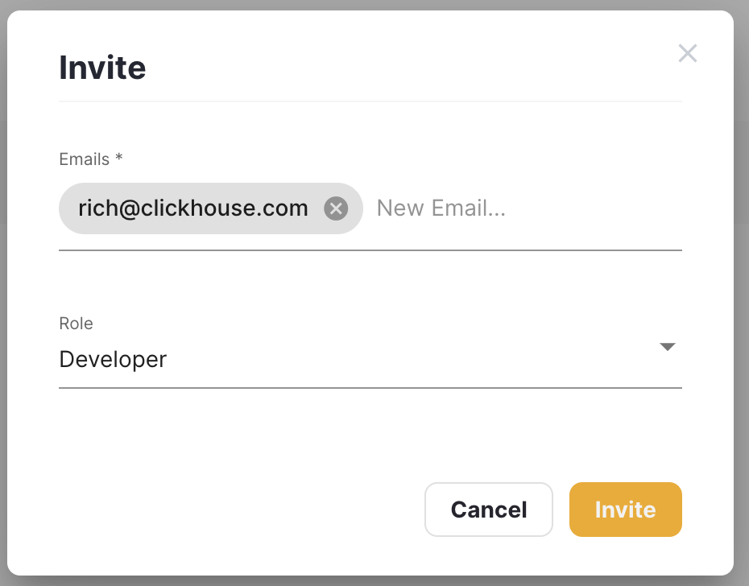
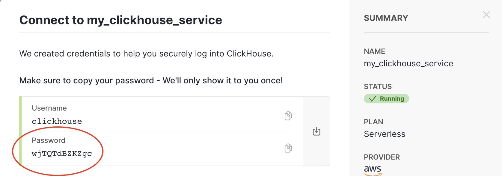
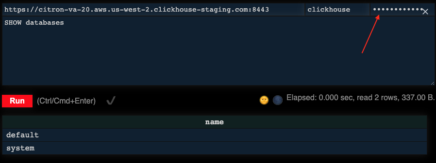
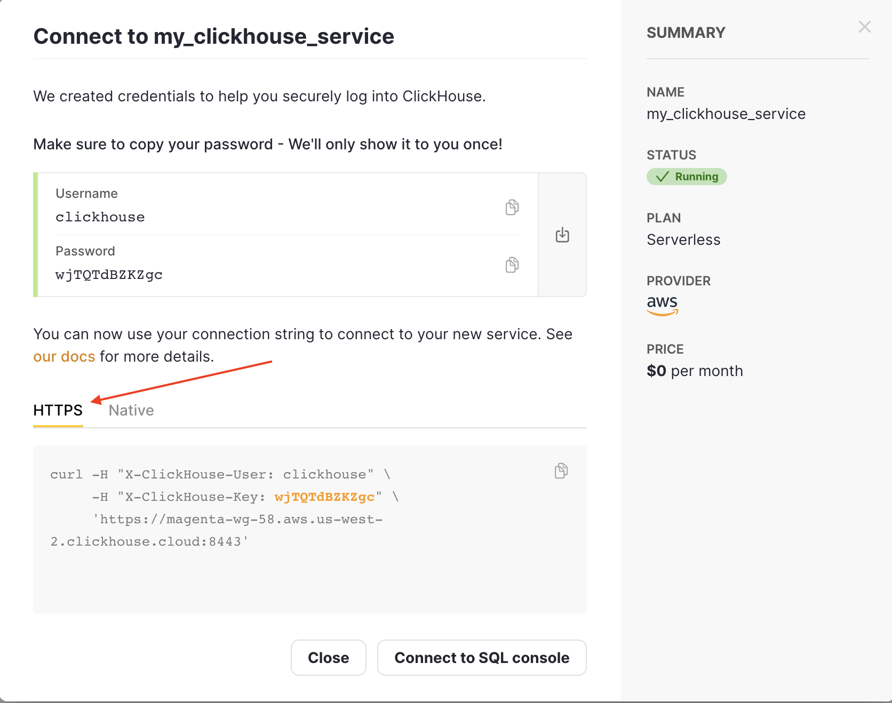

# Getting Started with ClickHouse Cloud


With ClickHouse Cloud, we are building a turnkey hosted ClickHouse experience! This guide will help you get started with creating a new ClickHouse Service, creating a table and inserting data. We have included some important details and helpful tips that you need to be aware of as you start using the ClickHouse Cloud.

<iframe width="100%" src="https://player.vimeo.com/video/704181801?h=5cd587cba1&amp;badge=0&amp;autopause=0&amp;player_id=0&amp;app_id=58479" frameborder="0" allow="autoplay; fullscreen; picture-in-picture" allowfullscreen title="ClickHouse Onboarding"></iframe>
<script src="https://player.vimeo.com/api/player.js"></script>


Important Details[​](#important-details "Direct link to heading")
-----------------------------------------------------------------

#### 1\. Invite your team members[​](#1-wait-for-the-new-service-to-be-running "Direct link to heading")


While you are waiting for your new ClickHouse service to start, you can click on **Members** in the left navigation menu and invite others using the **Invite Members** button. **Admin** users can access your services and create new ones; users with **Developer** privileges can access existing services only.





#### 2\. We only show you the password once…[​](#2-we-only-show-you-the-password-once "Direct link to heading")


…so hang on to it! Once your service is provisioned, the password will appear in the dialog window. After you refresh the page in your browser, the password will no longer appear and you will have to reset it if you have not saved it:





#### 3\. The Play UI is available for connecting to your service[​](#3-the-play-ui-is-available-for-connecting-to-your-service "Direct link to heading")


*   First, copy your password,
*   then click on the "Connect to SQL console" button and the UI will open in a pop-up window,
*   paste your password into the "password" text field:





#### 4\. You can also connect using HTTP or the native protocol[​](#4-you-can-also-connect-using-http-or-the-native-protocol "Direct link to heading")


The two commands you can use are provided for you - just copy-and-paste them from the Cloud console:





The curl command for the HTTP interface looks like:


```bash
curl --user 'default:[password]' \
--data-binary 'SELECT 1' \
https://HOSTNAME.us-west-2.aws.clickhouse.cloud:8443
```


And the `clickhouse-client` command for the native interface looks like:


```bash
clickhouse-client \
--host HOSTNAME.us-west-2.aws.clickhouse.cloud \
--secure --user default --port 9440 --password [password]
```


#### 5\. The default Database[​](#5-the-default-database "Direct link to heading")


Your ClickHouse Cloud service consists of the `default` and `system` databases. All tables and views are created in the `default` database, and any attempts to create a new database will generate an error. (If you need a new database, simply create a new service.)


#### 6\. Supported table engines[​](#6-supported-table-engines "Direct link to heading")


Here is a list of the supported table engines. (These table engines support replication, which is a requirement in a cluster environment):

*   `ReplicatedMergeTree`
*   `ReplicatedSummingMergeTree`
*   `ReplicatedAggregatingMergeTree`
*   `ReplicatedReplacingMergeTree`
*   `S3`
*   `URL`
*   `View`
*   `MaterializedView`
*   `GenerateRandom`
*   `Join`
*   `Null`


#### 7\. Insert Data[​](#7-insert-data "Direct link to heading")


Data can either be inserted using the **_native interface_** (e.g. the clickhouse-client) or **_HTTP interface_** (e.g. curl or a custom client application). See the Common Tasks section below for an example of both techniques.


#### 8\. Available AWS Regions[​](#8-available-aws-regions "Direct link to heading")


Each ClickHouse service runs in a single region across 3 availability zones for high availability. ClickHouse Cloud is currently available in the following AWS regions:

*   Ohio (us-east-2)
*   Oregon (us-west-2)
*   Ireland (eu-west-1)

* * *

Known Limitations[​](#known-limitations "Direct link to heading")
-----------------------------------------------------------------


#### 0\. CREATE DATABASE is not available[​](#0-create-databased "Direct link to heading")


A ClickHouse Cloud service includes a single database named `default`. At the current time, `CREATE DATABASE` is not permitted. We are working on implementing this capability.


#### 1\. Access to external systems is limited[​](#1-access-to-external-systems-is-limited "Direct link to heading")


AWS S3 is supported in ClickHouse Cloud, so you can use the S3 functions and table engine. External functions and engines like ODBC, JDBC, PostgreSQL, MySQL, SQLite, MongoDB, Redis, Kafka, RabbitMQ, HDFS and Hive will work as long as ClickHouse has external access to them from over the Internet.


#### 2\. Unavailable functions and settings[​](#2-unavailable-functions-and-settings "Direct link to heading")


Some functionality is disabled for security purposes, including:

*   Reading from sources local to clickhouse server, e.g. `File` table engine
*   SQL functions relying on local filesystem access, e.g. `file`
*   User-defined functions that rely on executables and external scripts
*   SQL functions for introspection are restricted for security reasons, e.g. `addressToLine`, `tcpPort`
*   Most system settings are not configurable at this time and/or do not have any effect


#### 3\. Backups are not available yet[​](#3-backups-are-not-available-yet "Direct link to heading")


The backups functionality is undergoing additional testing and not enabled at this time


#### 4\. Security limitations[​](#4-security-limitations "Direct link to heading")


As part of creating the ClickHouse service, we create a `default` database, and a user named `default` that has broad permissions to this database. This initial user can create additional users and assign their permissions to this database. Beyond this, the ability to enable the following security features within the database using Kerberos, LDAP, or SSL X.509 certificate authentication are not supported at this time.


#### 5\. Observability[​](#5-observability "Direct link to heading")


Each ClickHouse service is collecting metrics, and you can view those metrics by clicking on the three dots next to your service's name and selecting **Details** from the menu.

*   We have provided some basic metrics out of the box, but we would love to hear from you if you have ideas and suggetions for metrics to collect. Click the **New metric** button (below all of the metrics) to share your ideas with us.
*   The ability to query **system** tables is available, but note that not all metrics exposed in this way are relevant, and we may remove or restrict access to these details in the future.
*   Direct access to ClickHouse server logs is not provided.
*   Audit log of Cloud actions is available on the backend, but not yet exposed in the Cloud console.


#### 6\. CREATE AS SELECT queries[​](#6-select-as-create "Direct link to heading")


`CREATE AS SELECT` queries are not supported now. Use `CREATE VIEW AS + CREATE TABLE AS view + INSERT SELECT`. Also, `CREATE DATABASE IF NOT EXISITS` should not be used to check database availability for now. Use `EXISTS`\> instead.

* * *

Common Tasks[​](#common-tasks "Direct link to heading")
-------------------------------------------------------

### 1\. Using the clickhouse-client[​](#1-using-the-clickhouse-client "Direct link to heading")


#### On Linux[​](#on-linux "Direct link to heading")

##### 1\. Download and install the ClickHouse binary for Linux:

```bash
curl https://clickhouse.com/ | sh ./clickhouse install
```


##### 2\. Copy-and-paste the command provided from the **"Native"** tab on the Services links pop-up:

```bash
clickhouse-client --host \
HOSTNAME.aws.us-west-2.clickhouse.cloud \
--secure --user default --port 9440 \
--password [password]
```


#### On Mac[​](#on-mac "Direct link to heading")

##### 1\. Download the `clickhouse` binary for Mac

```bash
curl https://clickhouse.com/ | sh
```


##### 2\. Start the `clickhouse client`. You can copy and paste this from the Services links pop-up, but notice the binary you are running is slightly different (change `clickhouse-client` to `./clickhouse client`):

```bash
./clickhouse client \
--host HOSTNAME.aws.us-west-2.clickhouse.cloud \
--secure --user default --password [password]
```

#### On Windows[​](#on-windows "Direct link to heading")

##### 1\. The `clickhouse-client` can run inside WSL (Windows Subsystem for Linux), so start by [following the install instructions for WSL](https://docs.microsoft.com/en-us/windows/wsl/install) if you do not have it installed already. From the WSL prompt, run the command provided from the "Native" tab on the Services links pop-up (the same command as Linux above):

```bash
clickhouse-client \
--host HOSTNAME.aws.us-west-2.clickhouse.cloud \
--secure --user default --port 9440 \
--password [password]
```

#### Using Docker[​](#using-docker "Direct link to heading")

##### 1\. Use the `clickhouse/clickhouse-server` image in Docker Hub to run the `clickhouse-client` in a Docker container:

```bash
docker run -it clickhouse/clickhouse-server \
clickhouse-client --host HOSTNAME.aws.us-west-2.clickhouse.cloud \
--secure --user default --port 9440 --password [password]
```

### 2\. Insert Data from a Local File[​](#2-insert-data-from-a-local-file "Direct link to heading")

The following steps demonstrate how to insert a local text file into a table using `clickhouse-client`.

##### 1\. First create the table, either from the `clickhouse-client` prompt or using the Play UI. The dataset represents New York City taxi rides:

```sql
CREATE TABLE trips (
    `trip_id` UInt32,
    `vendor_id` Enum8('1' = 1, '2' = 2, '3' = 3, '4' = 4, 'CMT' = 5, 'VTS' = 6, 'DDS' = 7, 'B02512' = 10, 'B02598' = 11, 'B02617' = 12, 'B02682' = 13, 'B02764' = 14, '' = 15),
    `pickup_date` Date,
    `pickup_datetime` DateTime,
    `dropoff_date` Date,
    `dropoff_datetime` DateTime,
    `store_and_fwd_flag` UInt8,
    `rate_code_id` UInt8,
    `pickup_longitude` Float64,
    `pickup_latitude` Float64,
    `dropoff_longitude` Float64,
    `dropoff_latitude` Float64,
    `passenger_count` UInt8,
    `trip_distance` Float64,
    `fare_amount` Float32,
    `extra` Float32,
    `mta_tax` Float32,
    `tip_amount` Float32,
    `tolls_amount` Float32,
    `ehail_fee` Float32,
    `improvement_surcharge` Float32,
    `total_amount` Float32,
    `payment_type` Enum8('UNK' = 0, 'CSH' = 1, 'CRE' = 2, 'NOC' = 3, 'DIS' = 4),
    `trip_type` UInt8,
    `pickup` FixedString(25),
    `dropoff` FixedString(25),
    `cab_type` Enum8('yellow' = 1, 'green' = 2, 'uber' = 3),
    `pickup_nyct2010_gid` Int8,
    `pickup_ctlabel` Float32,
    `pickup_borocode` Int8,
    `pickup_ct2010` String,
    `pickup_boroct2010` String,
    `pickup_cdeligibil` String,
    `pickup_ntacode` FixedString(4),
    `pickup_ntaname` String,
    `pickup_puma` UInt16,
    `dropoff_nyct2010_gid` UInt8,
    `dropoff_ctlabel` Float32,
    `dropoff_borocode` UInt8,
    `dropoff_ct2010` String,
    `dropoff_boroct2010` String,
    `dropoff_cdeligibil` String,
    `dropoff_ntacode` FixedString(4),
    `dropoff_ntaname` String,
    `dropoff_puma` UInt16 )
ENGINE = ReplicatedMergeTree
PARTITION BY toYYYYMM(pickup_date)
ORDER BY pickup_datetime;
```


##### 2\. If you are at the `clickhouse-client` prompt, exit it:

```bash
clickhouse-cloud :) exit
```


##### 3\. Download the file, which consists of about 1M rows of taxi rides:

```bash
curl -O https://datasets-documentation.s3.eu-west-3.amazonaws.com/nyc-taxi/trips_2.gz
```


##### 4\. Run the following command to unzip the file, stream it to the `clickhouse-client` and insert it into the trips table. Be sure to modify the `clickhouse-client` portion of the command to match your OS (see the Linux, Mac, Windows and Docker options above):

```bash
gzip -d -c trips_2.gz | ./clickhouse-client \
--host HOSTNAME.aws.us-west-2.clickhouse.cloud \
--secure --user default \
--password [password] --database=default \
--query="INSERT INTO trips FORMAT TabSeparatedWithNames"
```


##### 5\. When the insertion is complete, run the following query from either the `clickhouse-client` or the Play UI to verify you have about a 1M rows in trips (999,825 to be precise):

```sql
SELECT count() FROM TRIPS
```


##### 6\. Run a query to see how fast 1M rows can be processed by ClickHouse:

```sql
SELECT passenger_count, avg(total_amount) FROM trips GROUP BY passenger_count;
```


:::note
More details on the `clickhouse-client` can be [found in the docs](https://clickhouse.com/docs/en/interfaces/cli).
:::

### 3\. Insert Data using the HTTP Interface[​](#3-insert-data-using-the-http-interface "Direct link to heading")

This example uses the same NYC taxi dataset as the previous example, except the data is inserted using the HTTP interface:

##### 1\. Download the file first:

```bash
curl -O https://datasets-documentation.s3.eu-west-3.amazonaws.com/nyc-taxi/trips_2.gz
```


##### 2\. Create the `trips` table defined in the previous section.

##### 3\. Unzip the `.gz` file and pipe the output to curl:

```bash
gzip -d -c trips_2.gz | curl -u default:[password] 'https://host:8443/?query=INSERT%20INTO%20trips%20FORMAT%20TabSeparatedWithNames' --data-binary @-
```


##### NOTE

The query in the URL is `INSERT%20INTO%20trips%20FORMAT%20TabSeparatedWithNames`, which is a URL-encoded version of `INSERT INTO trips FORMAT TabSeparatedWithNames`.


Further details on the `http` interface can be found [here](https://clickhouse.com/docs/en/interfaces/http).

### 4\. Create a table from files in S3[​](#4-create-a-table-from-files-in-s3 "Direct link to heading")

In this step, you will see how to populate a table with data from files stored in S3. The example uses the New York Taxi dataset, which is publicly available on S3.

##### 1\. Start by creating the table. Notice the table engine is `ReplicatedMergeTree`, which means it will automatically be replicated across the nodes in your cluster.

```sql
CREATE TABLE trips(
    `trip_id` UInt32,
    `vendor_id` Enum8('1' = 1, '2' = 2, '3' = 3, '4' = 4, 'CMT' = 5, 'VTS' = 6, 'DDS' = 7, 'B02512' = 10, 'B02598' = 11, 'B02617' = 12, 'B02682' = 13, 'B02764' = 14, '' = 15),
    `pickup_date` Date,
    `pickup_datetime` DateTime,
    `dropoff_date` Date,
    `dropoff_datetime` DateTime,
    `store_and_fwd_flag` UInt8,
    `rate_code_id` UInt8,
     `pickup_longitude` Float64,
     `pickup_latitude` Float64,
     `dropoff_longitude` Float64,
     `dropoff_latitude` Float64,
     `passenger_count` UInt8,
     `trip_distance` Float64,
     `fare_amount` Float32,
     `extra` Float32,
     `mta_tax` Float32,
     `tip_amount` Float32,
     `tolls_amount` Float32,
      `ehail_fee` Float32,
      `improvement_surcharge` Float32,
      `total_amount` Float32,
      `payment_type` Enum8('UNK' = 0, 'CSH' = 1, 'CRE' = 2, 'NOC' = 3, 'DIS' = 4),
      `trip_type` UInt8,
      `pickup` FixedString(25),
      `dropoff` FixedString(25),
      `cab_type` Enum8('yellow' = 1, 'green' = 2, 'uber' = 3),
      `pickup_nyct2010_gid` Int8,
      `pickup_ctlabel` Float32,
      `pickup_borocode` Int8,
      `pickup_ct2010` String,
      `pickup_boroct2010` String,
      `pickup_cdeligibil` String,
      `pickup_ntacode` FixedString(4),
      `pickup_ntaname` String,
      `pickup_puma` UInt16,
      `dropoff_nyct2010_gid` UInt8,
      `dropoff_ctlabel` Float32,
      `dropoff_borocode` UInt8,
      `dropoff_ct2010` String,
      `dropoff_boroct2010` String,
      `dropoff_cdeligibil` String,
      `dropoff_ntacode` FixedString(4),
      `dropoff_ntaname` String,
      `dropoff_puma` UInt16
    )
ENGINE = ReplicatedMergeTree
PARTITION BY toYYYYMM(pickup_date)
ORDER BY pickup_datetime;
```


##### 2\. Utilizing the `s3` function, insert approximately 1M rows into the table. This will take around 10s to execute:

```sql
INSERT INTO trips SELECT * FROM s3('https://datasets-documentation.s3.eu-west-3.amazonaws.com/nyc-taxi/trips_0.gz', 'TabSeparatedWithNames');
```


##### 3\. Confirm the data is available with a simple query to count the average fare per passenger count:

```sql
SELECT passenger_count, avg(total_amount) FROM trips GROUP BY passenger_count;
```


The response should look like:

```response
+---------------+------------------+
|passenger_count|avg(total_amount) |
+---------------+------------------+
|0              |29.16213358481725 |
|1              |15.949619633974189|
|2              |17.156779017363604|
|3              |19.446272162315193|
|4              |17.101371068907223|
|5              |16.366309569286106|
|6              |15.92480646257438 |
|7              |75.80000305175781 |
|8              |10.700000166893005|
|9              |11.800000190734863|
+---------------+------------------+
```

### 5\. Use S3 for table storage[​](#5-use-s3-for-table-storage "Direct link to heading")

In the following example we create a table that uses an S3 bucket for its table storage. The table references 9 files of the NYC taxi dataset - so 9m rows in total.

##### 1\. Start by creating the table that uses the `S3` table engine:

```sql
CREATE TABLE trips_raw(
    `trip_id` UInt32,
    `vendor_id` Enum8('1' = 1, '2' = 2, '3' = 3, '4' = 4, 'CMT' = 5, 'VTS' = 6, 'DDS' = 7, 'B02512' = 10, 'B02598' = 11, 'B02617' = 12, 'B02682' = 13, 'B02764' = 14, '' = 15),
    `pickup_date` Date,
    `pickup_datetime` DateTime,
    `dropoff_date` Date,
    `dropoff_datetime` DateTime,
    `store_and_fwd_flag` UInt8,
    `rate_code_id` UInt8,
    `pickup_longitude` Float64,
    `pickup_latitude` Float64,
    `dropoff_longitude` Float64,
    `dropoff_latitude` Float64,
    `passenger_count` UInt8,
    `trip_distance` Float64,
    `fare_amount` Float32,
    `extra` Float32,
    `mta_tax` Float32,
    `tip_amount` Float32,
    `tolls_amount` Float32,
    `ehail_fee` Float32,
    `improvement_surcharge` Float32,
    `total_amount` Float32,
    `payment_type` Enum8('UNK' = 0, 'CSH' = 1, 'CRE' = 2, 'NOC' = 3, 'DIS' = 4),
    `trip_type` UInt8,
    `pickup` FixedString(25),
    `dropoff` FixedString(25),
    `cab_type` Enum8('yellow' = 1, 'green' = 2, 'uber' = 3),
    `pickup_nyct2010_gid` Int8,
    `pickup_ctlabel` Float32,
    `pickup_borocode` Int8,
    `pickup_ct2010` String,
    `pickup_boroct2010` String,
    `pickup_cdeligibil` String,
    `pickup_ntacode` FixedString(4),
    `pickup_ntaname` String,
    `pickup_puma` UInt16,
    `dropoff_nyct2010_gid` UInt8,
    `dropoff_ctlabel` Float32,
    `dropoff_borocode` UInt8,
    `dropoff_ct2010` String,
    `dropoff_boroct2010` String,
    `dropoff_cdeligibil` String,
    `dropoff_ntacode` FixedString(4),
    `dropoff_ntaname` String,
    `dropoff_puma` UInt16
)
ENGINE = S3('https://datasets-documentation.s3.eu-west-3.amazonaws.com/nyc-taxi/trips_{1..9}.gz', 'TabSeparatedWithNames', 'gzip');
```


##### 2\. Run the following query to compute the average fare by passenger count. This should take around 15s to execute on most getting started clusters. View the [S3 table function page](https://clickhouse.com/docs/en/integrations/s3/s3-table-functions/) in the docs for further details on the S3 function and table engine.

```sql
SELECT passenger_count, avg(total_amount) FROM trips_raw GROUP BY passenger_count;
```


The response should look like:

```response
+---------------+------------------+
|passenger_count|avg(total_amount) |
+---------------+------------------+
|0              |26.504418398169953|
|1              |16.0056070582809  |
|2              |17.115858410446098|
|3              |17.06865096517502 |
|4              |17.236546043445877|
|5              |16.363680363493543|
|6              |16.01205029060048 |
|7              |64.60190670014848 |
|8              |42.02687507122755 |
|9              |95.6616637772984  |
+---------------+------------------+
```


### 6. Connect a UI[​](#6-connect-a-ui "Direct link to heading")

The ClickHouse docs has a section on [connecting a UI to ClickHouse](https://clickhouse.com/docs/en/connect-a-ui).

For example, if you want to connect Grafana to ClickHouse, you should be able to [follow the steps in the documentation](https://clickhouse.com/docs/en/connect-a-ui/grafana-and-clickhouse). The Grafana settings for connecting to a ClickHouse Cloud service will look like the following:

- Name: a Grafana setting - give your data source any name you like
- Server address: the URL of your ClickHouse Cloud service. This should not include the protocol prefixServer port: 9440
- Username: default
- Password: Password provided when you create the ClickHouse Cloud service
- Default database: leave empty
- Secure Connection: Enable


* * *

Users and Roles[​](#users-and-roles "Direct link to heading")
-------------------------------------------------------------

In the following examples we create 3 users, each with their own permissions. We assume users have created and inserted data into the trips table using the earlier examples.

*   A user power\_user with permissive permissions on the trips table
*   A user read\_only with read only permissions on the trips table.
*   A user column\_restricted\_user with limited read access to columns in the trips table
*   A user row\_restricted\_user with limited read access to rows in the trips table


:::note
For all examples, ensure the `<password>` is modified. Currently no password policies are enforced, leaving the administrator to ensure these follow sensible rules.
:::


### 1\. Creating a Power User[​](#1-creating-a-power-user "Direct link to heading")

##### 1\. Create a user, specifying the password. By default this user will have no permissions.

```sql
CREATE USER power_user IDENTIFIED WITH plaintext_password BY 'password';
```


##### 2\. Grant the user the following permissions to the trips table. Selectively exclude commands to limit specific permissions for the user.

```sql
GRANT SELECT ON default.trips TO power_user WITH GRANT OPTION;
GRANT SELECT ON default.`trips-distributed` TO power_user WITH GRANT OPTION;
GRANT INSERT ON default.trips TO power_user WITH GRANT OPTION;
GRANT INSERT ON default.`trips-distributed` TO power_user WITH GRANT OPTION;
GRANT ALTER ON default.trips TO power_user WITH GRANT OPTION;
GRANT ALTER ON default.`trips-distributed` TO power_user WITH GRANT OPTION;
GRANT TRUNCATE ON default.trips TO power_user WITH GRANT OPTION;
GRANT TRUNCATE ON default.`trips-distributed` TO power_user WITH GRANT OPTION;
GRANT OPTIMIZE ON default.trips TO power_user WITH GRANT OPTION;
GRANT OPTIMIZE ON default.`trips-distributed` TO power_user WITH GRANT OPTION;
```


:::note
The use of `WITH GRANT OPTION` allows the `power_user` to `GRANT` equivalent or lower permissions to other users. Edit as appropriate. In order for the user to grant permissions, they will also need a grantee rights specified

```sql
ALTER USER power_user GRANTEES ANY;
```

`ANY` here allows them to grant permissions to users and roles. Other options are documented here.
:::

##### Replicating the clickhouse user

To replicate permissions of the default clickhouse user, issue the following command and execute the statements provided in the reply - replacing the username clickhouse for your target user.

```sql
SHOW GRANTS;
```


### 2\. Restrict Table Permissions[​](#2-restrict-table-permissions "Direct link to heading")

##### 1\. Creating a read-only user is as simple as a executing a subset of the above commands. The following user has `SELECT` access only on the `trips` table.

```sql
CREATE USER read_only IDENTIFIED WITH plaintext_password BY 'password';
GRANT SELECT ON default.`trips-distributed` TO read_only;
```


##### 2\. Confirm the user can perform SELECTs on the trips table. The following query can either be executed via the Play UI and modifying the user credentials; or via the `clickhouse-client`:

```bash
clickhouse-client --host \<host\> --secure --port 9440 \
--user read_only --password \<password\> \
--query  "SELECT count() FROM trips"
```


### 3\. Restrict Column Permissions[​](#3-restrict-column-permissions "Direct link to heading")

##### 1\. Create both a user and role.

```sql
CREATE USER column_restricted_user IDENTIFIED WITH plaintext_password BY 'password';CREATE ROLE column_users;
```


##### 2\. Grant permissions to column\_users role to see only the columns trip\_id, passenger\_count and total\_amount columns.

```sql
GRANT SELECT(trip_id, passenger_count, total_amount) ON default.`trips-distributed` TO column_users;
```

##### 3\. Add the column\_restricted\_user to the column\_users role.

```sql
GRANT column_users TO column_restricted_user;
```


##### 4\. Confirm the user can execute queries on the columns to which they have access:

```bash
clickhouse-client --host \<host\> --secure --port 9440 \
--user column_restricted_user --password \<password\> \
--query  "SELECT trip_id, passenger_count, total_amount FROM trips LIMIT 10;"
```


##### 5\. Confirm the following query is not permitted.

```bash
clickhouse-client --host \<host\> --secure --port 9440 \
--user column_restricted_user --password \<password\> \
--query  "SELECT trip_id, passenger_count, total_amount, trip_distance FROM trips LIMIT 10;"
```


### 4\. Restrict Row permissions[​](#4-restrict-row-permissions "Direct link to heading")

:::note
Row policies make sense only for users with read-only access. If a user can modify a table or copy partitions between tables, it defeats the restrictions of row policies.
:::

##### 1\. Create a both a user and role:

```sql
CREATE USER row_restricted_user IDENTIFIED WITH plaintext_password BY 'password';
CREATE ROLE row_users;
GRANT SELECT ON default.`trips-distributed` TO row_restricted_user;
GRANT SELECT ON default.trips TO row_restricted_user;
```


##### 2\. Create a policy `row_filter` to allow only those rows with a `passenger_count = 1`, assigning this to the row created above:

```sql
CREATE ROW POLICY row_filter ON default.trips FOR SELECT USING passenger_count = 1 TO row_users;
```

:::caution
Assigning of the row policy will, at this point, forbid all users from seeing rows in the `trips` table. You must explicitly permit other users to see these rows.
:::

##### 3\. Create a row policy to permit all users, except those belonging to the `row_users` group, the ability to see rows in the trips table:

```sql
CREATE ROW POLICY allow_other_users_filter ON default.trips FOR SELECT USING 1 TO ALL EXCEPT row_users;
```


##### 4\. Confirm for the first query a count greater than 0. The second query should result in no hits:

```bash
clickhouse-client --host \<host\> --secure --port 9440 \
--user row_restricted_user --password \<password\> \
--query  "SELECT count() FROM trips WHERE passenger_count = 1"
```


```bash
clickhouse-client --host \<host\> --secure --port 9440 \
--user row_restricted_user --password \<password\> \
--query  "SELECT count() FROM trips WHERE passenger_count > 1"
```


### 5\. Modifying Users and Roles[​](#5-modifying-users-and-roles "Direct link to heading")

Here are some examples on how to delete privileges, policies, unassign users from roles, and delete users and roles:

##### 1\. To remove a privilege from a role:

```sql
REVOKE SELECT(trip_id, passenger_count, total_amount) ON default.trips FROM column_users;
```


##### 2\. To delete a policy:

```sql
DROP ROW POLICY row_filter ON default.trips;
```


##### 3\. To unassign a user from a role:

```sql
REVOKE row_users FROM row_restricted_user;
```


##### 4\. To delete a role:

```sql
DROP ROLE A_rows_users;
```


##### 5\. To delete a user:

```sql
DROP USER row_user;
```


#### 6\. Troubleshooting RBAC[​](#6-troubleshooting-rbac "Direct link to heading")


Here are some helpful commands for troubleshooting users and roles:


##### 1\. To show all users:

```sql
SHOW USERS;
```


##### 2\. Listing the grants and roles for a user:

```sql
SHOW GRANTS FOR power_user;
```


##### 3\. List roles in ClickHouse:

```sql
SHOW ROLES;
```


##### 4\. Display the policies:

```sql
SHOW ROW POLICIES
```


##### 5\. View how a policy was defined and current privileges:

```sql
SHOW CREATE ROW POLICY row_filter ON default.trips;
```
