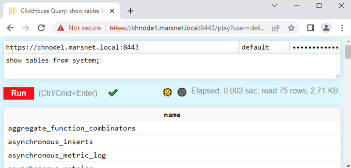

import SelfManaged from '@site/docs/en/_snippets/_self_managed_only_automated.md';

# Configuring SSL-TLS

<SelfManaged />

This guide provides simple and minimal settings to configure ClickHouse to use OpenSSL certificates to validate connections. For this demonstration, a self-signed Certificate Authority (CA) certificate and key are created with node certificates to make the connections with appropriate settings.

:::note
TLS implementation is complex and there are many options to consider to ensure a fully secure and robust deployment. This is a basic tutorial with basic SSL/TLS configuration examples. Consult with your PKI/security team to generate the correct certificates for your organization.

Review this [basic tutorial on certificate usage](https://ubuntu.com/server/docs/security-certificates) for an introductory overview.
:::

## 1. Create a ClickHouse Deployment

This guide was written using Ubuntu 20.04 and ClickHouse installed on the following hosts using the DEB package (using apt). The domain is `marsnet.local`:

|Host |IP Address|
|--------|-------------|
|chnode1 |192.168.1.221|
|chnode2 |192.168.1.222|
|chnode3 |192.168.1.223|


:::note
View the [Quick Start](/docs/en/getting-started/install.md) for more details on how to install ClickHouse.
:::


## 2. Create SSL certicates
:::note
Using self-signed certificates are for demonstration purposes only and should not used in production. Certificate requests should be created to be signed by the organization and validated using the CA chain that will be configured in the settings. However, these steps can be used to configure and test settings, then can be replaced by the actual certificates that will be used.
:::

1. Generate a key that will be used for the new CA:
    ```bash
    openssl genrsa -out marsnet_ca.key 2048
    ```

2. Generate a new self-signed CA certificate. The following will create a new certificate that will be used to sign other certificates using the CA key:
    ```bash
    openssl req -x509 -subj "/CN=marsnet.local CA" -nodes -key marsnet_ca.key -days 1095 -out marsnet_ca.crt
    ```

    :::note
    Backup the key and CA certificate in a secure location not in the cluster. After generating the node certificates, the key should be deleted from the cluster nodes.
    :::

3. Verify the contents of the new CA certificate:
    ```bash
    openssl x509 -in marsnet_ca.crt -text
    ```

4. Create a certificate request (CSR) and generate a key for each node:
    ```bash
    openssl req -newkey rsa:2048 -nodes -subj "/CN=chnode1" -addext "subjectAltName = DNS:chnode1.marsnet.local,IP:192.168.1.221" -keyout chnode1.key -out chnode1.csr
    openssl req -newkey rsa:2048 -nodes -subj "/CN=chnode2" -addext "subjectAltName = DNS:chnode2.marsnet.local,IP:192.168.1.222" -keyout chnode2.key -out chnode2.csr
    openssl req -newkey rsa:2048 -nodes -subj "/CN=chnode3" -addext "subjectAltName = DNS:chnode3.marsnet.local,IP:192.168.1.223" -keyout chnode3.key -out chnode3.csr
    ```

5. Using the CSR and CA, create new certificate and key pairs:
    ```bash
    openssl x509 -req -in chnode1.csr -out chnode1.crt -CAcreateserial -CA marsnet_ca.crt -CAkey marsnet_ca.key -days 365
    openssl x509 -req -in chnode2.csr -out chnode2.crt -CAcreateserial -CA marsnet_ca.crt -CAkey marsnet_ca.key -days 365
    openssl x509 -req -in chnode3.csr -out chnode3.crt -CAcreateserial -CA marsnet_ca.crt -CAkey marsnet_ca.key -days 365
    ```

6. Verify the certs for subject and issuer:
    ```bash
    openssl x509 -in chnode1.crt -text -noout
    ```

7. Check that the new certificates verify against the CA cert:
    ```bash
    openssl verify -CAfile marsnet_ca.crt chnode1.crt
    chnode1.crt: OK
    ```

## 3. Create and Configure a directory to store certificates and keys.

:::note
This must be done on each node. Use appropriate certificates and keys on each host.
:::

1. Create a folder in a directory accessible by ClickHouse in each node. We recommend the default configuration directory (e.g. `/etc/clickhouse-server`):
    ```bash
    mkdir /etc/clickhouse-server/certs
    ```

2. Copy the CA certificate, node certificate and key corresponding to each node to the new certs directory.

3. Update owner and permissions to allow ClickHouse to read the certificates:
    ```bash
    chown clickhouse:clickhouse -R /etc/clickhouse-server/certs
    chmod 600 /etc/clickhouse-server/certs/*
    chmod 755 /etc/clickhouse-server/certs
    ll /etc/clickhouse-server/certs
    ```

    ```response
    total 20
    drw-r--r-- 2 clickhouse clickhouse 4096 Apr 12 20:23 ./
    drwx------ 5 clickhouse clickhouse 4096 Apr 12 20:23 ../
    -rw------- 1 clickhouse clickhouse  997 Apr 12 20:22 chnode1.crt
    -rw------- 1 clickhouse clickhouse 1708 Apr 12 20:22 chnode1.key
    -rw------- 1 clickhouse clickhouse 1131 Apr 12 20:23 marsnet_ca.crt
    ```

## 4. Configure the environment with basic clusters using ClickHouse Keeper

For this deployment environment, the following ClickHouse Keeper settings are used in each node. Each server will have its own `<server_id>`. (For example, `<server_id>1</server_id>` for node `chnode1`, and so on.)

:::note
Recommended port is `9281` for ClickHouse Keeper. However, the port is configurable and can be set if this port is in use already by another application in the environment.

For a full explanation of all options, visit https://clickhouse.com/docs/en/operations/clickhouse-keeper/
:::


1. Add the following inside the `<clickhouse>` tag in ClickHouse server `config.xml`

    :::note
    For production environments, it is recommended to use a separate `.xml` config file in the `config.d` directory.
    For more information, visit https://clickhouse.com/docs/en/operations/configuration-files/
    :::

    ```xml
    <keeper_server>
        <tcp_port_secure>9281</tcp_port_secure>
        <server_id>1</server_id>
        <log_storage_path>/var/lib/clickhouse/coordination/log</log_storage_path>
        <snapshot_storage_path>/var/lib/clickhouse/coordination/snapshots</snapshot_storage_path>

        <coordination_settings>
            <operation_timeout_ms>10000</operation_timeout_ms>
            <session_timeout_ms>30000</session_timeout_ms>
            <raft_logs_level>trace</raft_logs_level>
        </coordination_settings>

        <raft_configuration>
            <server>
                <id>1</id>
                <hostname>chnode1.marsnet.local</hostname>
                <port>9444</port>
                <secure>1</secure>
            </server>
            <server>
                <id>2</id>
                <hostname>chnode2.marsnet.local</hostname>
                <port>9444</port>
                <secure>1</secure>
            </server>
            <server>
                <id>3</id>
                <hostname>chnode3.marsnet.local</hostname>
                <port>9444</port>
                <secure>1</secure>
            </server>
        </raft_configuration>
    </keeper_server>
    ```

2. Uncomment and update the keeper settings on all nodes and set the `<secure>` flag to 1:
    ```xml
    <zookeeper>
        <node>
            <host>chnode1.marsnet.local</host>
            <port>9281</port>
            <secure>1</secure>
        </node>
        <node>
            <host>chnode2.marsnet.local</host>
            <port>9281</port>
            <secure>1</secure>
        </node>
        <node>
            <host>chnode3.marsnet.local</host>
            <port>9281</port>
            <secure>1</secure>
        </node>
    </zookeeper>
    ```

3. Update and add the following cluster settings to `chnode1` and `chnode2`. `chnode3` will be used for the ClickHouse Keeper quorum.

    :::note
    For this configuration, only one example cluster is configured. The test sample clusters must be either removed, commented out or if an existing cluster exists that is being tested, then the port must be updated and the `<secure>` option must be added. The `<user` and `<password>` must be set if the `default` user was initially configured to have a password in the installation or in the `users.xml` file.
    :::

    The following creates a cluster with one shard replica on two servers (one on each node).
    ```xml
    <remote_servers>
        <cluster_1S_2R>
            <shard>
                <replica>
                    <host>chnode1.marsnet.local</host>
                    <port>9440</port>
                    <user>default</user>
                    <password>ClickHouse123!</password>
                    <secure>1</secure>
                </replica>
                <replica>
                    <host>chnode2.marsnet.local</host>
                    <port>9440</port>
                    <user>default</user>
                    <password>ClickHouse123!</password>
                    <secure>1</secure>
                </replica>
            </shard>
        </cluster_1S_2R>
    </remote_servers>
    ```

4. Define macros values to be able to create a ReplicatedMergeTree table for testing. On `chnode1`:
    ```xml
    <macros>
        <shard>1</shard>
        <replica>replica_1</replica>
    </macros>
    ```

    On `chnode2`:
    ```xml
    <macros>
        <shard>1</shard>
        <replica>replica_2</replica>
    </macros>
    ```

## 5. Configure SSL-TLS interfaces on ClickHouse nodes
The settings below are configured in the ClickHouse server `config.xml`

1.  Set the display name for the deployment (optional):
    ```xml
    <display_name>clickhouse</display_name>
    ```

2. Set ClickHouse to listen on external ports:
    ```xml
    <listen_host>0.0.0.0</listen_host>
    ```

3. Configure the `https` port and disable the `http` port on each node:
    ```xml
    <https_port>8443</https_port>
    <!--<http_port>8123</http_port>-->
    ```

4. Configure the ClickHouse Native secure TCP port and disable the default non-secure port on each node:
    ```xml
    <tcp_port_secure>9440</tcp_port_secure>
    <!--<tcp_port>9000</tcp_port>-->
    ```

5. Configure the `interserver https` port and disable the default non-secure port on each node:
    ```xml
    <interserver_https_port>9010</interserver_https_port>
    <!--<interserver_http_port>9009</interserver_http_port>-->
    ```

6. Configure OpenSSL with certificates and paths

    :::note
    Each filename and path must be updated to match the node that it is being configured on.
    For example, update the `<certificateFile>` entry to be `chnode2.crt` when configuring in `chnode2` host.
    :::

    ```xml
    <openSSL>
        <server>
            <certificateFile>/etc/clickhouse-server/certs/chnode1.crt</certificateFile>
            <privateKeyFile>/etc/clickhouse-server/certs/chnode1.key</privateKeyFile>
            <verificationMode>relaxed</verificationMode>
            <caConfig>/etc/clickhouse-server/certs/marsnet_ca.crt</caConfig>
            <cacheSessions>true</cacheSessions>
            <disableProtocols>sslv2,sslv3</disableProtocols>
            <preferServerCiphers>true</preferServerCiphers>
        </server>
        <client>
            <loadDefaultCAFile>false</loadDefaultCAFile>
            <caConfig>/etc/clickhouse-server/certs/marsnet_ca.crt</caConfig>
            <cacheSessions>true</cacheSessions>
            <disableProtocols>sslv2,sslv3</disableProtocols>
            <preferServerCiphers>true</preferServerCiphers>
            <verificationMode>relaxed</verificationMode>
            <invalidCertificateHandler>
                <name>RejectCertificateHandler</name>
            </invalidCertificateHandler>
        </client>
    </openSSL>
    ```

    For more information, visit https://clickhouse.com/docs/en/operations/server-configuration-parameters/settings/#server_configuration_parameters-openssl


7. Configure gRPC for SSL on every node:
    ```xml
    <grpc>
        <enable_ssl>1</enable_ssl>
        <ssl_cert_file>/etc/clickhouse-server/certs/chnode1.crt</ssl_cert_file>
        <ssl_key_file>/etc/clickhouse-server/certs/chnode1.key</ssl_key_file>
        <ssl_require_client_auth>true</ssl_require_client_auth>
        <ssl_ca_cert_file>/etc/clickhouse-server/certs/marsnet_ca.crt</ssl_ca_cert_file>
        <transport_compression_type>none</transport_compression_type>
        <transport_compression_level>0</transport_compression_level>
        <max_send_message_size>-1</max_send_message_size>
        <max_receive_message_size>-1</max_receive_message_size>
        <verbose_logs>false</verbose_logs>
    </grpc>
    ```

    For more information, visit https://clickhouse.com/docs/en/interfaces/grpc/

8. Configure ClickHouse client on at least one of the nodes to use SSL for connections in its own `config.xml` file (by default in `/etc/clickhouse-client/`):
    ```xml
    <openSSL>
        <client>
            <loadDefaultCAFile>false</loadDefaultCAFile>
            <caConfig>/etc/clickhouse-server/certs/marsnet_ca.crt</caConfig>
            <cacheSessions>true</cacheSessions>
            <disableProtocols>sslv2,sslv3</disableProtocols>
            <preferServerCiphers>true</preferServerCiphers>
            <invalidCertificateHandler>
                <name>RejectCertificateHandler</name>
            </invalidCertificateHandler>
        </client>
    </openSSL>
    ```

6. Disable default emulation ports for MySQL and PostgreSQL:
    ```xml
    <!--mysql_port>9004</mysql_port-->
    <!--postgresql_port>9005</postgresql_port-->
    ```

## 6. Testing
1. Start all nodes, one at a time:
    ```bash
    service clickhouse-server start
    ```

2. Verify secure ports are up and listening, should look similar to this example on each node:
    ```bash
    root@chnode1:/etc/clickhouse-server# netstat -ano | grep tcp
    ```

    ```response
    tcp        0      0 0.0.0.0:9010            0.0.0.0:*               LISTEN      off (0.00/0/0)
    tcp        0      0 127.0.0.53:53           0.0.0.0:*               LISTEN      off (0.00/0/0)
    tcp        0      0 0.0.0.0:22              0.0.0.0:*               LISTEN      off (0.00/0/0)
    tcp        0      0 0.0.0.0:8443            0.0.0.0:*               LISTEN      off (0.00/0/0)
    tcp        0      0 0.0.0.0:9440            0.0.0.0:*               LISTEN      off (0.00/0/0)
    tcp        0      0 0.0.0.0:9281            0.0.0.0:*               LISTEN      off (0.00/0/0)
    tcp        0      0 192.168.1.221:33046     192.168.1.222:9444      ESTABLISHED off (0.00/0/0)
    tcp        0      0 192.168.1.221:42730     192.168.1.223:9444      ESTABLISHED off (0.00/0/0)
    tcp        0      0 192.168.1.221:51952     192.168.1.222:9281      ESTABLISHED off (0.00/0/0)
    tcp        0      0 192.168.1.221:22        192.168.1.210:49801     ESTABLISHED keepalive (6618.05/0/0)
    tcp        0     64 192.168.1.221:22        192.168.1.210:59195     ESTABLISHED on (0.24/0/0)
    tcp6       0      0 :::22                   :::*                    LISTEN      off (0.00/0/0)
    tcp6       0      0 :::9444                 :::*                    LISTEN      off (0.00/0/0)
    tcp6       0      0 192.168.1.221:9444      192.168.1.222:59046     ESTABLISHED off (0.00/0/0)
    tcp6       0      0 192.168.1.221:9444      192.168.1.223:41976     ESTABLISHED off (0.00/0/0)
    ```

    |ClickHouse Port |Description|
    |--------|-------------|
    |8443 | https interface|
    |9010 | interserver https port|
    |9281 | ClickHouse Keeper secure port|
    |9440 | secure Native TCP protocol|
    |9444 | ClickHouse Keeper Raft port |

3. Verify ClickHouse Keeper health
The typical [4 letter word (4lW)](/docs/en/guides/sre/keeper/index.md#four-letter-word-commands) commands will not work using `echo` without TLS, here is how to use the commands with `openssl`.
   - Start an interactive session with `openssl`

  ```bash
  openssl s_client -connect chnode1.marsnet.local:9281
  ```
  ```response
  CONNECTED(00000003)
  depth=0 CN = chnode1
  verify error:num=20:unable to get local issuer certificate
  verify return:1
  depth=0 CN = chnode1
  verify error:num=21:unable to verify the first certificate
  verify return:1
  ---
  Certificate chain
   0 s:CN = chnode1
     i:CN = marsnet.local CA
  ---
  Server certificate
  -----BEGIN CERTIFICATE-----
  MIICtDCCAZwCFD321grxU3G5pf6hjitf2u7vkusYMA0GCSqGSIb3DQEBCwUAMBsx
  ...
  ```

   - Send the 4LW commands in the openssl session

  ```bash
  mntr
  ```
  ```response
  ---
  Post-Handshake New Session Ticket arrived:
  SSL-Session:
      Protocol  : TLSv1.3
  ...
  read R BLOCK
  zk_version      v22.7.3.5-stable-e140b8b5f3a5b660b6b576747063fd040f583cf3
  zk_avg_latency  0
  # highlight-next-line
  zk_max_latency  4087
  zk_min_latency  0
  zk_packets_received     4565774
  zk_packets_sent 4565773
  zk_num_alive_connections        2
  zk_outstanding_requests 0
  # highlight-next-line
  zk_server_state leader
  zk_znode_count  1087
  zk_watch_count  26
  zk_ephemerals_count     12
  zk_approximate_data_size        426062
  zk_key_arena_size       258048
  zk_latest_snapshot_size 0
  zk_open_file_descriptor_count   187
  zk_max_file_descriptor_count    18446744073709551615
  # highlight-next-line
  zk_followers    2
  zk_synced_followers     1
  closed
  ```

4. Start the ClickHouse client using `--secure` flag and SSL port:
    ```bash
    root@chnode1:/etc/clickhouse-server# clickhouse-client --user default --password ClickHouse123! --port 9440 --secure --host chnode1.marsnet.local
    ClickHouse client version 22.3.3.44 (official build).
    Connecting to chnode1.marsnet.local:9440 as user default.
    Connected to ClickHouse server version 22.3.3 revision 54455.

    clickhouse :)
    ```

5. Log into the Play UI using the `https` interface at `https://chnode1.marsnet.local:8443/play`.

    

    :::note
    the browser will show an untrusted certificate since it is being reached from a workstation and the certificates are not in the root CA stores on the client machine.
    When using certificates issued from a public authority or enterprise CA, it should show trusted.
    :::

6. Create a replicated table:
    ```sql
    clickhouse :) CREATE TABLE repl_table ON CLUSTER cluster_1S_2R
                (
                    id UInt64,
                    column1 Date,
                    column2 String
                )
                ENGINE = ReplicatedMergeTree('/clickhouse/tables/{shard}/default/repl_table', '{replica}' )
                ORDER BY (id);
    ```

    ```response
    ┌─host──────────────────┬─port─┬─status─┬─error─┬─num_hosts_remaining─┬─num_hosts_active─┐
    │ chnode2.marsnet.local │ 9440 │      0 │       │                   1 │                0 │
    │ chnode1.marsnet.local │ 9440 │      0 │       │                   0 │                0 │
    └───────────────────────┴──────┴────────┴───────┴─────────────────────┴──────────────────┘
    ```

7. Add a couple rows on `chnode1`:
    ```sql
    INSERT INTO repl_table
    (id, column1, column2)
    VALUES
    (1,'2022-04-01','abc'),
    (2,'2022-04-02','def');
    ```

8. Verify the replication by viewing the rows on `chnode2`:
    ```sql
    SELECT * FROM repl_table
    ```

    ```response
    ┌─id─┬────column1─┬─column2─┐
    │  1 │ 2022-04-01 │ abc     │
    │  2 │ 2022-04-02 │ def     │
    └────┴────────────┴─────────┘
    ```

## Summary

This article focused on getting a ClickHouse environment configured with SSL/TLS. The settings will differ for different requirements in production environments; for example, certificate verification levels, protocols, ciphers, etc. But you should now have a good understanding of the steps involved in configuring and implementing secure connections.
