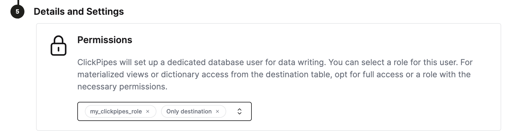

import KafkaSVG from "../../images/logos/kafka.svg";
import ConfluentSVG from "../../images/logos/confluent.svg";
import MskSVG from "../../images/logos/msk.svg";
import AzureEventHubsSVG from "../../images/logos/azure_event_hubs.svg";
import WarpStreamSVG from "../../images/logos/warpstream.svg";
import S3SVG from "../../images/logos/amazon_s3_logo.svg";
import AmazonKinesis from "../../images/logos/amazon_kinesis_logo.svg";
import GCSSVG from "../../images/logos/gcs.svg";
import PostgresSVG from "../../images/logos/postgresql.svg";

# Integrating with ClickHouse Cloud

## Introduction

[ClickPipes](https://clickhouse.com/cloud/clickpipes) is a managed integration platform that makes ingesting data from a diverse set of sources as simple as clicking a few buttons. Designed for the most demanding workloads, ClickPipes's robust and scalable architecture ensures consistent performance and reliability. ClickPipes can be used for long-term streaming needs or one-time data loading job.

## Supported Data Sources

| Name                 |Logo|Type| Status          | Description                                                                                          |
|----------------------|----|----|-----------------|------------------------------------------------------------------------------------------------------|
| Apache Kafka         |<KafkaSVG style={{width: '3rem', 'height': '3rem'}} />|Streaming| Stable          | Configure ClickPipes and start ingesting streaming data from Apache Kafka into ClickHouse Cloud.     |
| Confluent Cloud      |<ConfluentSVG style={{width: '3rem'}} />|Streaming| Stable          | Unlock the combined power of Confluent and ClickHouse Cloud through our direct integration.          |
| Redpanda             ||Streaming| Stable          | Configure ClickPipes and start ingesting streaming data from RedPanda into ClickHouse Cloud.         |
| AWS MSK              |<MskSVG style={{width: '3rem', 'height': '3rem'}} />|Streaming| Stable          | Configure ClickPipes and start ingesting streaming data from AWS MSK into ClickHouse Cloud.          |
| Azure Event Hubs     |<AzureEventHubsSVG style={{width: '3rem'}} />|Streaming| Stable          | Configure ClickPipes and start ingesting streaming data from Azure Event Hubs into ClickHouse Cloud. |
| WarpStream           |<WarpStreamSVG style={{width: '3rem'}} />|Streaming| Stable          | Configure ClickPipes and start ingesting streaming data from WarpStream into ClickHouse Cloud.       |
| Amazon S3            |<S3SVG style={{width: '3rem', height: 'auto'}} />|Object Storage| Stable          | Configure ClickPipes to ingest large volumes of data from object storage.                            |
| Google Cloud Storage |<GCSSVG style={{width: '3rem', height: 'auto'}} />|Object Storage| Stable          | Configure ClickPipes to ingest large volumes of data from object storage.                            |
| Amazon Kinesis       |<AmazonKinesis style={{width: '3rem', height: 'auto'}} />|Streaming| Stable          | Configure ClickPipes and start ingesting streaming data from Amazon Kinesis into ClickHouse cloud.   |
| Postgres             |<PostgresSVG style={{width: '3rem', height: 'auto'}} />|DBMS| Private Preview | Configure ClickPipes and start ingesting data from Postgres into ClickHouse Cloud.                   |

More connectors will get added to ClickPipes, you can find out more by [contacting us](https://clickhouse.com/company/contact?loc=clickpipes).

## List of Static IPs

The following are the static NAT IPs (separated by region) that ClickPipes uses to connect to your external services.
Add your related instance region IPs to your IP allowlist to allow traffic.
If your instance region is not listed here, it will fall to the default region:

- **eu-central-1** for EU regions
- **us-east-1** for instances in `us-east-1`
- **us-east-2** for other all regions

| ClickHouse Cloud region | IP Addresses |
|-------------------------|--------------|
| **eu-central-1**        | `18.195.233.217`, `3.127.86.90`, `35.157.23.2`, `18.197.167.47`, `3.122.25.29`, `52.28.148.40` |
| **us-east-2**           | `3.131.130.196`, `3.23.172.68`, `3.20.208.150`, `3.132.20.192`, `18.119.76.110`, `3.134.185.180` |
| **us-east-1**           | `54.82.38.199`, `3.90.133.29`, `52.5.177.8`, `3.227.227.145`, `3.216.6.184`, `54.84.202.92`, `3.131.130.196`, `3.23.172.68`, `3.20.208.150` |

## Adjusting ClickHouse settings
ClickHouse Cloud provides sensible defaults for most of the use cases. However, if you need to adjust some ClickHouse settings for the ClickPipes destination tables, a dedicated role for ClickPipes is the most flexible solution.
Steps:
1. create a custom role `CREATE ROLE my_clickpipes_role SETTINGS ...`. See [CREATE ROLE](/docs/en/sql-reference/statements/create/role.md) syntax for details.
2. add the custom role to ClickPipes user on step `Details and Settings` during the ClickPipes creation.

## Error reporting
ClickPipes will create a table next to your destination table with the postfix `<destination_table_name>_clickpipes_error`. This table will contain any errors from the operations of your ClickPipe (network, connectivity, etc.) and also any data that don't conform to the schema. The error table has a [TTL](https://clickhouse.com/docs/en/engines/table-engines/mergetree-family/mergetree#table_engine-mergetree-ttl) of 7 days.
If ClickPipes cannot connect to a data source or destination after 15min., ClickPipes instance stops and  stores an appropriate message in the error table (providing the ClickHouse instance is available).

## F.A.Q
- **What is ClickPipes?**

  ClickPipes is a ClickHouse Cloud feature that makes it easy for users to connect their ClickHouse services to external data sources, specifically Kafka. With ClickPipes for Kafka, users can easily continuously load data into ClickHouse, making it available for real-time analytics.

- **Does ClickPipes support data transformation?**

  Yes, ClickPipes supports basic data transformation by exposing the DDL creation. You can then apply more advanced transformations to the data as it is loaded into its destination table in a ClickHouse Cloud service leveraging ClickHouse's [materialized views feature](https://clickhouse.com/docs/en/guides/developer/cascading-materialized-views).

- **Does using ClickPipes incur an additional cost?**

  ClickPipes is not billed separately at the moment. Running ClickPipes might generate an indirect compute and storage cost on the destination ClickHouse Cloud service like any ingest workload.

- **Is there a way to handle errors or failures when using ClickPipes for Kafka?**

  Yes, ClickPipes for Kafka will automatically retry case of failures when consuming data from Kafka. ClickPipes also supports enabling a dedicated error table that will hold errors and malformed data for 7 days.
