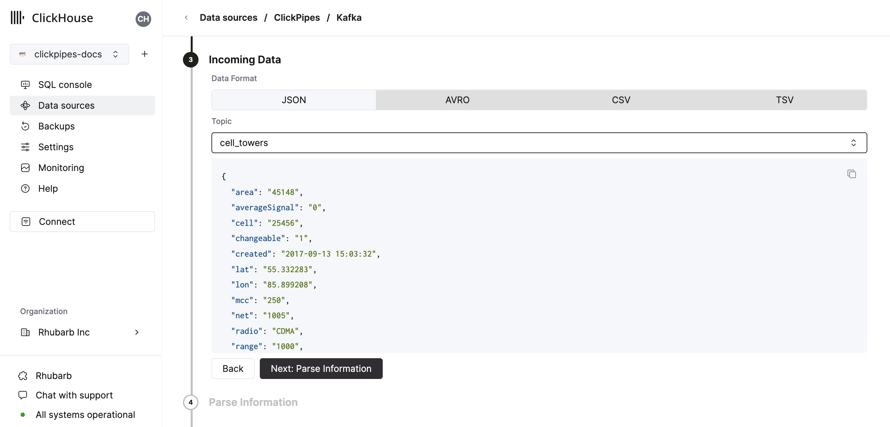
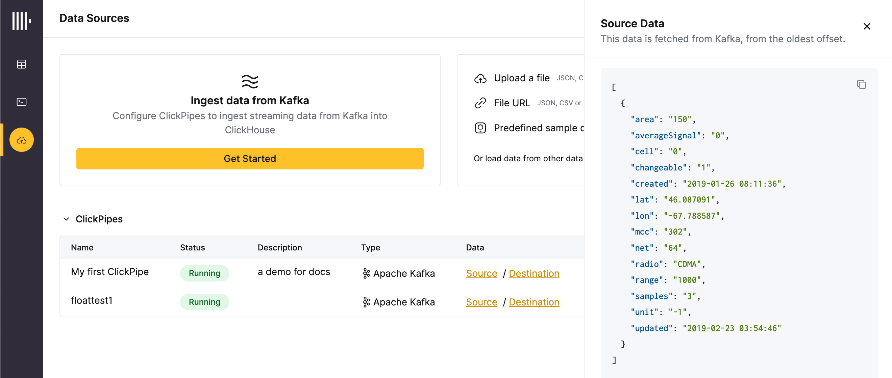
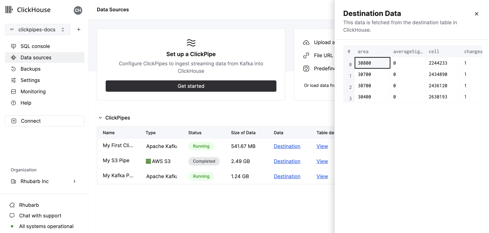

import KafkaSVG from "../../images/logos/kafka.svg";
import ConfluentSVG from "../../images/logos/confluent.svg";
import MskSVG from "../../images/logos/msk.svg";
import AzureEventHubsSVG from "../../images/logos/azure_event_hubs.svg";
import UpstashSVG from "../../images/logos/upstash.svg";
import WarpStreamSVG from "../../images/logos/warpstream.svg";

# Integrating with ClickHouse Cloud

## Introduction

[ClickPipes](https://clickhouse.com/cloud/clickpipes) is a managed integration platform that makes ingesting data from a diverse set of sources as simple as clicking a few buttons. Designed for the most demanding workloads, ClickPipes's robust and scalable architecture ensures consistent performance and reliability.

## Creating your first ClickPipe

1. Access the SQL Console for your ClickHouse Cloud Service.

  

2. Select the `Imports` button on the left-side menu and click on "Setup a ClickPipe"

  

3. Select your data source, either "Confluent Cloud", "Apache Kafka", "AWS MSK", "Redpanda", "Upstash", "WarpStream", or "S3"

  

4. Fill out the form by providing your ClickPipe with a name, a description (optional), your credentials, and other connection details.

  

4a. __Optional for Schema Registry__: Specify the complete URL of your Schema Registry server along with the precise RESTful path to the ID representing your preferred schema document. This schema will serve as the validation benchmark for all messages from your topic, consequently blocking any messages that fail the validation against the designated schema. Additionally, the Schema Registry allows new schema retreival via JSON_SR messages. In scenarios where your JSON_SR message carries a Schema Registry ID differing from the current one, Clickpipes will fetch the corresponding schema and use it for future validation.

5. Select your data format (we currently support a subset of ClickHouse formats). The UI will display a sample document from the selected source (Kafka topic, S3 Bucket, etc).

  

5. In the next step, you can select whether you want to ingest data into a new ClickHouse table or reuse an existing one. Follow the instructions in the screen to modify your table name, schema, and settings. You can see a real-time preview of your changes in the sample table at the top.

  

  You can also customize the advanced settings using the controls provided

  

6. Alternatively, you can decide to ingest your data in an existing ClickHouse table. In that case, the UI will allow you to map fields from Kafka with the ClickHouse fields in the selected destination table.

  

7. Finally, you can decide to enable the error logging table and configure permissions for the internal clickpipes user.

**Error table**: When error logging table is enabled, ClickPipes will create a table next to your destination table with the postfix `_clickpipes_error`. This table will contain any errors from the operations of your ClickPipe (network, connectivity, etc.) and also any data that don't conform to the schema specified in the previous screen. The error table has a [TTL](https://clickhouse.com/docs/en/engines/table-engines/mergetree-family/mergetree#table_engine-mergetree-ttl) of 7 days.

**Permissions:** ClickPipes will create a dedicated user for writing data into a destination table. You can select a role for this internal user using a custom role or one of the predefined role:
    - `Full access`: with the full access to the cluster. It might be useful if you use Materialized View or Dictionary with the destination table.
    - `Only destination table`: with the `INSERT` permissions to the destination table only.

  

8. By clicking on "Complete Setup", the system will register you ClickPipe, and you'll be able to see it listed in the summary table.

  

  

  The summary table provides controls to display sample data from the source or the destination table in ClickHouse

  

  

  As well as controls to remove the ClickPipe and display a summary of the ingest job.

  

9. **Congratulations!** you have successfully set up your first ClickPipe. This job will be continuously running, ingesting data in real-time from your remote data source.

## Supported Data Sources

|Name|Logo|Type|Description|
|------|----|----------------|------------------|
|Confluent Cloud|<ConfluentSVG style={{width: '3rem'}} />|Streaming|Unlock the combined power of Confluent and ClickHouse Cloud through our direct integration.|
|Apache Kafka|<KafkaSVG style={{width: '3rem', 'height': '3rem'}} />|Streaming|Configure ClickPipes and start ingesting streaming data from Apache Kafka into ClickHouse Cloud.|
|AWS MSK|<MskSVG style={{width: '3rem', 'height': '3rem'}} />|Streaming|Configure ClickPipes and start ingesting streaming data from AWS MSK into ClickHouse Cloud.|
|AzureEventHubs|<AzureEventHubsSVG style={{width: '3rem'}} />|Streaming|Configure ClickPipes and start ingesting streaming data from Azure Event Hubs into ClickHouse Cloud.|
|Upstash|<UpstashSVG style={{width: '3rem'}} />|Streaming|Configure ClickPipes and start ingesting streaming data from Upstash into ClickHouse Cloud.|
|WarpStream|<WarpStreamSVG style={{width: '3rem'}} />|Streaming|Configure ClickPipes and start ingesting streaming data from WarpStream into ClickHouse Cloud.|

More connectors are will get added to ClickPipes, you can find out more by [contacting us](https://clickhouse.com/company/contact?loc=clickpipes).

## Supported data formats

The supported formats are:

| Format                                                                                    | Support     |
|-------------------------------------------------------------------------------------------|-------------|
| [JSON](../../../interfaces/formats.md/#json)                                               | ✔           |
| [AvroConfluent](../../../interfaces/formats.md/#data-format-avro-confluent)                |*Coming Soon*|
| [TabSeparated](../../../interfaces/formats.md/#tabseparated)                               |*Coming Soon*|
| [CSV](../../../interfaces/formats.md/#csv)                                                 |*Coming Soon*|

## Supported data types

The following ClickHouse types are currently supported by the transform package (with standard JSON as the source):

- Base numeric types
  - Int8
  - Int16
  - Int32
  - Int64
  - UInt8
  - UInt16
  - UInt32
  - UInt64
  - Float32
  - Float64
- Boolean
- String
- FixedString
- Date, Date32
- DateTime, DateTime64
- Enum8/Enum16
- LowCardinality(String)
- Map with keys and values using any of the above types (including Nullables)
- Tuple and Array with elements using any of the above types (including Nullables, one level depth only)
- JSON/Object('json'). experimental

:::note
Nullable versions of the above are also supported with these exceptions:

- Nullable Enums are **not** supported
- LowCardinality(Nullable(String)) are **not** supported

:::

## Current Limitations

- Private Link support isn't currently available for ClickPipes but will be released in the near future. Please contact us to express interest.

## List of Static IPs

The following are the static NAT IPs that ClickPipes uses to connect to your Kafka brokers separated by region.
Add your related instance region IPs to your IP allowlist to allow traffic.
If your instance region is not listed here, it will fall to the default region:
- **eu-central-1** for EU regions
- **us-east-2** for other regions

| ClickHouse Cloud region | IP Addresses                                                                                                                                |
|-------------------------|---------------------------------------------------------------------------------------------------------------------------------------------|
| **us-east-2**           | `3.131.130.196`, `3.23.172.68`, `3.20.208.150`                                                                                              |
| **eu-central-1**        | `18.195.233.217`, `3.127.86.90`, `35.157.23.2`                                                                                              |
| us-east-1               | `54.82.38.199`, `3.90.133.29`, `52.5.177.8`, `3.227.227.145`, `3.216.6.184`, `54.84.202.92`, `3.131.130.196`, `3.23.172.68`, `3.20.208.150` |

## F.A.Q

- **What is ClickPipes ?**

  ClickPipes is a ClickHouse Cloud feature that makes it easy for users to connect their ClickHouse services to external data sources, specifically Kafka. With ClickPipes for Kafka, users can easily continuously load data into ClickHouse, making it available for real-time analytics.

- **What types of data sources does ClickPipes support ?**

  Currently, ClickPipes supports Confluent Cloud, AWS MSK, and Apache Kafka as data sources. However, we are committed to expand our support for more data sources in the future. Don't hesitate to [contact us](https://clickhouse.com/company/contact?loc=clickpipes) if you want to know more.

- **How does ClickPipes for Kafka work ?**

  ClickPipes uses a dedicated architecture running the Kafka Consumer API to read data from a specified topic and then inserts the data into a ClickHouse table on a specific ClickHouse Cloud service.

- **What's the difference between ClickPipes and the ClickHouse Kafka Table Engine?**

  The Kafka Table engine is a ClickHouse core capability that implements a “pull model” where the ClickHouse server itself connects to Kafka, pulls events then writes them locally.

  ClickPipes is a separate cloud service that runs independently from the ClickHouse Service, it connects to Kafka (or other data sources) and pushes events to an associated ClickHouse Cloud service. This decoupled architecture allows for superior operational flexibility, clear separation of concerns, scalable ingestion, graceful failure management, extensibility and more.

- **What are the requirements for using ClickPipes for Kafka ?**

  In order to use ClickPipes for Kafka, you will need a running Kafka broker and a ClickHouse Cloud service with ClickPipes enabled. You will also need to ensure that ClickHouse Cloud can access your Kafka broker. This can be achieved by allowing remote connection on the Kafka side, whitelisting [ClickHouse Cloud Egress IP addresses](https://clickhouse.com/docs/en/manage/security/cloud-endpoints-api) in your Kafka setup. Support for AWS Private Link is coming soon.

- **Can I use ClickPipes for Kafka to write data to a Kafka topic ?**

  No, the ClickPipes for Kafka is designed for reading data from Kafka topics, not writing data to them. To write data to a Kafka topic, you will need to use a dedicated Kafka producer.

- **What data formats are supported by ClickPipes for Kafka ?**

  The list of supported data types is [displayed above](#supported-data-types).

- **Does ClickPipes support data transformation ?**

  Yes, ClickPipes supports basic data transformation by exposing the DDL creation. You can then apply more advanced transformations to the data as it is loaded into its destination table in a ClickHouse Cloud service leveraging ClickHouse's [materialized views feature](https://clickhouse.com/docs/en/guides/developer/cascading-materialized-views).

- **What delivery semantics ClickPipes for Kafka supports ?**

  ClickPipes for Kafka provides `at-least-once` delivery semantics (as one of the most commonly used approaches). We'd love to hear your feedback on delivery semantics (contact form). If you need exactly-once semantics, we recommend using our official [`clickhouse-kafka-connect`](https://clickhouse.com/blog/real-time-event-streaming-with-kafka-connect-confluent-cloud-clickhouse) sink.

- **Is there a way to handle errors or failures when using ClickPipes for Kafka ?**

  Yes, ClickPipes for Kafka will automatically retry case of failures when consuming data from Kafka. ClickPipes also supports enabling a dedicated error table that will hold errors and malformed data for 7 days.

- **Does using ClickPipes incur an additional cost ?**

  ClickPipes is not billed separately at the moment. Running ClickPipes might generate an indirect compute and storage cost on the destination ClickHouse Cloud service like any ingest workload.

- **What authentication mechanisms are supported for ClickPipes for Kafka?**

  For Apache Kafka protocol data sourced, ClickPipes supports [SASL/PLAIN](https://docs.confluent.io/platform/current/kafka/authentication_sasl/authentication_sasl_plain.html) authentication with TLS encryption. For Amazon MSK ClickPipes, Redpanda, and Upstash supports [SCRAM-SHA-512](https://docs.aws.amazon.com/msk/latest/developerguide/msk-password.html) authentication.

- **Do you support schema registries for managed Kafka Providers?**

You can also select a Schema Registry server and credentials to handle your decoding and validation (Currently only available for Confluent Cloud).

- **Does ClickPipes AWS MSK support IAM authentication?**

AWS MSK authentication currently only supports SASL/SCRAM-SHA-512 authentication. IAM authentication is coming soon.
