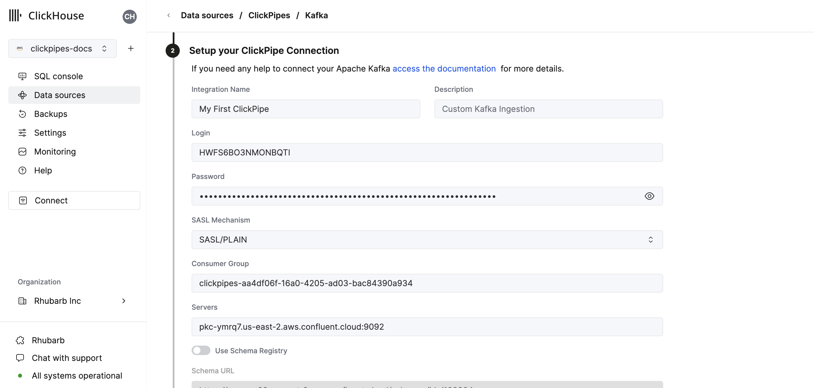
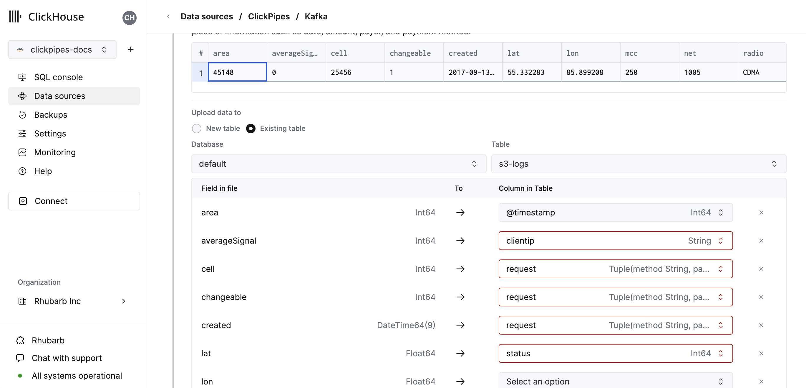
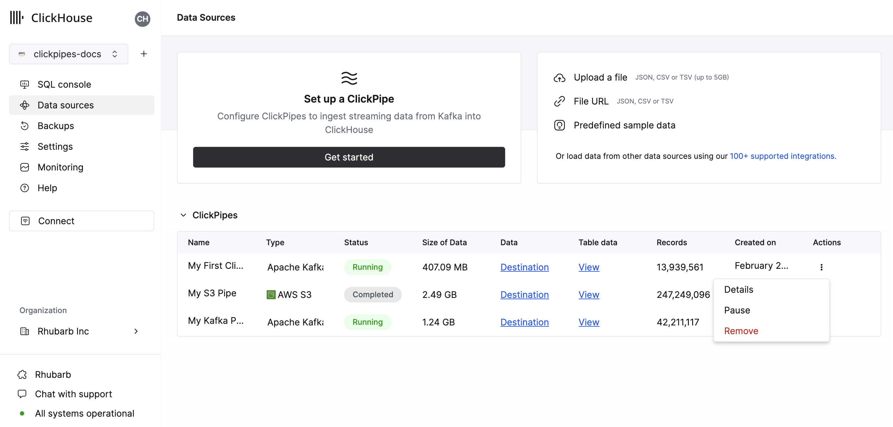
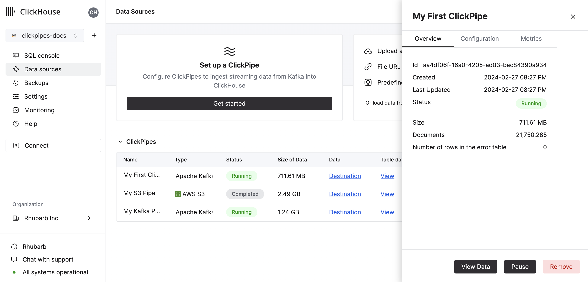

import KafkaSVG from "../../images/logos/kafka.svg";
import ConfluentSVG from "../../images/logos/confluent.svg";
import MskSVG from "../../images/logos/msk.svg";
import AzureEventHubsSVG from "../../images/logos/azure_event_hubs.svg";
import WarpStreamSVG from "../../images/logos/warpstream.svg";

# Integrating Kafka with ClickHouse Cloud
## Prerequisite
You have familiarized yourself with the [ClickPipes intro](./index.md).

## Creating your first Kafka ClickPipe

1. Access the SQL Console for your ClickHouse Cloud Service.

  

2. Select the `Data Sources` button on the left-side menu and click on "Set up a ClickPipe"

  

3. Select your data source.

  

4. Fill out the form by providing your ClickPipe with a name, a description (optional), your credentials, and other connection details.

  

5. Configure the schema registry. A valid schema is required for Avro streams and optional for JSON. This schema will be used to parse [AvroConfluent](../../../interfaces/formats.md/#data-format-avro-confluent) or validate JSON messages on the selected topic.
- Avro messages that cannot be parsed or JSON messages that fail validation will generate an error.
- the "root" path of the schema registry.  For example, a Confluent Cloud schema registry URL is just an HTTPS url with no path, like `https://test-kk999.us-east-2.aws.confluent.cloud`  If only the root
path is specified, the schema used to determine column names and types in step 4 will be determined by the id embedded in the sampled Kafka messages.
- the path `/schemas/ids/[ID]` to the schema document by the numeric schema id. A complete url using a schema id would be `https://registry.example.com/schemas/ids/1000`
- the path `/subjects/[subject_name]` to the schema document by subject name.  Optionally, a specific version can be referenced by appending `/versions/[version]` to the url (otherwise ClickPipes
will retrieve the latest version).  A complete url using a schema subject would be `https://registry.example.com/subjects/events` or `https://registry/example.com/subjects/events/versions/4`

Note that in all cases ClickPipes will automatically retrieve an updated or different schema from the registry if indicated by the schema ID embedded in the message.  If the message is written
without an embedded schema id, then the specific schema ID or subject must be specified to parse all messages.

6. Select your topic and the UI will display a sample document from the topic.

  

7. In the next step, you can select whether you want to ingest data into a new ClickHouse table or reuse an existing one. Follow the instructions in the screen to modify your table name, schema, and settings. You can see a real-time preview of your changes in the sample table at the top.

  

  You can also customize the advanced settings using the controls provided

  

8. Alternatively, you can decide to ingest your data in an existing ClickHouse table. In that case, the UI will allow you to map fields from the source to the ClickHouse fields in the selected destination table.

  

9. Finally, you can configure permissions for the internal clickpipes user.

  **Permissions:** ClickPipes will create a dedicated user for writing data into a destination table. You can select a role for this internal user using a custom role or one of the predefined role:
    - `Full access`: with the full access to the cluster. It might be useful if you use Materialized View or Dictionary with the destination table.
    - `Only destination table`: with the `INSERT` permissions to the destination table only.

  

10. By clicking on "Complete Setup", the system will register you ClickPipe, and you'll be able to see it listed in the summary table.

  

  

  The summary table provides controls to display sample data from the source or the destination table in ClickHouse

  

  As well as controls to remove the ClickPipe and display a summary of the ingest job.

  

11. **Congratulations!** you have successfully set up your first ClickPipe. If this is a streaming ClickPipe it will be continuously running, ingesting data in real-time from your remote data source.

## Supported Data Sources

|Name|Logo|Type|Status|Description|
|----|----|----|------|-----------|
|Apache Kafka|<KafkaSVG style={{width: '3rem', 'height': '3rem'}} />|Streaming|Stable|Configure ClickPipes and start ingesting streaming data from Apache Kafka into ClickHouse Cloud.|
|Confluent Cloud|<ConfluentSVG style={{width: '3rem'}} />|Streaming|Stable|Unlock the combined power of Confluent and ClickHouse Cloud through our direct integration.|
|Redpanda||Streaming|Stable|Configure ClickPipes and start ingesting streaming data from RedPanda into ClickHouse Cloud.|
|AWS MSK|<MskSVG style={{width: '3rem', 'height': '3rem'}} />|Streaming|Stable|Configure ClickPipes and start ingesting streaming data from AWS MSK into ClickHouse Cloud.|
|Azure Event Hubs|<AzureEventHubsSVG style={{width: '3rem'}} />|Streaming|Stable|Configure ClickPipes and start ingesting streaming data from Azure Event Hubs into ClickHouse Cloud.|
|WarpStream|<WarpStreamSVG style={{width: '3rem'}} />|Streaming|Stable|Configure ClickPipes and start ingesting streaming data from WarpStream into ClickHouse Cloud.|

More connectors are will get added to ClickPipes, you can find out more by [contacting us](https://clickhouse.com/company/contact?loc=clickpipes).

## Supported Data Formats

The supported formats are:
- [JSON](../../../interfaces/formats.md/#json)
- [AvroConfluent](../../../interfaces/formats.md/#data-format-avro-confluent)

### Supported Data Types

The following ClickHouse data types are currently supported in ClickPipes:

- Base numeric types - \[U\]Int8/16/32/64 and Float32/64
- Large integer types - \[U\]Int128/256
- Decimal Types
- Boolean
- String
- FixedString
- Date, Date32
- DateTime, DateTime64 (UTC timezones only)
- Enum8/Enum16
- UUID
- IPv4
- IPv6
- all ClickHouse LowCardinality types
- Map with keys and values using any of the above types (including Nullables)
- Tuple and Array with elements using any of the above types (including Nullables, one level depth only)

### Avro
#### Supported Avro Data Types

ClickPipes supports all Avro Primitive and Complex types, and all Avro Logical types except `time-millis`, `time-micros`, `local-timestamp-millis`, `local_timestamp-micros`, and `duration`.  Avro `record` types are converted to Tuple, `array` types to Array, and `map` to Map (string keys only).  In general the conversions listed [here](../../../../en/interfaces/formats.md#data-types-matching) are available.  We recommend using exact type matching for Avro numeric types, as ClickPipes does not check for overflow or precision loss on type conversion.

#### Nullable Types and Avro Unions

Nullable types in Avro are defined by using a Union schema of `(T, null)` or `(null, T)` where T is the base Avro type.  During schema inference, such unions will be mapped to a ClickHouse "Nullable" column.  Note that ClickHouse does not support
`Nullable(Array)`, `Nullable(Map)`, or `Nullable(Tuple)` types.  Avro null unions for these types will be mapped to non-nullable versions (Avro Record types are mapped to a ClickHouse named Tuple).  Avro "nulls" for these types will be inserted as:
- An empty Array for a null Avro array
- An empty Map for a null Avro Map
- A named Tuple with all default/zero values for a null Avro Record

ClickPipes does not currently support schemas that contain other Avro Unions (this may change in the future with the maturity of the new ClickHouse Variant and JSON data types).  If the Avro schema contains a "non-null" union, ClickPipes will generate an error when attempting to calculate a mapping between the Avro schema and Clickhouse column types.

#### Avro Schema Management

ClickPipes dynamically retrieves and applies the Avro schema from the configured Schema Registry using the schema ID embedded in each message/event.  Schema updates are detected and processed automatically.

At this time ClickPipes is only compatible with schema registries that use the [Confluent Schema Registry API](https://docs.confluent.io/platform/current/schema-registry/develop/api.html).  In addition to Confluent Kafka and Cloud, this includes the RedPanda, AWS MSK, and Upstash schema registries.  ClickPipes is not currently compatible with the AWS Glue Schema registry or the Azure Schema Registry (coming soon).

The following rules are applied to the mapping between the retrieved Avro schema and the ClickHouse destination table:
- If the Avro schema contains a field that is not included in the ClickHouse destination mapping, that field is ignored.
- If the Avro schema is missing a field defined in the ClickHouse destination mapping, the ClickHouse column will be populated with a "zero" value, such as 0 or an empty string.  Note that [DEFAULT](https://clickhouse.com/docs/en/sql-reference/statements/create/table#default) expressions are not currently evaluated for ClickPipes inserts (this is temporary limitation pending updates to the ClickHouse server default processing).
- If the Avro schema field and the ClickHouse column are incompatible, inserts of that row/message will fail, and the failure will be recorded in the ClickPipes errors table.  Note that several implicit conversions are supported (like between numeric types), but not all (for example, an Avro `record` field can not be inserted into an `Int32` ClickHouse column).

## Kafka Virtual Columns

The following virtual columns are supported for Kafka compatible streaming data sources.  When creating a new destination table virtual columns can be added by using the `Add Column` button.

| Name           | Description                                     | Recommended Data Type |
|----------------|-------------------------------------------------|-----------------------|
| _key           | Kafka Message Key                               | String                |
| _timestamp     | Kafka Timestamp (Millisecond precision)         | DateTime64(3)         |
| _partition     | Kafka Partition                                 | Int32                 |
| _offset        | Kafka Offset                                    | Int64                 |
| _topic         | Kafka Topic                                     | String                |
| _header_keys   | Parallel array of keys in the record Headers    | Array(String)         |
| _header_values | Parallel array of headers in the record Headers | Array(String)         |
| _raw_message   | Full Kafka Message                              | String                |

Note that the _raw_message column is only recommended for JSON data.  For use cases where only the JSON string is required (such as using ClickHouse [`JsonExtract*`](https://clickhouse.com/docs/en/sql-reference/functions/json-functions#jsonextract-functions) functions to populate a downstream materialized
view), it may improve ClickPipes performance to delete all the "non-virtual" columns.

## Limitations

- [DEFAULT](https://clickhouse.com/docs/en/sql-reference/statements/create/table#default) is not supported.

## Delivery semantics
ClickPipes for Kafka provides `at-least-once` delivery semantics (as one of the most commonly used approaches). We'd love to hear your feedback on delivery semantics [contact form](https://clickhouse.com/company/contact?loc=clickpipes). If you need exactly-once semantics, we recommend using our official [`clickhouse-kafka-connect`](https://clickhouse.com/blog/real-time-event-streaming-with-kafka-connect-confluent-cloud-clickhouse) sink.

## Authentication
For Apache Kafka protocol data sources, ClickPipes supports [SASL/PLAIN](https://docs.confluent.io/platform/current/kafka/authentication_sasl/authentication_sasl_plain.html) authentication with TLS encryption, as well as `SASL/SCRAM-SHA-256` and `SASL/SCRAM-SHA-512`. Depending on the streaming source (Redpanda, MSK, etc) will enable all or a subset of these auth mechanisms based on compatibility. If you auth needs differ please [give us feedback](https://clickhouse.com/company/contact?loc=clickpipes).

### IAM
AWS MSK authentication currently only supports [SASL/SCRAM-SHA-512](https://docs.aws.amazon.com/msk/latest/developerguide/msk-password.html) authentication.

### Custom Certificates
ClickPipes for Kafka supports the upload of custom certificates for Kafka brokers with SASL & public SSL/TLS certificate. You can upload your certificate in the SSL Certificate section of the ClickPipe setup.
:::note
Please note that while we support uploading a single SSL certificate along with SASL for Kafka, SSL with Mutual TLS (mTLS) is not supported at this time.
:::

## Performance

### Batching
ClickPipes inserts data into ClickHouse in batches. This is to avoid creating too many parts in the database which can lead to performance issues in the cluster.

Batches are inserted when one of the following criteria has been met:
- The batch size has reached the maximum size (100,000 rows or 20MB)
- The batch has been open for a maximum amount of time (5 seconds)

### Latency

Latency (defined as the time between the Kafka message being produced and the message being available in ClickHouse) will be dependent on a number of factors (i.e. broker latency, network latency, message size/format). The [batching](#Batching) described in the section above will also impact latency. We always recommend testing your specific use case with typical loads to determine the expected latency.

ClickPipes does not provide any guarantees concerning latency. If you have specific low-latency requirements, please [contact us](https://clickhouse.com/company/contact?loc=clickpipes).

### Scaling
ClickPipes for Kafka is designed to scale horizontally. By default, we create a consumer group with 2 consumers. This can be increased by [contacting us](https://clickhouse.com/company/contact?loc=clickpipes).

## F.A.Q

### General

- **How does ClickPipes for Kafka work?**

  ClickPipes uses a dedicated architecture running the Kafka Consumer API to read data from a specified topic and then inserts the data into a ClickHouse table on a specific ClickHouse Cloud service.

- **What's the difference between ClickPipes and the ClickHouse Kafka Table Engine?**

  The Kafka Table engine is a ClickHouse core capability that implements a “pull model” where the ClickHouse server itself connects to Kafka, pulls events then writes them locally.

  ClickPipes is a separate cloud service that runs independently of the ClickHouse Service, it connects to Kafka (or other data sources) and pushes events to an associated ClickHouse Cloud service. This decoupled architecture allows for superior operational flexibility, clear separation of concerns, scalable ingestion, graceful failure management, extensibility and more.

- **What are the requirements for using ClickPipes for Kafka?**

  In order to use ClickPipes for Kafka, you will need a running Kafka broker and a ClickHouse Cloud service with ClickPipes enabled. You will also need to ensure that ClickHouse Cloud can access your Kafka broker. This can be achieved by allowing remote connection on the Kafka side, whitelisting [ClickHouse Cloud Egress IP addresses](https://clickhouse.com/docs/en/manage/security/cloud-endpoints-api) in your Kafka setup.

- **Does ClickPipes for Kafka support AWS PrivateLink?**

  AWS PrivateLink is supported. Please [contact us](https://clickhouse.com/company/contact?loc=clickpipes) for more information.

- **Can I use ClickPipes for Kafka to write data to a Kafka topic?**

  No, the ClickPipes for Kafka is designed for reading data from Kafka topics, not writing data to them. To write data to a Kafka topic, you will need to use a dedicated Kafka producer.

- **Does ClickPipes support multiple brokers?**

  Yes, if the brokers are part of the same quorum they can be configured together delimited with `,`.

### Upstash

- **Does ClickPipes support Upstash?**

  Yes. Upstash's Kafka product entered into a deprecation period on 11th September 2024 for 6 months. Existing customers can continue to use ClickPipes with their existing Upstash Kafka brokers using the generic Kafka tile on the ClickPipes user interface. Existing Upstash Kafka ClickPipes are unaffected before the deprecation notice. When the the deprecation period is up the ClickPipe will stop functioning.

- **Does ClickPipes support Upstash schema registry?**

  No. ClickPipes is not Upstash Kafka schema registry compatible.

- **Does ClickPipes support Upstash's QStash Workflow?**

  No. Unless a Kafka compatible surface is introduced in QStash Workflow it will not work with Kafka ClickPipes.

### Azure EventHubs

- **Does the Azure Event Hubs ClickPipe work without the Kafka surface?**

  No. ClickPipes requires the Azure Event Hubs to have the Kafka surface enabled. The Kafka protocol is supported for their Standard, Premium and Dedicated SKU only pricing tiers.

- **Does Azure schema regstry work with ClickPipes**

  No. ClickPipes is not currently Event Hubs Schema Registry compatible.

- **What permissions does my policy need to consume from Azure Event Hubs?**

  To list topics and consume event, the shared access policy that is given to ClickPipes will at minimum require a 'Listen' claim.

- **Why is my Event Hubs not returning any data?**

 If your ClickHouse instance is in a different region or continent from your Event Hubs deployment, you may experience timeouts when onboarding your ClickPipes, and higher-latency when consuming data from the Event Hub. It is considered a best practice to locate your ClickHouse Cloud deployment and Azure Event Hubs deployment in cloud regions located close to each other to avoid adverse performance.

- **Should I include the port number for Azure Event Hubs?**

  Yes. ClickPipes expects you to include your port number for the Kafka surface, which should be `:9093`.

- **Are the ClickPipes IPs still relevant for Azure Event Hubs?**

  Yes. If you restrict traffic to your Event Hubs instance please add the [documented static NAT IPs](./index.md).

- **Is the connection string for the Event Hub, or is it for the Event Hub namespace?**

  Both will work, however, we recommend using a shared access policy at the namespace level to retrieve samples from multiple Event Hubs.
