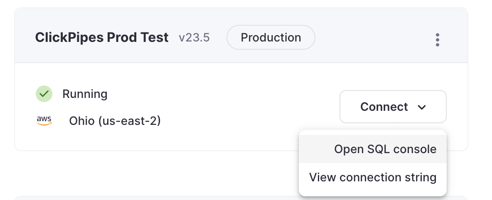
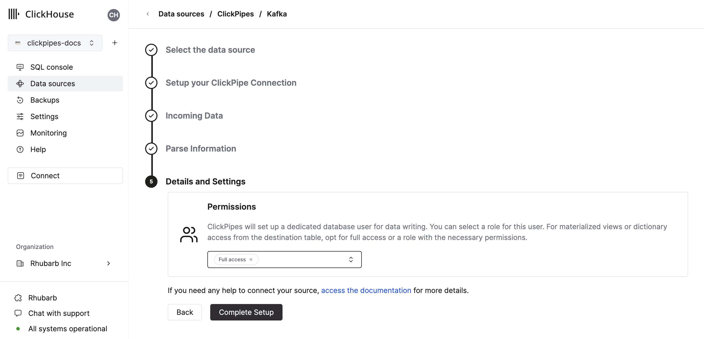

# Integrating Amazon Kinesis with ClickHouse Cloud
## Prerequisite
You have familiarized yourself with the [ClickPipes intro](./index.md) and setup [IAM credentials](https://docs.aws.amazon.com/IAM/latest/UserGuide/id_credentials_access-keys.html) or an [IAM Role](https://docs.aws.amazon.com/IAM/latest/UserGuide/id_roles.html). Follow the [Kinesis Role-Based Access guide](./secure-kinesis.md) for information on how to setup a role that works with ClickHouse Cloud.

## Creating your first ClickPipe

1. Access the SQL Console for your ClickHouse Cloud Service.

  

2. Select the `Data Sources` button on the left-side menu and click on "Set up a ClickPipe"

  

3. Select your data source.

  

4. Fill out the form by providing your ClickPipe with a name, a description (optional), your IAM role or credentials, and other connection details.

  

5. Select Kinesis Stream and starting offset. The UI will display a sample document from the selected source (Kafka topic, etc).

  

6. In the next step, you can select whether you want to ingest data into a new ClickHouse table or reuse an existing one. Follow the instructions in the screen to modify your table name, schema, and settings. You can see a real-time preview of your changes in the sample table at the top.

  

  You can also customize the advanced settings using the controls provided

  

7. Alternatively, you can decide to ingest your data in an existing ClickHouse table. In that case, the UI will allow you to map fields from the source to the ClickHouse fields in the selected destination table.

  

8. Finally, you can configure permissions for the internal clickpipes user.

  **Permissions:** ClickPipes will create a dedicated user for writing data into a destination table. You can select a role for this internal user using a custom role or one of the predefined role:
    - `Full access`: with the full access to the cluster. It might be useful if you use Materialized View or Dictionary with the destination table.
    - `Only destination table`: with the `INSERT` permissions to the destination table only.

  

9. By clicking on "Complete Setup", the system will register you ClickPipe, and you'll be able to see it listed in the summary table.

  

  

  The summary table provides controls to display sample data from the source or the destination table in ClickHouse

  

  As well as controls to remove the ClickPipe and display a summary of the ingest job.

  

10. **Congratulations!** you have successfully set up your first ClickPipe. If this is a streaming ClickPipe it will be continuously running, ingesting data in real-time from your remote data source. Otherwise it will ingest the batch and complete.

## Supported data formats

The supported formats are:
- [JSON](../../../interfaces/formats.md/#json)

## Supported data types (JSON)

The following ClickHouse types are currently supported for JSON payloads:

- Base numeric types
  - Int8
  - Int16
  - Int32
  - Int64
  - UInt8
  - UInt16
  - UInt32
  - UInt64
  - Float32
  - Float64
- Boolean
- String
- FixedString
- Date, Date32
- DateTime, DateTime64
- Enum8/Enum16
- LowCardinality(String)
- Map with keys and values using any of the above types (including Nullables)
- Tuple and Array with elements using any of the above types (including Nullables, one level depth only)
- JSON/Object('json'). experimental

:::note
Nullable versions of the above are also supported with these exceptions:

- Nullable Enums are **not** supported
- LowCardinality(Nullable(String)) is **not** supported

:::

## Limitations
 - ClickPipes can currently only handle Amazon Kinesis streams with 100 shards or less
 - [DEFAULT](https://clickhouse.com/docs/en/sql-reference/statements/create/table#default) is not supported.

## Authentication

To access Amazon Kinesis streams, you can use [IAM credentials](https://docs.aws.amazon.com/IAM/latest/UserGuide/id_credentials_access-keys.html) or an [IAM Role](https://docs.aws.amazon.com/IAM/latest/UserGuide/id_roles.html). For more details on how to setup an IAM role, you can [refer to this guide](./secure-kinesis.md) for information on how to setup a role that works with ClickHouse Cloud
