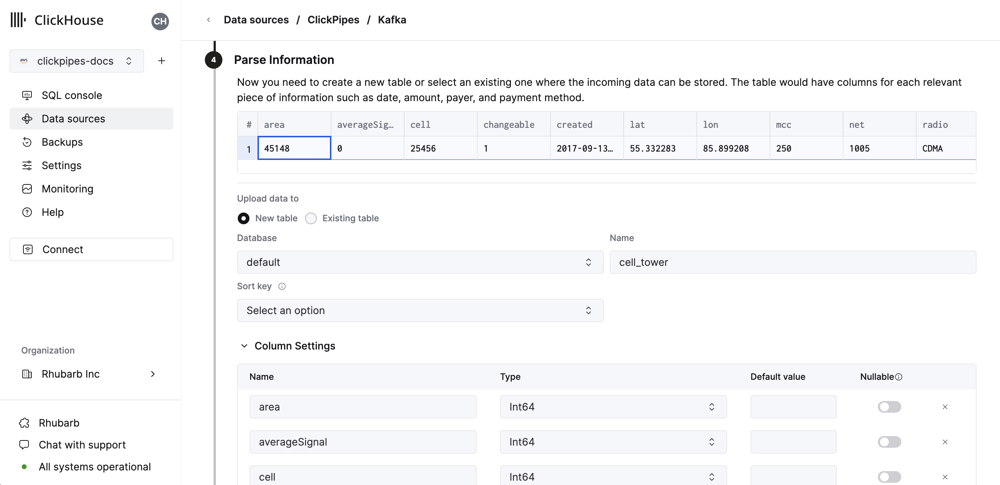
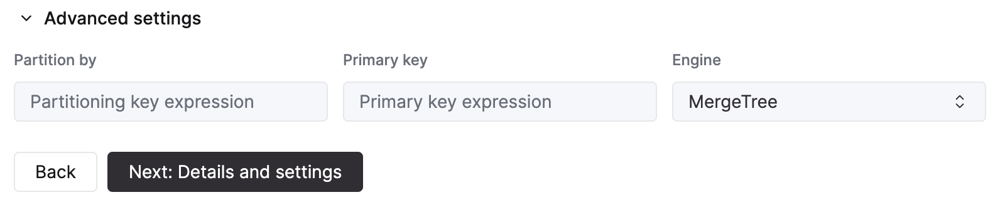

# Integrating Amazon Kinesis with ClickHouse Cloud
## Prerequisite
You have familiarized yourself with the [ClickPipes intro](./index.md) and setup [IAM credentials](https://docs.aws.amazon.com/IAM/latest/UserGuide/id_credentials_access-keys.html) or an [IAM Role](https://docs.aws.amazon.com/IAM/latest/UserGuide/id_roles.html). Follow the [Kinesis Role-Based Access guide](./secure-kinesis.md) for information on how to setup a role that works with ClickHouse Cloud.

## Creating your first ClickPipe

1. Access the SQL Console for your ClickHouse Cloud Service.

  

2. Select the `Data Sources` button on the left-side menu and click on "Set up a ClickPipe"

  

3. Select your data source.

  

4. Fill out the form by providing your ClickPipe with a name, a description (optional), your IAM role or credentials, and other connection details.

  

5. Select Kinesis Stream and starting offset. The UI will display a sample document from the selected source (Kafka topic, etc). You can also enable Enhanced Fan-out for Kinesis streams to improve the performance and stability of your ClickPipe (More information on Enhanced Fan-out can be found [here](https://aws.amazon.com/blogs/aws/kds-enhanced-fanout))

  

6. In the next step, you can select whether you want to ingest data into a new ClickHouse table or reuse an existing one. Follow the instructions in the screen to modify your table name, schema, and settings. You can see a real-time preview of your changes in the sample table at the top.

  

  You can also customize the advanced settings using the controls provided

  

7. Alternatively, you can decide to ingest your data in an existing ClickHouse table. In that case, the UI will allow you to map fields from the source to the ClickHouse fields in the selected destination table.

  

8. Finally, you can configure permissions for the internal clickpipes user.

  **Permissions:** ClickPipes will create a dedicated user for writing data into a destination table. You can select a role for this internal user using a custom role or one of the predefined role:
    - `Full access`: with the full access to the cluster. It might be useful if you use Materialized View or Dictionary with the destination table.
    - `Only destination table`: with the `INSERT` permissions to the destination table only.

  

9. By clicking on "Complete Setup", the system will register you ClickPipe, and you'll be able to see it listed in the summary table.

  

  

  The summary table provides controls to display sample data from the source or the destination table in ClickHouse

  

  As well as controls to remove the ClickPipe and display a summary of the ingest job.

  

10. **Congratulations!** you have successfully set up your first ClickPipe. If this is a streaming ClickPipe it will be continuously running, ingesting data in real-time from your remote data source. Otherwise it will ingest the batch and complete.

## Supported Data Formats

The supported formats are:
- [JSON](../../../interfaces/formats.md/#json)

## Supported Data Types 

The following ClickHouse data types are currently supported in ClickPipes:

- Base numeric types - \[U\]Int8/16/32/64 and Float32/64
- Large integer types - \[U\]Int128/256
- Decimal Types
- Boolean
- String
- FixedString
- Date, Date32
- DateTime, DateTime64 (UTC timezones only)
- Enum8/Enum16
- UUID
- IPv4
- IPv6
- all ClickHouse LowCardinality types
- Map with keys and values using any of the above types (including Nullables)
- Tuple and Array with elements using any of the above types (including Nullables, one level depth only)

## Kinesis Virtual Columns

The following virtual columns are supported for Kinesis stream.  When creating a new destination table virtual columns can be added by using the `Add Column` button.

| Name             | Description                                                   | Recommended Data Type |
|------------------|---------------------------------------------------------------|-----------------------|
| _key             | Kinesis Partition Key                                         | String                |
| _timestamp       | Kinesis Approximate Arrival Timestamp (millisecond precision) | DateTime64(3)         |
| _stream          | Kinesis Stream Name                                           | String                |
| _sequence_number | Kinesis Sequence Number                                       | String                |
| _raw_message     | Full Kinesis Message                                          | String                |

The _raw_message field can be used in cases where only full Kinesis JSON record is required (such as using ClickHouse [`JsonExtract*`](https://clickhouse.com/docs/en/sql-reference/functions/json-functions#jsonextract-functions) functions to populate a downstream materialized
view).  For such pipes, it may improve ClickPipes performance to delete all the "non-virtual" columns.

## Limitations

- [DEFAULT](https://clickhouse.com/docs/en/sql-reference/statements/create/table#default) is not supported.

## Performance

### Batching
ClickPipes inserts data into ClickHouse in batches. This is to avoid creating too many parts in the database which can lead to performance issues in the cluster.

Batches are inserted when one of the following criteria has been met:
- The batch size has reached the maximum size (100,000 rows or 20MB)
- The batch has been open for a maximum amount of time (5 seconds)

### Latency

Latency (defined as the time between the Kinesis message being sent to the stream and the message being available in ClickHouse) will be dependent on a number of factors (i.e. kinesis latency, network latency, message size/format). The [batching](#Batching) described in the section above will also impact latency. We always recommend testing your specific use case to understand the latency you can expect.

If you have specific low-latency requirements, please [contact us](https://clickhouse.com/company/contact?loc=clickpipes).

### Scaling
ClickPipes for Kinesis is designed to scale horizontally. By default, we create 1 consumer. This can be changed with the scaling controls in the ClickPipe details view.

## Authentication

To access Amazon Kinesis streams, you can use [IAM credentials](https://docs.aws.amazon.com/IAM/latest/UserGuide/id_credentials_access-keys.html) or an [IAM Role](https://docs.aws.amazon.com/IAM/latest/UserGuide/id_roles.html). For more details on how to setup an IAM role, you can [refer to this guide](./secure-kinesis.md) for information on how to setup a role that works with ClickHouse Cloud
