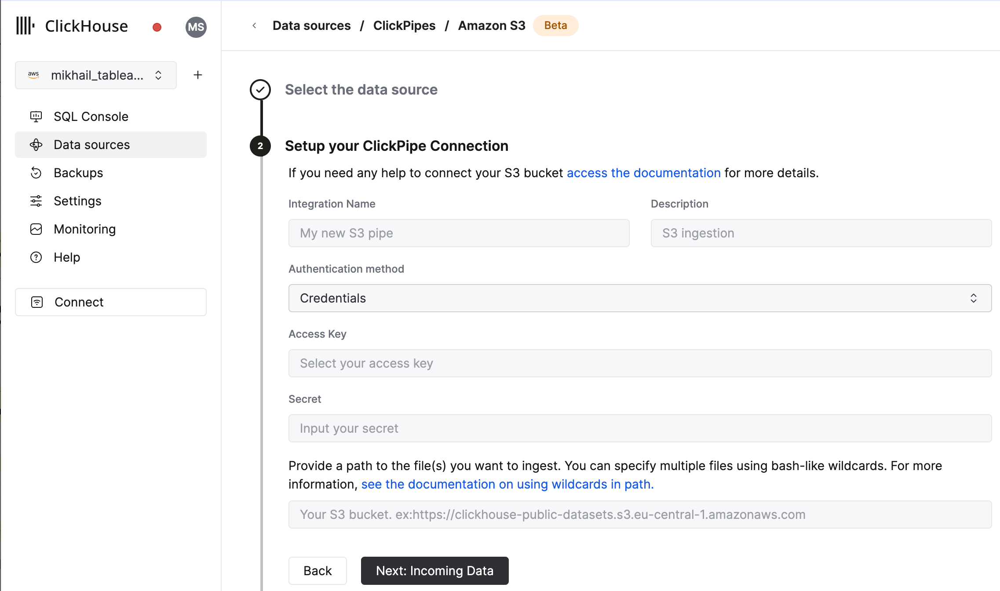
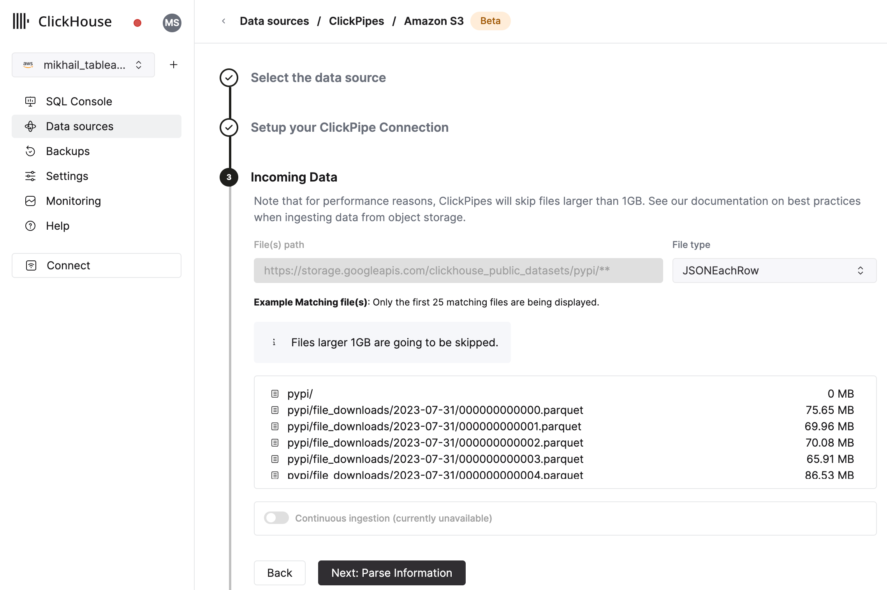

import S3SVG from "../../images/logos/amazon_s3_logo.svg";
import GCSSVG from "../../images/logos/gcs.svg";

# Integrating Object Storage with ClickHouse Cloud
## Prerequisite
You have familiarized yourself with the [ClickPipes intro](./index.md).

## Creating your first ClickPipe

1. Access the SQL Console for your ClickHouse Cloud Service.

  

2. Select the `Data Sources` button on the left-side menu and click on "Set up a ClickPipe"

  

3. Select your data source.

  

4. Fill out the form by providing your ClickPipe with a name, a description (optional), your IAM role or credentials, and bucket URL. You can specify multiple files using bash-like wildcards. For more information, [see the documentation on using wildcards in path](#limitations).

  

5. The UI will display a list of files in the specified bucket. Select your data format (we currently support a subset of ClickHouse formats) and if you want to enable continuous ingestion [More details below](#continuous-ingest).

  

6. In the next step, you can select whether you want to ingest data into a new ClickHouse table or reuse an existing one. Follow the instructions in the screen to modify your table name, schema, and settings. You can see a real-time preview of your changes in the sample table at the top.

  

  You can also customize the advanced settings using the controls provided

  

7. Alternatively, you can decide to ingest your data in an existing ClickHouse table. In that case, the UI will allow you to map fields from the source to the ClickHouse fields in the selected destination table.

  

:::info
You can also map [virtual columns](../../sql-reference/table-functions/s3#virtual-columns), like `_path` or `_size`, to fields.
:::

8. Finally, you can configure permissions for the internal clickpipes user.

  **Permissions:** ClickPipes will create a dedicated user for writing data into a destination table. You can select a role for this internal user using a custom role or one of the predefined role:
    - `Full access`: with the full access to the cluster. Required if you use Materialized View or Dictionary with the destination table.
    - `Only destination table`: with the `INSERT` permissions to the destination table only.

  

9. By clicking on "Complete Setup", the system will register you ClickPipe, and you'll be able to see it listed in the summary table.

  

  

  The summary table provides controls to display sample data from the source or the destination table in ClickHouse

  

  As well as controls to remove the ClickPipe and display a summary of the ingest job.

  

10. **Congratulations!** you have successfully set up your first ClickPipe. If this is a streaming ClickPipe it will be continuously running, ingesting data in real-time from your remote data source. Otherwise it will ingest the batch and complete.

## Supported Data Sources

|Name|Logo|Type|Status|Description|
|----|----|----|------|-----------|
|Amazon S3|<S3SVG style={{width: '3rem', height: 'auto'}} />|Object Storage|Beta|Configure ClickPipes to ingest large volumes of data from object storage.|
|Google Cloud Storage|<GCSSVG style={{width: '3rem', height: 'auto'}} />|Object Storage|Beta|Configure ClickPipes to ingest large volumes of data from object storage.|

More connectors are will get added to ClickPipes, you can find out more by [contacting us](https://clickhouse.com/company/contact?loc=clickpipes).

## Supported data formats

The supported formats are:
- [JSON](../../../interfaces/formats.md/#json)
- [CSV](../../../interfaces/formats.md/#csv)
- [Parquet](../../../interfaces/formats.md/#parquet)

## Scaling

Object Storage ClickPipes are scaled based on the maximum ClickHouse service size determined by the [configured vertical autoscaling settings](/docs/en/manage/scaling#configuring-vertical-auto-scaling). The size of the ClickPipe is determined when the pipe is created. Subsequent changes to the ClickHouse service settings will not affect the ClickPipe size.

To increase the throughput on large ingest jobs, we recommend scaling the ClickHouse service before creating the ClickPipe.

## Limitations

- Role authentication is not available for S3 ClickPipes for ClickHouse Cloud instances deployed into GCP or Azure. It is only supported for AWS ClickHouse Cloud instances.
- ClickPipes will only attempt to ingest objects at 1GB or smaller in size. If a file is greater than 1 GB an error will be appended to the ClickPipes dedicated error table.
- S3 / GCS ClickPipes **does not** share a listing syntax with the [S3 Table Function](https://clickhouse.com/docs/en/sql-reference/table-functions/file#globs_in_path).
  - `?` — Substitutes any single character
  - `*` — Substitutes any number of any characters except / including empty string
  - `**` — Substitutes any number of any character include / including empty string

:::note
This is a valid path:

https://datasets-documentation.s3.eu-west-3.amazonaws.com/http/**.ndjson.gz

This is not a valid path. `{N..M}` are not supported in ClickPipes.

https://datasets-documentation.s3.eu-west-3.amazonaws.com/http/{documents-01,documents-02}.ndjson.gz
:::

## Continuous Ingest
ClickPipes supports continuous ingestion from both S3 and GCS. When enabled, ClickPipes will continuously ingest data from the specified path. However, new files must be lexically greater than the last ingested file, meaning they must be named in a way that defines the ingestion order. For instance, files named `file1`, `file2`, `file3`, etc., will be ingested sequentially. If a new file is added with a name like `file0`, ClickPipes will not ingest it because it is not lexically greater than the last ingested file.

## Authentication

### S3
You can access public buckets with no configuration, and with protected buckets you can use [IAM credentials](https://docs.aws.amazon.com/IAM/latest/UserGuide/id_credentials_access-keys.html) or an [IAM Role](https://docs.aws.amazon.com/IAM/latest/UserGuide/id_roles.html). You can [refer to this guide](/docs/en/cloud/security/secure-s3) to understand the required permission for accessing your data.

### GCS
Like S3, you can access public buckets with no configuration, and with protected buckets you can use [HMAC Keys](https://cloud.google.com/storage/docs/authentication/managing-hmackeys) in place of the AWS IAM credentials. You can read this guide from Google Cloud on [how to setup such keys](https://cloud.google.com/storage/docs/authentication/hmackeys).

Service Accounts for GCS aren't directly supported. HMAC (IAM) Credentials must be used when authenticating with non-public buckets.
The Service Account permissions attached to the HMAC credentials should be `storage.objects.list` and `storage.objects.get`.

## F.A.Q.
- **Does ClickPipes support GCS buckets prefixed with `gs://`?**

No. For interoprability reasons we ask you to replace your `gs://` bucket prefix with `https://storage.googleapis.com/`.

