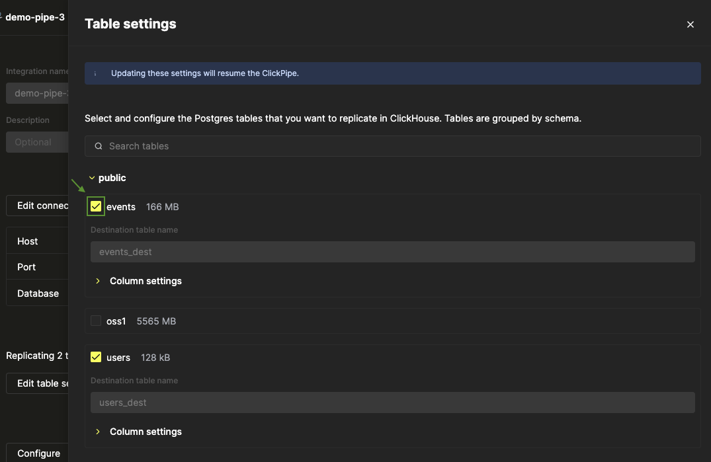

There are scenarios where it would be useful to remove specific tables of a pipe. For example, your analytics workload need to require this table on ClickHouse, and to save costs it makes sense to not have it be replicated.

## Steps to remove specific tables {#remove-tables-steps}
The first step is to remove the table from the pipe. This can be done by the following steps:
1. [Pause](./pause_and_resume#steps-to-pause-a-postgres-clickpipe) the pipe.
2. Click on Edit Table Settings.
3. Locate your table - this can be done by searching it in the search bar.
4. Deselect the table by clicking on the selected checkbox.
 

5. Click update.
6. Upon successful update, in the **Metrics** tab the status will be **Running**. This table will no longer be replicated by this ClickPipe.