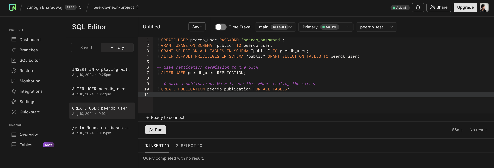
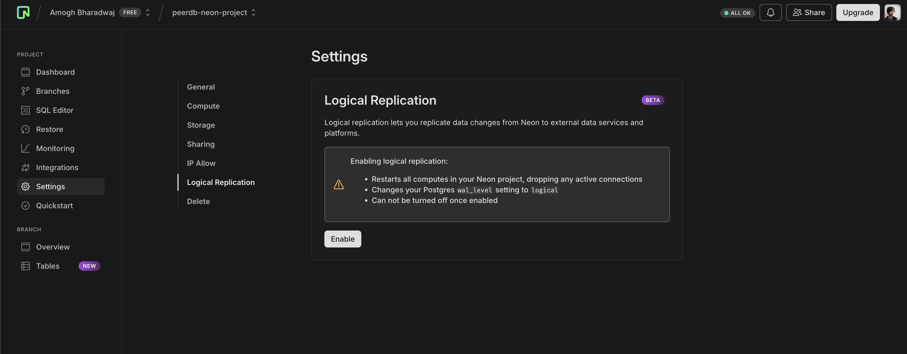
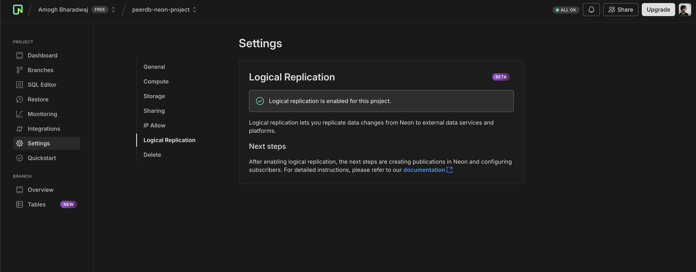
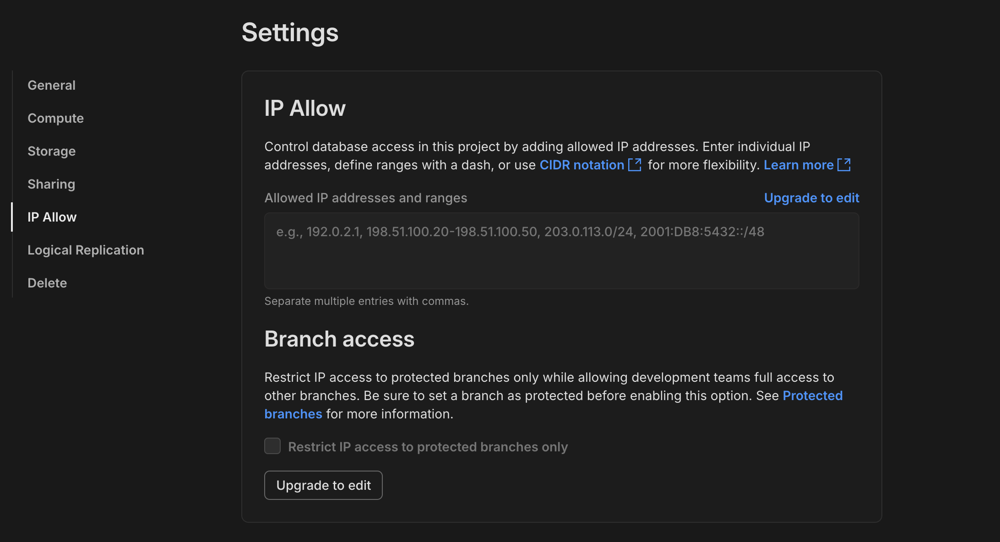
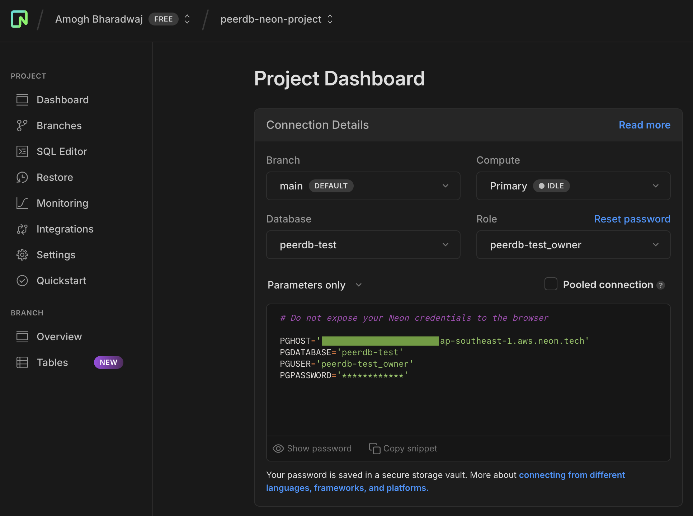

# Neon Postgres Source Setup Guide

This is a guide on how to setup Neon Postgres, which you can use for replication in ClickPipes.
Make sure you're signed in to your [Neon console](https://console.neon.tech/app/projects) for this setup.


## Creating a user with permissions

Let's create a new user for ClickPipes with the necessary permissions suitable for CDC,
and also create a publication that we'll use for replication.

For this, you can head over to the **SQL Console** tab.
Here, we can run the following SQL commands:
```sql
  CREATE USER clickpipes_user PASSWORD 'clickpipes_password';
  GRANT USAGE ON SCHEMA "public" TO clickpipes_user;
  GRANT SELECT ON ALL TABLES IN SCHEMA "public" TO clickpipes_user;
  ALTER DEFAULT PRIVILEGES IN SCHEMA "public" GRANT SELECT ON TABLES TO clickpipes_user;

-- Give replication permission to the USER
  ALTER USER clickpipes_user REPLICATION;

-- Create a publication. We will use this when creating the mirror
  CREATE PUBLICATION clickpipes_publication FOR ALL TABLES;
```




Click on **Run** to have a publication and a user ready.

## Enable Logical Replication
In Neon, you can enable logical replication through the UI. This is necessary for ClickPipes's CDC to replicate data.
Head over to the **Settings** tab and then to the **Logical Replication** section.



Click on **Enable** to be all set here. You should see the below success message once you enable it.




Let's verify the below settings in your Neon Postgres instance:
```sql
SHOW wal_level; -- should be logical
SHOW max_wal_senders; -- should be 10
SHOW max_replication_slots; -- should be 10
```


## IP Whitelisting (For Neon Enterprise plan)
If you have Neon Enterprise plan, you can whitelist the [ClickPipes IPs](../../index.md#list-of-static-ips) to allow replication from ClickPipes to your Neon Postgres instance.
To do this you can click on the **Settings** tab and go to the **IP Allow** section.




## Copy Connection Details
Now that we have the user, publication ready and replication enabled, we can copy the connection details to create a new ClickPipe.
Head over to the **Dashboard** and at the text box where it shows the connection string,
change the view to **Parameters Only**. We will need these parameters for our next step.




## What's next?

You can now [create your ClickPipe](../index.md) and start ingesting data from your Postgres instance into ClickHouse Cloud.
Make sure to note down the connection details you used while setting up your Postgres instance as you will need them during the ClickPipe creation process.
