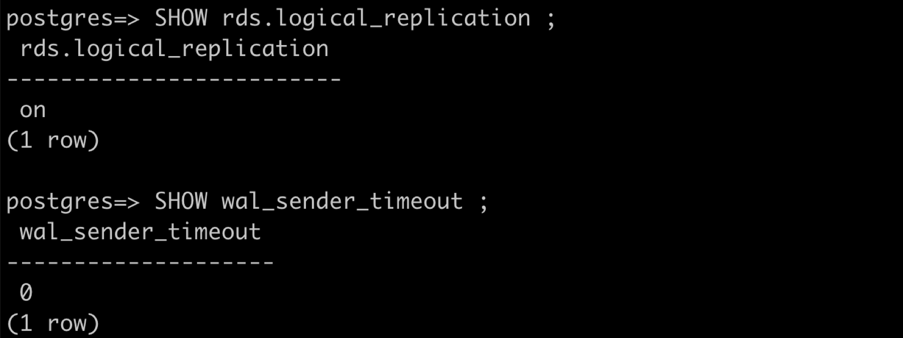
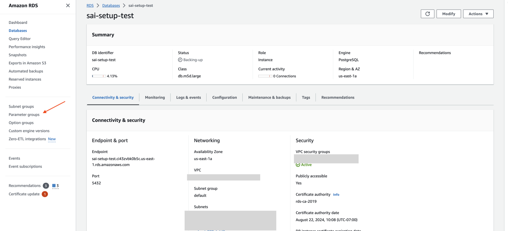
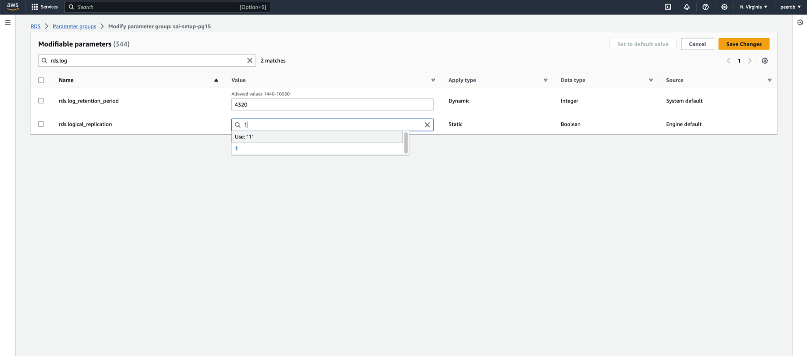
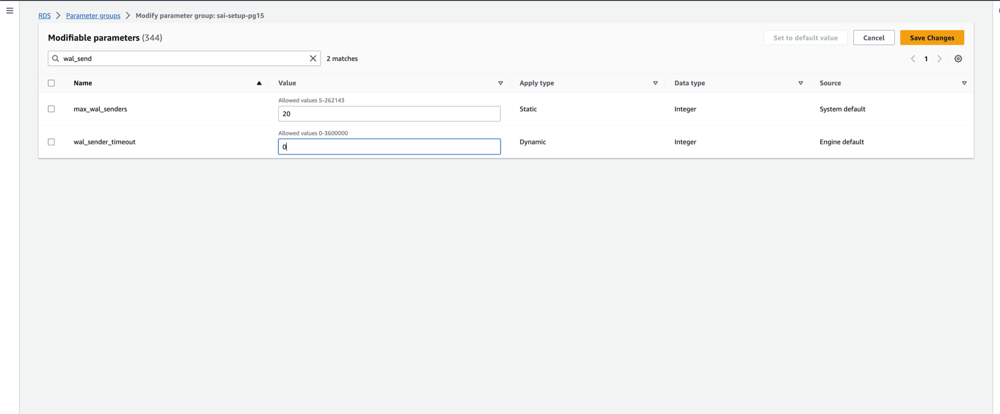
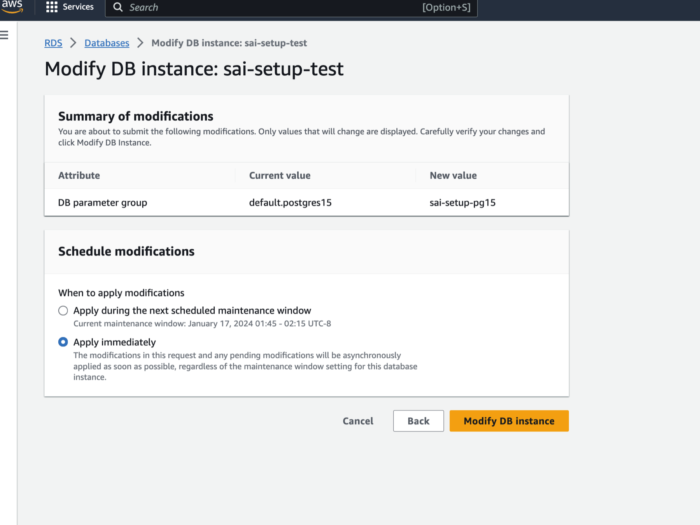
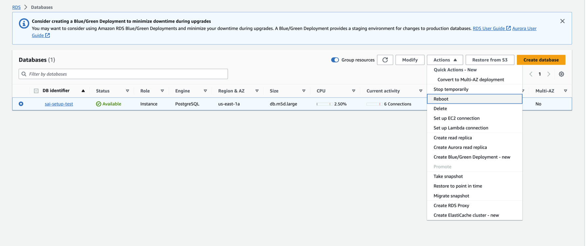
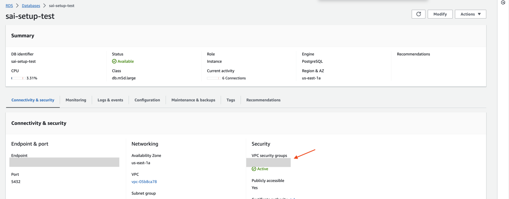
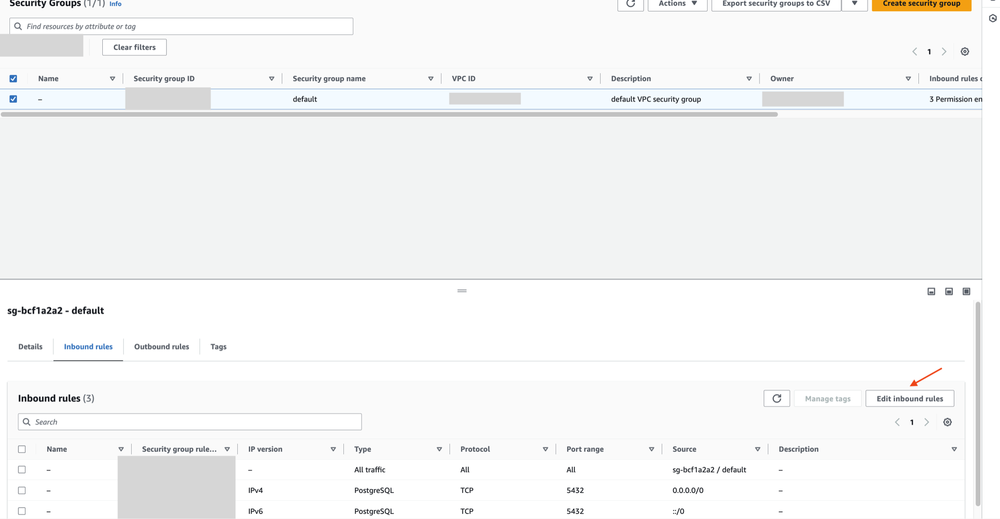

# RDS Postgres Source Setup Guide

## Supported Postgres versions

ClickPipes supports Postgres version 12 and later.

## Enable Logical Replication

You can skip this section if your RDS instance already has the following settings configured:
- `rds.logical_replication = 1`
- `wal_sender_timeout = 0`

These settings are typically pre-configured if you previously used another data replication tool.



If not already configured, follow these steps:

1. Create a new parameter group for your Postgres version with the required settings:
    - Set `rds.logical_replication` to 1
    - Set `wal_sender_timeout` to 0

    

    

    

2. Apply the new parameter group to your RDS Postgres database

    

3. Reboot your RDS instance to apply the changes

    

## Configure Database User

Connect to your RDS Postgres instance as an admin user and execute the following commands:

1. Create a dedicated user for ClickPipes:

    ```sql
    CREATE USER clickpipes_user PASSWORD 'some-password';
    ```

2. Grant schema permissions. The following example shows permissions for the `public` schema. Repeat these commands for each schema you want to replicate:

    ```sql
    GRANT USAGE ON SCHEMA "public" TO clickpipes_user;
    GRANT SELECT ON ALL TABLES IN SCHEMA "public" TO clickpipes_user;
    ALTER DEFAULT PRIVILEGES IN SCHEMA "public" GRANT SELECT ON TABLES TO clickpipes_user;
    ```

3. Grant replication privileges:

    ```sql
    GRANT rds_replication TO clickpipes_user;
    ```

4. Create a publication for replication:

    ```sql
    CREATE PUBLICATION clickpipes_publication FOR ALL TABLES;
    ```


## Configure Network Access

If you want to restrict traffic to your RDS instance, please add the [documented static NAT IPs](../../index.md#list-of-static-ips) to the `Inbound rules` of your RDS security group.






## What's next?

You can now [create your ClickPipe](../index.md) and start ingesting data from your RDS Postgres instance into ClickHouse Cloud.
Make sure to note down the connection details you used while setting up your RDS Postgres instance as you will need them during the ClickPipe creation process.
