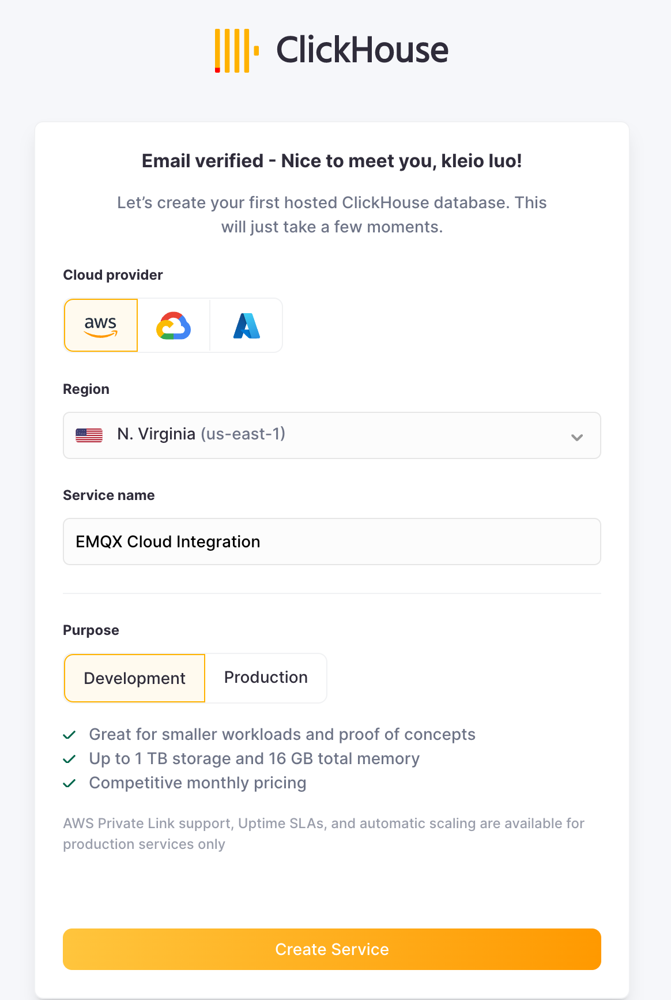
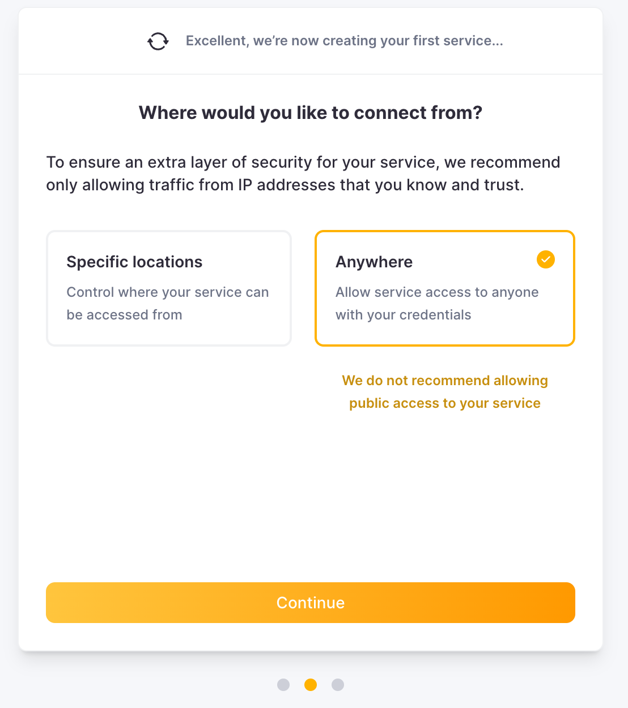
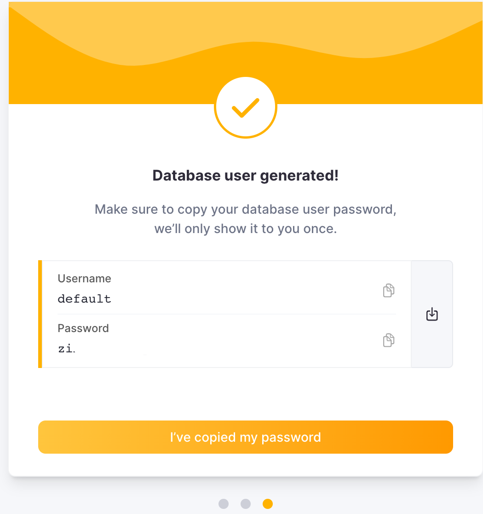
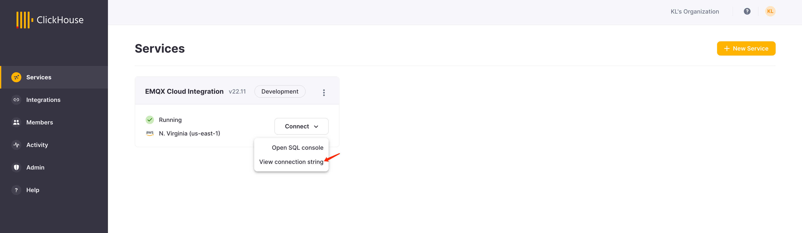
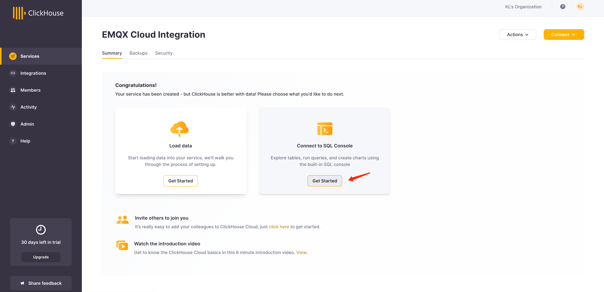
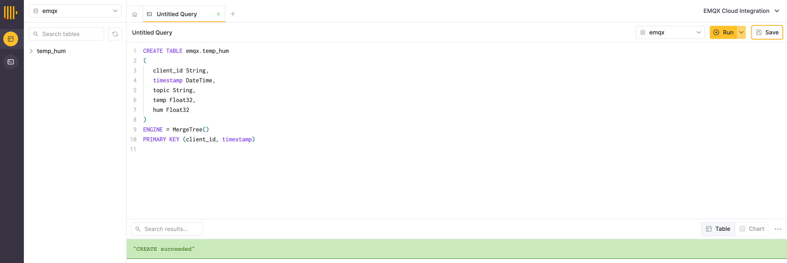

# Get Your ClickHouse Cloud Service

During this setup, we deployed the ClickHouse instance on AWS in N. Virginia (us-east -1), while an EMQX Cloud instance was also deployed in the same region.



During the setup process, you will also need to pay attention to the connection settings. In this tutorial, we chooes "Anywhere", but if you apply for a specific location, you will need to add the [NAT gateway](https://docs.emqx.com/en/cloud/latest/vas/nat-gateway.html) IP address you got from your EMQX Cloud deployment to the whitelist.



Then you need to save your username and password for future use.



After that, you will get a running Click house instance. Click "Connect" to get the instance connection address of Clickhouse Cloud.



Click "Connect to SQL Console" to create database and table for integration with EMQX Cloud.



You can refer to the following SQL statement, or modify the SQL according to the actual situation.

```sql
CREATE TABLE emqx.temp_hum 
(
   client_id String, 
   timestamp DateTime, 
   topic String, 
   temp Float32, 
   hum Float32
) 
ENGINE = MergeTree() 
PRIMARY KEY (client_id, timestamp)
```


