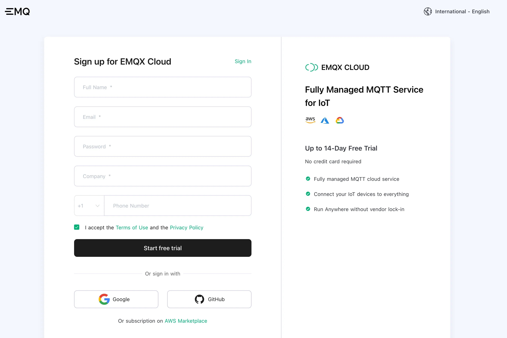
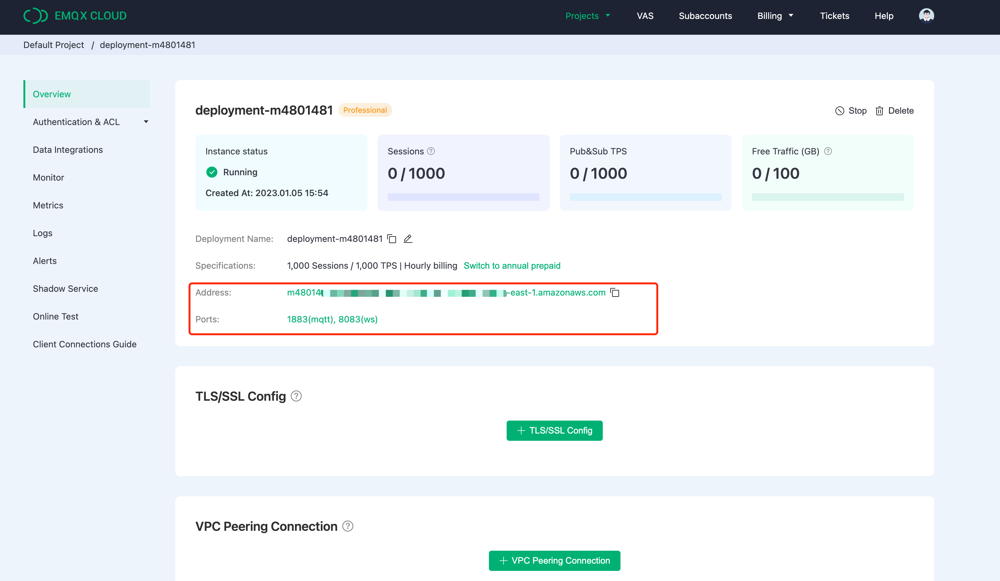
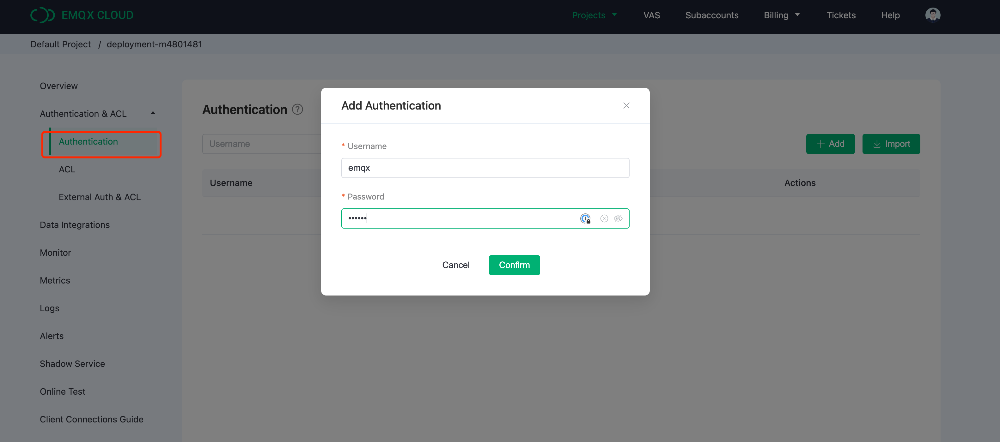
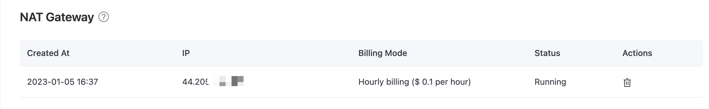

# Create an MQTT service on EMQX Cloud

Creating a dedicated MQTT broker on EMQX Cloud is as easy as a few clicks.

## Get an account

EMQX Cloud provides a 14-day free trial for both standard deployment and professional deployment for every account.

Start at the [EMQX Cloud sign up](https://accounts.emqx.com/signup?continue=https%3A%2F%2Fwww.emqx.com%2Fen%2Fcloud) page and click start free to register an account if you are new to EMQX Cloud.

## Create an MQTT cluster

Once logged in, click on "Cloud Console" under the account menu and you will be able to see the green button to create a new deployment.

In this tutorial, we will use the Professional deployment because only Pro version provides the data integration functionality, which can send MQTT data directly to ClickHouse without a single line of code.

Select Pro version and choose ‘N.Virginial’ region and click ‘Create Now’. In just a few minutes, you will get a fully managed MQTT broker:

Now click the panel to go to the cluster view. On this dashboard, you will see the overview of your MQTT broker.

## Add Client Credential

EMQX Cloud does not allow anonymous connections by default，so you need add a client credential so you can use the MQTT client tool to send data to this broker.

Click ‘Authentication & ACL’ on the left menu and click ‘Authentication’ in the submenu. Click the ‘Add’ button on the right and give a username and password for the MQTT connection later. Here we will use "emqx" and "xxxxxx" for the username and password.

Click ‘Confirm’ and now we have a fully managed MQTT broker ready.

## Enable NAT gateway

Before we can start setting up the ClickHouse integration, we need to enable the NAT gateway first. By default, the MQTT broker is deployed in a private VPC, which can not send data to third-party systems over the public network.

Go back to the Overview page and scroll down to the bottom of the page where you will see the NAT gateway widget. Click the Subscribe button and follow the instructions. Note that NAT Gateway is a value-added service, but it also offers a 14-day free trial.

Once it has been created, you will find the public IP address in the widget. Please note that if you select “Connect from a specific location” during ClickHouse Cloud setup, you will need to add this IP address to the whitelist.
