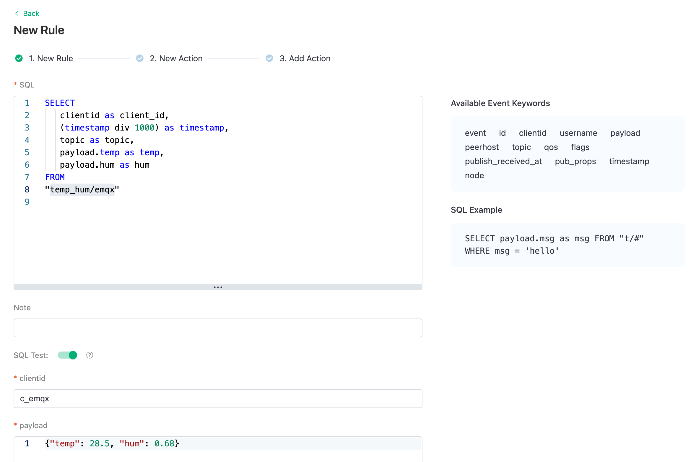
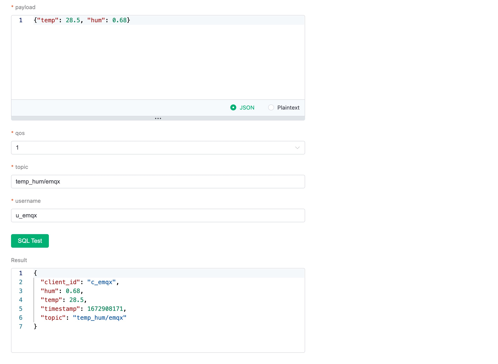
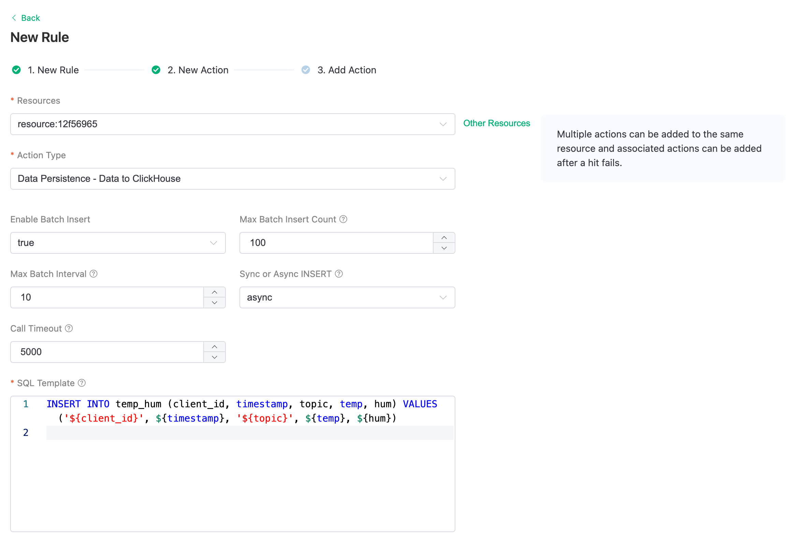

# Integration EMQX Cloud with ClickHouse Cloud

The [EMQX Cloud Data Integrations](https://docs.emqx.com/en/cloud/latest/rule_engine/introduction.html#general-flow) is used to configure the rules for handling and responding to EMQX message flows and device events. The Data Integrations not only provides a clear and flexible "configurable" architecture solution, but also simplifies the development process, improves user usability, and reduces the coupling degree between the business system and EMQX Cloud. It also provides a superior infrastructure for customization of EMQX Cloud's proprietary capabilities.


EMQX Cloud offers more than 30 native integrations with popular data systems. ClickHouse is one of them.


## Create ClickHouse Resource

Click "Data Integrations" on the left menu and click "View All Resouces". You will find the ClickHouse in the Data Persistence section or you can search for ClickHouse.

Click the ClickHouse card to create a new resource.

- Note: add a note for this resource.
- Server address: this is the address of your ClickHouse Cloud service, remember don’t forget the port.
- Database name: ‘emqx’ we created in the above steps.
- User: the username for connecting to your ClickHouse Cloud service.
- Key: the password for the connection.


## Create A New Rule

During the creation of the resource, you will see a popup, and clicking ‘New’ will leads you to the rule creation page.

EMQX provides a powerful [rule engine](https://docs.emqx.com/en/cloud/latest/rule_engine/rules.html) that can transform, and enrich the raw MQTT message before sending it to third-party systems.

Here’s the rule used in this tutorial:

```sql
SELECT
   clientid as client_id,
   (timestamp div 1000) as timestamp,
   topic as topic,
   payload.temp as temp,
   payload.hum as hum
FROM
"temp_hum/emqx"
```

It will read the messages from the ‘temp_hum/emqx’ topic and enrich the JSON object by adding client_id, topic, and timestamp info.

So, the raw JSON you send to the topic:

```bash
{"temp": 28.5, "hum": 0.68}
```



You can use the SQL test to test and see the results.



Now click on the “NEXT” button. This step is to tell EMQX Cloud how to insert refined data into your ClickHouse database.

## Add a response action

If you have only one resource, you don’t need to modify the ‘Resource’ and ‘Action Type’.
You only need to set the SQL template. Here’s the example used for this tutorial:

```bash
INSERT INTO temp_hum (client_id, timestamp, topic, temp, hum) VALUES ('${client_id}', ${timestamp}, '${topic}', ${temp}, ${hum})
```



This is a template for inserting data into Clickhouse, you can see the variables are used here.

## View Rules Details

Click "Confirm" and "View Details". Now, everything should be well set. You can see the data integration works from rule details page.


All the MQTT messages sent to the "temp_hum/emqx" topic will be persisted into your ClickHouse Cloud database.
