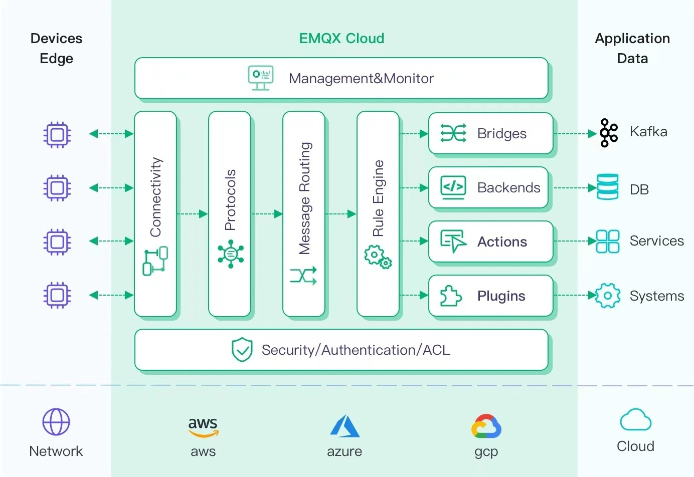

# Connecting EMQX

[EMQX](https://www.emqx.com/en/try?product=enterprise) is an open source MQTT broker with a high-performance real-time message processing engine, powering event streaming for IoT devices at massive scale. As the most scalable MQTT broker, EMQX can help you connect any device, at any scale. Move and process your IoT data anywhere.

[EMQX Cloud](https://www.emqx.com/en/try?product=cloud) is an MQTT messaging middleware product for the IoT domain hosted by [EMQ](https://www.emqx.com/en). As the world's first fully managed MQTT 5.0 cloud messaging service, EMQX Cloud provides a one-stop O&M colocation and a unique isolated environment for MQTT messaging services. In the era of the Internet of Everything, EMQX Cloud can help you quickly build industry applications for the IoT domain and easily collect, transmit, compute, and persist IoT data.

With the infrastructure provided by cloud providers, EMQX Cloud serves dozens of countries and regions around the world, providing low-cost, secure, and reliable cloud services for 5G and Internet of Everything applications.

## Assumptions

* You are familiar with the [MQTT protocol](https://mqtt.org/), which is designed as an extremely lightweight publish/subscribe messaging transport protocol.
* You are using EMQX or EMQX Cloud for real-time message processing engine, powering event streaming for IoT devices at massive scale.
* You have prepared a Clickhouse Cloud instance to persist device data.
* We are using [MQTT X](https://mqttx.app/)  as an MQTT client testing tool to connect the deployment of EMQX Cloud to publish MQTT data. Or other methods connecting to the MQTT broker will do the job as well. 