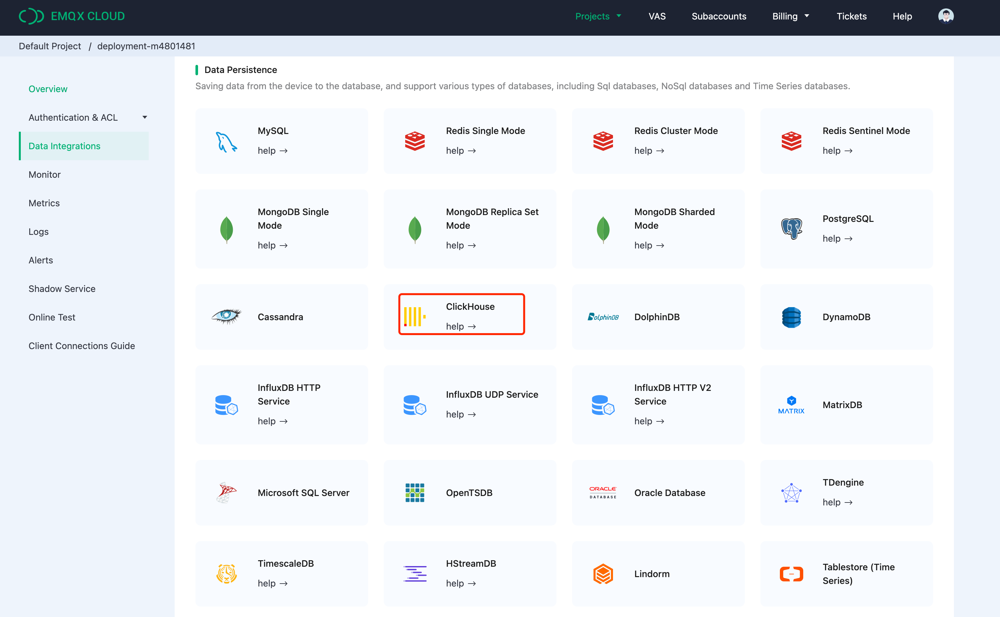

# Integrating EMQX with ClickHouse

## Connecting EMQX

[EMQX](https://www.emqx.com/en/try?product=enterprise) is an open source MQTT broker with a high-performance real-time message processing engine, powering event streaming for IoT devices at massive scale. As the most scalable MQTT broker, EMQX can help you connect any device, at any scale. Move and process your IoT data anywhere.

[EMQX Cloud](https://www.emqx.com/en/try?product=cloud) is an MQTT messaging middleware product for the IoT domain hosted by [EMQ](https://www.emqx.com/en). As the world's first fully managed MQTT 5.0 cloud messaging service, EMQX Cloud provides a one-stop O&M colocation and a unique isolated environment for MQTT messaging services. In the era of the Internet of Everything, EMQX Cloud can help you quickly build industry applications for the IoT domain and easily collect, transmit, compute, and persist IoT data.

With the infrastructure provided by cloud providers, EMQX Cloud serves dozens of countries and regions around the world, providing low-cost, secure, and reliable cloud services for 5G and Internet of Everything applications.


### Assumptions

* You are familiar with the [MQTT protocol](https://mqtt.org/), which is designed as an extremely lightweight publish/subscribe messaging transport protocol.
* You are using EMQX or EMQX Cloud for real-time message processing engine, powering event streaming for IoT devices at massive scale.
* You have prepared a Clickhouse Cloud instance to persist device data.
* We are using [MQTT X](https://mqttx.app/)  as an MQTT client testing tool to connect the deployment of EMQX Cloud to publish MQTT data. Or other methods connecting to the MQTT broker will do the job as well.


## Get Your ClickHouse Cloud Service

During this setup, we deployed the ClickHouse instance on AWS in N. Virginia (us-east -1), while an EMQX Cloud instance was also deployed in the same region.


During the setup process, you will also need to pay attention to the connection settings. In this tutorial, we chooes "Anywhere", but if you apply for a specific location, you will need to add the [NAT gateway](https://docs.emqx.com/en/cloud/latest/vas/nat-gateway.html) IP address you got from your EMQX Cloud deployment to the whitelist.


Then you need to save your username and password for future use.


After that, you will get a running Click house instance. Click "Connect" to get the instance connection address of Clickhouse Cloud.


Click "Connect to SQL Console" to create database and table for integration with EMQX Cloud.


You can refer to the following SQL statement, or modify the SQL according to the actual situation.

```sql
CREATE TABLE emqx.temp_hum
(
   client_id String,
   timestamp DateTime,
   topic String,
   temp Float32,
   hum Float32
)
ENGINE = MergeTree()
PRIMARY KEY (client_id, timestamp)
```


## Create an MQTT service on EMQX Cloud

Creating a dedicated MQTT broker on EMQX Cloud is as easy as a few clicks.

### Get an account

EMQX Cloud provides a 14-day free trial for both standard deployment and professional deployment for every account.

Start at the [EMQX Cloud sign up](https://accounts.emqx.com/signup?continue=https%3A%2F%2Fwww.emqx.com%2Fen%2Fcloud) page and click start free to register an account if you are new to EMQX Cloud.


### Create an MQTT cluster

Once logged in, click on "Cloud Console" under the account menu and you will be able to see the green button to create a new deployment.


In this tutorial, we will use the Professional deployment because only Pro version provides the data integration functionality, which can send MQTT data directly to ClickHouse without a single line of code.

Select Pro version and choose ‘N.Virginial’ region and click ‘Create Now’. In just a few minutes, you will get a fully managed MQTT broker:


Now click the panel to go to the cluster view. On this dashboard, you will see the overview of your MQTT broker.


### Add Client Credential

EMQX Cloud does not allow anonymous connections by default，so you need add a client credential so you can use the MQTT client tool to send data to this broker.

Click ‘Authentication & ACL’ on the left menu and click ‘Authentication’ in the submenu. Click the ‘Add’ button on the right and give a username and password for the MQTT connection later. Here we will use "emqx" and "xxxxxx" for the username and password.


Click ‘Confirm’ and now we have a fully managed MQTT broker ready.

### Enable NAT gateway

Before we can start setting up the ClickHouse integration, we need to enable the NAT gateway first. By default, the MQTT broker is deployed in a private VPC, which can not send data to third-party systems over the public network.

Go back to the Overview page and scroll down to the bottom of the page where you will see the NAT gateway widget. Click the Subscribe button and follow the instructions. Note that NAT Gateway is a value-added service, but it also offers a 14-day free trial.


Once it has been created, you will find the public IP address in the widget. Please note that if you select “Connect from a specific location” during ClickHouse Cloud setup, you will need to add this IP address to the whitelist.


## Integration EMQX Cloud with ClickHouse Cloud

The [EMQX Cloud Data Integrations](https://docs.emqx.com/en/cloud/latest/rule_engine/introduction.html#general-flow) is used to configure the rules for handling and responding to EMQX message flows and device events. The Data Integrations not only provides a clear and flexible "configurable" architecture solution, but also simplifies the development process, improves user usability, and reduces the coupling degree between the business system and EMQX Cloud. It also provides a superior infrastructure for customization of EMQX Cloud's proprietary capabilities.


EMQX Cloud offers more than 30 native integrations with popular data systems. ClickHouse is one of them.



### Create ClickHouse Resource

Click "Data Integrations" on the left menu and click "View All Resouces". You will find the ClickHouse in the Data Persistence section or you can search for ClickHouse.

Click the ClickHouse card to create a new resource.

- Note: add a note for this resource.
- Server address: this is the address of your ClickHouse Cloud service, remember don’t forget the port.
- Database name: ‘emqx’ we created in the above steps.
- User: the username for connecting to your ClickHouse Cloud service.
- Key: the password for the connection.


### Create A New Rule

During the creation of the resource, you will see a popup, and clicking ‘New’ will leads you to the rule creation page.

EMQX provides a powerful [rule engine](https://docs.emqx.com/en/cloud/latest/rule_engine/rules.html) that can transform, and enrich the raw MQTT message before sending it to third-party systems.

Here’s the rule used in this tutorial:

```sql
SELECT
   clientid as client_id,
   (timestamp div 1000) as timestamp,
   topic as topic,
   payload.temp as temp,
   payload.hum as hum
FROM
"temp_hum/emqx"
```

It will read the messages from the ‘temp_hum/emqx’ topic and enrich the JSON object by adding client_id, topic, and timestamp info.

So, the raw JSON you send to the topic:

```bash
{"temp": 28.5, "hum": 0.68}
```


You can use the SQL test to test and see the results.


Now click on the “NEXT” button. This step is to tell EMQX Cloud how to insert refined data into your ClickHouse database.

### Add a response action

If you have only one resource, you don’t need to modify the ‘Resource’ and ‘Action Type’.
You only need to set the SQL template. Here’s the example used for this tutorial:

```bash
INSERT INTO temp_hum (client_id, timestamp, topic, temp, hum) VALUES ('${client_id}', ${timestamp}, '${topic}', ${temp}, ${hum})
```


This is a template for inserting data into Clickhouse, you can see the variables are used here.

### View Rules Details

Click "Confirm" and "View Details". Now, everything should be well set. You can see the data integration works from rule details page.


All the MQTT messages sent to the "temp_hum/emqx" topic will be persisted into your ClickHouse Cloud database.

## Saving Data into ClickHouse

We will simulate temperature and humidity data and report these data to EMQX Cloud via the MQTT X and then use the EMQX Cloud Data Integrations to save the data into ClickHouse Cloud.


### Publish MQTT messages to EMQX Cloud

You can use any MQTT client or SDK to publish the message. In this tutorial, we will use [MQTT X](https://mqttx.app/), a user friendly MQTT client application provided by EMQ.


Click "New Connection" on MQTTX and fill the connection form:

- Name: Connection name. Use whatever name you want.
- Host: the MQTT broker connection address. You can get it from the EMQX Cloud overview page.
- Port: MQTT broker connection port. You can get it from the EMQX Cloud overview page.
- Username/Password: Use the credential created above, which should be "emqx" and "xxxxxx" in this tutorial.


Click the "Connect" button on top right and the connection should be established.

Now you can send messages to the MQTT broker using this tool.
Inputs:
1. Set payload format to "JSON".
2. Set to topic: temp_hum/emqx (the topic we just set in the rule)
3. JSON body:

```bash
{"temp": 23.1, "hum": 0.68}
```

Click the send button on the right. You can change the temperature value and send more data to MQTT broker.

The data sent to EMQX Cloud should be processed by the rule engine and inserted into ClickHouse Cloud automatically.


### View rules monitoring

Check the rule monitoring and add one to the number of success.


### Check the data persisted

Now it’s time to take a look at the data on the ClickHouse Cloud. Ideally, the data you send using MQTTX will go to the EMQX Cloud and persist to the ClickHouse Cloud’s database with the help of native data integration.

You can connect to the SQL console on ClickHouse Cloud panel or use any client tool to fetch data from your ClickHouse. In this tutorial, we used the SQL console.
By executing the SQL:

```bash
SELECT * FROM emqx.temp_hum;
```


### Summary

You didn’t write any piece of code, and now have the MQTT data move from EMQX cloud to ClickHouse Cloud. With EMQX Cloud and ClickHouse Cloud, you don’t need to manage the infra and just focus on writing you IoT applications with data storied securely in ClickHouse Cloud.
