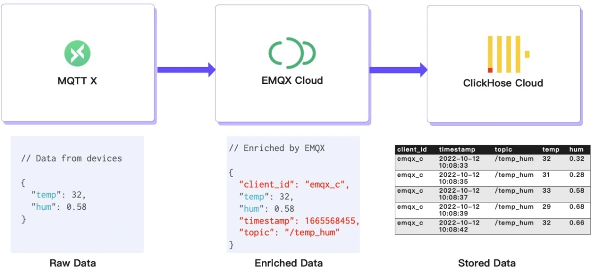
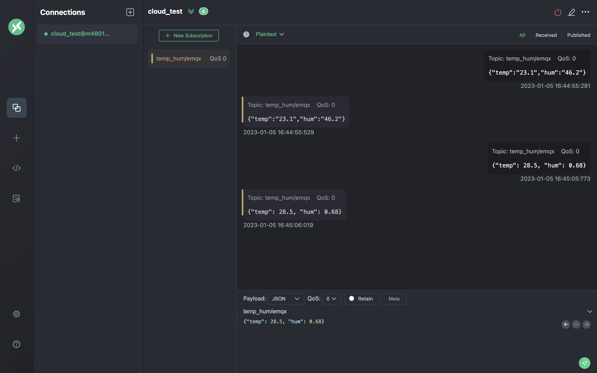

# Saving Data into ClickHouse

We will simulate temperature and humidity data and report these data to EMQX Cloud via the MQTT X and then use the EMQX Cloud Data Integrations to save the data into ClickHouse Cloud.



## Publish MQTT messages to EMQX Cloud

You can use any MQTT client or SDK to publish the message. In this tutorial, we will use [MQTT X](https://mqttx.app/), a user friendly MQTT client application provided by EMQ.


Click "New Connection" on MQTTX and fill the connection form:

- Name: Connection name. Use whatever name you want.
- Host: the MQTT broker connection address. You can get it from the EMQX Cloud overview page.
- Port: MQTT broker connection port. You can get it from the EMQX Cloud overview page.
- Username/Password: Use the credential created above, which should be "emqx" and "xxxxxx" in this tutorial.


Click the "Connect" button on top right and the connection should be established.

Now you can send messages to the MQTT broker using this tool.
Inputs:
1. Set payload format to "JSON".
2. Set to topic: temp_hum/emqx (the topic we just set in the rule)
3. JSON body:

```bash
{"temp": 23.1, "hum": 0.68}
```

Click the send button on the right. You can change the temperature value and send more data to MQTT broker.

The data sent to EMQX Cloud should be processed by the rule engine and inserted into ClickHouse Cloud automatically.



## View rules monitoring

Check the rule monitoring and add one to the number of success.


## Check the data persisted

Now it’s time to take a look at the data on the ClickHouse Cloud. Ideally, the data you send using MQTTX will go to the EMQX Cloud and persist to the ClickHouse Cloud’s database with the help of native data integration.

You can connect to the SQL console on ClickHouse Cloud panel or use any client tool to fetch data from your ClickHouse. In this tutorial, we used the SQL console.
By executing the SQL:

```bash
SELECT * FROM emqx.temp_hum;
```


## Summary

You didn’t write any piece of code, and now have the MQTT data move from EMQX cloud to ClickHouse Cloud. With EMQX Cloud and ClickHouse Cloud, you don’t need to manage the infra and just focus on writing you IoT applications with data storied securely in ClickHouse Cloud.
