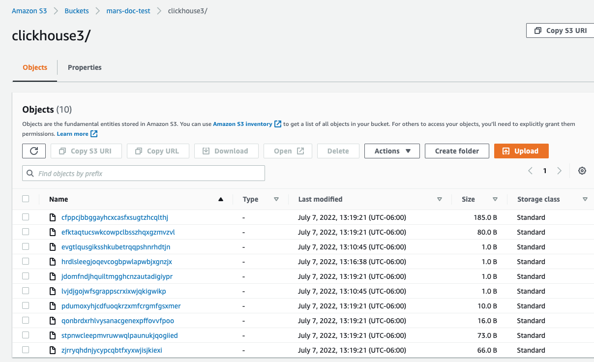

# Use S3 Object Storage as a ClickHouse disk

import SelfManaged from '@site/docs/en/_snippets/_self_managed_only_no_roadmap.md';

<SelfManaged />


This article demonstrates the basics of how to configure an AWS IAM user, create an S3 bucket and configure ClickHouse to use the bucket as an S3 disk.
You should work with your security team to determine the permissions to be used, and consider these as a starting point.


## Create an AWS IAM user
In this procedure, we'll be creating a service account user, not a login user.
1.  Log into the AWS IAM Management Console.

2. In "users", select **Add users**

  

3. Enter the user name and set the credential type to **Access key - Programmatic access** and select **Next: Permissions**

  

4. Do not add the user to any group; select **Next: Tags**

  

5. Unless you need to add any tags, select **Next: Review**

  

6. Select **Create User**
:::note
The warning message stating that the user has no permissions can be ignored; permissions will be granted on the bucket for the user in the next section
:::

  

7. The user is now created; click on **show** and copy the access and secret keys.
:::note
Save the keys somewhere else; this is the only time that the secret access key will be available.
:::

  

8. Click close, then find the user in the users screen.

  

9. Copy the ARN (Amazon Resource Name) and save it for use when configuring the access policy for the bucket.

  

## Create an S3 bucket
1. In the S3 bucket section, select **Create bucket**

  

2. Enter a bucket name, leave other options default
:::note
The bucket name must be unique across AWS, not just the organization, or it will emit an error.
:::
3. Leave `Block all Public Access` enabled; public access is not needed.

  

4. Select **Create Bucket** at the bottom of the page

  

5. Select the link, copy the ARN, and save it for use when configuring the access policy for the bucket.

6. Once the bucket has been created, find the new S3 bucket in the S3 buckets list and select the link

  

7. Select **Create folder**

  

8. Enter a folder name that will be the target for the ClickHouse S3 disk and select **Create folder**

  

9. The folder should now be visible on the bucket list

  

10. Select the checkbox for the new folder and click on **Copy URL** Save the URL copied to be used in the ClickHouse storage configuration in the next section.

  

11. Select the **Permissions** tab and click on the **Edit** button in the **Bucket Policy** section

  

12. Add a bucket policy, example below:
```json
{
	"Version": "2012-10-17",
	"Id": "Policy123456",
	"Statement": [
		{
			"Sid": "abc123",
			"Effect": "Allow",
			"Principal": {
				"AWS": "arn:aws:iam::921234567898:user/mars-s3-user"
			},
			"Action": "s3:*",
			"Resource": [
				"arn:aws:s3:::mars-doc-test",
				"arn:aws:s3:::mars-doc-test/*"
			]
		}
	]
}
```

|Parameter | Description | Example Value |
|----------|-------------|----------------|
|Version | Version of the policy interpreter, leave as-is | 2012-10-17 |
|Sid | User-defined policy id | abc123 |
|Effect | Whether user requests will be allowed or denied | Allow |
|Principal | The accounts or user that will be allowed | arn:aws:iam::921234567898:user/mars-s3-user |
|Action | What operations are allowed on the bucket| s3:*|
|Resource | Which resources in the bucket will operations be allowed in | "arn:aws:s3:::mars-doc-test", "arn:aws:s3:::mars-doc-test/*" |

:::note
You should work with your security team to determine the permissions to be used, consider these as a starting point.
For more information on Policies and settings, refer to AWS documentation:
https://docs.aws.amazon.com/AmazonS3/latest/userguide/access-policy-language-overview.html
:::

13. Save the policy configuration.

## Configure ClickHouse to use the S3 bucket as a disk
The following example is based on a Linux Deb package installed as a service with default ClickHouse directories.

1.  Create a new file in the ClickHouse `config.d` directory to store the storage configuration.
```bash
vim /etc/clickhouse-server/config.d/storage_config.xml
```
2. Add the following for storage configuration; substituting the bucket path, access key and secret keys from earlier steps
```xml
<clickhouse>
  <storage_configuration>
    <disks>
      <s3_disk>
        <type>s3</type>
        <endpoint>https://mars-doc-test.s3.amazonaws.com/clickhouse3/</endpoint>
        <access_key_id>ABC123</access_key_id>
        <secret_access_key>Abc+123</secret_access_key>
        <metadata_path>/var/lib/clickhouse/disks/s3_disk/</metadata_path>
      </s3_disk>
      <s3_cache>
        <type>cache</type>
        <disk>s3_disk</disk>
        <path>/var/lib/clickhouse/disks/s3_cache/</path>
        <max_size>10Gi</max_size>
      </s3_cache>
    </disks>
    <policies>
      <s3_main>
        <volumes>
          <main>
            <disk>s3_disk</disk>
          </main>
        </volumes>
      </s3_main>
    </policies>
  </storage_configuration>
</clickhouse>
```

:::note
The tags `s3_disk` and `s3_cache` within the `<disks>` tag are arbitrary labels. These can be set to something else but the same label must be used in the `<disk>` tab under the `<policies>` tab to reference the disk.
The `<S3_main>` tag is also arbitrary and is the name of the policy which will be used as the identifier storage target when creating resources in ClickHouse.

The configuration shown above is for ClickHouse version 22.8 or higher, if you are using an older version please see the [storing data](/docs/en/operations/storing-data.md/#using-local-cache) docs.

For more information about using S3:
Integrations Guide: [S3 Backed MergeTree](/docs/en/integrations/data-ingestion/s3/s3-merge-tree.md)
:::

3. Update the owner of the file to the `clickhouse` user and group
```bash
chown clickhouse:clickhouse /etc/clickhouse-server/config.d/storage_config.xml
```
4. Restart the ClickHouse instance to have the changes take effect.
```bash
service clickhouse-server restart
```

## Testing
1. Log in with the ClickHouse client, something like the following
```bash
clickhouse-client --user default --password ClickHouse123!
```
2. Create a table specifying the new S3 storage policy
```sql
CREATE TABLE s3_table1
           (
               `id` UInt64,
               `column1` String
           )
           ENGINE = MergeTree
           ORDER BY id
           SETTINGS storage_policy = 's3_main';
```

3. Show that the table was created with the correct policy
```sql
SHOW CREATE TABLE s3_table1;
```
```response
┌─statement────────────────────────────────────────────────────
│ CREATE TABLE default.s3_table1
(
    `id` UInt64,
    `column1` String
)
ENGINE = MergeTree
ORDER BY id
SETTINGS storage_policy = 's3_main', index_granularity = 8192
└──────────────────────────────────────────────────────────────
```

4. Insert test rows into the table
```sql
INSERT INTO s3_table1
           (id, column1)
           VALUES
           (1, 'abc'),
           (2, 'xyz');
```
```response
INSERT INTO s3_table1 (id, column1) FORMAT Values

Query id: 0265dd92-3890-4d56-9d12-71d4038b85d5

Ok.

2 rows in set. Elapsed: 0.337 sec.
```
5. View the rows
```sql
SELECT * FROM s3_table1;
```
```response
┌─id─┬─column1─┐
│  1 │ abc     │
│  2 │ xyz     │
└────┴─────────┘

2 rows in set. Elapsed: 0.284 sec.
```
6.  In the AWS console, navigate to the buckets, and select the new one and the folder.
You should see something like the following:

  

##  Summary
This article provided simple step-by-step instructions on configuring an AWS S3 bucket for access and use as a disk for ClickHouse.
