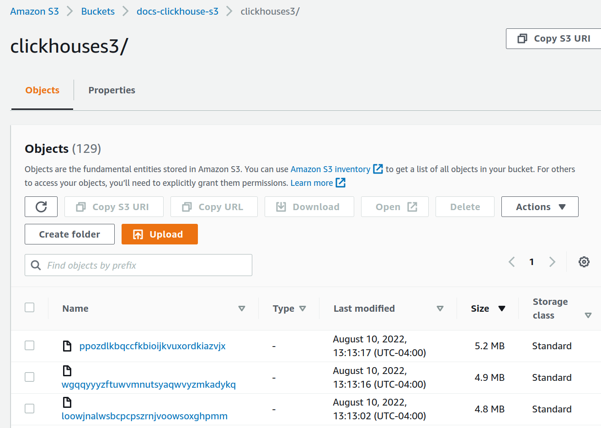
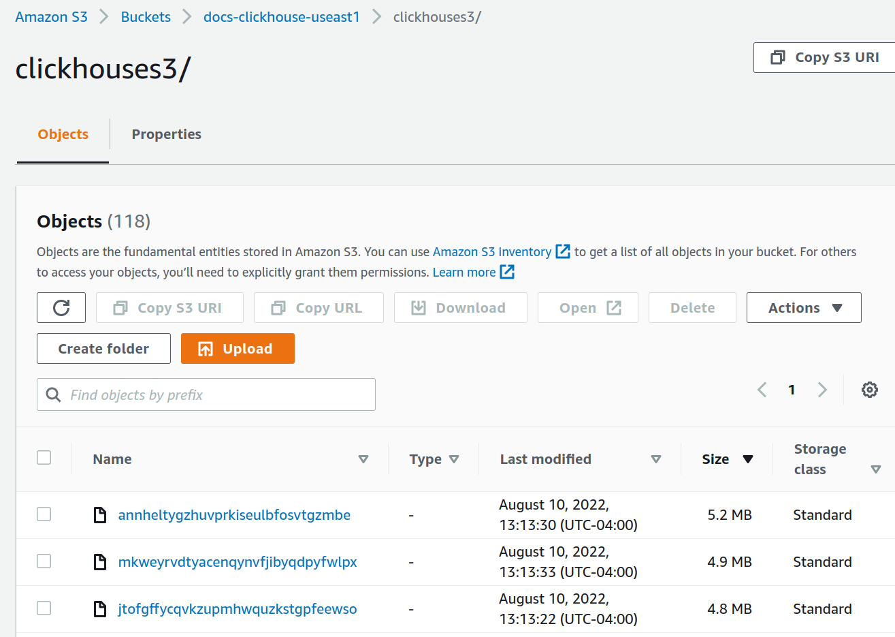

import BucketDetails from '@site/docs/en/_snippets/_S3_authentication_and_bucket.md';

# Integrating S3 with ClickHouse

You can insert data from S3 into ClickHouse and also use S3 as an export destination, thus allowing interaction with “Data Lake” architectures. Furthermore, S3 can provide “cold” storage tiers and assist with separating storage and compute. In the sections below we use the New York City taxi dataset to demonstrate the process of moving data between S3 and ClickHouse, as well as identifying key configuration parameters and providing hints on optimizing performance.

## S3 Table Functions

The `s3` table function allows you to read and write files from and to S3 compatible storage. The outline for this syntax is:

```sql
s3(path, [aws_access_key_id, aws_secret_access_key,] [format, [structure, [compression]]])
```

where:

* path — Bucket URL with a path to the file. This supports following wildcards in read-only mode: `*`, `?`, `{abc,def}` and `{N..M}` where `N`, `M` are numbers, `'abc'`, `'def'` are strings. For more information, see the docs on [using wildcards in path](/docs/en/engines/table-engines/integrations/s3/#wildcards-in-path).
* format — The [format](/docs/en/interfaces/formats.md/#formats) of the file.
* structure — Structure of the table. Format `'column1_name column1_type, column2_name column2_type, ...'`.
* compression — Parameter is optional. Supported values: `none`, `gzip/gz`, `brotli/br`, `xz/LZMA`, `zstd/zst`. By default, it will autodetect compression by file extension.

Using wildcards in the path expression allow multiple files to be referenced and opens the door for parallelism.

### Preparation

To interact with our S3-based dataset, we prepare a standard `MergeTree` table as our destination. The statement below creates a table named `trips` in the default database:


```sql
CREATE TABLE trips
(
    `trip_id` UInt32,
    `vendor_id` Enum8('1' = 1, '2' = 2, '3' = 3, '4' = 4, 'CMT' = 5, 'VTS' = 6, 'DDS' = 7, 'B02512' = 10, 'B02598' = 11, 'B02617' = 12, 'B02682' = 13, 'B02764' = 14, '' = 15),
    `pickup_date` Date,
    `pickup_datetime` DateTime,
    `dropoff_date` Date,
    `dropoff_datetime` DateTime,
    `store_and_fwd_flag` UInt8,
    `rate_code_id` UInt8,
    `pickup_longitude` Float64,
    `pickup_latitude` Float64,
    `dropoff_longitude` Float64,
    `dropoff_latitude` Float64,
    `passenger_count` UInt8,
    `trip_distance` Float64,
    `fare_amount` Float32,
    `extra` Float32,
    `mta_tax` Float32,
    `tip_amount` Float32,
    `tolls_amount` Float32,
    `ehail_fee` Float32,
    `improvement_surcharge` Float32,
    `total_amount` Float32,
    `payment_type` Enum8('UNK' = 0, 'CSH' = 1, 'CRE' = 2, 'NOC' = 3, 'DIS' = 4),
    `trip_type` UInt8,
    `pickup` FixedString(25),
    `dropoff` FixedString(25),
    `cab_type` Enum8('yellow' = 1, 'green' = 2, 'uber' = 3),
    `pickup_nyct2010_gid` Int8,
    `pickup_ctlabel` Float32,
    `pickup_borocode` Int8,
    `pickup_ct2010` String,
    `pickup_boroct2010` String,
    `pickup_cdeligibil` String,
    `pickup_ntacode` FixedString(4),
    `pickup_ntaname` String,
    `pickup_puma` UInt16,
    `dropoff_nyct2010_gid` UInt8,
    `dropoff_ctlabel` Float32,
    `dropoff_borocode` UInt8,
    `dropoff_ct2010` String,
    `dropoff_boroct2010` String,
    `dropoff_cdeligibil` String,
    `dropoff_ntacode` FixedString(4),
    `dropoff_ntaname` String,
    `dropoff_puma` UInt16
)
ENGINE = MergeTree
PARTITION BY toYYYYMM(pickup_date)
ORDER BY pickup_datetime
SETTINGS index_granularity = 8192
```

Note the use of [partitioning](/docs/en/engines/table-engines/mergetree-family/custom-partitioning-key.md/#custom-partitioning-key) on the `pickup_date` field. Usually a partition key is for data management, but later on we will use this key to parallelize writes to S3.


Each entry in our taxi dataset contains a taxi trip. This anonymized data consists of 20M records compressed in the S3 bucket https://datasets-documentation.s3.eu-west-3.amazonaws.com/ under the folder **nyc-taxi**. The data is in the TSV format with approximately 1M rows per file.

### Reading Data from s3

We can query s3 data as a source without requiring persistence in ClickHouse.  In the following query, we sample 10 rows. Note the absence of credentials here as the bucket is publicly accessible:

```sql
SELECT *
FROM s3('https://datasets-documentation.s3.eu-west-3.amazonaws.com/nyc-taxi/trips_*.gz', 'TabSeparatedWithNames')
LIMIT 10;
```

Note that we are not required to list the columns since the `TabSeparatedWithNames` format encodes the column names in the first row. Other formats, such as `CSV` or `TSV`, will return auto-generated columns for this query, e.g., `c1`, `c2`, `c3` etc.

Queries additionally support the virtual columns `_path` and `_file` that provide information regarding the bucket path and filename respectively. For example:

```sql
SELECT  _path, _file, trip_id
FROM s3('https://datasets-documentation.s3.eu-west-3.amazonaws.com/nyc-taxi/trips_0.gz', 'TabSeparatedWithNames')
LIMIT 5;
```

```response
| \_path | \_file | trip\_id |
| :--- | :--- | :--- |
| datasets-documentation/nyc-taxi/trips\_0.gz | trips\_0.gz | 1199999902 |
| datasets-documentation/nyc-taxi/trips\_0.gz | trips\_0.gz | 1199999919 |
| datasets-documentation/nyc-taxi/trips\_0.gz | trips\_0.gz | 1199999944 |
| datasets-documentation/nyc-taxi/trips\_0.gz | trips\_0.gz | 1199999969 |
| datasets-documentation/nyc-taxi/trips\_0.gz | trips\_0.gz | 1199999990 |
```

Confirm the number of rows in this sample dataset. Note the use of wildcards for file expansion, so we consider all twenty files. This query will take around 10 seconds, depending on the number of cores on the ClickHouse instance:


```sql
SELECT count() AS count
FROM s3('https://datasets-documentation.s3.eu-west-3.amazonaws.com/nyc-taxi/trips_*.gz', 'TabSeparatedWithNames');
```

```response
| count |
| :--- |
| 20000000 |
```

While useful for sampling data and executing ae-hoc, exploratory queries, reading data directly from S3 is not something you want to do regularly. When it is time to get serious, import the data into a `MergeTree` table in ClickHouse.

### Using clickhouse-local

The `clickhouse-local` program enables you to perform fast processing on local files without deploying and configuring the ClickHouse server. Any queries using the `s3` table function can be performed with this utility. For example:

```sql
clickhouse-local --query "SELECT * FROM s3('https://datasets-documentation.s3.eu-west-3.amazonaws.com/nyc-taxi/trips_*.gz', 'TabSeparatedWithNames') LIMIT 10"
```

### Inserting Data from S3

To exploit the full capabilities of ClickHouse, we next read and insert the data into our instance.
We combine our `s3` function with a simple `INSERT` statement to achieve this. Note that we aren’t required to list our columns because our target table provides the required structure. This requires the columns to appear in the order specified in the table DDL statement: columns are mapped according to their position in the `SELECT` clause. The insertion of all 10m rows can take a few minutes depending on the ClickHouse instance. Below we insert 1M rows to ensure a prompt response. Adjust the `LIMIT` clause or column selection to import subsets as required:


```sql
INSERT INTO trips
   SELECT *
   FROM s3('https://datasets-documentation.s3.eu-west-3.amazonaws.com/nyc-taxi/trips_*.gz', 'TabSeparatedWithNames')
   LIMIT 1000000;
```

### Remote Insert using ClickHouse Local

If network security policies prevent your ClickHouse cluster from making outbound connections, you can potentially insert S3 data using `clickhouse-local`. In the example below, we read from an S3 bucket and insert into ClickHouse using the `remote` function:

```sql
clickhouse-local --query "INSERT INTO TABLE FUNCTION remote('localhost:9000', 'default.trips', 'username', 'password') (*) SELECT * FROM s3('https://datasets-documentation.s3.eu-west-3.amazonaws.com/nyc-taxi/trips_*.gz', 'TabSeparatedWithNames') LIMIT 10"
```

:::note
To execute this over a secure SSL connection, utilize the `remoteSecure` function.
:::

### Exporting Data

You can write to files in S3 using the `s3` table function. This will require appropriate permissions. We pass the credentials needed in the request, but vie the [Managing Credentials](#managing-credentials) page for more options.

In the simple example below, we use the table function as a destination instead of a source. Here we stream 10,000 rows from the `trips` table to a bucket, specifying `lz4` compression and output type of `CSV`:

```sql
INSERT INTO FUNCTION
   s3(
       'https://datasets-documentation.s3.eu-west-3.amazonaws.com/csv/trips.csv.lz4',
       's3_key',
       's3_secret',
       'CSV'
    )
SELECT *
FROM trips
LIMIT 10000;
```

Note here how the format of the file is inferred from the extension. We also don’t need to specify the columns in the `s3` function - this can be inferred from the `SELECT`.

### Splitting Large Files

It is unlikely you will want to export your data as a single file. Most tools, including ClickHouse, will achieve higher throughput performance when reading and writing to multiple files due to the possibility of parallelism. We could execute our `INSERT` command multiple times, targeting a subset of the data. ClickHouse offers a means of automatic splitting files using a `PARTITION` key.

In the example below, we create ten files using a modulus of the `rand()` function. Notice how the resulting partition ID is referenced in the filename. This results in ten files with a numerical suffix, e.g. `trips_0.csv.lz4`, `trips_1.csv.lz4` etc...:


```sql
INSERT INTO FUNCTION
   s3(
       'https://datasets-documentation.s3.eu-west-3.amazonaws.com/csv/trips_{_partition_id}.csv.lz4',
       's3_key',
       's3_secret',
       'CSV'
    )
    PARTITION BY rand() % 10
SELECT *
FROM trips
LIMIT 100000;
```

Alternatively, we can reference a field in the data. For this dataset, the `payment_type` provides a natural partitioning key with a cardinality of 5.

```sql
INSERT INTO FUNCTION
   s3(
       'https://datasets-documentation.s3.eu-west-3.amazonaws.com/csv/trips_{_partition_id}.csv.lz4',
       's3_key',
       's3_secret',
       'CSV'
    )
    PARTITION BY payment_type
SELECT *
FROM trips
LIMIT 100000;
```

### Utilizing Clusters

The above functions are all limited to execution on a single node. Read speeds will scale linearly with CPU cores until other resources (typically network) are saturated, allowing users to vertically scale. However, this approach has its limitations. While users can alleviate some resource pressure by inserting into a distributed table when performing an `INSERT INTO SELECT` query, this still leaves a single node reading, parsing, and processing the data. To address this challenge and allow us to scale reads horizontally, we have the [s3Cluster](/docs/en/sql-reference/table-functions/s3Cluster.md) function.

The node which receives the query, known as the initiator, creates a connection to every node in the cluster. The glob pattern determining which files need to be read is resolved to a set of files. The initiator distributes files to the nodes in the cluster, which act as workers. These workers, in turn, request files to process as they complete reads. This process ensures that we can scale reads horizontally.

The `s3Cluster` function takes the same format as the single node variants, except that a target cluster is required to denote the worker nodes:

```
s3Cluster(cluster_name, source, [access_key_id, secret_access_key,] format, structure)
```

* `cluster_name` — Name of a cluster that is used to build a set of addresses and connection parameters to remote and local servers.
* `source` — URL to a file or a bunch of files. Supports following wildcards in read-only mode: *, ?, {'abc','def'} and {N..M} where N, M — numbers, abc, def — strings. For more information see [Wildcards In Path](/docs/en/engines/table-engines/integrations/s3.md/#wildcards-in-path).
* `access_key_id` and `secret_access_key` — Keys that specify credentials to use with the given endpoint. Optional.
* `format` — The [format](/docs/en/interfaces/formats.md/#formats) of the file.
* `structure` — Structure of the table. Format 'column1_name column1_type, column2_name column2_type, ...'.


Like any `s3` functions, the credentials are optional if the bucket is insecure or you define security through the environment, e.g., IAM roles. Unlike the s3 function, however, the structure must be specified in the request as of 22.3.1, i.e., the schema is not inferred.

This function will be used as part of an `INSERT INTO SELECT` in most cases. In this case, you will often be inserting a distributed table. We illustrate a simple example below where trips_all is a distributed table. While this table uses the events cluster, the consistency of the nodes used for reads and writes is not a requirement:

```sql
INSERT INTO default.trips_all
   SELECT *
   FROM s3Cluster(
       'events',
       'https://datasets-documentation.s3.eu-west-3.amazonaws.com/nyc-taxi/trips_*.gz',
       'TabSeparatedWithNames'
    )
```

Inserts will occur against the initiator node. This means that while reads will occur on each node, the resulting rows will be routed to the initiator for distribution. In high throughput scenarios, this may prove a bottleneck. To address this, set the parameter [parallel_distributed_insert_select](/docs/en/operations/settings/settings/#parallel_distributed_insert_select) for the `s3cluster` function.


## S3 Table Engines

While the `s3` functions allow ad-hoc queries to be performed on data stored in S3, they are syntactically verbose. The `S3` table engine allows you to not have to specify the bucket URL and credentials over and over again. To address this, ClickHouse provides the S3 table engine.

```sql
CREATE TABLE s3_engine_table (name String, value UInt32)
    ENGINE = S3(path, [aws_access_key_id, aws_secret_access_key,] format, [compression])
    [SETTINGS ...]
```

* `path` — Bucket URL with a path to the file. Supports following wildcards in read-only mode: *, ?, {abc,def} and {N..M} where N, M — numbers, 'abc', 'def' — strings. For more information, see [here](/docs/en/engines/table-engines/integrations/s3#wildcards-in-path).
* `format` — The[ format](/docs/en/interfaces/formats.md/#formats) of the file.
* `aws_access_key_id`, `aws_secret_access_key` - Long-term credentials for the AWS account user. You can use these to authenticate your requests. The parameter is optional. If credentials are not specified, configuration file values are used. For more information, see [Managing credentials](#managing-credentials).
* `compression` — Compression type. Supported values: none, gzip/gz, brotli/br, xz/LZMA, zstd/zst. The parameter is optional. By default, it will autodetect compression by file extension.

### Reading Data

In the following example, we create a table named `trips_raw` using the first ten TSV files located in the `https://datasets-documentation.s3.eu-west-3.amazonaws.com/nyc-taxi/` bucket. Each of these contains 1M rows each:


```sql
CREATE TABLE trips_raw
(
   `trip_id`               UInt32,
   `vendor_id`             Enum8('1' = 1, '2' = 2, '3' = 3, '4' = 4, 'CMT' = 5, 'VTS' = 6, 'DDS' = 7, 'B02512' = 10, 'B02598' = 11, 'B02617' = 12, 'B02682' = 13, 'B02764' = 14, '' = 15),
   `pickup_date`           Date,
   `pickup_datetime`       DateTime,
   `dropoff_date`          Date,
   `dropoff_datetime`      DateTime,
   `store_and_fwd_flag`    UInt8,
   `rate_code_id`          UInt8,
   `pickup_longitude`      Float64,
   `pickup_latitude`       Float64,
   `dropoff_longitude`     Float64,
   `dropoff_latitude`      Float64,
   `passenger_count`       UInt8,
   `trip_distance`         Float64,
   `fare_amount`           Float32,
   `extra`                 Float32,
   `mta_tax`               Float32,
   `tip_amount`            Float32,
   `tolls_amount`          Float32,
   `ehail_fee`             Float32,
   `improvement_surcharge` Float32,
   `total_amount`          Float32,
   `payment_type_`         Enum8('UNK' = 0, 'CSH' = 1, 'CRE' = 2, 'NOC' = 3, 'DIS' = 4),
   `trip_type`             UInt8,
   `pickup`                FixedString(25),
   `dropoff`               FixedString(25),
   `cab_type`              Enum8('yellow' = 1, 'green' = 2, 'uber' = 3),
   `pickup_nyct2010_gid`   Int8,
   `pickup_ctlabel`        Float32,
   `pickup_borocode`       Int8,
   `pickup_ct2010`         String,
   `pickup_boroct2010`     FixedString(7),
   `pickup_cdeligibil`     String,
   `pickup_ntacode`        FixedString(4),
   `pickup_ntaname`        String,
   `pickup_puma`           UInt16,
   `dropoff_nyct2010_gid`  UInt8,
   `dropoff_ctlabel`       Float32,
   `dropoff_borocode`      UInt8,
   `dropoff_ct2010`        String,
   `dropoff_boroct2010`    FixedString(7),
   `dropoff_cdeligibil`    String,
   `dropoff_ntacode`       FixedString(4),
   `dropoff_ntaname`       String,
   `dropoff_puma`          UInt16
) ENGINE = S3('https://datasets-documentation.s3.eu-west-3.amazonaws.com/nyc-taxi/trips_{0..9}.gz', 'TabSeparatedWithNames', 'gzip');
```

Notice the use of the {0..9} pattern to limit to the first ten files. Once created, we can query this table like any other table:

```sql
SELECT DISTINCT(pickup_ntaname)
FROM trips_raw
LIMIT 10;
```

```response
┌─pickup_ntaname───────────────────────────────────┐
│ Lenox Hill-Roosevelt Island                      │
│ Airport                                          │
│ SoHo-TriBeCa-Civic Center-Little Italy           │
│ West Village                                     │
│ Chinatown                                        │
│ Hudson Yards-Chelsea-Flatiron-Union Square       │
│ Turtle Bay-East Midtown                          │
│ Upper West Side                                  │
│ Murray Hill-Kips Bay                             │
│ DUMBO-Vinegar Hill-Downtown Brooklyn-Boerum Hill │
└──────────────────────────────────────────────────┘
```

### Inserting Data

The `S3` table engine supports parallel reads. Writes are only supported if the table definition does not contain glob patterns. The above table, therefore, would block writes.

To demonstrate writes, create a table that points to a writeable S3 bucket:

```sql
CREATE TABLE trips_dest
(
   `trip_id`               UInt32,
   `pickup_date`           Date,
   `pickup_datetime`       DateTime,
   `dropoff_datetime`      DateTime,
   `tip_amount`            Float32,
   `total_amount`          Float32
) ENGINE = S3('<bucket path>/trips.bin', 'Native');
```

```sql
INSERT INTO trips_dest
   SELECT
      trip_id,
      pickup_date,
      pickup_datetime,
      dropoff_datetime,
      tip_amount,
      total_amount
   FROM trips
   LIMIT 10;
```

```sql
SELECT * FROM trips_dest LIMIT 5;
```

```response
| trip\_id | pickup\_date | pickup\_datetime | dropoff\_datetime | tip\_amount | total\_amount |
| :--- | :--- | :--- | :--- | :--- | :--- |
| 14 | 2013-08-02 | 2013-08-02 09:43:58 | 2013-08-02 09:44:13 | 0 | 2 |
| 15 | 2013-08-02 | 2013-08-02 09:44:43 | 2013-08-02 09:45:15 | 0 | 2 |
| 21 | 2013-08-02 | 2013-08-02 11:30:00 | 2013-08-02 17:08:00 | 0 | 172 |
| 21 | 2013-08-02 | 2013-08-02 12:30:00 | 2013-08-02 18:08:00 | 0 | 172 |
| 23 | 2013-08-02 | 2013-08-02 18:00:50 | 2013-08-02 18:01:55 | 0 | 6.5 |
```

Note that rows can only be inserted into new files. There are no merge cycles or file split operations. Once a file is written, subsequent inserts will fail. Users have two options here:

* Specify the setting `s3_create_new_file_on_insert=1`. This will cause the creation of new files on each insert. A numeric suffix will be appended to the end of each file that will monotonically increase for each insert operation. For the above example, a subsequent insert would cause the creation of a trips_1.bin file.
* Specify the setting `s3_truncate_on_insert=1`. This will cause a truncation of the file, i.e. it will only contain the newly inserted rows once complete.

Both of these settings default to 0 - thus forcing the user to set one of them. `s3_truncate_on_insert` will take precedence if both are set.

Some notes about the `S3` table engine:

- Unlike a traditional `MergeTree` family table, dropping an `S3` table will not delete the underlying data.
- Full settings for this table type can be found [here](/docs/en/engines/table-engines/integrations/s3.md/#settings).
- Be aware of the following caveats when using this engine:
    * ALTER queries are not supported
    * SAMPLE operations are not supported
    * There is no notion of indexes, i.e. primary or skip.

## Managing Credentials

In the previous examples, we have passed credentials in the `s3` function or `S3` table definition. While this may be acceptable for occasional usage, users require less explicit authentication mechanisms in production. To address this, ClickHouse has several options:

* Specify the connection details in the **config.xml** or an equivalent configuration file under **conf.d**. The contents of an example file are shown below, assuming installation using the debian package.

    ```xml
    ubuntu@single-node-clickhouse:/etc/clickhouse-server/config.d$ cat s3.xml
    <clickhouse>
        <s3>
            <endpoint-name>
                <endpoint>https://dalem-files.s3.amazonaws.com/test/</endpoint>
                <access_key_id>key</access_key_id>
                <secret_access_key>secret</secret_access_key>
                <!-- <use_environment_credentials>false</use_environment_credentials> -->
                <!-- <header>Authorization: Bearer SOME-TOKEN</header> -->
            </endpoint-name>
        </s3>
    </clickhouse>
    ```

    These credentials will be used for any requests where the endpoint above is an exact prefix match for the requested URL. Also, note the ability in this example to declare an authorization header as an alternative to access and secret keys. A complete list of supported settings can be found [here](/docs/en/engines/table-engines/integrations/s3.md/#settings).

* The example above highlights the availability of the configuration parameter `use_environment_credentials`. This configuration parameter can also be set globally at the `s3` level:

    ```xml
    <clickhouse>
        <s3>
        <use_environment_credentials>true</use_environment_credentials>
        </s3>
    </clickhouse>
    ```

    This setting turns on an attempt to retrieve S3 credentials from the environment, thus allowing access through IAM roles. Specifically, the following order of retrieval is performed:

   * A lookup for the environment variables `AWS_ACCESS_KEY_ID`, `AWS_SECRET_ACCESS_KEY` and `AWS_SESSION_TOKEN`
   * Check performed in **$HOME/.aws**
   * Temporary credentials obtained via the AWS Security Token Service - i.e. via [AssumeRole](https://docs.aws.amazon.com/STS/latest/APIReference/API_AssumeRole.html) API
   * Checks for credentials in the ECS environment variables `AWS_CONTAINER_CREDENTIALS_RELATIVE_URI` or `AWS_CONTAINER_CREDENTIALS_FULL_URI` and `AWS_ECS_CONTAINER_AUTHORIZATION_TOKEN`.
   * Obtains the credentials via [Amazon EC2 instance metadata](https://docs.aws.amazon.com/cli/latest/userguide/cli-configure-metadata.html) provided [AWS_EC2_METADATA_DISABLED](https://docs.aws.amazon.com/cli/latest/userguide/cli-configure-envvars.html#envvars-list-AWS_EC2_METADATA_DISABLED) is not set to true.
   * These same settings can also be set for a specific endpoint, using the same prefix matching rule.

## Optimizing for Performance {#s3-optimizing-performance}

import SelfManaged from '@site/docs/en/_snippets/_self_managed_only_not_applicable.md';

<SelfManaged />

### Measuring Performance

Before making any changes to improve performance, ensure you measure appropriately. As S3 API calls are sensitive to latency and may impact client timings, use the query log for performance metrics, i.e., `system.query_log`.

If measuring the performance of `SELECT` queries, where large volumes of data are returned to the client, either utilize the [null format](/docs/en/interfaces/formats/#null) for queries or direct results to the [Null engine](/docs/en/engines/table-engines/special/null.md). This should avoid the client being overwhelmed with data and network saturation.

### Region Locality

Ensure your buckets are located in the same region as your ClickHouse instances. This simple optimization can dramatically improve throughput performance, especially if you deploy your ClickHouse instances on AWS infrastructure.

### Using Threads

Read performance on S3 will scale linearly with the number of cores, provided you are not limited by network bandwidth or local IO. Increasing the number of threads also has memory overhead permutations that users should be aware of. The following can be modified to improve throughput performance potentially:

* Usually, the default value of `max_threads` is sufficient, i.e., the number of cores. If the amount of memory used for a query is high, and this needs to be reduced, or the LIMIT on results is low, this value can be set lower. Users with plenty of memory may wish to experiment with increasing this value for possible higher read throughput from S3. Typically this is only beneficial on machines with lower core counts, i.e., &lt; 10. The benefit from further parallelization typically diminishes as other resources act as a bottleneck, e.g., network.
* If performing an `INSERT INTO x SELECT` request, note that the number of threads will be set to 1 as dictated by the setting [max_insert_threads](/docs/en/operations/settings/settings.md/#settings-max_threads). Provided max_threads is greater than 1 (confirm with `SELECT * FROM system.settings WHERE name='max_threads'`), increasing this will improve insert performance at the expense of memory. Increase with caution due to memory consumption overheads. This value should not be as high as the max_threads as resources are consumed on background merges. Furthermore, not all target engines (MergeTree does) support parallel inserts. Finally, parallel inserts invariably cause more parts, slowing down subsequent reads. Increase with caution.
* For low memory scenarios, consider lowering `max_insert_delayed_streams_for_parallel_write` if inserting into S3.
* Versions of ClickHouse before 22.3.1 only parallelized reads across multiple files when using the `s3` function or `S3` table engine. This required the user to ensure files were split into chunks on S3 and read using a glob pattern to achieve optimal read performance. Later versions now parallelize downloads within a file.
* Assuming sufficient memory (test!), increasing [min_insert_block_size_rows](/docs/en/operations/settings/settings.md/#min-insert-block-size-rows) can improve insert throughput.
* In low thread count scenarios, users may benefit from setting `remote_filesystem_read_method` to "read" to cause the synchronous reading of files from S3.

### Formats

ClickHouse can read files stored in S3 buckets in the [supported formats](/docs/en/interfaces/formats.md/#data-formatting) using the `s3` function and `S3` engine. If reading raw files, some of these formats have distinct advantages:


* Formats with encoded column names such as Native, Parquet, CSVWithNames, and TabSeparatedWithNames will be less verbose to query since the user will not be required to specify the column name is the `s3` function. The column names allow this information to be inferred.
* Formats will differ in performance with respect to read and write throughputs. Native and parquet represent the most optimal formats for read performance since they are already column orientated and more compact. The native format additionally benefits from alignment with how ClickHouse stores data in memory - thus reducing processing overhead as data is streamed into ClickHouse.
* The block size will often impact the latency of reads on large files. This is very apparent if you only sample the data, e.g., returning the top N rows. In the case of formats such as CSV and TSV, files must be parsed to return a set of rows. Formats such as Native and Parquet will allow faster sampling as a result.
* Each compression format brings pros and cons, often balancing the compression level for speed and biasing compression or decompression performance. If compressing raw files such as CSV or TSV, lz4 offers the fastest decompression performance, sacrificing the compression level. Gzip typically compresses better at the expense of slightly slower read speeds. Xz takes this further by usually offering the best compression with the slowest compression and decompression performance. If exporting, Gz and lz4 offer comparable compression speeds. Balance this against your connection speeds. Any gains from faster decompression or compression will be easily negated by a slower connection to your s3 buckets.
* Formats such as native or parquet do not typically justify the overhead of compression. Any savings in data size are likely to be minimal since these formats are inherently compact. The time spent compressing and decompressing will rarely offset network transfer times - especially since s3 is globally available with higher network bandwidth.


Internally the ClickHouse merge tree uses two primary storage formats: [Wide and Compact](/docs/en/engines/table-engines/mergetree-family/mergetree.md/#mergetree-data-storage). While the current implementation uses the default behavior of ClickHouse - controlled through the settings `min_bytes_for_wide_part` and `min_rows_for_wide_part`; we expect behavior to diverge for S3 in the future releases, e.g., a larger default value of min_bytes_for_wide_part encouraging a more Compact format and thus fewer files. Users may now wish to tune these settings when using exclusively s3 storage.

### Scaling with Nodes

Users will often have more than one node of ClickHouse available. While users can scale vertically, improving S3 throughput linearly with the number of cores, horizontal scaling is often necessary due to hardware availability and cost-efficiency.

Utilizing a cluster for S3 reads requires using the `s3Cluster` function as described in [Utilizing Clusters](#utilizing-clusters). While this allows reads to be distributed across nodes, thread settings will not currently be sent to all nodes. For example, if the following query was executed against a node, only the receiving initiator node will respect the `max_insert_threads` setting:

```sql
INSERT INTO default.trips_all
   SELECT *
   FROM s3Cluster(
       'events',
       'https://datasets-documentation.s3.eu-west-3.amazonaws.com/nyc-taxi/trips_*.gz',
       'TabSeparatedWithNames'
    )
    SETTINGS max_insert_threads=8;
```

To ensure this setting is used, the following would need to be added to each nodes **config.xml** file (or under **conf.d**):

```xml
<clickhouse>
  <profiles>
    <default>
      <max_insert_threads>8</max_insert_threads>
    </default>
  </profiles>
</clickhouse>
```

## S3 Backed MergeTree

The `s3` functions and associated table engine allow us to query data in S3 using familiar ClickHouse syntax. However, concerning data management features and performance, they are limited. There is no support for primary indexes, no-cache support, and files inserts need to be managed by the user.

ClickHouse recognizes that S3 represents an attractive storage solution, especially where query performance on “colder” data is less critical, and users seek to separate storage and compute. To help achieve this, support is provided for using S3 as the storage for a MergeTree engine. This will enable users to exploit the scalability and cost benefits of S3, and the insert and query performance of the MergeTree engine.

### Storage Tiers

ClickHouse storage volumes allow physical disks to be abstracted from the MergeTree table engine. Any single volume can be composed of an ordered set of disks. Whilst principally allowing multiple block devices to be potentially used for data storage, this abstraction also allows other storage types, including S3. ClickHouse data parts can be moved between volumes and fill rates according to storage policies, thus creating the concept of storage tiers.

Storage tiers unlock hot-cold architectures where the most recent data, which is typically also the most queried, requires only a small amount of space on high-performing storage, e.g., NVMe SSDs. As the data ages, SLAs for query times increase, as does query frequency. This fat tail of data can be stored on slower, less performant storage such as HDD or object storage such as S3.

### Creating a Disk

To utilize an S3 bucket as a disk, we must first declare it within the ClickHouse configuration file. Either extend config.xml or preferably provide a new file under conf.d. An example of an S3 disk declaration is shown below:

```xml
<clickhouse>
    <storage_configuration>
        ...
        <disks>
            <s3>
                <type>s3</type>
                <endpoint>https://sample-bucket.s3.us-east-2.amazonaws.com/tables/</endpoint>
                <access_key_id>your_access_key_id</access_key_id>
                <secret_access_key>your_secret_access_key</secret_access_key>
                <region></region>
                <metadata_path>/var/lib/clickhouse/disks/s3/</metadata_path>
            </s3>
            <s3_cache>
                <type>cache</type>
                <disk>s3</disk>
                <path>/var/lib/clickhouse/disks/s3_cache/</path>
                <max_size>10Gi</max_size>
            </s3_cache>
        </disks>
        ...
    </storage_configuration>
</clickhouse>

```

A complete list of settings relevant to this disk declaration can be found [here](/docs/en/engines/table-engines/mergetree-family/mergetree.md/#table_engine-mergetree-s3). Note that credentials can be managed here using the same approaches described in [Managing credentials](#managing-credentials), i.e., the use_environment_credentials can be set to true in the above settings block to use IAM roles.

### Creating a Storage Policy

Once configured, this “disk” can be used by a storage volume declared within a policy. For the example below, we assume s3 is our only storage. This ignores more complex hot-cold architectures where data can be relocated based on TTLs and fill rates.

```xml
<clickhouse>
    <storage_configuration>
        <disks>
            <s3>
            ...
            </s3>
            <s3_cache>
            ...
            </s3_cache>
        </disks>
        <policies>
            <s3_main>
                <volumes>
                    <main>
                        <disk>s3</disk>
                    </main>
                </volumes>
            </s3_main>
        </policies>
    </storage_configuration>
</clickhouse>
```

### Creating a table

Assuming you have configured your disk to use a bucket with write access, you should be able to create a table such as in the example below. For purposes of brevity, we use a subset of the NYC taxi columns and stream data directly to the s3 backed table:

```sql
CREATE TABLE trips_s3
(
   `trip_id` UInt32,
   `pickup_date` Date,
   `pickup_datetime` DateTime,
   `dropoff_datetime` DateTime,
   `pickup_longitude` Float64,
   `pickup_latitude` Float64,
   `dropoff_longitude` Float64,
   `dropoff_latitude` Float64,
   `passenger_count` UInt8,
   `trip_distance` Float64,
   `tip_amount` Float32,
   `total_amount` Float32,
   `payment_type` Enum8('UNK' = 0, 'CSH' = 1, 'CRE' = 2, 'NOC' = 3, 'DIS' = 4)
)
ENGINE = MergeTree
PARTITION BY toYYYYMM(pickup_date)
ORDER BY pickup_datetime
SETTINGS index_granularity = 8192, storage_policy='s3_main'
```

```sql
INSERT INTO trips_s3 SELECT trip_id, pickup_date, pickup_datetime, dropoff_datetime, pickup_longitude, pickup_latitude, dropoff_longitude, dropoff_latitude, passenger_count, trip_distance, tip_amount, total_amount, payment_type FROM s3('https://ch-nyc-taxi.s3.eu-west-3.amazonaws.com/tsv/trips_{0..9}.tsv.gz', 'TabSeparatedWithNames') LIMIT 1000000;
```

Depending on the hardware, this latter insert of 1m rows may take a few minutes to execute. You can confirm the progress via the system.processes table. Feel free to adjust the row count up to the limit of 10m and explore some sample queries.

```sql
SELECT passenger_count, avg(tip_amount) as avg_tip, avg(total_amount) as avg_amount FROM trips_s3 GROUP BY passenger_count;
```

### Modifying a Table

Occasionally users may need to modify the storage policy of a specific table. Whilst this is possible, it comes with limitations. The new target policy must contain all of the disks and volumes of the previous policy, i.e., data will not be migrated to satisfy a policy change. When validating these constraints, volumes and disks will be identified by their name, with attempts to violate resulting in an error. However, assuming you use the previous examples, the following changes are valid.

```xml
<policies>
   <s3_main>
       <volumes>
           <main>
               <disk>s3</disk>
           </main>
       </volumes>
   </s3_main>
   <s3_tiered>
       <volumes>
           <hot>
               <disk>default</disk>
           </hot>
           <main>
               <disk>s3</disk>
           </main>
       </volumes>
       <move_factor>0.2</move_factor>
   </s3_tiered>
</policies>
```

```sql
ALTER TABLE trips_s3 MODIFY SETTING storage_policy='s3_tiered'
```

Here we reuse the main volume in our new s3_tiered policy and introduce a new hot volume. This uses the default disk, which consists of only one disk configured via the parameter `<path>`. Note that our volume names and disks do not change.  New inserts to our table will reside on the default disk until this reaches move_factor * disk_size - at which data will be relocated to S3.

### Handling Replication

Replication with S3 disks can be accomplished by using the `ReplicatedMergeTree` table engine.  See the [replicating a single shard across two AWS regions using S3 Object Storage](#s3-multi-region) guide for details.

### Read & Writes

The following notes cover the implementation of S3 interactions with ClickHouse. Whilst generally only informative, it may help the readers when [Optimizing for Performance](#s3-optimizing-performance):

* By default, the maximum number of query processing threads used by any stage of the query processing pipeline is equal to the number of cores. Some stages are more parallelizable than others, so this value provides an upper bound.  Multiple query stages may execute at once since data is streamed from the disk. The exact number of threads used for a query may thus exceed this. Modify through the setting [max_threads](/docs/en/operations/settings/settings.md/#settings-max_threads).
* Reads on S3 are asynchronous by default. This behavior is determined by setting `remote_filesystem_read_method`, set to the value `threadpool` by default. When serving a request, ClickHouse reads granules in stripes. Each of these stripes potentially contain many columns. A thread will read the columns for their granules one by one. Rather than doing this synchronously, a prefetch is made for all columns before waiting for the data. This offers significant performance improvements over synchronous waits on each column. Users will not need to change this setting in most cases - see [Optimizing for Performance](#s3-optimizing-performance).
* For the s3 function and table, parallel downloading is determined by the values `max_download_threads` and `max_download_buffer_size`. Files will only be downloaded in parallel if their size is greater than the total buffer size combined across all threads. This is only available on versions > 22.3.1.
* Writes are performed in parallel, with a maximum of 100 concurrent file writing threads. `max_insert_delayed_streams_for_parallel_write`, which has a default value of 1000,  controls the number of S3 blobs written in parallel. Since a buffer is required for each file being written (~1MB), this effectively limits the memory consumption of an INSERT. It may be appropriate to lower this value in low server memory scenarios.


## Use S3 Object Storage as a ClickHouse disk {#configuring-s3-for-clickhouse-use}

If you need step-by-step instructions to create buckets and an IAM role, then expand **Create GCS buckets and an IAM role** and follow along:

<BucketDetails />

### Configure ClickHouse to use the S3 bucket as a disk
The following example is based on a Linux Deb package installed as a service with default ClickHouse directories.

1.  Create a new file in the ClickHouse `config.d` directory to store the storage configuration.
```bash
vim /etc/clickhouse-server/config.d/storage_config.xml
```
2. Add the following for storage configuration; substituting the bucket path, access key and secret keys from earlier steps
```xml
<clickhouse>
  <storage_configuration>
    <disks>
      <s3_disk>
        <type>s3</type>
        <endpoint>https://mars-doc-test.s3.amazonaws.com/clickhouse3/</endpoint>
        <access_key_id>ABC123</access_key_id>
        <secret_access_key>Abc+123</secret_access_key>
        <metadata_path>/var/lib/clickhouse/disks/s3_disk/</metadata_path>
      </s3_disk>
      <s3_cache>
        <type>cache</type>
        <disk>s3_disk</disk>
        <path>/var/lib/clickhouse/disks/s3_cache/</path>
        <max_size>10Gi</max_size>
      </s3_cache>
    </disks>
    <policies>
      <s3_main>
        <volumes>
          <main>
            <disk>s3_disk</disk>
          </main>
        </volumes>
      </s3_main>
    </policies>
  </storage_configuration>
</clickhouse>
```

:::note
The tags `s3_disk` and `s3_cache` within the `<disks>` tag are arbitrary labels. These can be set to something else but the same label must be used in the `<disk>` tab under the `<policies>` tab to reference the disk.
The `<S3_main>` tag is also arbitrary and is the name of the policy which will be used as the identifier storage target when creating resources in ClickHouse.

The configuration shown above is for ClickHouse version 22.8 or higher, if you are using an older version please see the [storing data](/docs/en/operations/storing-data.md/#using-local-cache) docs.

For more information about using S3:
Integrations Guide: [S3 Backed MergeTree](#s3-backed-mergetree)
:::

3. Update the owner of the file to the `clickhouse` user and group
```bash
chown clickhouse:clickhouse /etc/clickhouse-server/config.d/storage_config.xml
```
4. Restart the ClickHouse instance to have the changes take effect.
```bash
service clickhouse-server restart
```

### Testing
1. Log in with the ClickHouse client, something like the following
```bash
clickhouse-client --user default --password ClickHouse123!
```
2. Create a table specifying the new S3 storage policy
```sql
CREATE TABLE s3_table1
           (
               `id` UInt64,
               `column1` String
           )
           ENGINE = MergeTree
           ORDER BY id
           SETTINGS storage_policy = 's3_main';
```

3. Show that the table was created with the correct policy
```sql
SHOW CREATE TABLE s3_table1;
```
```response
┌─statement────────────────────────────────────────────────────
│ CREATE TABLE default.s3_table1
(
    `id` UInt64,
    `column1` String
)
ENGINE = MergeTree
ORDER BY id
SETTINGS storage_policy = 's3_main', index_granularity = 8192
└──────────────────────────────────────────────────────────────
```

4. Insert test rows into the table
```sql
INSERT INTO s3_table1
           (id, column1)
           VALUES
           (1, 'abc'),
           (2, 'xyz');
```
```response
INSERT INTO s3_table1 (id, column1) FORMAT Values

Query id: 0265dd92-3890-4d56-9d12-71d4038b85d5

Ok.

2 rows in set. Elapsed: 0.337 sec.
```
5. View the rows
```sql
SELECT * FROM s3_table1;
```
```response
┌─id─┬─column1─┐
│  1 │ abc     │
│  2 │ xyz     │
└────┴─────────┘

2 rows in set. Elapsed: 0.284 sec.
```
6.  In the AWS console, navigate to the buckets, and select the new one and the folder.
You should see something like the following:

  

## Replicating a single shard across two AWS regions using S3 Object Storage {#s3-multi-region}

:::tip
Object storage is used by default in ClickHouse Cloud, you do not need to follow this procedure if you are running in ClickHouse Cloud.
:::

### Plan the deployment
This tutorial is based on deploying two ClickHouse Server nodes and three ClickHouse Keeper nodes in AWS EC2.  The data store for the ClickHouse servers is S3. Two AWS regions, with a ClickHouse Server and an S3 Bucket in each region, are used in order to support disaster recovery.

ClickHouse tables are replicated across the two servers, and therefore across the two regions.

### Install software

#### ClickHouse server nodes
Refer to the [installation instructions](/docs/en/getting-started/install.md/#available-installation-options) when performing the deployment steps on the ClickHouse server nodes.

#### Deploy ClickHouse

Deploy ClickHouse on two hosts, in the sample configurations these are named `chnode1`, `chnode2`.

Place `chnode1` in one AWS region, and `chnode2` in a second.

#### Deploy ClickHouse Keeper

Deploy ClickHouse Keeper on three hosts, in the sample configurations these are named `keepernode1`, `keepernode2`, and `keepernode3`.  `keepernode1` can be deployed in the same region as `chnode1`, `keepernode2` with `chnode2`, and `keepernode3` in either region but a different availability zone from the ClickHouse node in that region.

Refer to the [installation instructions](/docs/en/getting-started/install.md/#install-standalone-clickhouse-keeper) when performing the deployment steps on the ClickHouse Keeper nodes.

### Create S3 Buckets

Create two S3 buckets, one in each of the regions that you have placed `chnode1` and `chnode2`.

If you need step-by-step instructions to create buckets and an IAM role, then expand **Create GCS buckets and an IAM role** and follow along:

<BucketDetails />

The configuration files will then be placed in `/etc/clickhouse-server/config.d/`.  Here is a sample configuration file for one bucket, the other is similar with the three highlighted lines differing:

```xml title="/etc/clickhouse-server/config.d/storage_config.xml"
<clickhouse>
  <storage_configuration>
     <disks>
        <s3_disk>
           <type>s3</type>
	<!--highlight-start-->
           <endpoint>https://docs-clickhouse-s3.s3.us-east-2.amazonaws.com/clickhouses3/</endpoint>
           <access_key_id>ABCDEFGHIJKLMNOPQRST</access_key_id>
           <secret_access_key>Tjdm4kf5snfkj303nfljnev79wkjn2l3knr81007</secret_access_key>
	<!--highlight-end-->
           <metadata_path>/var/lib/clickhouse/disks/s3_disk/</metadata_path>
        </s3_disk>

        <s3_cache>
           <type>cache</type>
           <disk>s3</disk>
           <path>/var/lib/clickhouse/disks/s3_cache/</path>
           <max_size>10Gi</max_size>
        </s3_cache>
     </disks>
        <policies>
            <s3_main>
                <volumes>
                    <main>
                        <disk>s3_disk</disk>
                    </main>
                </volumes>
            </s3_main>
    </policies>
   </storage_configuration>
</clickhouse>
```
:::note
Many of the steps in this guide will ask you to place a configuration file in `/etc/clickhouse-server/config.d/`.  This is the default location on Linux systems for configuration override files.  When you put these files into that directory ClickHouse will use the content to override the default configuration.  By placing these files in the override directory you will avoid losing your configuration during an upgrade.
:::

### Configure ClickHouse Keeper

When running ClickHouse Keeper standalone (separate from ClickHouse server) the configuration is a single XML file.  In this tutorial, the file is `/etc/clickhouse-keeper/keeper_config.xml`.  All three Keeper servers use the same configuration with one setting different; `<server_id>`.

`server_id` indicates the ID to be assigned to the host where the configuration files is used.  In the example below, the `server_id` is `3`, and if you look further down in the file in the `<raft_configuration>` section, you will see that server 3 has the hostname `keepernode3`.  This is how the ClickHouse Keeper process knows which other servers to connect to when choosing a leader and all other activities.

```xml title="/etc/clickhouse-keeper/keeper_config.xml"
<clickhouse>
    <logger>
        <level>trace</level>
        <log>/var/log/clickhouse-keeper/clickhouse-keeper.log</log>
        <errorlog>/var/log/clickhouse-keeper/clickhouse-keeper.err.log</errorlog>
        <size>1000M</size>
        <count>3</count>
    </logger>
    <listen_host>0.0.0.0</listen_host>
    <keeper_server>
        <tcp_port>9181</tcp_port>
<!--highlight-next-line-->
        <server_id>3</server_id>
        <log_storage_path>/var/lib/clickhouse/coordination/log</log_storage_path>
        <snapshot_storage_path>/var/lib/clickhouse/coordination/snapshots</snapshot_storage_path>

        <coordination_settings>
            <operation_timeout_ms>10000</operation_timeout_ms>
            <session_timeout_ms>30000</session_timeout_ms>
            <raft_logs_level>warning</raft_logs_level>
        </coordination_settings>

        <raft_configuration>
            <server>
                <id>1</id>
                <hostname>keepernode1</hostname>
                <port>9234</port>
            </server>
            <server>
                <id>2</id>
                <hostname>keepernode2</hostname>
                <port>9234</port>
            </server>
<!--highlight-start-->
            <server>
                <id>3</id>
                <hostname>keepernode3</hostname>
                <port>9234</port>
            </server>
<!--highlight-end-->
        </raft_configuration>
    </keeper_server>
</clickhouse>
```

Copy the configuration file for ClickHouse Keeper in place (remembering to set the `<server_id>`):
```bash
sudo -u clickhouse \
  cp keeper.xml /etc/clickhouse-keeper/keeper.xml
```

### Configure ClickHouse Server

#### Define a cluster

ClickHouse cluster(s) are defined in the `<remote_servers>` section of the configuration.  In this sample one cluster, `cluster_1S_2R`, is defined and it consists of a single shard with two replicas.  The replicas are located on the hosts `chnode1` and `chnode2`.

```xml title="/etc/clickhouse-server/config.d/remote-servers.xml"
<clickhouse>
    <remote_servers replace="true">
        <cluster_1S_2R>
            <shard>
                <replica>
                    <host>chnode1</host>
                    <port>9000</port>
                </replica>
                <replica>
                    <host>chnode2</host>
                    <port>9000</port>
                </replica>
            </shard>
        </cluster_1S_2R>
    </remote_servers>
</clickhouse>
```

When working with clusters it is handy to define macros that populate DDL queries with the cluster, shard, and replica settings.  This sample allows you to specify the use of a replicated table engine without providing `shard` and `replica` details.  When you create a table you can see how the `shard` and `replica` macros are used by querying `system.tables`.

```xml title="/etc/clickhouse-server/config.d/macros.xml"
<clickhouse>
    <distributed_ddl>
            <path>/clickhouse/task_queue/ddl</path>
    </distributed_ddl>
    <macros>
        <cluster>cluster_1S_2R</cluster>
        <shard>1</shard>
        <replica>replica_1</replica>
    </macros>
</clickhouse>
```
:::note
The above macros are for `chnode1`, on `chnode2` set `replica` to `replica_2`.
:::

#### Disable zero-copy replication

In ClickHouse versions 22.7 and lower the setting `allow_remote_fs_zero_copy_replication` is set to `true` by default for S3 and HDFS disks. This setting should be set to `false` for this disaster recovery scenario, and in version 22.8 and higher it is set to `false` by default.

This setting should be false for two reasons: 1) this feature is not production ready; 2) in a disaster recovery scenario both the data and metadata need to be stored in multiple regions. Set `allow_remote_fs_zero_copy_replication` to `false`.

```xml title="/etc/clickhouse-server/config.d/remote-servers.xml"
<clickhouse>
   <merge_tree>
        <allow_remote_fs_zero_copy_replication>false</allow_remote_fs_zero_copy_replication>
   </merge_tree>
</clickhouse>
```


ClickHouse Keeper is responsible for coordinating the replication of data across the ClickHouse nodes.  To inform ClickHouse about the ClickHouse Keeper nodes add a configuration file to each of the ClickHouse nodes.

```xml title="/etc/clickhouse-server/config.d/use_keeper.xml"
<clickhouse>
    <zookeeper>
        <node index="1">
            <host>keepernode1</host>
            <port>9181</port>
        </node>
        <node index="2">
            <host>keepernode2</host>
            <port>9181</port>
        </node>
        <node index="3">
            <host>keepernode3</host>
            <port>9181</port>
        </node>
    </zookeeper>
</clickhouse>
```

### Configure networking

See the [network ports](../../../guides/sre/network-ports.md) list when you configure the security settings in AWS so that your servers can communicate with each other, and you can communicate with them.

All three servers must listen for network connections so that they can communicate between the servers and with S3.  By default, ClickHouse listens ony on the loopback address, so this must be changed.  This is configured in `/etc/clickhouse-server/config.d/`.  Here is a sample that configures ClickHouse and ClickHouse Keeper to listen on all IP v4 interfaces.  see the documentation or the default configuration file `/etc/clickhouse/config.xml` for more information.

```xml title="/etc/clickhouse-server/config.d/networking.xml"
<clickhouse>
    <listen_host>0.0.0.0</listen_host>
</clickhouse>
```

### Start the servers

#### Run ClickHouse Keeper

On each Keeper server run the commands for your operating system, for example:

```bash
sudo systemctl enable clickhouse-keeper
sudo systemctl start clickhouse-keeper
sudo systemctl status clickhouse-keeper
```

#### Check ClickHouse Keeper status

Send commands to the ClickHouse Keeper with `netcat`.  For example, `mntr` returns the state of the ClickHouse Keeper cluster.  If you run the command on each of the Keeper nodes you will see that one is a leader, and the other two are followers:

```bash
echo mntr | nc localhost 9181
```
```response
zk_version	v22.7.2.15-stable-f843089624e8dd3ff7927b8a125cf3a7a769c069
zk_avg_latency	0
zk_max_latency	11
zk_min_latency	0
zk_packets_received	1783
zk_packets_sent	1783
# highlight-start
zk_num_alive_connections	2
zk_outstanding_requests	0
zk_server_state	leader
# highlight-end
zk_znode_count	135
zk_watch_count	8
zk_ephemerals_count	3
zk_approximate_data_size	42533
zk_key_arena_size	28672
zk_latest_snapshot_size	0
zk_open_file_descriptor_count	182
zk_max_file_descriptor_count	18446744073709551615
# highlight-start
zk_followers	2
zk_synced_followers	2
# highlight-end
```

#### Run ClickHouse Server

On each ClickHouse server run
```
sudo service clickhouse-server start
```

#### Verify ClickHouse Server

When you added the [cluster configuration](#define-a-cluster) a single shard replicated across the two ClickHouse nodes was defined.  In this verification step you will check that the cluster was built when ClickHouse was started, and you will create a replicated table using that cluster.
- Verify that the cluster exists:
  ```sql
  show clusters
  ```
  ```response
  ┌─cluster───────┐
  │ cluster_1S_2R │
  └───────────────┘

  1 row in set. Elapsed: 0.009 sec. `
  ```

- Create a table in the cluster using the `ReplicatedMergeTree` table engine:
  ```sql
  create table trips on cluster 'cluster_1S_2R' (
   `trip_id` UInt32,
   `pickup_date` Date,
   `pickup_datetime` DateTime,
   `dropoff_datetime` DateTime,
   `pickup_longitude` Float64,
   `pickup_latitude` Float64,
   `dropoff_longitude` Float64,
   `dropoff_latitude` Float64,
   `passenger_count` UInt8,
   `trip_distance` Float64,
   `tip_amount` Float32,
   `total_amount` Float32,
   `payment_type` Enum8('UNK' = 0, 'CSH' = 1, 'CRE' = 2, 'NOC' = 3, 'DIS' = 4))
  ENGINE = ReplicatedMergeTree
  PARTITION BY toYYYYMM(pickup_date)
  ORDER BY pickup_datetime
  SETTINGS index_granularity = 8192, storage_policy='s3_main'
  ```
  ```response
  ┌─host────┬─port─┬─status─┬─error─┬─num_hosts_remaining─┬─num_hosts_active─┐
  │ chnode1 │ 9000 │      0 │       │                   1 │                0 │
  │ chnode2 │ 9000 │      0 │       │                   0 │                0 │
  └─────────┴──────┴────────┴───────┴─────────────────────┴──────────────────┘
  ```
- Understand the use of the macros defined earlier

  The macros `shard`, and `replica` were [defined earlier](#define-a-cluster), and in the highlighted line below you can see where the values are substituted on each ClickHouse node.  Additionally, the value `uuid` is used; `uuid` is not defined in the macros as it is generated by the system.
  ```sql
  SELECT create_table_query
  FROM system.tables
  WHERE name = 'trips'
  FORMAT Vertical
  ```
  ```response
  Query id: 4d326b66-0402-4c14-9c2f-212bedd282c0

  Row 1:
  ──────
  create_table_query: CREATE TABLE default.trips (`trip_id` UInt32, `pickup_date` Date, `pickup_datetime` DateTime, `dropoff_datetime` DateTime, `pickup_longitude` Float64, `pickup_latitude` Float64, `dropoff_longitude` Float64, `dropoff_latitude` Float64, `passenger_count` UInt8, `trip_distance` Float64, `tip_amount` Float32, `total_amount` Float32, `payment_type` Enum8('UNK' = 0, 'CSH' = 1, 'CRE' = 2, 'NOC' = 3, 'DIS' = 4))
  # highlight-next-line
  ENGINE = ReplicatedMergeTree('/clickhouse/tables/{uuid}/{shard}', '{replica}')
  PARTITION BY toYYYYMM(pickup_date) ORDER BY pickup_datetime SETTINGS index_granularity = 8192, storage_policy = 's3_main'

  1 row in set. Elapsed: 0.012 sec.
  ```
  :::note
  You can customize the zookeeper path `'clickhouse/tables/{uuid}/{shard}` shown above by setting `default_replica_path` and `default_replica_name`.  The docs are [here](/docs/en/operations/server-configuration-parameters/settings.md/#default_replica_path).
  :::

### Testing

These tests will verify that data is being replicated across the two servers, and that it is stored in the S3 Buckets and not on local disk.

- Add data from the New York City taxi dataset:
  ```sql
  INSERT INTO trips
  SELECT trip_id,
         pickup_date,
         pickup_datetime,
         dropoff_datetime,
         pickup_longitude,
         pickup_latitude,
         dropoff_longitude,
         dropoff_latitude,
         passenger_count,
         trip_distance,
         tip_amount,
         total_amount,
         payment_type
     FROM s3('https://ch-nyc-taxi.s3.eu-west-3.amazonaws.com/tsv/trips_{0..9}.tsv.gz', 'TabSeparatedWithNames') LIMIT 1000000;
  ```
- Verify that data is stored in S3.

  This query shows the size of the data on disk, and the policy used to determine which disk is used.
  ```sql
  SELECT
      engine,
      data_paths,
      metadata_path,
      storage_policy,
      formatReadableSize(total_bytes)
  FROM system.tables
  WHERE name = 'trips'
  FORMAT Vertical
  ```
  ```response
  Query id: af7a3d1b-7730-49e0-9314-cc51c4cf053c

  Row 1:
  ──────
  engine:                          ReplicatedMergeTree
  data_paths:                      ['/var/lib/clickhouse/disks/s3_disk/store/551/551a859d-ec2d-4512-9554-3a4e60782853/']
  metadata_path:                   /var/lib/clickhouse/store/e18/e18d3538-4c43-43d9-b083-4d8e0f390cf7/trips.sql
  storage_policy:                  s3_main
  formatReadableSize(total_bytes): 36.42 MiB

  1 row in set. Elapsed: 0.009 sec.
  ```

  Check the size of data on the local disk.  From above, the size on disk for the millions of rows stored is 36.42 MiB.  This should be on S3, and not the local disk.  The query above also tells us where on local disk data and metadata is stored.  Check the local data:
  ```response
  root@chnode1:~# du -sh /var/lib/clickhouse/disks/s3_disk/store/551
  536K	/var/lib/clickhouse/disks/s3_disk/store/551
  ```

  Check the S3 data in each S3 Bucket (the totals are not shown, but both buckets have approximately 36 MiB stored after the inserts):

  

  
