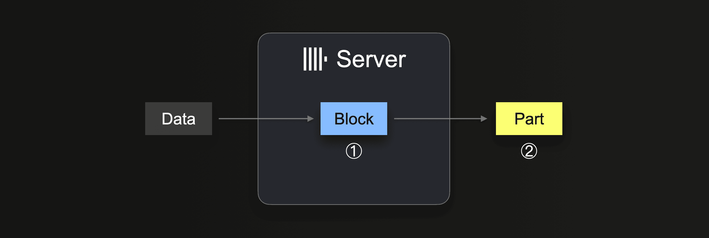
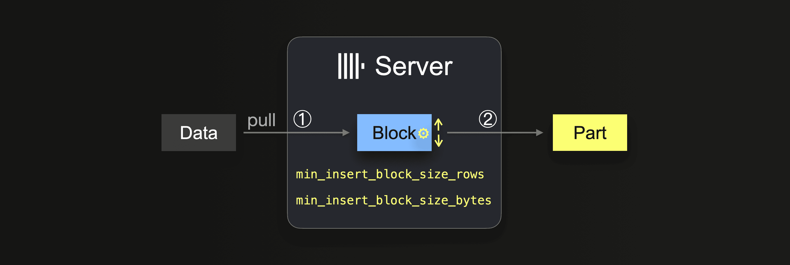
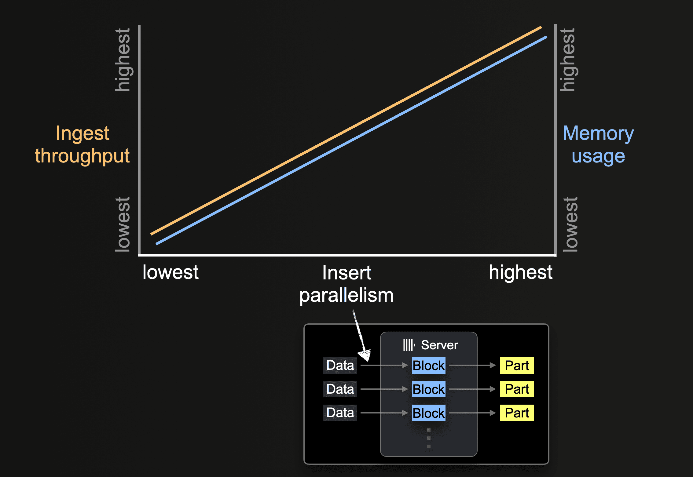
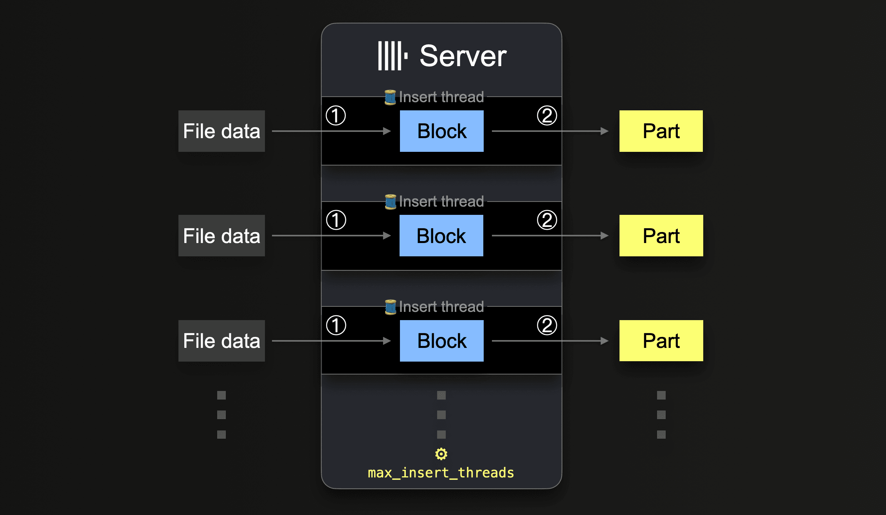

This section focuses on optimizing performance when reading and inserting data from S3 using the [s3 table functions](/docs/en/sql-reference/table-functions/s3). 

:::info
**The lesson described in this guide can be applied to other object storage implementations with their own dedicated table functions such as [GCS](/docs/en/sql-reference/table-functions/gcs) and [Azure Blob storage](/docs/en/sql-reference/table-functions/azureBlobStorage).**
:::

Before tuning threads and block sizes to improve insert performance, we recommend users understand the mechanics of S3 inserts. If you're familar with the insert mechanics, or just want some quick tips, skip to our example [below](/docs/en/integrations/s3/performance#example-dataset).

## Insert Mechanics (single node)

Two main factors, in addition to hardware size, influence the performance and resource usage of ClickHouse’s data insert mechanics (for a single node): **insert block size** and **insert parallelism**.

### Insert Block Size



When performing an `INSERT INTO SELECT`, ClickHouse receives some data portion, and ① forms (at least) one in-memory insert block (per [partitioning key](/docs/en/engines/table-engines/mergetree-family/custom-partitioning-key)) from the received data. The block’s data is sorted, and table engine-specific optimizations are applied. The data is then compressed and ② written to the database storage in the form of a new data part.

The insert block size impacts both the [disk file I/O usage](https://en.wikipedia.org/wiki/Category:Disk_file_systems) and memory usage of a ClickHouse server. Larger insert blocks use more memory but generate larger and fewer initial parts. The fewer parts ClickHouse needs to create for loading a large amount of data, the less disk file I/O and automatic [background merges required](https://clickhouse.com/blog/supercharge-your-clickhouse-data-loads-part1#more-parts--more-background-part-merges).

When using an `INSERT INTO SELECT` query in combination with an integration table engine or a table function, the data is pulled by the ClickHouse server: 



Until the data is completely loaded, the server executes a loop:

```bash
① Pull and parse the next portion of data and form an in-memory data block (one per partitioning key) from it.

② Write the block into a new part on storage.

Go to ① 
```

In ①, the size depends on the insert block size, which can be controlled with two settings:

- [`min_insert_block_size_rows`](https://clickhouse.com/docs/en/operations/settings/settings#min-insert-block-size-rows) (default: `1048545` million rows)
- [`min_insert_block_size_bytes`](https://clickhouse.com/docs/en/operations/settings/settings#min-insert-block-size-bytes) (default: `256 MiB`)

When either the specified number of rows is collected in the insert block, or the configured amount of data is reached (whichever happens first), then this will trigger the block being written into a new part. The insert loop continues at step ①.

Note that the `min_insert_block_size_bytes` value denotes the uncompressed in-memory block size (and not the compressed on-disk part size). Also, note that the created blocks and parts rarely precisely contain the configured number of rows or bytes because ClickHouse streams and [processes](https://clickhouse.com/company/events/query-performance-introspection) data row-[block](https://clickhouse.com/docs/en/operations/settings/settings#setting-max_block_size)-wise. Therefore, these settings specify minimum thresholds.

#### Be aware of merges

The smaller the configured insert block size is, the more initial parts get created for a large data load, and the more background part merges are executed concurrently with the data ingestion. This can cause resource contention (CPU and memory) and require additional time (for reaching a [healthy](/docs/en/operations/settings/merge-tree-settings#parts-to-throw-insert) (3000) number of parts) after the ingestion is finished. 

:::important
ClickHouse query performance will be negatively impacted if the part count exceeds the [recommended limits](/docs/en/operations/settings/merge-tree-settings#parts-to-throw-insert).
:::

ClickHouse will continuously [merge parts](https://clickhouse.com/blog/asynchronous-data-inserts-in-clickhouse#data-needs-to-be-batched-for-optimal-performance) into larger parts until they [reach](/docs/en/operations/settings/merge-tree-settings#max-bytes-to-merge-at-max-space-in-pool) a compressed size of ~150 GiB. This diagram shows how a ClickHouse server merges parts:


A single ClickHouse server utilizes several [background merge threads](/docs/en/operations/server-configuration-parameters/settings#background_pool_size) to execute concurrent [part merges](https://clickhouse.com/blog/supercharge-your-clickhouse-data-loads-part1#more-parts--more-background-part-merges:~:text=to%20execute%20concurrent-,part%20merges,-.%20Each%20thread%20executes). Each thread executes a loop:

```bash
① Decide which parts to merge next, and load these parts as blocks into memory.

② Merge the loaded blocks in memory into a larger block.

③ Write the merged block into a new part on disk.

Go to ①
```

Note that [increasing](https://clickhouse.com/blog/supercharge-your-clickhouse-data-loads-part1#hardware-size) the number of CPU cores and the size of RAM increases the background merge throughput.

Parts that were merged into larger parts are marked as [inactive](/docs/en/operations/system-tables/parts) and finally deleted after a [configurable](/docs/en/operations/settings/merge-tree-settings#old-parts-lifetime) number of minutes. Over time, this creates a tree of merged parts (hence the name [`MergeTree`](/docs/en/engines/table-engines/mergetree-family) table).

### Insert Parallelism



A ClickHouse server can process and insert data in parallel. The level of insert parallelism impacts the ingest throughput and memory usage of a ClickHouse server. Loading and processing data in parallel requires more main memory but increases the ingest throughput as data is processed faster.

Table functions like s3 allow specifying sets of to-be-loaded-file names via glob patterns. When a glob pattern matches multiple existing files, ClickHouse can parallelize reads across and within these files and insert the data in parallel into a table by utilizing parallel running insert threads (per server): 



Until all data from all files is processed, each insert thread executes a loop: 

```bash
① Get the next portion of unprocessed file data (portion size is based on the configured block size) and create an in-memory data block from it.

② Write the block into a new part on storage.

Go to ①. 
```

The number of such parallel insert threads can be configured with the [`max_insert_threads`](https://clickhouse.com/docs/en/operations/settings/settings#settings-max-insert-threads) setting. The default value is `1` for open-source ClickHouse and 4 for [ClickHouse Cloud](https://clickhouse.com/cloud).

With a large number of files, the parallel processing by multiple insert threads works well. It can fully saturate both the available CPU cores and the network bandwidth (for parallel file downloads). In scenarios where just a few large files will be loaded into a table, ClickHouse automatically establishes a high level of data processing parallelism and optimizes network bandwidth usage by spawning additional reader threads per insert thread for reading (downloading) more distinct ranges within large files in parallel. 

For the s3 function and table, parallel downloading of an individual file is determined by the values [max_download_threads](https://clickhouse.com/codebrowser/ClickHouse/src/Core/Settings.h.html#DB::SettingsTraits::Data::max_download_threads) and [max_download_buffer_size](https://clickhouse.com/codebrowser/ClickHouse/src/Core/Settings.h.html#DB::SettingsTraits::Data::max_download_buffer_size). Files will only be downloaded in parallel if their size is greater than `2 * max_download_buffer_size`. By default, the `max_download_buffer_size` default is set to 10MiB. In some cases, you can safely increase this buffer size to 50 MB (`max_download_buffer_size=52428800`), with the aim of ensuring each file was downloaded by a single thread. This can reduce the time each thread spends making S3 calls and thus also lower the S3 wait time. Furthermore, for files that are too small for parallel reading, to increase throughput, ClickHouse automatically prefetches data by pre-reading such files asynchronously.

## Measuring Performance

Optimizing the performance of queries using the S3 table functions is required when both running queries against data in place i.e. ad-hoc querying where only ClickHouse compute is used and the data remains in S3 in its original format, and when inserting data from S3 into a ClickHouse MergeTree table engine. Unless specified the following recommendations apply to both scenarios.

## Impact of Hardware Size


The number of available CPU cores and the size of RAM impacts the:

- supported [initial size of parts](#insert-block-size)
- possible level of [insert parallelism](#insert-parallelism)
- throughput of [background part merges](https://clickhouse.com/blog/supercharge-your-clickhouse-data-loads-part1#more-parts--more-background-part-merges)

and, therefore, the overall ingest throughput.

## Region Locality

Ensure your buckets are located in the same region as your ClickHouse instances. This simple optimization can dramatically improve throughput performance, especially if you deploy your ClickHouse instances on AWS infrastructure.

## Formats

ClickHouse can read files stored in S3 buckets in the [supported formats](/docs/en/interfaces/formats.md/#data-formatting) using the `s3` function and `S3` engine. If reading raw files, some of these formats have distinct advantages:

* Formats with encoded column names such as Native, Parquet, CSVWithNames, and TabSeparatedWithNames will be less verbose to query since the user will not be required to specify the column name is the `s3` function. The column names allow this information to be inferred.
* Formats will differ in performance with respect to read and write throughputs. Native and parquet represent the most optimal formats for read performance since they are already column orientated and more compact. The native format additionally benefits from alignment with how ClickHouse stores data in memory - thus reducing processing overhead as data is streamed into ClickHouse.
* The block size will often impact the latency of reads on large files. This is very apparent if you only sample the data, e.g., returning the top N rows. In the case of formats such as CSV and TSV, files must be parsed to return a set of rows. Formats such as Native and Parquet will allow faster sampling as a result.
* Each compression format brings pros and cons, often balancing the compression level for speed and biasing compression or decompression performance. If compressing raw files such as CSV or TSV, lz4 offers the fastest decompression performance, sacrificing the compression level. Gzip typically compresses better at the expense of slightly slower read speeds. Xz takes this further by usually offering the best compression with the slowest compression and decompression performance. If exporting, Gz and lz4 offer comparable compression speeds. Balance this against your connection speeds. Any gains from faster decompression or compression will be easily negated by a slower connection to your s3 buckets.
* Formats such as native or parquet do not typically justify the overhead of compression. Any savings in data size are likely to be minimal since these formats are inherently compact. The time spent compressing and decompressing will rarely offset network transfer times - especially since s3 is globally available with higher network bandwidth.

## Example dataset

To illustrate further potential optimizations, purposes we will use [the posts from the Stack Overflow dataset](/docs/en/data-modeling/schema-design#stack-overflow-dataset) - optimizing both the query and insert performance of this data. 

This dataset consists of 189 Parquet files, with one for every month between July 2008 and March 2024. 

Note that we use Parquet for performance, per our [recommendations above](#formats), executing all queries on a ClickHouse Cluster located in the same region as the bucket. This cluster has 3 nodes, each with 32GiB of RAM and 8 vCPUs.

With no tuning, we demonstrate the performance to insert this dataset into a MergeTree table engine as well as execute a query to compute the users asking the most questions. Both of these queries intentionally require a complete scan of the data.

```sql
-- Top usernames
SELECT
    OwnerDisplayName,
    count() AS num_posts
FROM s3('https://datasets-documentation.s3.eu-west-3.amazonaws.com/stackoverflow/parquet/posts/by_month/*.parquet')
WHERE OwnerDisplayName NOT IN ('', 'anon')
GROUP BY OwnerDisplayName
ORDER BY num_posts DESC
LIMIT 5

┌─OwnerDisplayName─┬─num_posts─┐
│ user330315       │     10344 │
│ user4039065      │      5316 │
│ user149341       │      4102 │
│ user529758       │      3700 │
│ user3559349      │      3068 │
└──────────────────┴───────────┘

5 rows in set. Elapsed: 3.013 sec. Processed 59.82 million rows, 24.03 GB (19.86 million rows/s., 7.98 GB/s.)
Peak memory usage: 603.64 MiB.

-- Load into posts table
INSERT INTO posts SELECT *
FROM s3('https://datasets-documentation.s3.eu-west-3.amazonaws.com/stackoverflow/parquet/posts/by_month/*.parquet')

0 rows in set. Elapsed: 191.692 sec. Processed 59.82 million rows, 24.03 GB (312.06 thousand rows/s., 125.37 MB/s.)
```

In our example we only return a few rows. If measuring the performance of `SELECT` queries, where large volumes of data are returned to the client, either utilize the [null format](/docs/en/interfaces/formats/#null) for queries or direct results to the [`Null` engine](/docs/en/engines/table-engines/special/null.md). This should avoid the client being overwhelmed with data and network saturation.

:::info
When reading from queries, the initial query can often appear slower than if the same query is repeated. This can be attributed to both S3's own caching but also the [ClickHouse Schema Inference Cache](/docs/en/operations/system-tables/schema_inference_cache). This stores the inferred schema for files and means the inference step can be skipped on subsequent accesses, thus reducing query time.
:::

## Using Threads for Reads

Read performance on S3 will scale linearly with the number of cores, provided you are not limited by network bandwidth or local I/O. Increasing the number of threads also has memory overhead permutations that users should be aware of. The following can be modified to improve read throughput performance potentially:

* Usually, the default value of `max_threads` is sufficient, i.e., the number of cores. If the amount of memory used for a query is high, and this needs to be reduced, or the `LIMIT` on results is low, this value can be set lower. Users with plenty of memory may wish to experiment with increasing this value for possible higher read throughput from S3. Typically this is only beneficial on machines with lower core counts, i.e., &lt; 10. The benefit from further parallelization typically diminishes as other resources act as a bottleneck, e.g., network and CPU contention.
* Versions of ClickHouse before 22.3.1 only parallelized reads across multiple files when using the `s3` function or `S3` table engine. This required the user to ensure files were split into chunks on S3 and read using a glob pattern to achieve optimal read performance. Later versions now parallelize downloads within a file.
* In low thread count scenarios, users may benefit from setting `remote_filesystem_read_method` to "read" to cause the synchronous reading of files from S3.
* For the s3 function and table, parallel downloading of an individual file is determined by the values `max_download_threads` and `max_download_buffer_size`. Files will only be downloaded in parallel if their size is greater than 2 * `max_download_buffer_size`. By default, the `max_download_buffer_size` default is set to 10MiB. In some cases, you can safely increase this buffer size to 50 MB (`max_download_buffer_size=52428800`), with the aim of ensuring each file was downloaded by a single thread. This can reduce the time each thread spends making S3 calls and thus also lower the S3 wait time. See [this blog post](https://clickhouse.com/blog/clickhouse-1-trillion-row-challenge) for an example of this.

Before making any changes to improve performance, ensure you measure appropriately. As S3 API calls are sensitive to latency and may impact client timings, use the query log for performance metrics, i.e., `system.query_log`.

Consider our earlier query, douibling the `max_threads` to `16` (default `max_thread` is the number of cores on a node) improves our read query performance by 2x at the expense of higher memory. Further increasing `max_threads` has dimishing returns as shown.

```sql
SELECT
    OwnerDisplayName,
    count() AS num_posts
FROM s3('https://datasets-documentation.s3.eu-west-3.amazonaws.com/stackoverflow/parquet/posts/by_month/*.parquet')
WHERE OwnerDisplayName NOT IN ('', 'anon')
GROUP BY OwnerDisplayName
ORDER BY num_posts DESC
LIMIT 5
SETTINGS max_threads = 16

┌─OwnerDisplayName─┬─num_posts─┐
│ user330315       │     10344 │
│ user4039065      │      5316 │
│ user149341       │      4102 │
│ user529758       │      3700 │
│ user3559349      │      3068 │
└──────────────────┴───────────┘

5 rows in set. Elapsed: 1.505 sec. Processed 59.82 million rows, 24.03 GB (39.76 million rows/s., 15.97 GB/s.)
Peak memory usage: 178.58 MiB.

SETTINGS max_threads = 32

5 rows in set. Elapsed: 0.779 sec. Processed 59.82 million rows, 24.03 GB (76.81 million rows/s., 30.86 GB/s.)
Peak memory usage: 369.20 MiB.

SETTINGS max_threads = 64

5 rows in set. Elapsed: 0.674 sec. Processed 59.82 million rows, 24.03 GB (88.81 million rows/s., 35.68 GB/s.)
Peak memory usage: 639.99 MiB.
```

## Tuning Threads and Block Size for Inserts

To achieve maximum ingestion performance, you must choose (1) an insert block size and (2) an appropriate level of insert parallelism based on (3) the amount of available CPU cores and RAM available. In summary:

- The larger we [configure the insert block size](#insert-block-size), the fewer parts ClickHouse has to create, and the fewer [disk file I/O](https://en.wikipedia.org/wiki/Category:Disk_file_systems) and [background merges](https://clickhouse.com/blog/supercharge-your-clickhouse-data-loads-part1#more-parts--more-background-part-merges) are required.  
- The higher we configure the [number of parallel insert threads](#insert-parallelism), the faster the data will be processed.

There is a conflicting tradeoff between these two performance factors (plus a tradeoff with the background part merging). The amount of available main memory of ClickHouse servers is limited. Larger blocks use more main memory, which limits the number of parallel insert threads we can utilize. Conversely, a higher number of parallel insert threads requires more main memory, as the number of insert threads determines the number of insert blocks created in memory concurrently. This limits the possible size of insert blocks. Additionally, there can be resource contention between insert threads and background merge threads. A high number of configured insert threads (1) creates more parts that need to be merged and (2) takes away CPU cores and memory space from background merge threads.

For a detailed description of how the behavior of these parameters impacts performance and resources, we recommend [reading this blog post](https://clickhouse.com/blog/supercharge-your-clickhouse-data-loads-part2). As described in this blog post, tuning can involve a careful balance of the two parameters. This exhaustive testing is often impractical, so in summary, we recommend:

```bash
• max_insert_threads: choose ~ half of the available CPU cores for insert threads (to leave enough dedicated cores for background merges)

• peak_memory_usage_in_bytes: choose an intended peak memory usage; either all available RAM (if it is an isolated ingest) or half or less (to leave room for other concurrent tasks)

Then:
min_insert_block_size_bytes = peak_memory_usage_in_bytes / (~3 * max_insert_threads)
```

With this formula, you can set `min_insert_block_size_rows` to 0 (to disable the row based threshold) while setting `max_insert_threads` to the chosen value and `min_insert_block_size_bytes` to the calculated result from the above formula.

Using this formula with our earlier Stack Overflow example.

- `max_insert_threads=4` (8 cores per node)
- `peak_memory_usage_in_bytes` - 32 GiB (100% of node resources) or `34359738368` bytes.
- `min_insert_block_size_bytes` = `34359738368/(3*4) = 2863311530`

```sql
INSERT INTO posts SELECT *
FROM s3('https://datasets-documentation.s3.eu-west-3.amazonaws.com/stackoverflow/parquet/posts/by_month/*.parquet') SETTINGS min_insert_block_size_rows=0, max_insert_threads=4, min_insert_block_size_bytes=2863311530

0 rows in set. Elapsed: 128.566 sec. Processed 59.82 million rows, 24.03 GB (465.28 thousand rows/s., 186.92 MB/s.)
```

As shown, tuning of these setting has improved insert performance by over `33%`. We leave this to the reader to see if they can improve single node performance further.

## Scaling with Resources and Nodes

Scaling with resources and nodes applies to both read and insert queries.

### Vertical scaling 

All previous tuning and queries have only used a single node in our ClickHouse Cloud cluster. Users will also often have more than one node of ClickHouse available. We recommend users scale vertically initially, improving S3 throughput linearly with the number of cores. If we repeat our earlier insert and read queries on a larger ClickHouse Cloud node to twice the resources (64GiB, 16 vCPUs) with appropriate settings, both execute approximately twice as fast.

```sql
INSERT INTO posts SELECT *
FROM s3('https://datasets-documentation.s3.eu-west-3.amazonaws.com/stackoverflow/parquet/posts/by_month/*.parquet') SETTINGS min_insert_block_size_rows=0, max_insert_threads=8, min_insert_block_size_bytes=2863311530

0 rows in set. Elapsed: 67.294 sec. Processed 59.82 million rows, 24.03 GB (888.93 thousand rows/s., 357.12 MB/s.)

SELECT
    OwnerDisplayName,
    count() AS num_posts
FROM s3('https://datasets-documentation.s3.eu-west-3.amazonaws.com/stackoverflow/parquet/posts/by_month/*.parquet')
WHERE OwnerDisplayName NOT IN ('', 'anon')
GROUP BY OwnerDisplayName
ORDER BY num_posts DESC
LIMIT 5
SETTINGS max_threads = 92

5 rows in set. Elapsed: 0.421 sec. Processed 59.82 million rows, 24.03 GB (142.08 million rows/s., 57.08 GB/s.)
```

:::note
Individual nodes can also be bottlenecked by network and S3 GET requests, preventing linear scaling of performance vertically.
:::

### Horizontal scaling

Eventually, horizontal scaling is often necessary due to hardware availability and cost-efficiency. In ClickHouse Cloud, production clusters have at least 3 nodes. Users may also wish to therefore utilize all nodes for an insert.

Utilizing a cluster for S3 reads requires using the `s3Cluster` function as described in [Utilizing Clusters](./index.md#utilizing-clusters). This allows reads to be distributed across nodes.  

The server that initially receives the insert query first resolves the glob pattern and then dispatches the processing of each matching file dynamically to itself and the other servers.


We repeat our earlier read query distributing the workload across 3 nodes, adjusting the query to use `s3Cluster`. This is performed automatically in ClickHouse Cloud, by refering to the `default` cluster.

As noted in [Utilizing Clusters](#utilizing-clusters) this work is distributed a file level. To benefit from this feature users will require a sufficient number of files i.e. at least > the number of nodes.


```sql
SELECT
    OwnerDisplayName,
    count() AS num_posts
FROM s3Cluster('default', 'https://datasets-documentation.s3.eu-west-3.amazonaws.com/stackoverflow/parquet/posts/by_month/*.parquet')
WHERE OwnerDisplayName NOT IN ('', 'anon')
GROUP BY OwnerDisplayName
ORDER BY num_posts DESC
LIMIT 5
SETTINGS max_threads = 16

┌─OwnerDisplayName─┬─num_posts─┐
│ user330315       │     10344 │
│ user4039065      │      5316 │
│ user149341       │      4102 │
│ user529758       │      3700 │
│ user3559349      │      3068 │
└──────────────────┴───────────┘

5 rows in set. Elapsed: 0.622 sec. Processed 59.82 million rows, 24.03 GB (96.13 million rows/s., 38.62 GB/s.)
Peak memory usage: 176.74 MiB.
```

Likewise, our insert query can be distributed, using the improved settings identified earlier for a single node:

```sql
INSERT INTO posts SELECT *
FROM s3Cluster('default', 'https://datasets-documentation.s3.eu-west-3.amazonaws.com/stackoverflow/parquet/posts/by_month/*.parquet') SETTINGS min_insert_block_size_rows=0, max_insert_threads=4, min_insert_block_size_bytes=2863311530

0 rows in set. Elapsed: 171.202 sec. Processed 59.82 million rows, 24.03 GB (349.41 thousand rows/s., 140.37 MB/s.)
```

Readers will notice the reading of files has improved query but not insert performance. By default, although reads are distributed using `s3Cluster`, inserts will occur against the initiator node. This means that while reads will occur on each node, the resulting rows will be routed to the initiator for distribution. In high throughput scenarios, this may prove a bottleneck. To address this, set the parameter `parallel_distributed_insert_select` for the `s3cluster` function.

Setting this to `parallel_distributed_insert_select=2`, ensures the `SELECT` and `INSERT` will be executed on each shard from/to the underlying table of the distributed engine on each node.

```sql
INSERT INTO posts
SELECT *
FROM s3Cluster('default', 'https://datasets-documentation.s3.eu-west-3.amazonaws.com/stackoverflow/parquet/posts/by_month/*.parquet')
SETTINGS parallel_distributed_insert_select = 2, min_insert_block_size_rows=0, max_insert_threads=4, min_insert_block_size_bytes=2863311530

0 rows in set. Elapsed: 54.571 sec. Processed 59.82 million rows, 24.03 GB (1.10 million rows/s., 440.38 MB/s.)
Peak memory usage: 11.75 GiB.
```

As expected, this reduces insert performance by 3x.

## Further tuning

### Disable de-duplication

Insert operations can sometimes fail due to errors such as timeouts. When inserts fail, data may or may not have been successfully inserted. To allow inserts to be safely re-tried by the client, by default in distributed deployments such as ClickHouse Cloud, ClickHouse tries to determine whether the data has already been successfully inserted. If the inserted data is marked as a duplicate, ClickHouse does not insert it into the destination table. However, the user will still receive a successful operation status as if the data had been inserted normally.

While this behavior, which incurs an insert overhead, makes sense when loading data from a client or in batches it can be unneccessary when performing an `INSERT INTO SELECT` from object storage. By disabling this functionality at insert time, we can improve performance as shown below:

```sql
INSERT INTO posts
SETTINGS parallel_distributed_insert_select = 2, min_insert_block_size_rows = 0, max_insert_threads = 4, min_insert_block_size_bytes = 2863311530, insert_deduplicate = 0
SELECT *
FROM s3Cluster('default', 'https://datasets-documentation.s3.eu-west-3.amazonaws.com/stackoverflow/parquet/posts/by_month/*.parquet')
SETTINGS parallel_distributed_insert_select = 2, min_insert_block_size_rows = 0, max_insert_threads = 4, min_insert_block_size_bytes = 2863311530, insert_deduplicate = 0

0 rows in set. Elapsed: 52.992 sec. Processed 59.82 million rows, 24.03 GB (1.13 million rows/s., 453.50 MB/s.)
Peak memory usage: 26.57 GiB.
```

### Optimize on insert

In ClickHouse, the `optimize_on_insert` setting controls whether data parts are merged during the insert process. When enabled (`optimize_on_insert = 1` by default), small parts are merged into larger ones as they are inserted, improving query performance by reducing the number of parts that need to be read. However, this merging adds overhead to the insert process, potentially slowing down high-throughput insertions.

Disabling this setting (`optimize_on_insert = 0`) skips merging during inserts, allowing data to be written more quickly, especially when handling frequent small inserts. The merging process is deferred to the background, allowing for better insert performance but temporarily increasing the number of small parts, which may slow down queries until the background merge completes. This setting is ideal when insert performance is a priority, and the background merge process can handle optimization efficiently later. As shown below, disabling setting can improve insert throughput:

```sql
SELECT *
FROM s3Cluster('default', 'https://datasets-documentation.s3.eu-west-3.amazonaws.com/stackoverflow/parquet/posts/by_month/*.parquet')
SETTINGS parallel_distributed_insert_select = 2, min_insert_block_size_rows = 0, max_insert_threads = 4, min_insert_block_size_bytes = 2863311530, insert_deduplicate = 0, optimize_on_insert = 0

0 rows in set. Elapsed: 49.688 sec. Processed 59.82 million rows, 24.03 GB (1.20 million rows/s., 483.66 MB/s.)
```

## Misc notes

* For low memory scenarios, consider lowering `max_insert_delayed_streams_for_parallel_write` if inserting into S3.
