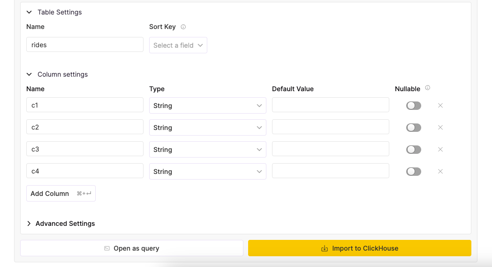

# Upload a CSV File

You can upload a CSV or TSV file that contains a header row with the column names, and ClickHouse will preprocess a batch
of rows to infer the data types of the columns, then insert the rows into a new table.

1. Start by going to the **Details** page of your ClickHouse Cloud service:

2. Select **Load data** from the **Actions** dropdown menu:

3. Click the **File upload** button on the **DataSources** page and select the file you want to upload in the dialog window that appears. Click **Open** to proceed ( Example below is on MacOS, other operating systems may vary).

4. ClickHouse shows you the data types that it inferred. 

5. ***Enter a new table name*** to insert the data into, then click the **Import to ClickHouse** button.

6. Connect to your ClickHouse service, verify the table was created successfully, and your data is ready to go! If you want to visualize your data, check out some of the [BI tools](../data-visualization.md) that can easily connect to ClickHouse.
