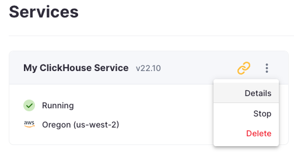
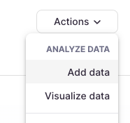
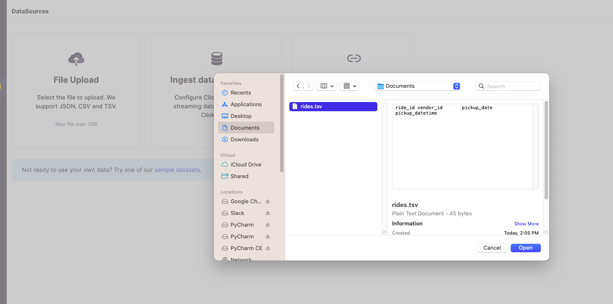
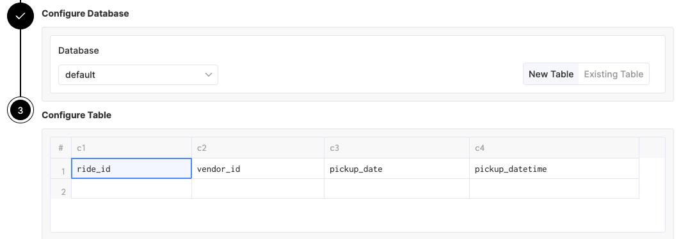

# Upload a CSV File

You can upload a CSV or TSV file that contains a header row with the column names, and ClickHouse will preprocess a batch
of rows to infer the data types of the columns, then insert the rows into a new table.

1. Start by going to the **Details** page of your ClickHouse Cloud service:

2. Select **Load data** from the **Actions** dropdown menu:

3. Click the **File upload** button in the **Load data** dialog window that appears. Enter your database user credentials, drag-and-drop (or click the **+** to browse for) your file into the **File upload** section, then click the **Upload file** button:

5. ClickHouse shows you the data types that it inferred. ***Enter a new table name*** to insert the data into, then click the **Create table** button.

6. [Connect to your ClickHouse service](../connect-a-client.md), verify the table was created successfully, and your data is ready to go! If you want to visualize your data, check out some of the [BI tools](../data-visualization.md) that can easily connect to ClickHouse.