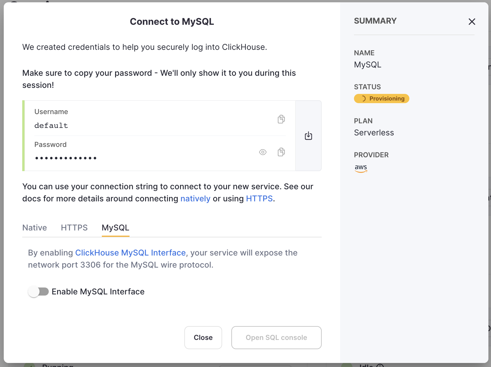
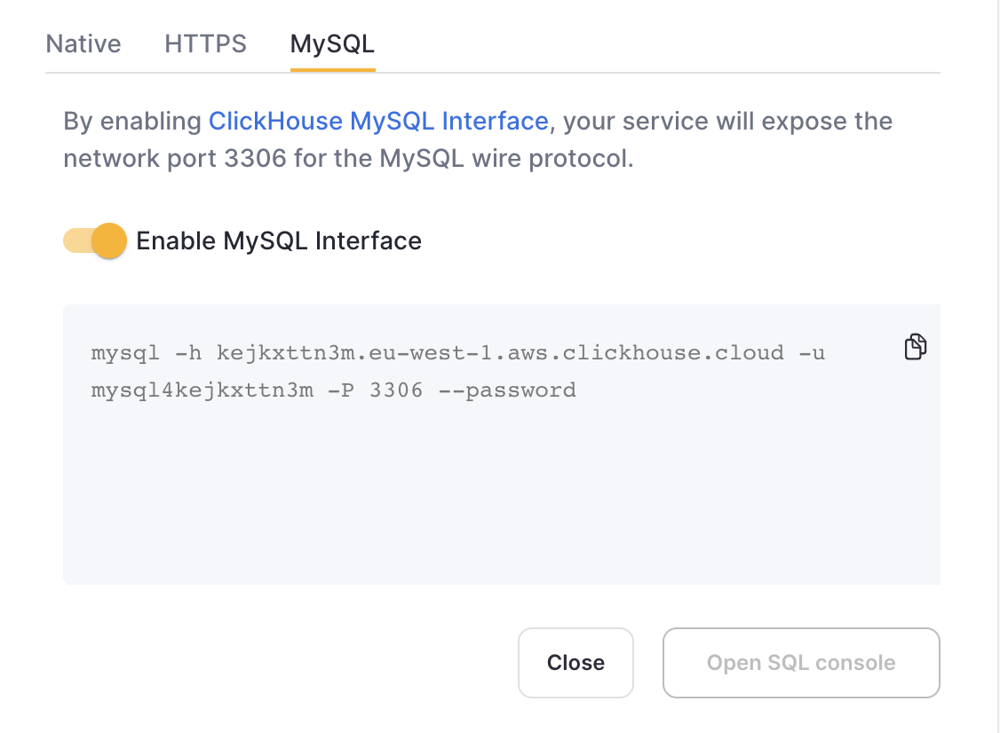
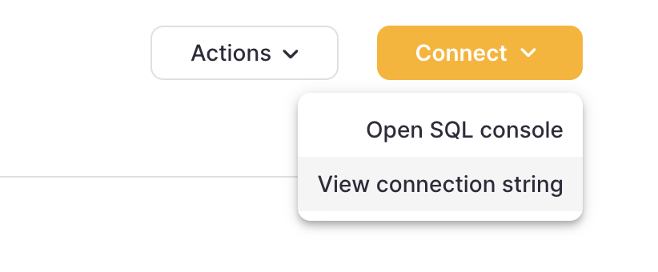
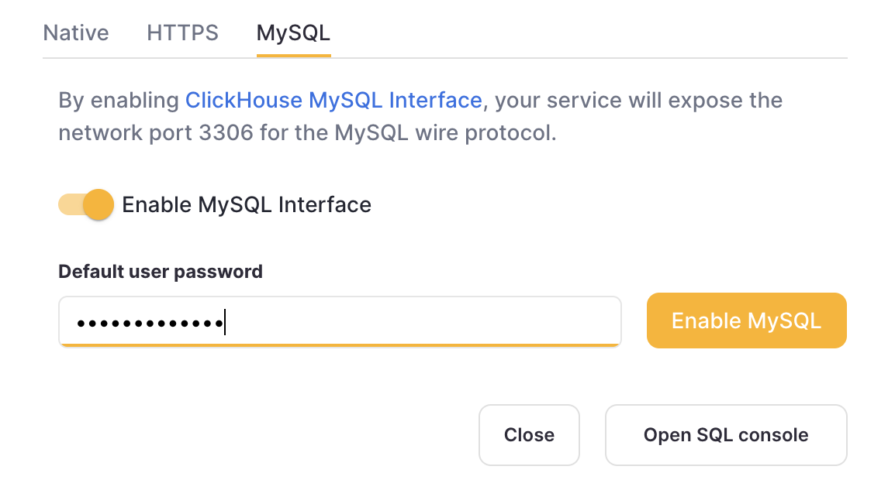

# Looker Studio

Looker Studio can connect to ClickHouse via the MySQL interface using the official Google MySQL data source.

## ClickHouse Cloud Setup
1. After creating your ClickHouse Cloud Service, on the credentials screen, select the MySQL tab



2. Toggle the switch to enable the MySQL interface for this specific service. This will expose port `3306` for this service and prompt you with your MySQL connection screen that include your unique MySQL username. The password will be the same as the service's default user password.



Alternatively, in order to enable the MySQL interface for an exisitng service:

1. Ensure your service is in `Running` state then click on the "View connection string" button for the service you want to enable the MySQL interface for



2. Toggle the switch to enable the MySQL interface for this specific service. This will prompt you to enter the default password.



3. After entering the password, you will get prompted the MySQL connection string for this service


## On-premise ClickHouse Server Setup

Please refer to [the official documentation](https://clickhouse.com/docs/en/interfaces/mysql) 
on how to set up a ClickHouse server with enabled MySQL interface.

Aside from adding an entry to the server's `config.xml`

```xml
<clickhouse>
    <mysql_port>9004</mysql_port>
</clickhouse>
```

it is also _required_ to use 
[Double SHA1 password encryption](https://clickhouse.com/docs/en/operations/settings/settings-users#user-namepassword) 
for the user that will be using MySQL interface. 

Generating a random password encrypted with Double SHA1 from the shell:

```shell
PASSWORD=$(base64 < /dev/urandom | head -c16); echo "$PASSWORD"; echo -n "$PASSWORD" | sha1sum | tr -d '-' | xxd -r -p | sha1sum | tr -d '-'
```

The output should look like the following:

```
LZOQYnqQN4L/T6L0
fbc958cc745a82188a51f30de69eebfc67c40ee4
```

The first line is the generated password, and the second line is the hash we could use to configure ClickHouse.

Here is an example configuration for `mysql_user` that uses the generated hash:

`/etc/clickhouse-server/users.d/mysql_user.xml`

```xml
  <users>
    <mysql_user>
        <password_double_sha1_hex>fbc958cc745a82188a51f30de69eebfc67c40ee4</password_double_sha1_hex>
        <networks>
            <ip>::/0</ip>
        </networks>
        <profile>default</profile>
        <quota>default</quota>
    </mysql_user>
</users> 
```

Replace `password_double_sha1_hex` entry with your own generated Double SHA1 hash.

Once the configuration is done, Looker Studio should be able to connect to ClickHouse via MySQL interface. 

If you have the `mysql` binary available, you can test the connection from the commandline. 
Using the sample username (`mysql_user`) and password (`LZOQYnqQN4L/T6L0`) from above the command line would be:

```bash
mysql --protocol tcp -h localhost -u mysql_user -P 9004 --password=LZOQYnqQN4L/T6L0
```

```
mysql> show databases;
+--------------------+
| name               |
+--------------------+
| INFORMATION_SCHEMA |
| default            |
| information_schema |
| system             |
+--------------------+
4 rows in set (0.00 sec)
Read 4 rows, 603.00 B in 0.00156 sec., 2564 rows/sec., 377.48 KiB/sec.
```

## Connecting Looker Studio to ClickHouse

First, login to https://lookerstudio.google.com using your Google account and create a new Data Source:


<br/>

Search for the official MySQL connector provided by Google (named just **MySQL**):


<br/>

Specify your connection details. Please note that MySQL interface port is 9004 by default, 
and it might be different depending on your server configuration.


<br/>

Now, you have two options on how to fetch the data from ClickHouse. First, you could use the Table Browser feature:


<br/>

Alternatively, you could specify a custom query to fetch your data:


<br/>

Finally, you should be able to see the introspected table structure and adjust the data types if necessary. 


<br/>

Now you can proceed with exploring your data or creating a new report! 

## Using Looker Studio with ClickHouse Cloud

When using ClickHouse Cloud, create a support case to enable the MySQL feature. Our support team will enable this feature, which then creates a dedicated user for the MySQL interface.


<br/>

In the Looker Studio UI, choose the "Enable SSL" option. ClickHouse Cloud's SSL certificate is signed by [LetsEncrypt](https://letsencrypt.org/certificates/). You can download this root cert [here](https://letsencrypt.org/certs/isrgrootx1.pem).

The rest of the steps are the same as listed above in the previous section.
