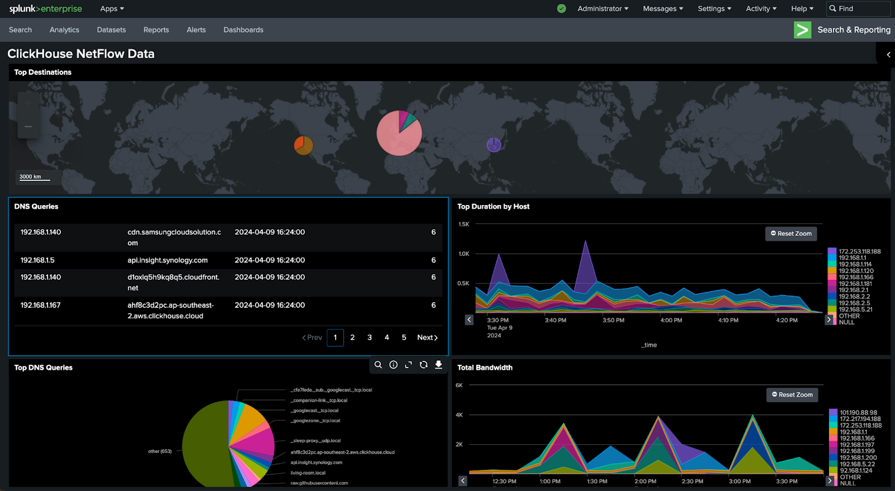
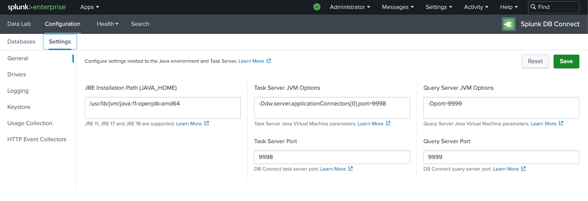
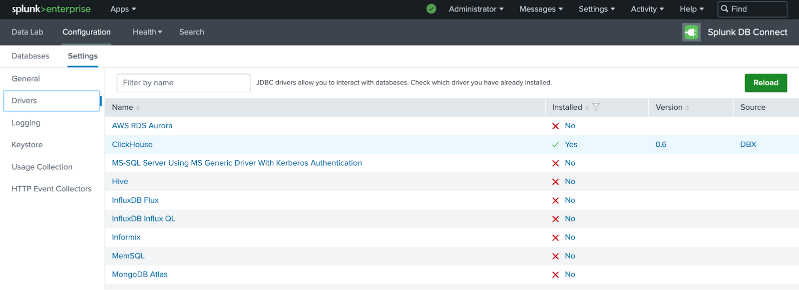
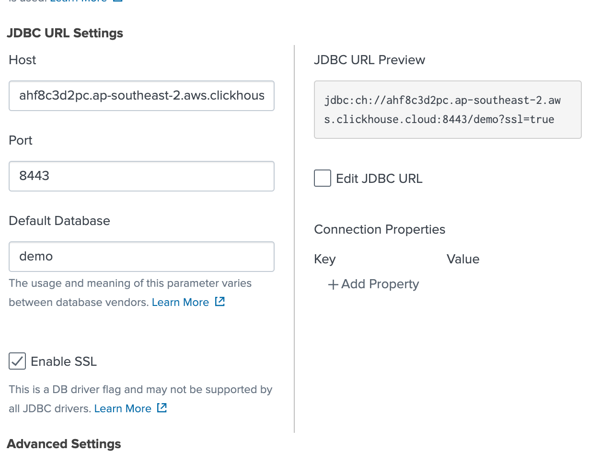
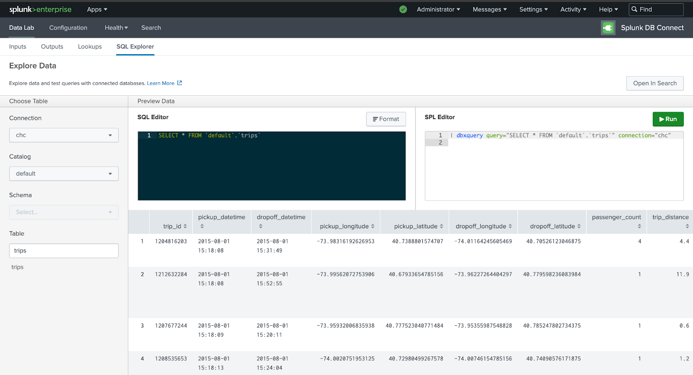
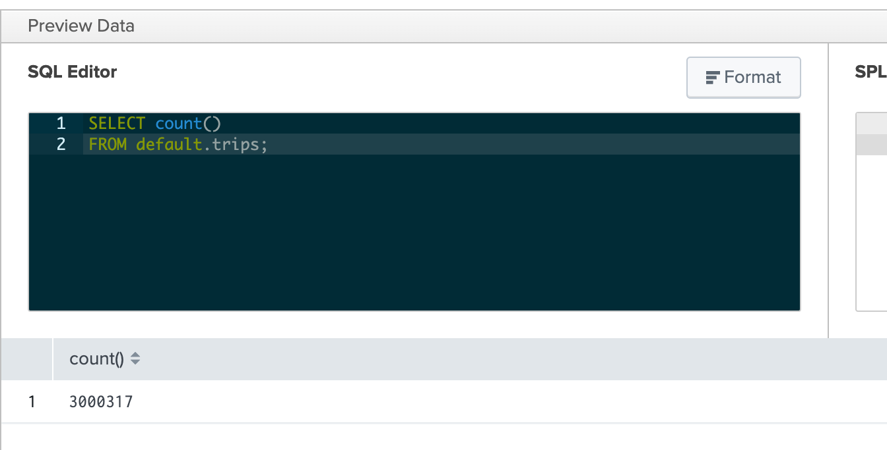
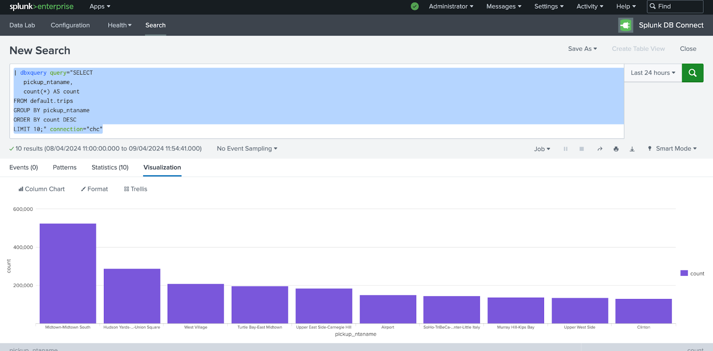
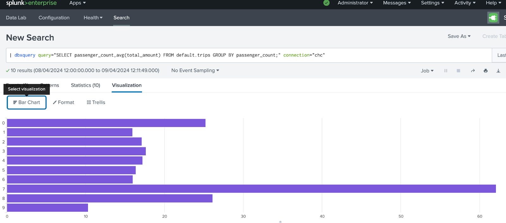
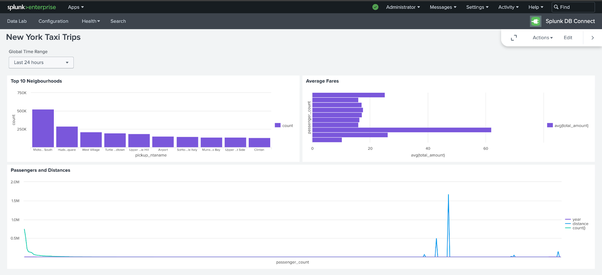

# Connecting Splunk to ClickHouse

Splunk is a popular technology for security and observability. It is also a powerful search and dashboarding engine. There are hundreds of Splunk apps available to address different use cases.

For ClickHouse specifically, we are leveraging the [Splunk DB Connect App](https://splunkbase.splunk.com/app/2686) which has a simple integration to the highly performant ClickHouse JDBC driver to query tables in ClickHouse directly.

The ideal use case for this integration is when you are using ClickHouse for large data sources such as netflow, Avro or Protobuf binary data, DNS, VPC flow logs, and other OTEL logs that can be shared with your team on Splunk to search and create dashboards. By using this approach, the data is not ingested into the Splunk index layer and is simply queried directly from ClickHouse similarly to other visualization integrations such as [Metabase](https://www.metabase.com/) or [Superset](https://superset.apache.org/).


## Goal​

In this guide, we will use the ClickHouse JDBC driver to connect ClickHouse to Splunk. We will install a local version of Splunk Enterprise but we are not indexing any data. Instead, we are using the search functions through the DB Connect query engine.

With this guide, you will be able to create a dashboard connected to ClickHouse similar to this:



:::note
This guide uses the [New York City Taxi dataset](https://clickhouse.com/docs/en/getting-started/example-datasets/nyc-taxi). There are many other datasets that you can use from [our docs](http://localhost:3000/docs/en/getting-started/example-datasets).
:::

## Prerequisites

Before you get started you will need:
- Splunk Enterprise to use search head functions
- [Java Runtime Environment (JRE)](https://docs.splunk.com/Documentation/DBX/3.16.0/DeployDBX/Prerequisites) requirements installed on your OS or container
- [Splunk DB Connect](https://splunkbase.splunk.com/app/2686)
- Admin or SSH access to your Splunk Enterprise OS Instance
- ClickHouse connection details (see [here](https://clickhouse.com/docs/en/integrations/metabase#1-gather-your-connection-details) if you're using ClickHouse Cloud)

## Install and Configure DB Connect on Splunk Enterprise

You must first install the Java Runtime Environment on your Splunk Enterprise instance. If you're using Docker, you can use the command `microdnf install java-11-openjdk`.

Note down the `java_home` path: `java -XshowSettings:properties -version`.

Ensure that the DB Connect App is installed on Splunk Enterprise. You can find it in the Apps section of the Splunk Web UI:
- Log in to Splunk Web and go to Apps > Find More Apps
- Use the search box to find DB Connect
- Click the green "Install" button next to Splunk DB Connect
- Click "Restart Splunk"

If you're having issues installing the DB Connect App, please see [this link](https://splunkbase.splunk.com/app/2686) for additional instructions.

Once you've verified that the DB Connect App is installed, add the java_home path  to the DB Connect App in Configuration -> Settings, and click save then reset.



## Configure JDBC for ClickHouse

Download the [ClickHouse JDBC driver](https://github.com/ClickHouse/clickhouse-java) to the DB Connect Drivers folder such as:

```
$SPLUNK_HOME/etc/apps/splunk_app_db_connect/drivers
```

You must then edit the connection types configuration at `$SPLUNK_HOME/etc/apps/splunk_app_db_connect/default/db_connection_types.conf` to add the ClickHouse JDBC Driver class details.

Add the following stanza to the file:

```
[ClickHouse]
displayName = ClickHouse
serviceClass = com.splunk.dbx2.DefaultDBX2JDBC
jdbcUrlFormat = jdbc:ch://<host>:<port>/<database>
jdbcUrlSSLFormat = jdbc:ch://<host>:<port>/<database>?ssl=true
jdbcDriverClass = com.clickhouse.jdbc.ClickHouseDriver
ui_default_catalog = $database$
```

Restart Splunk using `$SPLUNK_HOME/bin/splunk restart`.

Navigate back to the DB Connect App and go to Configuration > Settings > Drivers. You should see a green tick next to ClickHouse:



## Connect Splunk Search to ClickHouse

Navigate to DB Connect App Configuration -> Databases -> Identities: Create a Identity for your ClickHouse.

Create a new Connection to ClickHouse from Configuration -> Databases -> Connections and select “New Connection”.


<br />

Add ClickHouse host details and ensure “Enable SSL” is ticked:



After saving the connection, you will have successfully connected to ClickHouse to Splunk!

:::note
If you receive an error, make sure that you have added the IP address of your Splunk instance to the ClickHouse Cloud IP Access List. See [the docs](https://clickhouse.com/docs/en/manage/security/setting-ip-filters) for more info.
:::

## Run a SQL query

We will now run a SQL query to test that everything works.

Select your connection details in the SQL Explorer from the DataLab section of the DB Connect App. We are using the  `trips` table for this demo:



Execute a SQL query on the `trips` table that returns the count of all the records in the table:



If your query is successful, you should see the results.

## Create a Dashboard

Let's create a dashboard that leverages a combination of SQL plus the powerful Splunk Processing Language (SPL).

Before proceeding, you must first [Deactivate DPL Safeguards](https://docs.splunk.com/Documentation/Splunk/9.2.1/Security/SPLsafeguards?ref=hk#Deactivate_SPL_safeguards).

Run the following query that shows us the top 10 neighborhoods that have the most frequent pickups:

```sql
dbxquery query="SELECT pickup_ntaname, count(*) AS count
FROM default.trips GROUP BY pickup_ntaname
ORDER BY count DESC LIMIT 10;" connection="chc"
```

Select the visualization tab to view the column chart created:



We will now create a dashobard by clicking Save As > Save to a Dashboard.

Let's add another query that shows the average fare based on the number of passengers.


```sql
dbxquery query="SELECT passenger_count,avg(total_amount) 
FROM default.trips GROUP BY passenger_count;" connection="chc"
```

This time, let's create a bar chart visualization and save it to the previous dashboard.



Finally, let's add one more query that shows the correlation between the number of passengers and the distance of the trip: 


```sql
dbxquery query="SELECT passenger_count, toYear(pickup_datetime) AS year,
round(trip_distance) AS distance, count(* FROM default.trips)
GROUP BY passenger_count, year, distance
ORDER BY year, count(*) DESC; " connection="chc"
```

Our final dashboard should look like this:



## Time Series Data

Splunk has hundreds of built-in functions that dashboards can use for visualization and presentation of time series data. This example will combine SQL + SPL to create a query that can work with time series data in Splunk

```sql
dbxquery query="SELECT time, orig_h, duration 
FROM "demo"."conn" WHERE time >= now() - interval 1 HOURS" connection="chc"
| eval time = strptime(time, "%Y-%m-%d %H:%M:%S.%3Q")
| eval _time=time
| timechart avg(duration) as duration by orig_h
| eval duration=round(duration/60)
| sort - duration:
```

## Learn more

If you'd like to find more information about Splunk DB Connect and how to build dashboards, please visit the [Splunk documentation](https://docs.splunk.com/Documentation).
