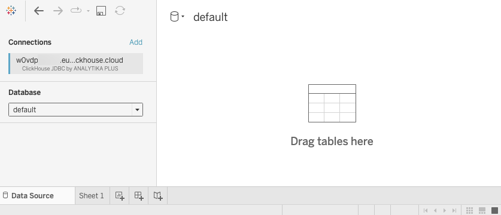

import ConnectionDetails from '@site/docs/en/_snippets/_gather_your_details_http.mdx';

# Connecting Tableau to ClickHouse

Tableau can use ClickHouse databases and tables as a data source. This requires a special JDBC driver to be downloaded and saved into a specific location where Tableau can find it.

## How to connect

1. Gather your connection details
<ConnectionDetails />

2. Download and install  <a href="https://www.tableau.com/products/desktop/download" target="_blank">Tableau desktop</a>.
3. Download the latest version of the ANALYTIKA PLUS <a href="https://github.com/analytikaplus/clickhouse-tableau-connector-jdbc/releases" target="_blank">clickhouse-tableau-connector-jdbc</a> TACO connector.
4. Store the TACO connector in the following folder (based on your OS):
    - macOS: `~/Documents/My Tableau Repository/Connectors`
    - Windows: `C:\Users[Windows User]\Documents\My Tableau Repository\Connectors`
5. Follow `clickhouse-tableau-connector-jdbc` instructions to download the compatible version of <a href="https://github.com/ClickHouse/clickhouse-java/releases/" target="_blank">ClickHouse JDBC driver</a>.

:::note
Make sure you download the **clickhouse-jdbc-x.x.x-shaded.jar** JAR file.
:::

6. Store the JDBC driver in the following folder (based on your OS, if the folder doesn't exist you can create it):
    - macOS: `~/Library/Tableau/Drivers`
    - Windows: `C:\Program Files\Tableau\Drivers`
7. Configure a ClickHouse data source in Tableau and start building data visualizations!

## Configure a ClickHouse data source in Tableau

Now that you have the driver and connector in the appropriate folders on your machine, let's see how to define a data source in Tableau that connects to the **TPCD** database in ClickHouse.

1. Start Tableau. (If you already had it running, then restart it.)

2. From the left-side menu, click on **More** under the **To a Server** section. If everything worked properly, you should see **ClickHouse (JDBC) by ANALYTIKA PLUS** in the list of installed connectors:

    

3. Click on **ClickHouse (JDBC) by ANALYTIKA PLUS**  and a dialog window pops up. Enter the following details:

    | Setting  | Value |
    | ----------- | ----------- |
    | Server      |  **localhost**  |
    | Port   |  **8123** |
    | Database |  **default** |
    | Username | **default** |
    | Password | *leave blank* |

 

Your settings should look like:

:::note
Our ClickHouse database is named **TPCD**, but you must set the **Database** to **default** in the dialog above, then select **TPCD** for the **Schema** in the next step. (This is likely due to a bug in the connector, so this behavior could change, but for now you must use **default** as the database.)
:::

4. Click the **Sign In** button and you should see a new Tableau workbook:

    

5. Select **TPCD** from the **Schema** dropdown and you should see the list of tables in **TPCD**:

    

You are now ready to build some visualizations in Tableau!

## Building Visualizations in Tableau

Now that have a ClickHouse data source configured in Tableau, let's visualize the data...

1. Drag the **CUSTOMER** table onto the workbook. Notice the columns appear, but the data table is empty:

    

2. Click the **Update Now** button and 100 rows from **CUSTOMER** will populate the table.

3. Drag the **ORDERS** table into the workbook, then set **Custkey** as the relationship field between the two tables:

    

4. You now have the **ORDERS** and **LINEITEM** tables associated with each other as your data source, so you can use this relationship to answer questions about the data. Select the **Sheet 1** tab at the bottom of the workbook.

    

5. Suppose you want to know how many specific items were ordered each year. Drag **Orderdate** from **ORDERS** into the **Columns** section (the horizontal field), then drag **Quantity** from **LINEITEM** into the **Rows**. Tableau will generate the following line chart:

    

Not a very exciting line chart, but the dataset was generated by a script and built for testing query performance, so you will notice there is not a lot of variations in the simulated orders of the TCPD data.

6. Suppose you want to know the average order amount (in dollars) by quarter and also by shipping mode (air, mail, ship, truck, etc.):

    - Click the **New Worksheet** tab create a new sheet
    - Drag **OrderDate** from **ORDERS** into **Columns** and change it from **Year** to **Quarter**
    - Drag **Shipmode** from **LINEITEM** into **Rows**

You should see the following:

7. The **Abc** values are just filling in the space until you drag a metric onto the table. Drag **Totalprice** from **ORDERS** onto the table. Notice the default calculation is to **SUM** the **Totalpricess**:

    

8. Click on **SUM** and change the **Measure** to **Average**. From the same dropdown menu, select **Format** change the **Numbers** to **Currency (Standard)**:

    

  Well done! You have successfully connected Tableau to ClickHouse, and you have opened up a whole world of possibilities for analyzing and visualizing your ClickHouse data.

:::note
Tableau is great, and we love that it connects so nicely to ClickHouse! If you are new to Tableau, <a href="https://help.tableau.com/current/pro/desktop/en-us/gettingstarted_overview.htm" target="_blank"  >check out their documentation</a> for help on building dashboards and visualizations.
:::

**Summary:** You can connect Tableau to ClickHouse using the generic ODBC/JDBC ClickHouse driver, but we really like how this tool from ANALYTIKA PLUS simplifies the process of setting up the connection. If you have any issues with the connector, feel free to reach out to ANALYTIKA PLUS on <a href="https://github.com/analytikaplus/clickhouse-tableau-connector-jdbc/issues" target="_blank"  >GitHub</a>.
