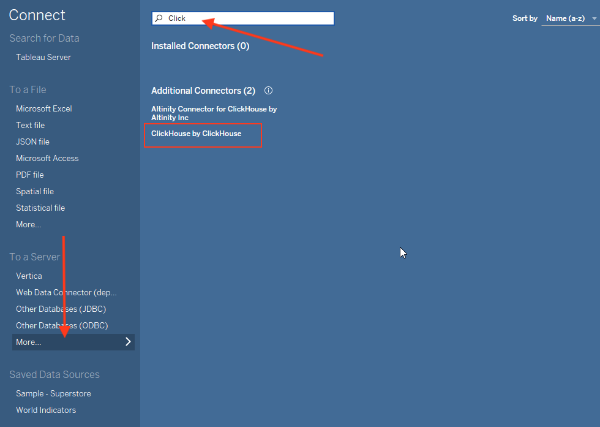
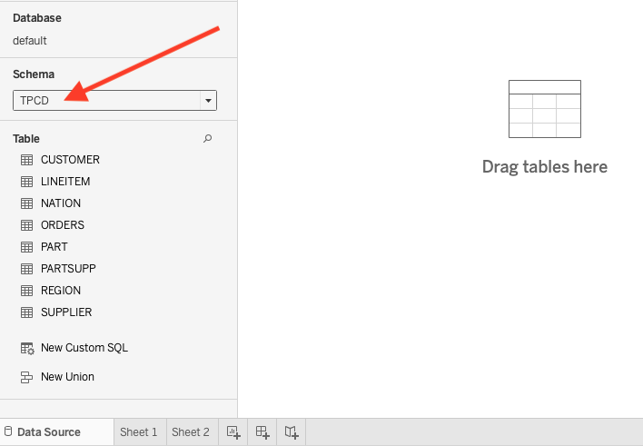
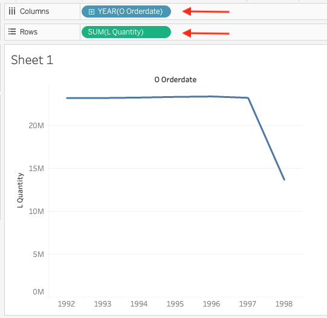
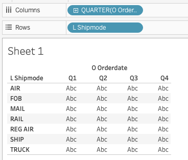
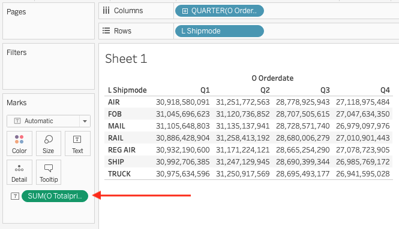
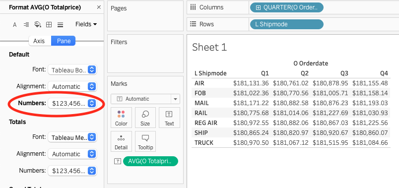

import TOCInline from '@theme/TOCInline';
import ConnectionDetails from '@site/docs/en/_snippets/_gather_your_details_http.mdx';

# Connecting Tableau to ClickHouse

ClickHouse offers an official Tableau Connector, featured on
the [Tableau Exchange](https://exchange.tableau.com/products/1064).
The connector is based on ClickHouse's advanced [JDBC driver](/docs/en/integrations/java/jdbc-driver).

With this connector, Tableau integrates ClickHouse databases and tables as data sources. To enable this functionality,
follow the setup guide bellow.

<TOCInline toc={toc}/>

## Setup Required Prior Usage

1. Gather your connection details
   <ConnectionDetails />

2. Download and install  <a href="https://www.tableau.com/products/desktop/download" target="_blank">Tableau
   desktop</a>.
3. Follow `clickhouse-tableau-connector-jdbc` instructions to download the compatible version
   of <a href="https://github.com/ClickHouse/clickhouse-java/releases/" target="_blank">ClickHouse JDBC driver</a>.

:::note
Make sure you download the **clickhouse-jdbc-x.x.x-shaded-all.jar** JAR file. Currently, we recommended using versions `0.8.X`.
:::

4. Store the JDBC driver in the following folder (based on your OS, if the folder doesn't exist you can create it):
    - macOS: `~/Library/Tableau/Drivers`
    - Windows: `C:\Program Files\Tableau\Drivers`
5. Configure a ClickHouse data source in Tableau and start building data visualizations!

## Configure a ClickHouse data source in Tableau

Now that you have the `clickhouse-jdbc` driver installed and set, let's see how to define a data
source in Tableau that connects to the **TPCD** database in ClickHouse.

1. Start Tableau. (If you already had it running, then restart it.)

2. From the left-side menu, click on **More** under the **To a Server** section. Search for **ClickHouse by ClickHouse** in the available connectors list:

   
 

:::note
Don't see the **ClickHouse by ClickHouse** connector in your connectors list? It might be related to an old Tableau Desktop version.
To solve that, consider upgrading your Tableau Desktop application, or [install the connector manually](#install-the-connector-manually).
:::

3. Click on **ClickHouse by ClickHouse**  and the following dialog will pop up:

   
 
4. Click **Install and Restart Tableau**. Restart the application.
5. After restarting, the connector will have its full name: `ClickHouse JDBC by ClickHouse, Inc.`. When clicking it the following dialog will pop up:

     

6. Enter your connection details:

    | Setting  | Value                                                  |
    | ----------- |--------------------------------------------------------|
    | Server      | **Your ClickHouse host (with no prefixes or suffix)** |
    | Port   | **8443**                                               |
    | Database | **default**                                            |
    | Username | **default**                                            |
    | Password | *\*****                                                |

:::note
When working with ClickHouse cloud, it's required to enable the SSL checkbox for secured connections.
:::
 

:::note
Our ClickHouse database is named **TPCD**, but you must set the **Database** to **default** in the dialog above, then
select **TPCD** for the **Schema** in the next step. (This is likely due to a bug in the connector, so this behavior
could change, but for now you must use **default** as the database.)
:::

7. Click the **Sign In** button and you should see a new Tableau workbook:

   

8. Select **TPCD** from the **Schema** dropdown and you should see the list of tables in **TPCD**:

   

You are now ready to build some visualizations in Tableau!

## Building Visualizations in Tableau

Now that have a ClickHouse data source configured in Tableau, let's visualize the data...

1. Drag the **CUSTOMER** table onto the workbook. Notice the columns appear, but the data table is empty:

   

2. Click the **Update Now** button and 100 rows from **CUSTOMER** will populate the table.

3. Drag the **ORDERS** table into the workbook, then set **Custkey** as the relationship field between the two tables:

   

4. You now have the **ORDERS** and **LINEITEM** tables associated with each other as your data source, so you can use
   this relationship to answer questions about the data. Select the **Sheet 1** tab at the bottom of the workbook.

   

5. Suppose you want to know how many specific items were ordered each year. Drag **OrderDate** from **ORDERS** into the
   **Columns** section (the horizontal field), then drag **Quantity** from **LINEITEM** into the **Rows**. Tableau will
   generate the following line chart:

   

Not a very exciting line chart, but the dataset was generated by a script and built for testing query performance, so
you will notice there is not a lot of variations in the simulated orders of the TCPD data.

6. Suppose you want to know the average order amount (in dollars) by quarter and also by shipping mode (air, mail, ship,
   truck, etc.):

    - Click the **New Worksheet** tab create a new sheet
    - Drag **OrderDate** from **ORDERS** into **Columns** and change it from **Year** to **Quarter**
    - Drag **Shipmode** from **LINEITEM** into **Rows**

You should see the following:

7. The **Abc** values are just filling in the space until you drag a metric onto the table. Drag **Totalprice** from *
   *ORDERS** onto the table. Notice the default calculation is to **SUM** the **Totalprices**:

   

8. Click on **SUM** and change the **Measure** to **Average**. From the same dropdown menu, select **Format** change the
   **Numbers** to **Currency (Standard)**:

   

Well done! You have successfully connected Tableau to ClickHouse, and you have opened up a whole world of possibilities
for analyzing and visualizing your ClickHouse data.

## Install the Connector Manually

In case you use an outdated Tableau Desktop version that doesn't include the connector by default, you can install it manually by following these steps:

1. Download the latest taco file from [Tableau Exchange](https://exchange.tableau.com/products/1064)
2. Place the taco file in
   * macOS: `~/Documents/My Tableau Repository/Connectors`
   * Windows: `C:\Users\[Windows User]\Documents\My Tableau Repository\Connectors`
3. Restart Tableau Desktop, if your setup went successfully, you will set the connector under the `New Data Source` section.

## Connection and Analysis Tips

For more guidance on optimizing your Tableau-ClickHouse integration, 
please visit [Connection Tips](/en/integrations/tableau/connection-tips) and [Analysis Tips](/en/integrations/tableau/analysis-tips).

## Tests
The connector is being tested with the [TDVT framework](https://tableau.github.io/connector-plugin-sdk/docs/tdvt) and currently maintains a 97% coverage ratio.

## Summary 
You can connect Tableau to ClickHouse using the generic ODBC/JDBC ClickHouse driver. However, this
connector streamlines the connection setup process. If you have any issues with the connector, feel free to reach out
on <a href="https://github.com/ClickHouse/clickhouse-tableau-connector-jdbc/issues" target="_blank"  >GitHub</a>.
