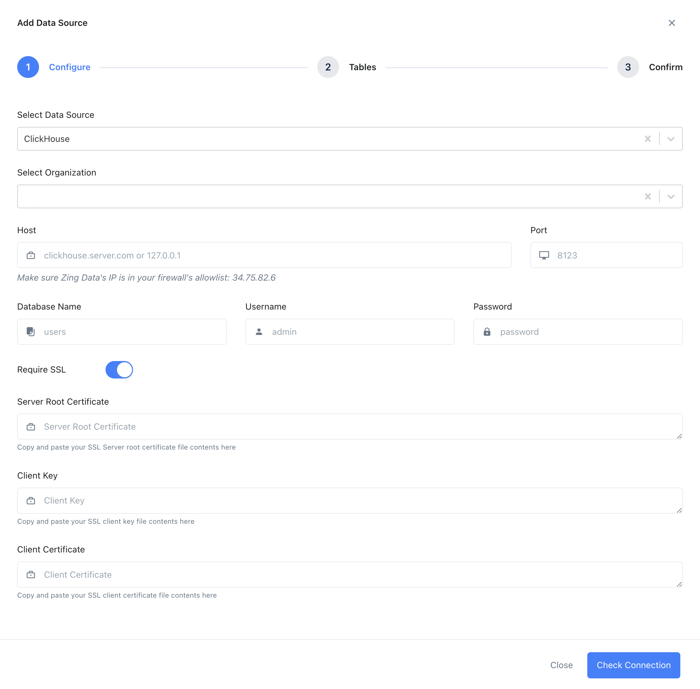
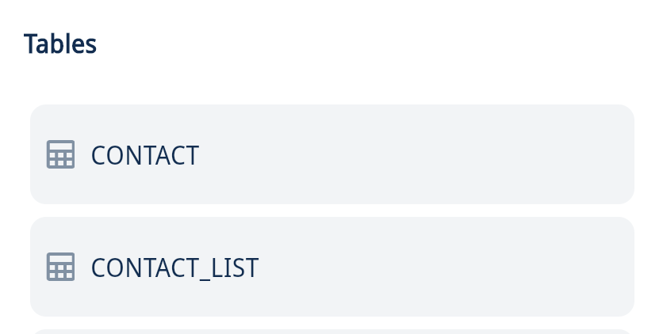
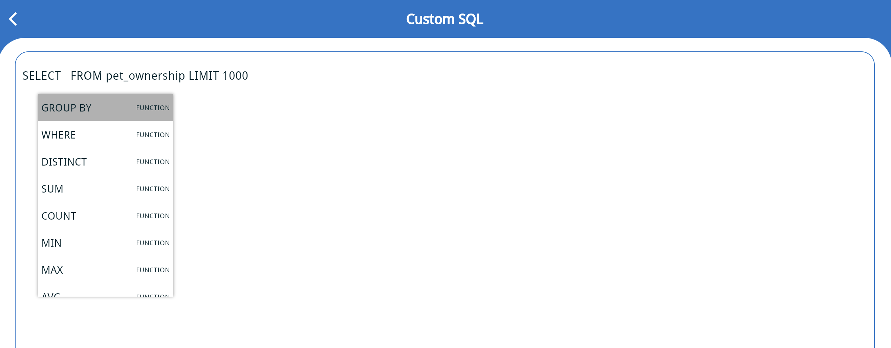
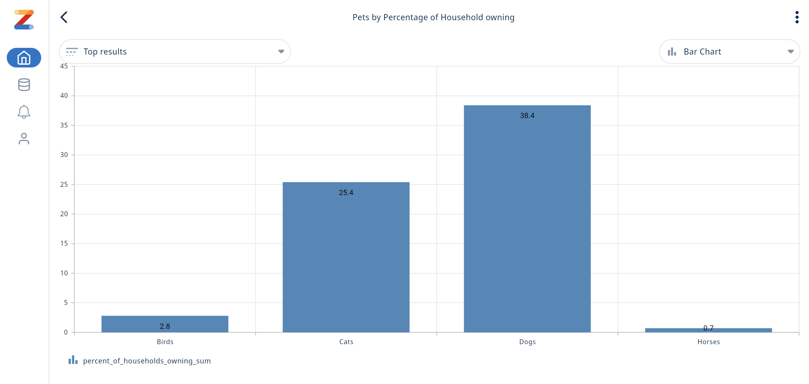
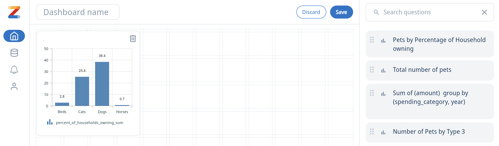

import ConnectionDetails from '@site/docs/en/_snippets/_gather_your_details_http.mdx';

# Connect Zing Data to ClickHouse

<a href="https://www.zingdata.com/" target="_blank">Zing Data</a> is a data exploration and visualization platform. Zing Data connects to ClickHouse using the JS driver provided by ClickHouse. 

## How to connect
1. Gather your connection details.
<ConnectionDetails />

2. Download or visit Zing Data

    * To use Clickhouse with Zing Data on mobile, download the Zing data app on [Google Play Store](https://play.google.com/store/apps/details?id=com.getzingdata.android) or the [Apple App Store](https://apps.apple.com/us/app/zing-data-collaborative-bi/id1563294091).
    
    * To use Clickhouse with Zing Data on the web, visit the [Zing web console](https://console.getzingdata.com/) and create an account.

3. Add a datasource

    * To interact with your ClickHouse data with Zing Data, you need to define a **_datasource_**. On the mobile app menu in Zing Data, select **Sources**, then click on **Add a Datasource**.

    * To add a datasource on web, click on **Data Sources** on the top menu, click on **New Datasource** and select **Clickhouse** from the dropdown menu
    
      

4. Fill out the connection details and click on **Check Connection**.

    

5. If the connection is successful, Zing will proceed you to table selection. Select the required tables and click on **Save**. If Zing cannot connect to your data source, you'll see a message asking your to check your credentials and retry. If even after checking your credentials and retrying you still experience issues, <a id="contact_link" href="mailto:hello@getzingdata.com">reach out to Zing support here.</a>

    

6. Once the Clickhouse datasource is added, it will be available to everyone in your Zing organization, under the **Data Sources** / **Sources** tab.

## Creating Charts and Dashboards in Zing Data

1. After your Clickhouse datasource is added, click on **Zing App** on the web, or click on the datasource on mobile to start creating charts.

2. Click on a table under the table's list to create a chart.

  

3. Use the visual query builder to pick the desired fields, aggregations, etc., and click on **Run Question**.

    

4. If you familiar with SQL, you can also write custom SQL to run queries and create a chart.

    

    

5. An example chart would look as follows. The question can be saved using the three-dot menu. You can comment on the chart, tag your team members, create real-time alerts, change the chart type, etc.

    

6. Dashboards can be created using the "+" icon under **Dashboards** on the Home screen. Existing questions can be dragged in, to be displayed on the dashboard.

    

## Related Content

- Blog: [Visualizing Data with ClickHouse - Zing Data](https://getzingdata.com/blog/zing-adds-support-for-clickhouse-as-a-data-source/)
- [Documentation](https://docs.getzingdata.com/docs/)
- [Quick Start](https://getzingdata.com/quickstart/)
- Guide to [Create Dashboards](https://getzingdata.com/blog/new-feature-create-multi-question-dashboards/)
