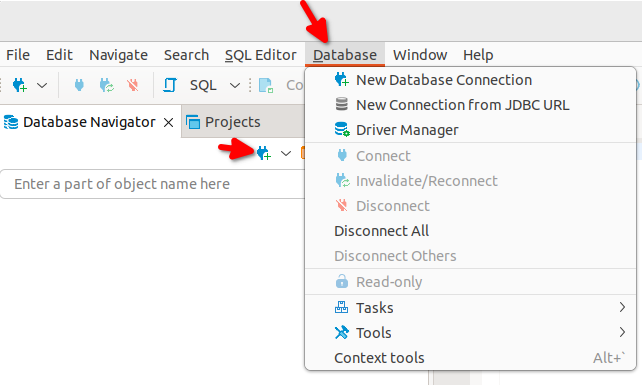
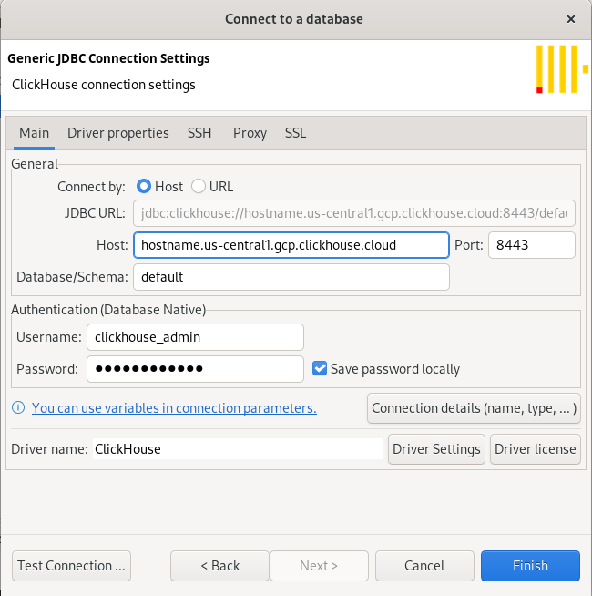
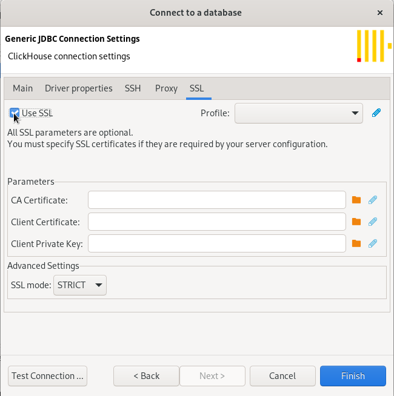
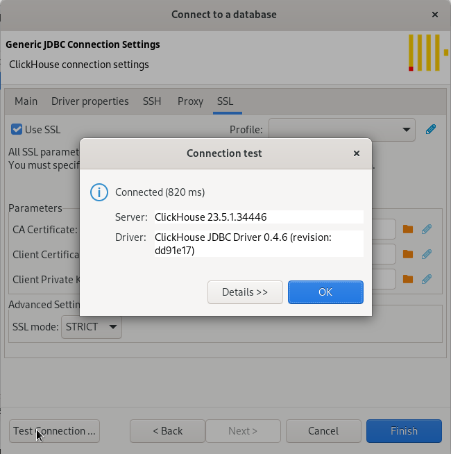
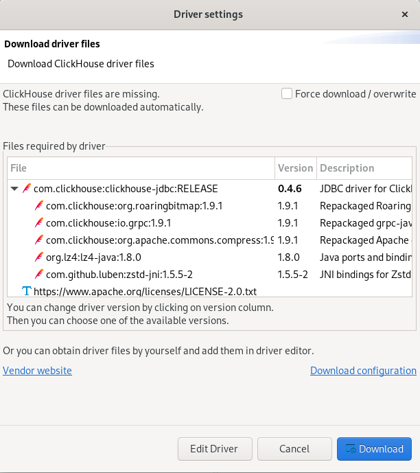
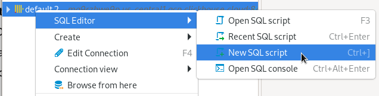
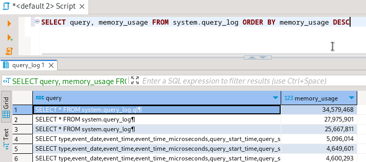

# Connect DBeaver to ClickHouse

DBeaver is available in multiple offerings. In this guide [DBeaver Community](https://dbeaver.io/) is used. See the various offerings and capabilities [here](https://dbeaver.com/edition/).  DBeaver connects to ClickHouse using JDBC.

:::note
Please use DBeaver version 23.1.0 or above for improved support of `Nullable` columns in ClickHouse.
:::

## 1. Gather your ClickHouse details

DBeaver uses JDBC over HTTP(S) to connect to ClickHouse; you need:

- endpoint
- port number
- username
- password

## 2. Download DBeaver

DBeaver is available at https://dbeaver.io/download/

## 3. Add a database

- Either use the **Database > New Database Connection** menu or the **New Database Connection** icon in the **Database Navigator** to bring up the **Connect to a database** dialog:

- Select **Analytical** and then **ClickHouse**:

- Build the JDBC URL. On the **Main** tab set the Host, Port, Username, Password, and Database:

- By default the **SSL > Use SSL** property will be unset, if you are connecting to ClickHouse Cloud or a server that requires SSL on the HTTP port, then set **SSL > Use SSL** on:

- Test the connection:

If DBeaver detects that you do not have the ClickHouse driver installed it will offer to download them for you:

- After downloading the driver **Test** the connection again:

## 4. Query ClickHouse

Open a query editor and run a query.

- Right click on your connection and choose **SQL Editor > Open SQL Script** to open a query editor:

- An example query against `system.query_log`:

  

## Next Steps

See the [DBeaver wiki](https://github.com/dbeaver/dbeaver/wiki) to learn about the capabilities of DBeaver, and the [ClickHouse documentation](https://clickhouse.com/docs) to learn about the capabilities of ClickHouse.
