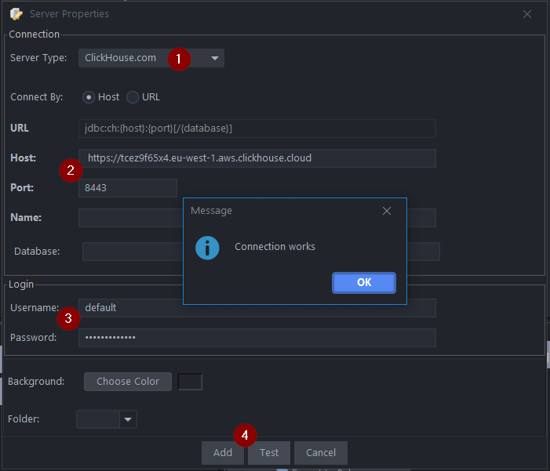
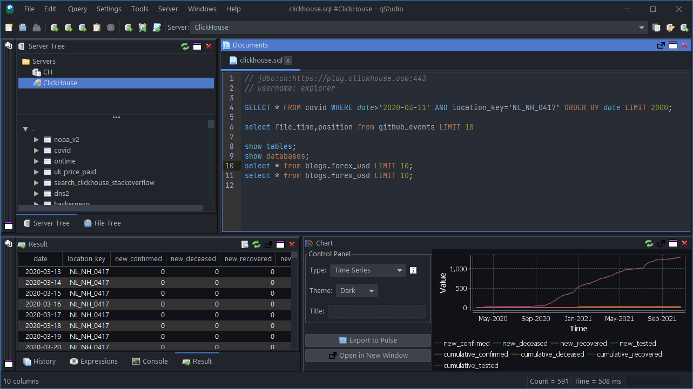

import ConnectionDetails from '@site/docs/en/_snippets/_gather_your_details_http.mdx';

qStudio is a free SQL GUI, it allows running SQL scripts, easy browsing of tables, charting and exporting of results. It works on every operating system, with every database.

# Connect QStudio to ClickHouse

QStudio connects to ClickHouse using JDBC. 

## 1. Gather your ClickHouse details

QStudio uses JDBC over HTTP(S) to connect to ClickHouse; you need:

- endpoint
- port number
- username
- password

<ConnectionDetails />

## 2. Download QStudio

QStudio is available at https://www.timestored.com/qstudio/download/

## 3. Add a database

- When you first open qStudio click on the menu options **Server->Add Server** or on the add server button on the toolbar.
- Then set the details:

1.   Server Type: Clickhouse.com
2.    Note for Host you MUST include https://
    Host: https://abc.def.clickhouse.cloud
    Port: 8443
3.  Username: default
    Password: XXXXXXXXXXX
 4. Click Add

If qStudio detects that you do not have the ClickHouse JDBC driver installed, it will offer to download them for you:

## 4. Query ClickHouse

- Open a query editor and run a query. You can run queries by 
- Ctrl + e - Runs highlighted text
- Ctrl + Enter - Runs the current line

- An example query:

  

## Next Steps

See [QStudio](https://www.timestored.com/qstudio) to learn about the capabilities of QStudio, and the [ClickHouse documentation](https://clickhouse.com/docs) to learn about the capabilities of ClickHouse.
