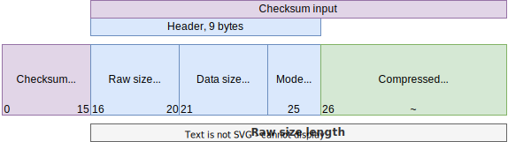

# Compression

ClickHouse protocol supports **data blocks** compression with checksums.
Use `LZ4` if not sure what mode to pick.

:::tip
Learn more about the [column compression codecs](/docs/en/sql-reference/statements/create/table.md/#column-compression-codecs) available and specify them when creating your tables, or afterward.
:::

## Modes

| value  | name               | description                              |
|--------|--------------------|------------------------------------------|
| `0x02` | [None](#none-mode) | No compression, only checksums           |
| `0x82` | LZ4                | Extremely fast, good compression         |
| `0x90` | ZSTD               | Zstandard, pretty fast, best compression |

Both LZ4 and ZSTD are made by same author, but with different tradeoffs.
From [facebook benchmarks](https://facebook.github.io/zstd/#benchmarks):

| name              | ratio | encoding | decoding  |
|-------------------|-------|----------|-----------|
| **zstd** 1.4.5 -1 | 2.8   | 500 MB/s | 1660 MB/s |
| **lz4** 1.9.2     | 2.1   | 740 MB/s | 4530 MB/s |

## Block

| field           | type    | description                                      |
|-----------------|---------|--------------------------------------------------|
| checksum        | uint128 | [Hash](./hash.md) of (header + compressed data) |
| raw_size        | uint32  | Raw size without header                          |
| data_size       | uint32  | Uncompressed data size                           |
| mode            | byte    | Compression mode                                 |
| compressed_data | binary  | Block of compressed data                         |

Header is (raw_size + data_size + mode), raw size consists of len(header + compressed_data).

Checksum is `hash(header + compressed_data)`, using [ClickHouse CityHash](./hash.md).

## None mode

If *None* mode is used, `compressed_data` is equal to original data.
No compression mode is useful to ensure additional data integrity with checksums, because
hashing overhead is negligible.
