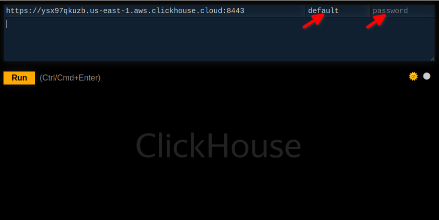
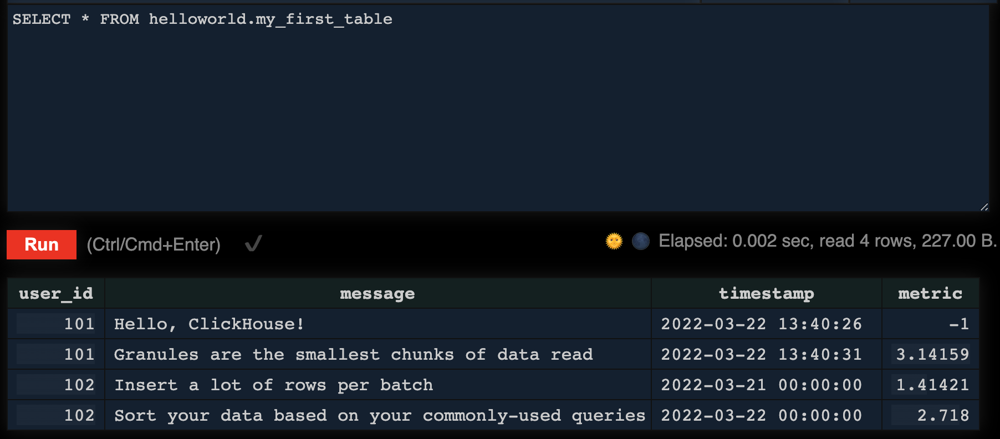
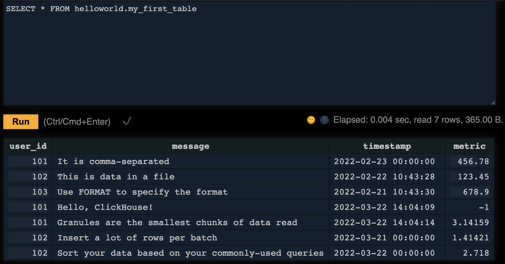

import ConnectionDetails from '@site/docs/_snippets/_ip-filtering.md';

import Tabs from '@theme/Tabs';
import TabItem from '@theme/TabItem';
import CodeBlock from '@theme/CodeBlock';

# Quick Start

ClickHouse runs on ClickHouse Cloud or any Linux, FreeBSD, or macOS system with x86_64, AArch64, or PowerPC64LE CPU architecture. Follow these steps to get up and running with ClickHouse.

##  1. Get ClickHouse

<Tabs groupId="deployMethod">
<TabItem value="serverless" label="ClickHouse Cloud" default>

## Start a trial, or sign in.

Need the flow.

## Create a Service, a Service is an auto scaling ClickHouse cluster. 

Need the flow.

<ConnectionDetails/>

</TabItem>
<TabItem value="selfmanaged" label="Self Managed">

:::note
If your OS is not supported or for other install options, view the [installation details in the technical reference guide](/en/getting-started/install/).
:::

<Tabs groupId="os">
<TabItem value="linux" label="Linux" >

The simplest way to download ClickHouse locally is to run the following command. If your operating system is supported, an appropriate ClickHouse binary will be downloaded and made runnable:
  ```bash
  curl https://clickhouse.com/ | sh
  ```

Run the `install` command, which defines a collection of useful symlinks along with the files and folders used by ClickHouse - all of which you can see in the output of the install script:
  ```bash
  sudo ./clickhouse install
  ```

At the end of the install script, you are prompted for a password for the `default` user. Feel free to enter a password, or you can optionally leave it blank:
  ```response
  Creating log directory /var/log/clickhouse-server.
  Creating data directory /var/lib/clickhouse.
  Creating pid directory /var/run/clickhouse-server.
   chown -R clickhouse:clickhouse '/var/log/clickhouse-server'
   chown -R clickhouse:clickhouse '/var/run/clickhouse-server'
   chown  clickhouse:clickhouse '/var/lib/clickhouse'
  Enter password for default user:
  ```

  You should see the following output:
  ```response
   ClickHouse has been successfully installed.

   Start clickhouse-server with:
    sudo clickhouse start

   Start clickhouse-client with:
    clickhouse-client
  ```

Run the following command to start the ClickHouse server:
  ```bash
  sudo clickhouse start
  ```

</TabItem>
<TabItem value="mac" label="macOS">

The simplest way to download ClickHouse locally is to run the following command. If your operating system is supported, an appropriate ClickHouse binary will be downloaded and made runnable:
  ```bash
  curl https://clickhouse.com/ | sh
  ```

Run the following command to start the ClickHouse server. A user named `default` with no password is created on the initial startup:
  ```bash
  ./clickhouse server
  ```
:::info Important
The examples throughout the documentation use the Linux commands for running the ClickHouse client (`clickhouse-client`).  
To run the ClickHouse server and client on a Mac, use `./clickhouse server` and `./clickhouse client`, respectively.
:::

</TabItem>
</Tabs>
</TabItem>
</Tabs>

## 2. Connect to ClickHouse

ClickHouse provides a web based SQL console that this part of the Quick Start will use.  Later on you will use `clickhouse-client` to connect to your ClickHouse service, and other clients are described in the pages in the *What's Next* section.

<Tabs groupId="deployMethod">
<TabItem value="serverless" label="ClickHouse Cloud" default>

### Connect to SQL console

You can connect to the SQL console from the Services list in your ClickHouse Cloud organization.

From your organization page, open the connection details for the service that you want to connect to:

  

From here you can reset the password for the `default` user, get the connection information to connect clients (SQL clients, visualization tools, development language clients, etc.), and **connect to SQL console**.

  

The SQL console requires a username and password, the username is populated with `default`; change it to your username if you are not using the default user.  Enter your password in the password field.

  

</TabItem>
<TabItem value="selfmanaged" label="Self Managed">

The ClickHouse server listens for HTTP clients on port 8123 by default. There is a built-in UI for running SQL queries at [http://127.0.0.1:8123/play](http://127.0.0.1:8123/play) (change the hostname accordingly).

  

Notice in your Play UI that the username was populated with **default** and the password text field was left empty. If you assigned a password to the `default` user, enter it into the password field.

</TabItem>
</Tabs>

## 3. Run a query

This returns the names of the databases, type it in the SQL console, and click **Run**:
  ```sql
  SHOW databases
  ```

  

## 4. Create a database and table

Like most database management systems, ClickHouse logically groups tables into **databases**. Use the `CREATE DATABASE` command to create a new database in ClickHouse:
  ```sql
  CREATE DATABASE IF NOT EXISTS helloworld
  ```

Run the following command to create a table named `my_first_table` in the `helloworld` database:
  ```sql
  CREATE TABLE helloworld.my_first_table
  (
      user_id UInt32,
      message String,
      timestamp DateTime,
      metric Float32
  )
  ENGINE = MergeTree()
  PRIMARY KEY (user_id, timestamp)
  ```

In the example above, `my_first_table` is a MergeTree table with four columns:

- `user_id`:  a 32-bit unsigned integer
- `message`: a String data type, which replaces types like VARCHAR, BLOB, CLOB and others from other database systems
- `timestamp`: a DateTime value, which represents an instant in time
- `metric`: a 32-bit floating point number

:::note table engines
The table engine determines:
   - How and where the data is stored
   - Which queries are supported
   - Whether or not the data is replicated

There are many engines to choose from, but for a simple table on a single-node ClickHouse server, [MergeTree](/en/engines/table-engines/mergetree-family/mergetree.md) is your likely choice. 
:::

### A Brief Intro to Primary Keys

Before you go any further, it is important to understand how primary keys work in ClickHouse (the implementation
of primary keys might seem unexpected!):

- primary keys in ClickHouse are **_not unique_** for each row in a table

The primary key of a ClickHouse table determines how the data is sorted when written to disk. Every 8,192 rows or 10MB of
data (referred to as the **index granularity**) creates an entry in the primary key index file. This granularity concept
creates a **sparse index** that can easily fit in memory, and the granules represent a stripe of the smallest amount of
column data that gets processed during `SELECT` queries.

The primary key can be defined using the `PRIMARY KEY` parameter. If you define a table without a `PRIMARY KEY` specified,
then the key becomes the tuple specified in the `ORDER BY` clause. If you specify both a `PRIMARY KEY ` and an `ORDER BY`, the primary key must be a subset of the sort order.

The primary key is also the sorting key, which is a tuple of `(user_id, timestamp)`.  Therefore, the data stored in each
column file will be sorted by `user_id`, then `timestamp`.

## 5. Insert Data

You can use the familiar `INSERT INTO TABLE` command with ClickHouse, but it is important to understand that each insert into a `MergeTree` table causes a **part** to be created in storage.

:::tip Clickhouse best practice
Insert a large number of rows per batch - tens of thousands or even millions of
rows at once. (Don't worry - ClickHouse can easily handle that type of volume!)
:::

Even for a simple example, let's insert more than one row at a time:
  ```sql
  INSERT INTO helloworld.my_first_table (user_id, message, timestamp, metric) VALUES
      (101, 'Hello, ClickHouse!',                                 now(),       -1.0    ),
      (102, 'Insert a lot of rows per batch',                     yesterday(), 1.41421 ),
      (102, 'Sort your data based on your commonly-used queries', today(),     2.718   ),
      (101, 'Granules are the smallest chunks of data read',      now() + 5,   3.14159 )
  ```

:::note
Notice the `timestamp` column is populated using various **Date** and **DateTime** functions. ClickHouse has hundreds of useful functions that you can [view in the **Functions** section](/en/sql-reference/functions/).
:::

Let's verify it worked:
  ```sql
  SELECT * FROM helloworld.my_first_table
  ```
   You should see the four rows of data that were inserted:

   


### The ClickHouse Client

<Tabs groupId="deployMethod">
<TabItem value="serverless" label="ClickHouse Cloud" default>

You can also connect to your ClickHouse Cloud service using a command-line tool named **clickhouse-client**. The connection details are in the **Native** tab in the services connection details:

  

  Download info to be determined (we need a download link for
  `clickhouse-client and clickhouse-local for Cloud customers)

  ```bash
  clickhouse-client --host HOSTNAME.REGION.CSP.clickhouse.cloud \
  --secure --port 9440 \
  --user default \
  --password <password>
  ```

</TabItem>
<TabItem value="selfmanaged" label="Self Managed">
<Tabs groupId="os">
<TabItem value="linux" label="Linux" >

You can also connect to your ClickHouse server using a command-line tool named **clickhouse-client**:
  ```bash
  clickhouse-client
  ```

</TabItem>
<TabItem value="mac" label="macOS">

You can also connect to your ClickHouse server using a command-line tool named **clickhouse-client**. Open a new terminal and change directories to where you downloaded the `clickhouse` binary in step 1 above, then run the following command:
  ```bash
  ./clickhouse client
  ```

</TabItem>
</Tabs>
</TabItem>
</Tabs>

If you get the smiley face prompt, you are ready to run queries!
  ```response
  :)
  ```

  Give it a try by running the following query:
  ```sql
  SELECT *
  FROM helloworld.my_first_table
  ORDER BY timestamp
  ```

  Notice the response comes back in a nice table format:

   ```response
   ┌─user_id─┬─message────────────────────────────────────────────┬───────────timestamp─┬──metric─┐
   │     102 │ Insert a lot of rows per batch                     │ 2022-03-21 00:00:00 │ 1.41421 │
   │     102 │ Sort your data based on your commonly-used queries │ 2022-03-22 00:00:00 │   2.718 │
   │     101 │ Hello, ClickHouse!                                 │ 2022-03-22 14:04:09 │      -1 │
   │     101 │ Granules are the smallest chunks of data read      │ 2022-03-22 14:04:14 │ 3.14159 │
   └─────────┴────────────────────────────────────────────────────┴─────────────────────┴─────────┘
   
   4 rows in set. Elapsed: 0.008 sec.
   ```

Add a `FORMAT` clause to specify one of the [many supported output formats of ClickHouse](/en/interfaces/formats/):
  ```sql
  SELECT *
  FROM helloworld.my_first_table
  ORDER BY timestamp
  FORMAT TabSeparated
  ```
  In the above query, the output is returned as tab-separated:
  ```response
  Query id: 3604df1c-acfd-4117-9c56-f86c69721121

  102 Insert a lot of rows per batch	2022-03-21 00:00:00	1.41421
  102 Sort your data based on your commonly-used queries	2022-03-22 00:00:00	2.718
  101 Hello, ClickHouse!	2022-03-22 14:04:09	-1
  101 Granules are the smallest chunks of data read	2022-03-22 14:04:14	3.14159

  4 rows in set. Elapsed: 0.005 sec.
  ```

To exit the `clickhouse-client`, enter the **exit** command:
  ```bash
  exit
  ```

### Insert a CSV file

A common task when getting started with a database is to insert some data that you already have in files. We have some
sample data online that you can insert that represents clickstream data - it includes a user ID, a URL that was visited, and
the timestamp of the event.

Suppose we have the following text in a CSV file named `data.csv`:

  ```bash
  102,This is data in a file,2022-02-22 10:43:28,123.45
  101,It is comma-separated,2022-02-23 00:00:00,456.78
  103,Use FORMAT to specify the format,2022-02-21 10:43:30,678.90
  ```

The following command inserts the data into `my_first_table`:

<Tabs groupId="deployMethod">
<TabItem value="serverless" label="ClickHouse Cloud" default>

  ```bash
  clickhouse-client --host HOSTNAME.REGION.CSP.clickhouse.cloud \
  --secure --port 9440 \
  --user default \
  --password <password> \
  --query='INSERT INTO helloworld.my_first_table FORMAT CSV' < data.csv
  ```

</TabItem>
<TabItem value="selfmanaged" label="Self Managed">
<Tabs groupId="os">
<TabItem value="linux" label="Linux" >


  ```bash
  clickhouse-client \
  --query='INSERT INTO helloworld.my_first_table FORMAT CSV' < data.csv
  ```

</TabItem>
<TabItem value="macOS" label="macOS">

  ```bash
  ./clickhouse client \
  --query='INSERT INTO helloworld.my_first_table FORMAT CSV' < data.csv
  ```


</TabItem>
</Tabs>
</TabItem>
</Tabs>

Notice the new rows appear in the table now:

  

## What's Next?

- The [Tutorial](/en/tutorial.md) has you insert 2 million rows into a table and write some analytical queries
- We have a list of [example datasets](/en/getting-started/example-datasets/) with instructions on how to insert them
- Check out our 25-minute video on [Getting Started with ClickHouse](https://clickhouse.com/company/events/getting-started-with-clickhouse/)
- If your data is coming from an external source, view our [collection of integration guides](/en/integrations/) for connecting to message queues, databases, pipelines and more
- If you are using a UI/BI visualization tool, view the [user guides for connecting a UI to ClickHouse](/en/connect-a-ui/)
- The user guide on [primary keys](/en/guides/improving-query-performance/sparse-primary-indexes/sparse-primary-indexes-intro.md) is everything you need to know about primary keys and how to define them
