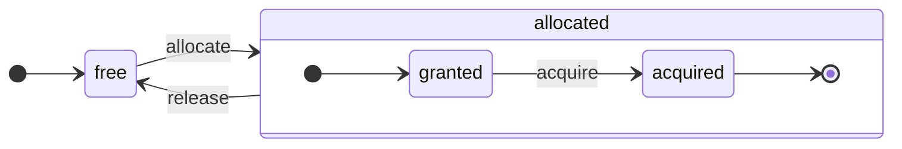

# アーキテクチャの概要

ClickHouseは真の列指向DBMSです。データはカラム単位で保存され、配列（カラムのベクトルやチャンク）を実行する際に使用されます。可能な限り、操作は個別の値ではなく配列に対して行われます。これを「ベクトル化クエリ実行」と呼び、実際のデータ処理コストを低減します。

このアイデアは新しいものではありません。1957年の`APL`（A Programming Language）やその子孫、`A +`（APL方言）、`J`（1990年）、`K`（1993年）、および`Q`（Kx Systemsのプログラミング言語、2003年）に遡ります。配列プログラミングは科学的データ処理に使用されます。このアイデアはリレーショナルデータベースにおいても新しいものではありません。たとえば、`VectorWise`システム（Actian CorporationによるActian Vector Analytic Databaseとも呼ばれます）で使用されています。

クエリ処理を加速するためのアプローチは2つあります：ベクトル化クエリ実行とランタイムコード生成です。後者はすべての間接的な操作と動的ディスパッチを排除します。これらのアプローチはどちらかが厳密に優れているわけではありません。ランタイムコード生成は多くの操作を融合する際にCPUの実行ユニットとパイプラインを完全に活用できるため、より優れている場合があります。ベクトル化クエリ実行は、キャッシュに書き込む必要がある一時的なベクトルを伴うため、実用的でないこともあります。もし一時データがL2キャッシュに収まらない場合、問題になります。しかし、ベクトル化クエリ実行はCPUのSIMD機能をより容易に利用します。[研究論文](http://15721.courses.cs.cmu.edu/spring2016/papers/p5-sompolski.pdf)では、両方のアプローチを組み合わせることが最善であると示しています。ClickHouseはベクトル化クエリ実行を使用し、ランタイムコード生成の初期サポートを限られています。

## カラム {#columns}

`IColumn`インターフェースは、メモリ内のカラム（実際にはカラムのチャンク）を表すために使用されます。このインターフェースは、さまざまなリレーショナルオペレーターの実装のためのヘルパーメソッドを提供します。ほとんどすべての操作は不変です：元のカラムを変更することなく、新しい修正されたカラムを作成します。たとえば、`IColumn :: filter`メソッドはフィルタバイトマスクを受け入れ、`WHERE`および`HAVING`リレーショナルオペレーターに使用されます。追加の例として、`ORDER BY`をサポートするための`IColumn :: permute`メソッド、`LIMIT`をサポートするための`IColumn :: cut`メソッドがあります。

さまざまな`IColumn`の実装（`ColumnUInt8`、`ColumnString`など）は、カラムのメモリレイアウトを責任を持ちます。メモリレイアウトは通常、連続した配列です。整数型のカラムの場合、一つの連続した配列、つまり`std :: vector`です。`String`と`Array`カラムの場合、すべての配列要素のための一つの連続したベクトルと、各配列の開始位置を指すオフセットのための二つ目のベクトルがあります。`ColumnConst`もあり、これは単一の値のみをメモリに保存し、カラムのように見えます。

## フィールド {#field}

とはいえ、個別の値で作業することも可能です。個別の値を表すために、`Field`が使用されます。`Field`は、`UInt64`、`Int64`、`Float64`、`String`、および`Array`の排他的なユニオンです。`IColumn`には、n番目の値を`Field`として取得するための`operator []`メソッドと、`Field`をカラムの末尾に追加する`insert`メソッドがあります。これらのメソッドは、一時的な`Field`オブジェクトを扱う必要があるため、効率的ではありません。さらに効率的なメソッドとして、`insertFrom`、`insertRangeFrom`などがあります。

`Field`は、テーブルの特定のデータ型に関する十分な情報を持っていません。たとえば、`UInt8`、`UInt16`、`UInt32`、および`UInt64`はすべて`Field`内で`UInt64`として表されます。

## 漏れた抽象 {#leaky-abstractions}

`IColumn`にはデータの一般的なリレーショナル変換のためのメソッドがありますが、すべてのニーズを満たしているわけではありません。たとえば、`ColumnUInt64`には二つのカラムの合計を計算するためのメソッドがなく、`ColumnString`には部分文字列検索を実行するためのメソッドがありません。これら無数のルーチンは、`IColumn`の外で実装されています。

カラム上のさまざまな関数は、`IColumn`メソッドを使用して`Field`値を抽出する一般的で非効率的な方法で実装されるか、特定の`IColumn`実装内のデータの内部メモリレイアウトに関する知識を使用して専門的な方法で実装されることがあります。これは、関数を特定の`IColumn`タイプにキャストし、内部表現に直接対処します。たとえば、`ColumnUInt64`には、内部配列への参照を返す`getData`メソッドがあり、次に別のルーチンがその配列を直接読み取ります。また、さまざまなルーチンの効率的な特化を許可するために「漏れた抽象」があります。

## データ型 {#data_types}

`IDataType`は、シリアル化とデシリアル化を担当します：カラムのチャンクまたは個別の値をバイナリまたはテキスト形式で読み書きします。`IDataType`は、テーブル内のデータ型に直接対応します。たとえば、`DataTypeUInt32`、`DataTypeDateTime`、`DataTypeString`などがあります。

`IDataType`と`IColumn`は、相互に緩やかに関連しています。異なるデータ型は、同じ`IColumn`実装によってメモリ内で表すことができます。たとえば、`DataTypeUInt32`と`DataTypeDateTime`は、`ColumnUInt32`または`ColumnConstUInt32`によって両方とも表されます。さらに、同じデータ型は、異なる`IColumn`実装によって表されることもあります。たとえば、`DataTypeUInt8`は、`ColumnUInt8`または`ColumnConstUInt8`で表すことができます。

`IDataType`は、メタデータのみを保存します。たとえば、`DataTypeUInt8`は何も保存せず（仮想ポインタ`vptr`を除く）、`DataTypeFixedString`は固定サイズの文字列のサイズ`N`のみを保存します。

`IDataType`には、さまざまなデータ形式のためのヘルパーメソッドがあります。例としては、値を引用符付きでシリアル化するメソッド、JSON用の値をシリアル化するメソッド、およびXML形式の一部として値をシリアル化するメソッドがあります。データ形式に直接対応するものはありません。たとえば、異なるデータ形式`Pretty`と`TabSeparated`は、`IDataType`インターフェースから同じ`serializeTextEscaped`ヘルパーメソッドを使用できます。

## ブロック {#block}

`Block`は、メモリ内のテーブルのサブセット（チャンク）を表すコンテナです。これは、`(IColumn, IDataType, カラム名)`の三つ組のセットです。クエリ実行中は、データは`Block`によって処理されます。`Block`があれば、データ（`IColumn`オブジェクト内）、その型に関する情報（`IDataType`内に保存されている）、およびカラム名があります。これは、テーブルからの元のカラム名か、計算の一時的な結果を得るために割り当てられた人工的な名前のいずれかです。

ブロック内のカラムに対して何らかの関数を計算すると、その結果を保持するために別のカラムをブロックに追加し、関数の引数としてのカラムには触れません。これは、操作が不変であるため、共通の部分式を削除するのに便利です。

ブロックは、処理されるデータの各チャンクのために作成されます。同じ計算タイプの場合、異なるブロックのカラム名と型は同じままであり、カラムデータのみが変わります。ブロックデータをブロックヘッダーから分離する方が良いです。これは、小さなブロックサイズに対して共有されたポインタやカラム名をコピーするための一時的な文字列のオーバーヘッドが高いからです。

## プロセッサ {#processors}

詳細は[https://github.com/ClickHouse/ClickHouse/blob/master/src/Processors/IProcessor.h](https://github.com/ClickHouse/ClickHouse/blob/master/src/Processors/IProcessor.h)を参照してください。

## フォーマット {#formats}

データフォーマットは、プロセッサで実装されています。

## I/O {#io}

バイト指向の入出力のために、`ReadBuffer`と`WriteBuffer`の抽象クラスがあります。これらはC++の`iostream`の代わりに使用されます。心配しないでください：すべての成熟したC++プロジェクトは、良い理由から`iostream`以外の何かを使用しています。

`ReadBuffer`と`WriteBuffer`は、連続的なバッファとそのバッファ内の位置を指すカーソルです。実装はバッファのメモリを所有する場合もそうでない場合もあります。バッファにデータを充填するための仮想メソッド（`ReadBuffer`用）や、バッファをどこかにフラッシュするためのもの（`WriteBuffer`用）があります。仮想メソッドは滅多に呼び出されません。

`ReadBuffer` / `WriteBuffer`の実装は、ファイルやファイル記述子、ネットワークソケットとの作業、圧縮の実装（`CompressedWriteBuffer`は別のWriteBufferで初期化され、データを書く前に圧縮を行います）、およびその他の目的のために使用されます。`ConcatReadBuffer`、`LimitReadBuffer`、および`HashingWriteBuffer`という名前は、それ自身を説明しています。

Read/WriteBuffersは、バイトのみを扱います。さまざまな入力/出力をフォーマットするための`ReadHelpers`および`WriteHelpers`ヘッダーファイルからの関数もあります。たとえば、数値を10進数形式で書き込むためのヘルパーがあります。

`JSON`形式で結果セットを標準出力に書き込もうとするとどうなるかを見てみましょう。プル型の`QueryPipeline`から取得する準備が整った結果セットがあります。まず、`WriteBufferFromFileDescriptor(STDOUT_FILENO)`を作成して、バイトを標準出力に書き込みます。次に、クエリパイプラインの結果を`JSONRowOutputFormat`に接続します。この`JSONRowOutputFormat`は、その`WriteBuffer`で初期化され、標準出力にJSON形式で行を書き込みます。これは、クエリパイプラインを完了する`complete`メソッドを通じて行えます。このメソッドは、プル型の`QueryPipeline`を完了した`QueryPipeline`に変換します。内部的に、`JSONRowOutputFormat`はさまざまなJSONデリミタを出力し、`IDataType::serializeTextJSON`メソッドを`IColumn`への参照と行番号を引数として呼び出します。その結果、`IDataType::serializeTextJSON`は、たとえば数値型用の`writeText`や`DataTypeString`用の`writeJSONString`などを含む`WriteHelpers.h`のメソッドを呼び出します。

## テーブル {#tables}

`IStorage`インターフェースはテーブルを表します。このインターフェースのさまざまな実装は、異なるテーブルエンジンです。例として、`StorageMergeTree`、`StorageMemory`などがあります。これらのクラスのインスタンスは単にテーブルです。

`IStorage`の主要なメソッドは`read`と`write`ですが、その他にも`alter`、`rename`、`drop`などがあります。`read`メソッドは、以下の引数を受け取ります：テーブルから読み取るカラムのセット、考慮すべき`AST`クエリ、および希望するストリーム数。それは`Pipe`を返します。

ほとんどの場合、読み取りメソッドは、テーブルから指定されたカラムを読み取ることのみを責任とし、他のデータ処理は行いません。すべての後続のデータ処理は、パイプラインの別の部分で処理され、`IStorage`の責任外です。

しかし、注目すべき例外もあります：

- ASTクエリが`read`メソッドに渡され、テーブルエンジンはこれを使用してインデックスの使用を導き、より少ないデータをテーブルから読み取ることができます。
- 時にはテーブルエンジン自体がデータを特定の段階まで処理できます。たとえば、`StorageDistributed`は、リモートサーバーにクエリを送り、データを異なるリモートサーバーからマージできる段階まで処理するように要求し、その前処理済みデータを返すことができます。クエリインタープリターはその後データの処理を完了します。

テーブルの`read`メソッドは、複数の`Processors`で構成される`Pipe`を返すことがあります。これらの`Processors`はテーブルから並行して読み取ることができます。そして、これらのプロセッサをさまざまな他の変換（たとえば、式の評価やフィルタリングなど）に接続できます。これらは独立して計算可能です。その後、彼らの上に`QueryPipeline`を作成し、それを`PipelineExecutor`を介して実行します。

また、`TableFunction`もあります。これは、一時的な`IStorage`オブジェクトをクエリの`FROM`句で使用するために返す関数です。

テーブルエンジンの実装方法を簡潔に理解するには、`StorageMemory`や`StorageTinyLog`のようなシンプルなものを見てみてください。

> `read`メソッドの結果として、`IStorage`は`QueryProcessingStage`を返します – これは、ストレージ内で既に計算されたクエリの部分に関する情報です。

## パーサ {#parsers}

手書きの再帰降下パーサがクエリを解析します。たとえば、`ParserSelectQuery`は、クエリのさまざまな部分のために底層のパーサを再帰的に呼び出します。パーサは`AST`を生成します。`AST`は、`IAST`のインスタンスであるノードによって表されます。

> パーサジェネレーターは歴史的な理由から使用されていません。

## インタープリター {#interpreters}

インタープリターは、ASTからクエリ実行パイプラインを作成する責任があります。`InterpreterExistsQuery`や`InterpreterDropQuery`のような単純なインタープリターや、より複雑な`InterpreterSelectQuery`があります。

クエリ実行パイプラインは、チャンク（特定の型のカラムのセット）を消費し生産することができるプロセッサの組み合わせです。プロセッサはポートを介して通信し、複数の入力ポートと出力ポートを持つことができます。詳細な説明は[src/Processors/IProcessor.h](https://github.com/ClickHouse/ClickHouse/blob/master/src/Processors/IProcessor.h)で確認できます。

たとえば、`SELECT`クエリを解釈した結果は、結果セットを読み込むための特別な出力ポートを持つ「プル型」`QueryPipeline`です。`INSERT`クエリの結果は、挿入のためのデータを書き込む入力ポートを持つ「プッシュ型」`QueryPipeline`です。そして、`INSERT SELECT`クエリを解釈した結果は、入力または出力がなく、同時に`SELECT`から`INSERT`にデータをコピーする「完了型」`QueryPipeline`です。

`InterpreterSelectQuery`は、クエリの分析と変換のために`ExpressionAnalyzer`と`ExpressionActions`の機構を利用します。ここで、ほとんどのルールベースのクエリ最適化が行われます。`ExpressionAnalyzer`は非常に複雑であり、再書きが必要です：さまざまなクエリの変形と最適化を別のクラスに抽出することで、クエリのモジュール化された変換を可能にするべきです。

インタープリターに存在する問題に対処するために、新しい`InterpreterSelectQueryAnalyzer`が開発されました。これは、`ExpressionAnalyzer`を使用せず、`AST`と`QueryPipeline`の間に`QueryTree`と呼ばれる追加の抽象レイヤーを導入した`InterpreterSelectQuery`の新しいバージョンです。これは本番使用に完全に準備が整っていますが、念のために`enable_analyzer`設定を`false`に設定することでオフにすることができます。

## 関数 {#functions}

通常の関数と集約関数があります。集約関数については、次のセクションを参照してください。

通常の関数は行数を変更せず – 各行を独立して処理しているかのように機能します。実際、関数は個々の行に対して呼び出されるのではなく、データの`Block`に対して呼び出され、ベクトル化クエリ実行を実装します。

いくつかの雑多な関数、たとえば、[blockSize](../sql-reference/functions/other-functions.md#blocksize-function-blocksize)、[rowNumberInBlock](../sql-reference/functions/other-functions.md#rownumberinblock-function-rownumberinblock)、および[runningAccumulate](../sql-reference/functions/other-functions.md#runningaccumulate-runningaccumulate)があり、これらはブロック処理を利用し、行の独立性を損ないます。

ClickHouseは強い型付けを持っているため、暗黙の型変換はありません。関数が特定の型の組み合わせをサポートしていない場合、例外がスローされます。しかし、関数は多くの異なる型の組み合わせに対応することができます（オーバーロードが可能です）。たとえば、`plus`関数（`+`演算子を実装するため）は、任意の数値型の組み合わせで機能します：`UInt8` + `Float32`、`UInt16` + `Int8`など。さらに、いくつかの可変長引数の関数は、任意の数の引数を受け入れます。たとえば、`concat`関数です。

関数の実装は、サポートされているデータ型と`IColumns`を明示的にディスパッチするため、少し不便かもしれません。たとえば、`plus`関数には、数値型および定数または非定数の左辺と右辺の引数の各組み合わせのために、C++テンプレートをインスタンス化して生成されたコードがあります。

これは、テンプレートコードの膨張を避けるためにランタイムコード生成を実装するのに素晴らしい場所です。また、融合関数（たとえば、融合掛け加算や単一のループ反復で複数の比較を行うこと）を追加することも可能にします。

ベクトル化クエリ実行により、関数は短絡されません。たとえば、`WHERE f(x) AND g(y)`と書くと、両側が計算されます。`f(x)`がゼロであっても（ただし、`f(x)`がゼロ定数式の場合を除き）。しかし、`f(x)`条件の選択性が高く、`f(x)`の計算が`g(y)`よりもはるかに安価であれば、マルチパス計算の実装が望ましいです。最初に`f(x)`を計算し、次にその結果でカラムをフィルタリングし、`g(y)`をフィルタされた小さなデータチャンクに対してのみ計算します。

## 集約関数 {#aggregate-functions}

集約関数は状態を持つ関数です。渡された値をいくつかの状態に累積し、その状態から結果を取得することを許可します。これらは`IAggregateFunction`インターフェースで管理されます。状態は非常に単純な場合もあれば（`AggregateFunctionCount`の状態は単一の`UInt64`値です）、非常に複雑な場合もあります（`AggregateFunctionUniqCombined`の状態は、線形配列、ハッシュテーブル、および確率的データ構造である`HyperLogLog`の組み合わせです）。

状態は`Arena`（メモリプール）に割り当てられ、高いカーディナリティの`GROUP BY`クエリを実行している間に複数の状態に対処します。状態には非トリビアルなコンストラクタとデストラクタがある場合があります。たとえば、複雑な集約状態は、追加のメモリを自ら割り当てることがあります。状態の作成と破壊、所有権と破壊順序の適切な引き渡しに注意が必要です。

集約状態は、分散クエリ実行中にネットワークを介して渡すために、またはRAMが不足しているディスクに書き込むためにシリアル化およびデシリアル化されることがあります。彼らは`DataTypeAggregateFunction`を持つテーブルに保存され、データの逐次集約を可能にします。

> 集約関数の状態のシリアル化データ形式は現在バージョン管理されていません。集約状態が一時的に保存されるだけで問題ありません。しかし、我々は逐次集約のための`AggregatingMergeTree`テーブルエンジンを持っており、人々はすでに本番環境で使用しています。これが、今後の集約関数のシリアル化形式を変更する際に後方互換性が必要な理由です。

## サーバー {#server}

サーバーは、いくつかの異なるインターフェースを実装しています：

- 外部クライアント用のHTTPインターフェース。
- ネイティブClickHouseクライアントや、分散クエリ実行中のサーバー間通信用のTCPインターフェース。
- レプリケーションのためのデータ転送用インターフェース。

内部的には、これはコルーチンやファイバーのない単純なマルチスレッドサーバーです。サーバーは高い率の単純なクエリを処理するためではなく、相対的に低い率の複雑なクエリを処理するように設計されているため、各クエリは分析のために膨大な量のデータを処理できます。

サーバーは、クエリ実行に必要な環境である`Context`クラスを初期化します：利用可能なデータベース、ユーザーおよびアクセス権のリスト、設定、クラスター、プロセスリスト、クエリログなど。インタープリターはこの環境を使用します。

サーバーTCPプロトコルについては、完全な前方および後方互換性を維持しています：旧クライアントは新しいサーバーと通信でき、新しいクライアントは古いサーバーと通信できます。しかし、永遠にそれを維持することは望んでおらず、約1年後に古いバージョンのサポートを削除しています。

:::note
ほとんどの外部アプリケーションには、シンプルで使いやすいためHTTPインターフェースの使用を推奨します。TCPプロトコルは内部データ構造により密接に結びついています：データのブロックを渡すための内部フォーマットを使用し、圧縮データのカスタムフレーミングを使用します。このプロトコルのためのCライブラリはリリースされていません。なぜなら、ClickHouseのコードベースのほとんどをリンクする必要があり、これは実用的ではありませんからです。
:::

## 設定 {#configuration}

ClickHouse ServerはPOCO C++ Librariesを基にしており、その設定を表すために`Poco::Util::AbstractConfiguration`を使用します。設定は、`DaemonBase`クラスから継承された`Poco::Util::ServerApplication`クラスによって保持され、これにより、実際にclickhouse-serverを実装する`DB::Server`クラスが継承されます。したがって、設定は`ServerApplication::config()`メソッドを介してアクセスできます。

設定は複数のファイル（XMLまたはYAMLフォーマット）から読み取られ、`ConfigProcessor`クラスによって単一の`AbstractConfiguration`にマージされます。設定はサーバーの起動時にロードされ、その後、設定ファイルのいずれかが更新、削除、または追加されると再ロードが可能です。`ConfigReloader`クラスは、これらの変更を定期的に監視し、再ロード手順も担当しています。`SYSTEM RELOAD CONFIG`クエリも設定の再ロードをトリガーします。

サーバー設定以外のクエリやサブシステムでは、`Context::getConfigRef()`メソッドを使用して設定にアクセス可能です。サーバー再起動なしに設定を再ロードできるサブシステムは、`Server::main()`メソッドの再ロードコールバックに自らを登録する必要があります。新しい設定にエラーがあると、ほとんどのサブシステムは新しい構成を無視し、警告メッセージをログに記録し、以前に読み込まれた設定で作業を続けます。`AbstractConfiguration`の性質上、特定のセクションへの参照を渡すことはできません。したがって、通常は`String config_prefix`が使用されます。

## スレッドとジョブ {#threads-and-jobs}

クエリを実行し、サイドアクティビティを行うために、ClickHouseはスレッドプールからスレッドを割り当てて、頻繁なスレッドの作成と破棄を回避します。いくつかのスレッドプールがあり、目的やジョブの構造に応じて選択されます：
  * クライアントセッション用のサーバープール。
  * 一般的なジョブ、バックグラウンドアクティビティ、およびスタンドアロンスレッド用のグローバルスレッドプール。
  * 主要にIOブロックで行われるジョブ用のIOスレッドプール。
  * 定期的なタスクのためのバックグラウンドプール。
  * ステップに分割可能なプリエンプタブルタスク用のプール。

サーバープールは、`Server::main()`メソッドで定義された`Poco::ThreadPool`クラスのインスタンスです。最大で`max_connection`スレッドを持つことができます。各スレッドは単一のアクティブ接続に専念します。

グローバルスレッドプールは`GlobalThreadPool`シングルトンクラスです。そこからスレッドを割り当てるには、`ThreadFromGlobalPool`を使用します。これは`std::thread`に似たインターフェースを持っていますが、グローバルプールからスレッドを引き出し、必要な初期化を行います。次の設定で構成されます：
  * `max_thread_pool_size` - プール内のスレッド数の制限。
  * `max_thread_pool_free_size` - 新しいジョブを待っているアイドルスレッド数の制限。
  * `thread_pool_queue_size` - 予定されたジョブ数の制限。

グローバルプールは汎用であり、以下に説明するすべてのプールはそれに基づいて実装されています。これはプールの階層と考えることができます。専門プールは、`ThreadPool`クラスを使用してグローバルプールからそのスレッドを取り出します。したがって、専門プールの主な目的は、同時ジョブの数の制限を適用し、ジョブをスケジューリングすることです。プール内のスレッドよりも多くのジョブがスケジュールされると、`ThreadPool`は優先順位付きのキューにジョブを蓄積します。各ジョブには整数優先順位があります。デフォルトの優先順位はゼロです。優先順位値の高いすべてのジョブは、優先順位値の低いジョブの前に開始されます。しかし、既に実行中のジョブには違いがないため、優先順位はプールがオーバーロードされている場合のみ重要です。

IOスレッドプールは、`IOThreadPool::get()`メソッドを介してアクセス可能な通常の`ThreadPool`として実装されています。これはグローバルプールと同様に、`max_io_thread_pool_size`、`max_io_thread_pool_free_size`、および`io_thread_pool_queue_size`の設定に基づいて構成されます。IOスレッドプールの主な目的は、IOタスクがグローバルプールを枯渇させないようにすることで、クエリがCPUを完全に利用できることを防ぐことです。S3へのバックアップはかなりの量のIO操作を行うため、対話型クエリへの影響を避けるために、`max_backups_io_thread_pool_size`、`max_backups_io_thread_pool_free_size`、および`backups_io_thread_pool_queue_size`の設定が構成された別の`BackupsIOThreadPool`があります。

定期的なタスク実行のために、`BackgroundSchedulePool`クラスがあります。タスクを`BackgroundSchedulePool::TaskHolder`オブジェクトを使用して登録すると、プールは同時に2つのジョブが実行されないようにします。また、タスクの実行を未来の特定の瞬間に延期するか、一時的にタスクを無効にすることもできます。グローバル`Context`は、異なる目的のためにこのクラスのいくつかのインスタンスを提供します。一般的な目的のタスクには、`Context::getSchedulePool()`が使用されます。

プリエンプタブルタスクのための専門的なスレッドプールもあります。このような`IExecutableTask`タスクは、ステップと呼ばれる順序付けられたジョブの連続に分割できます。これらのタスクを短いタスクに優先順位を付けてスケジュールするには、`MergeTreeBackgroundExecutor`が使用されます。その名前が示すように、これはマージ、ミューテーション、フェッチ、移動などのバックグラウンドMergeTree関連操作に使用されます。プールインスタンスは、`Context::getCommonExecutor()`およびその他の類似のメソッドを使用してアクセス可能です。

ジョブに使用されるプールにかかわらず、開始時にそのジョブのための`ThreadStatus`インスタンスが作成されます。これは、スレッド関連の情報（スレッドID、クエリID、パフォーマンスカウンター、リソース消費、およびその他の有用なデータ）をカプセル化します。ジョブは、`CurrentThread::get()`呼び出しによってスレッドローカルポインタを介してこれにアクセスできますので、それをすべての関数に渡す必要はありません。

スレッドがクエリ実行に関連している場合、`ThreadStatus`に付随する最も重要なものは、クエリコンテキストの`ContextPtr`です。各クエリには、サーバープール内にそのマスタースレッドがあります。マスタースレッドは、`ThreadStatus::QueryScope query_scope(query_context)`オブジェクトを保持することによってアタッチを行います。マスタースレッドはまた、`ThreadGroupStatus`オブジェクトで表されるスレッドグループを作成します。このクエリの実行中に割り当てられた追加の各スレッドは、`CurrentThread::attachTo(thread_group)`呼び出しによってそのスレッドグループにアタッチされます。スレッドグループは、プロファイルイベントカウンターを集約し、単一のタスクに専念するすべてのスレッドによるメモリ消費を追跡するために使用されます（詳細は`MemoryTracker`と`ProfileEvents::Counters`クラスを参照してください）。

## 同時制御 {#concurrency-control}

並列化できるクエリは、`max_threads`設定を使用して自らを制限します。この設定のデフォルト値は、単一のクエリがCPUコアを最適に利用できるように選択されています。しかし、同時に複数のクエリがあり、それぞれがデフォルトの`max_threads`設定値を使用する場合、クエリはCPUリソースを共有することになります。OSはスレッドを常に切り替えることで、公平性を保証しますが、これにはパフォーマンスのペナルティが生じます。`ConcurrencyControl`は、このペナルティに対処し、多くのスレッドを割り当てることを避けるのに役立ちます。設定値`concurrent_threads_soft_limit_num`は、ある程度のCPU圧力を適用する前に、同時に割り当てられるスレッドの数を制限するために使用されます。

:::note
`concurrent_threads_soft_limit_num`と`concurrent_threads_soft_limit_ratio_to_cores`は、デフォルトで無効（0に等しい）です。この機能を使用する前に有効にする必要があります。
:::

CPU `slot`の概念が導入されています。スロットは同時処理の単位です：スレッドを実行するには、クエリが事前にスロットを取得し、スレッドが停止するとそれを解放しなければなりません。スロットの数はサーバー内で全体的に制限されています。全体的な需要がスロットの総数を超過する場合、複数の同時クエリがCPUスロットを競争します。`ConcurrencyControl`は、この競争を解決し、CPUスロットのスケジュールを公平に行う責任があります。

各スロットは、次の状態を持つ独立した状態機械として見ることができます：
 * `free`：スロットは任意のクエリによって割り当て可能です。
 * `granted`：スロットは特定のクエリによって「割り当てられた」状態ですが、まだ任意のスレッドによって取得されていません。
 * `acquired`：スロットは特定のクエリによって「割り当てられた」状態で、スレッドによって取得されています。

ここで注意すべきことは、`allocated`スロットが`granted`と`acquired`の二つの異なる状態になる可能性があることです。前者は遷移状態であり、実際には短いべきです（スロットがクエリに割り当てられた瞬間から、そのクエリの任意のスレッドによってスケールアップの手続きが実行されるまでの瞬間まで）。

`ConcurrencyControl`のAPIは、以下の関数で構成されています：
1. クエリのためのリソース割り当てを作成：`auto slots = ConcurrencyControl::instance().allocate(1, max_threads);`。これは、少なくとも1、最大で`max_threads`スロットを割り当てます。最初のスロットはすぐに付与されますが、残りのスロットは後で付与される場合があります。このため、制限はソフトです。すべてのクエリは少なくとも1つのスレッドを取得します。
2. 各スレッドは、割り当てられたスロットを取得する必要があります：`while (auto slot = slots->tryAcquire()) spawnThread([slot = std::move(slot)] { ... });`。
3. スロットの総数を更新する：`ConcurrencyControl::setMaxConcurrency(concurrent_threads_soft_limit_num)`。サーバーの再起動なしに実行できます。

このAPIは、CPU圧力がある場合に少なくとも1つのスレッドでクエリを開始し、後で`max_threads`までスケールアップできるようにします。

## 分散クエリ実行 {#distributed-query-execution}

クラスタ設定のサーバーはほとんど独立しています。クラスタ内の1つまたはすべてのサーバーに`Distributed`テーブルを作成できます。`Distributed`テーブルはデータ自体を保存せず、単にクラスタ内の複数のノードのすべてのローカルテーブルへの「ビュー」を提供します。`Distributed`テーブルから`SELECT`を実行すると、そのクエリを再構成し、ロードバランシング設定に応じてリモートノードを選択し、クエリを送信します。`Distributed`テーブルは、異なるサーバーからの中間結果をマージできる段階までクエリをリモートサーバーに処理するよう要求します。その後、中間結果を受け取り、それらをマージします。分散テーブルは、可能な限り多くの作業をリモートサーバーに分配し、ネットワーク上で多くの中間データを送信しません。

サブクエリがINまたはJOIN句にある場合、状況はさらに複雑になります。それぞれが`Distributed`テーブルを使用します。これらのクエリの実行に関しては、異なる戦略があります。

分散クエリ実行にグローバルなクエリプランはありません。各ノードはそのジョブの一部に対してローカルなクエリプランを持っています。我々は、リモートノードにクエリを送信し、結果をマージするという単純な一回パスの分散クエリ実行しか行いません。しかし、高いカーディナリティの `GROUP BY` や大量の一時データを伴うJOINを含む複雑なクエリに対してはこれは実行できません。そのような場合、サーバー間でデータの「再シャッフル」を行う必要があり、追加の調整が必要です。ClickHouseはその種のクエリ実行をサポートしておらず、今後の改善が必要です。

## Merge Tree {#merge-tree}

`MergeTree` は、主キーによるインデックスをサポートするストレージエンジンのファミリーです。主キーは任意のカラムや式の組み合わせで構成できます。`MergeTree` テーブルのデータは「パーツ」に保存され、各パートは主キー順にデータを保存します。そのため、データは主キーのタプルによって辞書式に整列されます。テーブルのすべてのカラムは、これらのパーツ内の個別の `column.bin` ファイルに保存されます。ファイルは圧縮されたブロックから構成されます。各ブロックは通常、平均値のサイズに応じて64 KBから1 MBの非圧縮データを含みます。ブロックは列の値が連続して配置され、各カラムは同じ順序で配置されています（主キーが順序を定義します）。したがって、複数のカラムを反復処理すると、対応する行の値を取得できます。

主キー自体は「スパース」です。すべての行を指定するのではなく、特定のデータ範囲のみを指します。別の `primary.idx` ファイルには、N 番目の行ごとの主キーの値が記録されており、N は `index_granularity`（通常、N = 8192）と呼ばれます。また、各カラムに対して、データファイル内の各N番目の行へのオフセットを示す「マーク」を含む `column.mrk` ファイルも存在します。各マークは、圧縮ブロックの先頭へのオフセットと、非圧縮ブロック内のデータの先頭へのオフセットのペアです。通常、圧縮ブロックはマークで整列されており、非圧縮ブロック内のオフセットはゼロです。`primary.idx` のデータは常にメモリに存在し、`column.mrk` ファイルのデータはキャッシュされます。

`MergeTree` のパートから何かを読み取る際、我々は `primary.idx` データを確認し、リクエストされたデータを含む可能性のある範囲を特定し、その後 `column.mrk` データを確認して、これらの範囲の読み取りを開始するオフセットを計算します。スパース性のため、余分なデータが読み取られることがあります。ClickHouseは、各キーごとに `index_granularity` 行全体を読み取る必要があり、各カラムごとに全圧縮ブロックを展開しなければならないため、高負荷の単純なポイントクエリには適していません。インデックスのメモリ消費が目立たないように、我々はトリリオン行を単一のサーバーで維持できる必要があるため、インデックスをスパースにしました。また、主キーがスパースであるため、ユニークではなく、INSERT 時にテーブルにキーが存在するかどうかを確認できません。同じキーを持つ多くの行がテーブルに存在することがあります。

`MergeTree` に大量のデータを `INSERT` すると、そのデータは主キー順にソートされ、新しいパートを形成します。バックグラウンドスレッドは定期的にいくつかのパーツを選択し、それらを単一のソートされたパートにマージして、パーツの数を比較的少なく保つ役割を果たします。これが `MergeTree` と呼ばれる所以です。もちろん、マージは「書き込み増幅」を引き起こします。すべてのパーツは不変であり、作成されることはあっても変更されることはありません。SELECT が実行されると、テーブルのスナップショット（パーツのセット）を保持します。マージ後も、障害の後の回復を容易にするために、古いパーツは一定の時間保持され、マージされたパートが壊れている可能性がある場合は、それを元のパーツで置き換えることができます。

`MergeTree` は LSM ツリーではありません。なぜなら、MEMTABLE と LOG を含まず、挿入されたデータは直接ファイルシステムに書き込まれるからです。この動作により、MergeTree はバッチでのデータ挿入に非常に適しています。したがって、小さな行を頻繁に挿入することは MergeTree にとって理想的ではありません。たとえば、1秒あたり数行の挿入は問題ありませんが、1秒あたり1000回の挿入は最適ではありません。しかし、小規模な挿入に対応するための非同期挿入モードがあります。この方法を採用したのは、単純さのためであり、我々はすでにアプリケーションでバッチでデータを挿入しているからです。

バックグラウンドマージ中に追加の作業を行う MergeTree エンジンもあります。例えば、`CollapsingMergeTree` や `AggregatingMergeTree` です。これらは更新の特別なサポートとして扱うことができます。ただし、これらは実際の更新ではなく、ユーザーはバックグラウンドマージが実行されるタイミングを通常コントロールできないため、`MergeTree` テーブル内のデータはほぼ常に複数のパーツに保存されており、完全にマージされた形ではありません。

## レプリケーション {#replication}

ClickHouse におけるレプリケーションは、テーブルごとに設定できます。同じサーバーに replicated テーブルと non-replicated テーブルを持つことができます。また、2ファクターレプリケーションのテーブルと3ファクターレプリケーションのテーブルのように、異なる方法でレプリケーションされたテーブルを持つこともできます。

レプリケーションは `ReplicatedMergeTree` ストレージエンジンで実装されています。ストレージエンジンのパラメータとして `ZooKeeper` 内のパスが指定されます。同じ `ZooKeeper` のパスを持つすべてのテーブルは互いのレプリカとなり、データを同期させ、一貫性を維持します。レプリカは、テーブルを作成したり削除したりすることで動的に追加または削除できます。

レプリケーションは非同期のマルチマスター方式で実行されます。`ZooKeeper` とのセッションを持つ任意のレプリカにデータを挿入でき、データは非同期で他のすべてのレプリカにレプリケートされます。ClickHouse は UPDATE をサポートしていないため、レプリケーションは衝突がありません。デフォルトでは挿入に対する過半数の承認がないため、一つのノードが失敗した場合、新しく挿入されたデータが失われる可能性があります。挿入の過半数は `insert_quorum` 設定を使用して有効にできます。

レプリケーションのメタデータは ZooKeeper に保存されています。どのようなアクションを実行するかを記録したレプリケーションログがあります。アクションには、パートを取得、パーツをマージ、パーティションをドロップなどがあります。各レプリカはレプリケーションログを自分のキューにコピーし、その後キューからアクションを実行します。たとえば、挿入時には「パートを取得する」アクションがログに作成され、各レプリカがそのパートをダウンロードします。マージは、バイト単位で同一な結果を得るためにレプリカ間で調整されます。すべてのパーツはすべてのレプリカで同じ方法でマージされます。リーダーの一つが最初に新しいマージを開始し、「パーツをマージする」アクションをログに書き込みます。複数のレプリカ（またはすべて）が同時にリーダーになることができます。レプリカがリーダーになることを防ぐには、`merge_tree` 設定の `replicated_can_become_leader` を使用します。リーダーはバックグラウンドマージのスケジューリングを担当します。

レプリケーションは物理的です：ノード間でクエリではなく圧縮されたパーツのみが転送されます。マージは、ネットワーク増幅を避けるため、多くの場合、各レプリカで独立して処理されます。大きなマージパーツは、重要なレプリケーション遅延がある場合にのみネットワークを介して送信されます。

さらに、各レプリカは自身のパーツのセットとチェックサムをZooKeeperに状態として保存します。ローカルファイルシステムの状態がZooKeeperの参照状態から逸脱した場合、レプリカは不足した部分や壊れた部分を他のレプリカからダウンロードすることで整合性を回復します。ローカルファイルシステムに予期しないまたは壊れたデータがある場合、ClickHouseはそれを削除するのではなく、別のディレクトリに移動して忘れます。

:::note
ClickHouseクラスタは独立したシャードで構成されており、各シャードはレプリカで構成されています。クラスタは**エラスティックではありません**。したがって、新しいシャードが追加された場合でも、データは自動的にシャード間で再バランスされません。代わりに、クラスタの負荷は不均一に調整されることを想定しています。この実装は、比較的小規模なクラスタ（数十のノードなど）に対する制御を向上させます。しかし、我々が本番環境で使用している数百のノードを持つクラスタにとって、このアプローチは大きな欠点となります。我々は、動的にレプリケートされた領域を跨ぎ、自動的にクラスタ間で分割およびバランスが取られるテーブルエンジンを実装する必要があります。
:::
