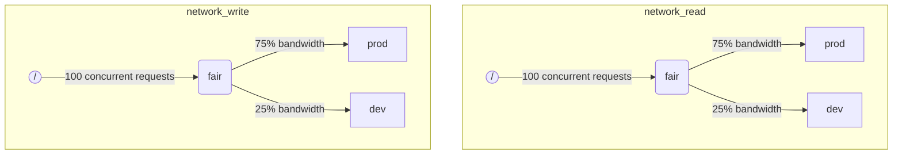

ClickHouseが複数のクエリを同時に実行すると、それらが共有リソース（例：ディスク）を使用する可能性があります。スケジューリング制約とポリシーを適用して、リソースの利用方法と異なるワークロード間での共有を調整できます。各リソースについてスケジューリング階層を構成できます。階層のルートはリソースを表し、葉はリソース容量を超えるリクエストを保持するキューです。

:::note
現在、リモートディスクのIOのみが上記の方法でスケジューリングできます。CPUスケジューリングについては、スレッドプールに関する設定と [`concurrent_threads_soft_limit_num`](server-configuration-parameters/settings.md#concurrent_threads_soft_limit_num)を参照してください。柔軟なメモリ制限については、[Memory overcommit](settings/memory-overcommit.md)を参照してください。
:::

## ディスク設定 {#disk-config}

特定のディスクのIOスケジューリングを有効にするには、ストレージ設定で `read_resource` と/または `write_resource` を指定する必要があります。これにより、ClickHouseは指定されたディスクに対してどのリソースを使用すべきかを決定します。読み取りリソースと書き込みリソースは、ローカルSSDやHDDに便利な同じリソース名を参照することができます。複数の違うディスクも同じリソースを参照でき、例として「本番」と「開発」ワークロード間でのネットワーク帯域幅の公平な分配を可能にします。

例:
```xml
<clickhouse>
    <storage_configuration>
        ...
        <disks>
            <s3>
                <type>s3</type>
                <endpoint>https://clickhouse-public-datasets.s3.amazonaws.com/my-bucket/root-path/</endpoint>
                <access_key_id>your_access_key_id</access_key_id>
                <secret_access_key>your_secret_access_key</secret_access_key>
                <read_resource>network_read</read_resource>
                <write_resource>network_write</write_resource>
            </s3>
        </disks>
        <policies>
            <s3_main>
                <volumes>
                    <main>
                        <disk>s3</disk>
                    </main>
                </volumes>
            </s3_main>
        </policies>
    </storage_configuration>
</clickhouse>
```

リソースがどのディスクによって使用されるかを表現する別の方法はSQL構文です：

```sql
CREATE RESOURCE resource_name (WRITE DISK disk1, READ DISK disk2)
```

リソースは、READまたはWRITE、または両方のために任意の数のディスクに使用できます。すべてのディスクに対してリソースを使用するための構文もあります：

```sql
CREATE RESOURCE all_io (READ ANY DISK, WRITE ANY DISK);
```

サーバー設定オプションは、リソースを定義するSQL方法よりも優先されることに注意してください。

## ワークロードマークアップ {#workload_markup}

クエリは、異なるワークロードを区別するために `workload` を設定することでマークできます。 `workload` が設定されていない場合、値「default」が使用されます。他の値を指定することも、設定プロファイルを使用して可能です。すべてのユーザーからのクエリを固定の `workload` 設定値でマークしたい場合、制約を設定して `workload` を定数にすることができます。

バックグラウンド活動のための `workload` 設定を割り当てることも可能です。マージとミューテーションは、それぞれ `merge_workload` と `mutation_workload` サーバー設定を使用します。これらの値は、特定のテーブルのために `merge_workload` と `mutation_workload` マージツリー設定で上書きすることもできます。

「本番」と「開発」の2つの異なるワークロードを持つシステムの例を考えてみましょう。

```sql
SELECT count() FROM my_table WHERE value = 42 SETTINGS workload = 'production'
SELECT count() FROM my_table WHERE value = 13 SETTINGS workload = 'development'
```

## リソーススケジューリング階層 {#hierarchy}

スケジューリングサブシステムの観点から、リソースはスケジューリングノードの階層を表します。



**可能なノードタイプ：**
* `inflight_limit` (制約) - 現在の同時実行リクエスト数が `max_requests` を超えるか、総コストが `max_cost` を超える場合にブロックされます。単一の子を持つ必要があります。
* `bandwidth_limit` (制約) - 現在の帯域幅が `max_speed` (0は無制限)を超えるか、バーストが `max_burst` (デフォルトでは `max_speed` に等しい)を超える場合にブロックされます。単一の子を持つ必要があります。
* `fair` (ポリシー) - 最大最小公平性に従って、その子ノードの中から次のリクエストを選択します。子ノードは `weight` (デフォルトは1)を指定できます。
* `priority` (ポリシー) - 静的優先度に基づいてその子ノードの中から次のリクエストを選択します（値が低いほど優先度が高い）。子ノードは `priority` (デフォルトは0)を指定できます。
* `fifo` (キュー) - リソース容量を超えるリクエストを保持できる階層の葉です。

基盤となるリソースのフルキャパシティを利用するには、`inflight_limit` を使用する必要があります。 `max_requests` または `max_cost` の数が少ないとリソースの利用が不完全になる可能性がありますが、数が多すぎるとスケジューラー内で空のキューが発生し、その結果としてサブツリー内でポリシーが無視されることになります（不公平または優先度の無視）。一方、リソースを高い利用から保護したい場合は `bandwidth_limit` を使用するべきです。これは、`duration` 秒以内に消費されたリソースの量が `max_burst + max_speed * duration` バイトを超えると制限します。同じリソースの2つの `bandwidth_limit` ノードを使用して、短い間隔でのピーク帯域幅と長い間隔での平均帯域幅を制限できます。

以下の例は、画像に示されたIOスケジューリング階層を定義する方法を示しています：

```xml
<clickhouse>
    <resources>
        <network_read>
            <node path="/">
                <type>inflight_limit</type>
                <max_requests>100</max_requests>
            </node>
            <node path="/fair">
                <type>fair</type>
            </node>
            <node path="/fair/prod">
                <type>fifo</type>
                <weight>3</weight>
            </node>
            <node path="/fair/dev">
                <type>fifo</type>
            </node>
        </network_read>
        <network_write>
            <node path="/">
                <type>inflight_limit</type>
                <max_requests>100</max_requests>
            </node>
            <node path="/fair">
                <type>fair</type>
            </node>
            <node path="/fair/prod">
                <type>fifo</type>
                <weight>3</weight>
            </node>
            <node path="/fair/dev">
                <type>fifo</type>
            </node>
        </network_write>
    </resources>
</clickhouse>
```

## ワークロード分類子 {#workload_classifiers}

ワークロード分類子は、クエリによって指定された `workload` を、特定のリソースのために使用すべき葉キューにマッピングするために使用されます。現在、ワークロード分類はシンプルであり、静的マッピングのみが利用可能です。

例:
```xml
<clickhouse>
    <workload_classifiers>
        <production>
            <network_read>/fair/prod</network_read>
            <network_write>/fair/prod</network_write>
        </production>
        <development>
            <network_read>/fair/dev</network_read>
            <network_write>/fair/dev</network_write>
        </development>
        <default>
            <network_read>/fair/dev</network_read>
            <network_write>/fair/dev</network_write>
        </default>
    </workload_classifiers>
</clickhouse>
```

## ワークロード階層（SQLのみ） {#workloads}

リソースや分類子をXMLで定義することは難しい場合があります。ClickHouseは、はるかに便利なSQL構文を提供します。 `CREATE RESOURCE` で作成されたすべてのリソースは同じ階層構造を共有しますが、いくつかの点で異なる場合があります。 `CREATE WORKLOAD` で作成された各ワークロードは、各リソースのために自動的に作成されたスケジューリングノードをいくつか維持します。子ワークロードは、別の親ワークロード内に作成できます。以下は、上記のXML設定とまったく同じ階層を定義する例です：

```sql
CREATE RESOURCE network_write (WRITE DISK s3)
CREATE RESOURCE network_read (READ DISK s3)
CREATE WORKLOAD all SETTINGS max_requests = 100
CREATE WORKLOAD development IN all
CREATE WORKLOAD production IN all SETTINGS weight = 3
```

子を持たない葉のワークロードの名前は、クエリ設定 `SETTINGS workload = 'name'` で使用できます。SQL構文を使用する場合にも、ワークロード分類子は自動的に作成されることに注意してください。

ワークロードをカスタマイズするために、以下の設定を使用できます：
* `priority` - 同じレベルのワークロードは、静的優先度値に従って提供されます（値が低いほど優先度が高い）。
* `weight` - 同じ静的優先度を持つ兄弟ワークロードは、重みの割合でリソースを共有します。
* `max_requests` - このワークロード内での同時リソースリクエストの最大数の制限。
* `max_cost` - このワークロード内での同時リソースリクエストの総インフライトバイト数の制限。
* `max_speed` - このワークロードのバイト処理速度の制限（各リソースに対して独立した制限）。
* `max_burst` - スロットルされることなくワークロードによって処理できる最大バイト数（各リソースに対して独立）。

ワークロード設定は、適切なスケジューリングノードのセットに変換されることに注意してください。詳細については、スケジューリングノードの[タイプとオプション](#hierarchy)の説明を参照してください。

異なるリソースに対して異なるワークロードの階層を指定する方法はありませんが、特定のリソースに対して異なるワークロード設定値を指定する方法はあります：

```sql
CREATE OR REPLACE WORKLOAD all SETTINGS max_requests = 100, max_speed = 1000000 FOR network_read, max_speed = 2000000 FOR network_write
```

また、他のワークロードから参照されている場合、ワークロードやリソースを削除することはできないことに注意してください。ワークロードの定義を更新するには、 `CREATE OR REPLACE WORKLOAD` クエリを使用します。

## ワークロードとリソースのストレージ {#workload_entity_storage}
すべてのワークロードおよびリソースの定義は `CREATE WORKLOAD` および `CREATE RESOURCE` クエリの形で、`workload_path` のディスクまたは `workload_zookeeper_path` のZooKeeperに永続的に保存されます。ZooKeeperストレージは、ノード間の整合性を確保するために推奨されます。代わりに、`ON CLUSTER` 句を使用してディスクストレージと併用することもできます。

## 厳格なリソースアクセス {#strict-resource-access}
すべてのクエリがリソーススケジューリングポリシーに従うように強制するために、サーバー設定 `throw_on_unknown_workload` があります。これが `true` に設定されている場合、すべてのクエリは有効な `workload` クエリ設定を使用する必要があり、そうでない場合は `RESOURCE_ACCESS_DENIED` 例外がスローされます。 `false` に設定されている場合、そのようなクエリはリソーススケジューラを使用せず、すなわち、任意の `RESOURCE` への無制限のアクセスを得ます。

:::note
`CREATE WORKLOAD default` が実行されるまでは、`throw_on_unknown_workload` を `true` に設定しないでください。明示的な `workload` 設定なしにクエリが起動時に実行されると、サーバー起動の問題が発生する可能性があります。
:::

## 参照 {#see-also}
 - [system.scheduler](/operations/system-tables/scheduler.md)
 - [system.workloads](/operations/system-tables/workloads.md)
 - [system.resources](/operations/system-tables/resources.md)
 - [merge_workload](/operations/settings/merge-tree-settings.md#merge_workload) マージツリー設定
 - [merge_workload](/operations/server-configuration-parameters/settings.md#merge_workload) グローバルサーバー設定
 - [mutation_workload](/operations/settings/merge-tree-settings.md#mutation_workload) マージツリー設定
 - [mutation_workload](/operations/server-configuration-parameters/settings.md#mutation_workload) グローバルサーバー設定
 - [workload_path](/operations/server-configuration-parameters/settings.md#workload_path) グローバルサーバー設定
 - [workload_zookeeper_path](/operations/server-configuration-parameters/settings.md#workload_zookeeper_path) グローバルサーバー設定
