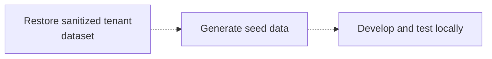

Managed Postgres は標準的な PostgreSQL をベースとしており、既存の PostgreSQL エコシステムとそのまま連携できます。ほとんどの開発作業では、クラウドのデプロイメントではなく、Docker 上で実行するローカルの PostgreSQL インスタンスを使って開発やテストを行えます。

この方法により、フィードバックループを短縮し、オンボーディングを簡素化し、共有インフラストラクチャへの依存を減らし、本番システムに影響を与えることなく安全に検証できます。

目的は、本番環境を完全に再現することではありません。代わりに、次の条件を満たす再現可能なローカル環境を構築します。

* 本番環境と同じ PostgreSQL のメジャーバージョンを使用する。
* 本番環境と同じスキーマ定義を適用する。
* 開発に適した代表的なデータを含める。
* 通常のアプリケーション開発およびテストのワークフローに対応する。

Managed Postgres は標準的な PostgreSQL であるため、既存の移行フレームワーク、スキーマ管理ツール、データシードの手法をそのまま利用できます。

## 例: 開発の流れ \{#example-development-flow\}

一般的なローカル開発のワークフローは次のとおりです。




Managed Postgres は、既存の PostgreSQL 開発ワークフローに自然に組み込めます。ローカルの PostgreSQL インスタンスを使って開発することで、チームは素早く反復を重ね、再現性のある環境を維持しながら、Managed Postgres にデプロイした際もアプリケーションが一貫して動作するという確信を得られます。

## Docker で PostgreSQL をローカル実行する \{#run-postgresql-locally-with-docker\}

ローカルの開発環境を構築する最も簡単な方法は、Docker で PostgreSQL を実行することです。

Managed Postgres のデプロイ環境に対応する PostgreSQL のバージョンを選択してください。

```yaml title="docker-compose.yml"
services:
  postgres:
    image: postgres:18
    container_name: local-postgres
    restart: unless-stopped

    environment:
      POSTGRES_USER: postgres
      POSTGRES_PASSWORD: postgres
      POSTGRES_DB: app

    ports:
      - "15432:5432"

    volumes:
      - postgres_data:/var/lib/postgresql

volumes:
  postgres_data:
```

PostgreSQL を起動します。

```bash
docker compose up -d
```

接続を確認します。

```bash
psql -h localhost -U postgres -p 15432 -d app
```

この時点では、PostgreSQL はローカルで動作していますが、まだアプリケーションのスキーマや開発用データは含まれていません。

## アプリケーションのスキーマを適用する \{#apply-the-application-schema\}

ローカル環境でスキーマを作成する方法に、唯一の必須手順はありません。ほとんどの組織では、すでに確立されたスキーマ管理のワークフローをそのまま再利用できます。

### アプリケーションの移行 \{#application-migrations\}

多くのチームでは、ステージング環境や本番環境で使っているのと同じ移行フレームワーク (Flyway、Liquibase、Rails migrations、Django migrations、Prisma migrations、Alembic など) を使用しています。

ローカルで移行を適用しておくと、通常の開発フローの中でスキーマ変更を継続的にテストできます。

```bash
./migrate up
# or
npm run migrate
# or
rails db:migrate
```

### スキーマのみの PostgreSQL ダンプ \{#schema-only-postgresql-dumps\}

スキーマのみの PostgreSQL エクスポートでは、既存のデータベース構造を再現できます。これは、オンボーディング、スキーマの挙動の調査、互換性の検証、開発環境の迅速な立ち上げに役立ちます。

スキーマをエクスポートします:

```bash
pg_dump \
  --schema-only \
  --no-owner \
  --no-privileges \
  -h <host> \
  -U <user> \
  -d <database> \
  > schema.sql
```

ローカルで復元:

```bash
psql \
  -h localhost \
  -U postgres \
  -p 15432    \
  -d app \
  -f schema.sql
```

### リポジトリで管理されるSQL定義 \{#checked-in-sql-definitions\}

チームによっては、スキーマ定義をSQLファイルとしてソース管理で直接管理しています。これらは、環境のセットアップ時にローカルのPostgreSQLインスタンスへそのまま適用できます。

どの方法を採る場合でも、重要なのは、スキーマの作成が自動化され、再現可能であり、バージョン管理された定義に基づいていることです。

## 代表的な開発用データを投入する \{#populate-representative-development-data\}

スキーマを作成したら、開発用の代表的なデータをデータベースに投入します。

ほとんどの開発ワークフローでは、シードスクリプトで生成した合成データセットで十分です。こうしたデータセットは簡単に再生成でき、安心して配布できるうえ、本番データに伴うコンプライアンスやセキュリティ上の考慮事項も避けられます。

SaaS アプリケーションで一般的な方法は、少数のサンプルテナント向けのデータを生成し、ユーザー、製品、注文、その他の業務エンティティの間に現実的な関係性を持たせることです。

### 例: マルチテナント スキーマ \{#example-multi-tenant-schema\}

以下のスキーマは、簡略化したマルチテナント SaaS アプリケーションを表したものです。

```sql
CREATE TABLE tenants (
    id UUID PRIMARY KEY,
    name TEXT NOT NULL
);

CREATE TABLE users (
    id UUID PRIMARY KEY,
    tenant_id UUID NOT NULL REFERENCES tenants(id),
    email TEXT NOT NULL,
    first_name TEXT,
    last_name TEXT,
    created_at TIMESTAMP DEFAULT now()
);

CREATE TABLE products (
    id UUID PRIMARY KEY,
    tenant_id UUID NOT NULL REFERENCES tenants(id),
    name TEXT NOT NULL,
    price NUMERIC(10,2)
);

CREATE TABLE orders (
    id UUID PRIMARY KEY,
    tenant_id UUID NOT NULL REFERENCES tenants(id),
    user_id UUID NOT NULL REFERENCES users(id),
    status TEXT,
    created_at TIMESTAMP DEFAULT now()
);

CREATE TABLE order_items (
    id UUID PRIMARY KEY,
    order_id UUID NOT NULL REFERENCES orders(id),
    product_id UUID NOT NULL REFERENCES products(id),
    quantity INTEGER
);

CREATE TABLE audit_logs (
    id UUID PRIMARY KEY,
    tenant_id UUID NOT NULL REFERENCES tenants(id),
    entity_type TEXT,
    entity_id UUID,
    action TEXT,
    created_at TIMESTAMP DEFAULT now()
);
```

### サンプルデータを生成する \{#generate-sample-data\}

依存関係をインストールします。

```bash
pip install faker psycopg2-binary
```

`seed.py` という名前のファイルを作成します。

```python title="seed.py"
import random
import uuid

import psycopg2
from faker import Faker

fake = Faker()

conn = psycopg2.connect(
    host="localhost",
    port=15432,
    dbname="app",
    user="postgres",
    password="postgres"
)

cur = conn.cursor()

tenant_ids = []

for tenant_name in [
    "Tenant A",
    "Tenant B",
    "Tenant C"
]:
    tenant_id = str(uuid.uuid4())
    tenant_ids.append(tenant_id)

    cur.execute(
        """
        INSERT INTO tenants(id, name)
        VALUES (%s, %s)
        """,
        (tenant_id, tenant_name)
    )

for tenant_id in tenant_ids:

    users = []
    products = []

    for _ in range(20):
        user_id = str(uuid.uuid4())
        users.append(user_id)

        cur.execute(
            """
            INSERT INTO users(
                id,
                tenant_id,
                email,
                first_name,
                last_name
            )
            VALUES (%s,%s,%s,%s,%s)
            """,
            (
                user_id,
                tenant_id,
                fake.email(),
                fake.first_name(),
                fake.last_name()
            )
        )

    for _ in range(15):
        product_id = str(uuid.uuid4())
        products.append(product_id)

        cur.execute(
            """
            INSERT INTO products(
                id,
                tenant_id,
                name,
                price
            )
            VALUES (%s,%s,%s,%s)
            """,
            (
                product_id,
                tenant_id,
                fake.word(),
                round(random.uniform(10, 500), 2)
            )
        )

    for _ in range(50):

        order_id = str(uuid.uuid4())

        cur.execute(
            """
            INSERT INTO orders(
                id,
                tenant_id,
                user_id,
                status
            )
            VALUES (%s,%s,%s,%s)
            """,
            (
                order_id,
                tenant_id,
                random.choice(users),
                random.choice([
                    "pending",
                    "completed",
                    "cancelled"
                ])
            )
        )

        for _ in range(random.randint(1, 5)):
            cur.execute(
                """
                INSERT INTO order_items(
                    id,
                    order_id,
                    product_id,
                    quantity
                )
                VALUES (%s,%s,%s,%s)
                """,
                (
                    str(uuid.uuid4()),
                    order_id,
                    random.choice(products),
                    random.randint(1, 10)
                )
            )

        cur.execute(
            """
            INSERT INTO audit_logs(
                id,
                tenant_id,
                entity_type,
                entity_id,
                action
            )
            VALUES (%s,%s,%s,%s,%s)
            """,
            (
                str(uuid.uuid4()),
                tenant_id,
                "order",
                order_id,
                "created"
            )
        )

conn.commit()
conn.close()
```

スクリプトを実行します：

```bash
python seed.py
```

生成されたデータセットには、以下が含まれます。

| テーブル            | レコード数 |
| --------------- | ----- |
| tenants         | 3     |
| users           | 60    |
| products        | 45    |
| orders          | 150   |
| order&#95;items | 400+  |
| audit&#95;logs  | 150+  |

このデータセットは、一般的なアプリケーションのワークフロー、テナント分離ロジック、レポートクエリ、リレーショナル整合性のチェックを行うのに十分な規模がありながら、ローカルでの開発やテストには軽量です。

## PostgreSQL + ClickHouse 開発環境 \{#postgresql-clickhouse-development-environment\}

上記の例では、ローカルでの PostgreSQL 開発に重点を置いています。PostgreSQL から ClickHouse までの完全なアーキテクチャをローカルでテストしたい場合は、オープンソースの PostgreSQL + ClickHouse スタックを実行できます。

このスタックは、トランザクションワークロード向けの PostgreSQL、分析向けの ClickHouse、そしてネイティブな CDC (変更データキャプチャ) のための PeerDB を組み合わせたものです。これにより、PostgreSQL を使って開発を進めながら、データを継続的に ClickHouse へレプリケートできます。そのため、運用分析、レポートワークロード、リアルタイムデータパイプラインを、手元のラップトップから直接テストできます。

このスタックは 1 つのコマンドで起動でき、必要なすべてのサービスがあらかじめ設定された状態で含まれています。

```bash
git clone https://github.com/ClickHouse/postgres-clickhouse-stack.git
cd postgres-clickhouse-stack

./run.sh start
```

このスタックには以下が含まれます。

* PostgreSQL
* ClickHouse
* PostgreSQL の CDC (変更データキャプチャ) 用の PeerDB
* 関連サービスとサンプルアプリケーション

セットアップ手順、アーキテクチャの詳細、スタック全体の手順付きガイドについては、以下を参照してください。

* [Blog: PostgreSQL + ClickHouse OSS](https://clickhouse.com/blog/postgres-clickhouse-oss)
* [GitHub: postgres-clickhouse-stack](https://github.com/ClickHouse/postgres-clickhouse-stack)

アプリケーションが PostgreSQL を使ってローカルで動作するようになったら、PostgreSQL から ClickHouse への同期、リアルタイム分析、アプリケーションのエンドツーエンドの動作を検証するための次のステップとして役立ちます。