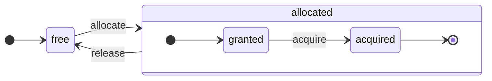

# アーキテクチャの概要

ClickHouseは真の列指向DBMSです。データはカラム単位で保存され、配列（ベクトルまたはカラムのチャンク）の実行時に使用されます。
可能な限り、操作は個々の値ではなく配列に対して行われます。
これは「ベクトル化されたクエリ実行」と呼ばれ、実際のデータ処理コストを低減するのに役立ちます。

この考え方は新しいものではありません。
1957年の`APL`（Aプログラミング言語）およびその子孫に遡ります:`A +`（APLの方言）、`J`（1990年）、`K`（1993年）、`Q`（Kx Systemsのプログラミング言語、2003年）です。
配列プログラミングは科学的データ処理に利用されます。この考え方はリレーショナルデータベースにおいても新しいものではありません。たとえば、`VectorWise`システム（Actian CorporationによるActian Vector Analytic Databaseとしても知られる）で使用されています。

クエリ処理を加速するためには、ベクトル化されたクエリ実行と実行時コード生成という2つの異なるアプローチがあります。後者はすべての間接呼び出しと動的ディスパッチを排除します。どちらのアプローチが優れているわけではありません。実行時コード生成は、多くの操作を融合させ、CPUの実行ユニットとパイプラインを完全に活用できる場合に優れていることがあります。ベクトル化されたクエリ実行は、一時的なベクトルがキャッシュに書き込まれ、再度読み取られる必要があるため、実用性が低い場合があります。一時的なデータがL2キャッシュに収まりきらない場合、これが問題になります。しかし、ベクトル化されたクエリ実行はCPUのSIMD機能をより簡単に利用できます。私たちの友人が書いた[研究論文](http://15721.courses.cs.cmu.edu/spring2016/papers/p5-sompolski.pdf)では、両方のアプローチを組み合わせると良いことが示されています。ClickHouseはベクトル化されたクエリ実行を使用し、実行時コード生成には限られた初期サポートを持っています。

## カラム {#columns}

`IColumn`インターフェースは、メモリ内のカラム（実際はカラムのチャンク）を表すために使用されます。このインターフェースは、さまざまなリレーショナル演算子の実装に必要なヘルパーメソッドを提供します。ほとんどすべての操作は不変であり、元のカラムを変更することなく、新しい修正されたものを作成します。たとえば、`IColumn :: filter`メソッドはフィルタバイトマスクを受け入れ、`WHERE`および`HAVING`のリレーショナル演算子で使用されます。追加の例として、`ORDER BY`をサポートするための`IColumn :: permute`メソッド、`LIMIT`をサポートするための`IColumn :: cut`メソッドがあります。

さまざまな`IColumn`の実装（`ColumnUInt8`、`ColumnString`など）は、カラムのメモリレイアウトを担当します。メモリレイアウトは通常、連続した配列です。整数型のカラムの場合、それはただの1つの連続した配列、つまり`std :: vector`のようなものです。`String`および`Array`カラムの場合、それはすべての配列要素が連続して配置されている1つのベクトルと、各配列の先頭へのオフセット用の別のベクトルの2つがあります。また、`ColumnConst`は、メモリに1つの値を格納しますが、カラムのように見えます。

## フィールド {#field}

それでも、個々の値で作業することも可能です。個々の値を表すために`Field`が使用されます。`Field`は単に`UInt64`、`Int64`、`Float64`、`String`および`Array`の識別されたユニオンです。`IColumn`は、n番目の値を`Field`として取得するための`operator []`メソッドと、カラムの末尾に`Field`を追加するための`insert`メソッドを持っています。これらのメソッドは非常に効率的ではなく、個々の値を表す一時的な`Field`オブジェクトに対処する必要があります。`insertFrom`、`insertRangeFrom`などのより効率的なメソッドもあります。

`Field`はテーブルの特定のデータ型に関する十分な情報を持っていません。たとえば、`UInt8`、`UInt16`、`UInt32`、および`UInt64`はすべて`Field`内で`UInt64`として表現されます。

## 漏れた抽象 {#leaky-abstractions}

`IColumn`にはデータの一般的なリレーショナル変換のためのメソッドがありますが、すべてのニーズを満たすわけではありません。たとえば、`ColumnUInt64`には2つのカラムの合計を計算するメソッドがなく、`ColumnString`には部分文字列検索を実行するメソッドがありません。これらの無数のルーチンは、`IColumn`の外で実装されています。

カラム上のさまざまな関数は、`IColumn`メソッドを使用して`Field`値を抽出する方法で、一般的に非効率的に実装できます。または、特定の`IColumn`実装のデータの内部メモリレイアウトの知識を使用して専門的に実装できます。これは、特定の`IColumn`タイプにキャスト関数を実装すればよく、内部表現に直接対処します。たとえば、`ColumnUInt64`には、内部配列への参照を返す`getData`メソッドがあり、その後別のルーチンがその配列を直接読み取りまたは埋め込みます。さまざまなルーチンの効率的な特化を許可するために「漏れた抽象」があります。

## データ型 {#data_types}

`IDataType`は、シリアル化とデシリアル化を担当します：カラムのチャンクまたは個々の値をバイナリまたはテキスト形式で読み書きするためです。`IDataType`はテーブル内のデータ型に直接対応します。たとえば、`DataTypeUInt32`、`DataTypeDateTime`、`DataTypeString`などがあります。

`IDataType`と`IColumn`はお互いに緩く関連しています。異なるデータ型は、同じ`IColumn`実装でメモリに表現されることがあります。たとえば、`DataTypeUInt32`と`DataTypeDateTime`は、両方とも`ColumnUInt32`または`ColumnConstUInt32`で表現されます。さらに、同じデータ型は異なる`IColumn`実装で表現できます。たとえば、`DataTypeUInt8`は`ColumnUInt8`または`ColumnConstUInt8`で表現できます。

`IDataType`はメタデータのみを保存します。たとえば、`DataTypeUInt8`は何も保存しません（仮想ポインタ`vptr`を除く）し、`DataTypeFixedString`は固定長の文字列のサイズ`N`のみを保存します。

`IDataType`にはさまざまなデータ形式のヘルパーメソッドがあります。例としては、引用符付きの値をシリアル化するためのメソッド、JSON形式で値をシリアル化するためのメソッド、およびXML形式の一部として値をシリアル化するためのメソッドがあります。データ形式には直接の対応関係はありません。たとえば、異なるデータ形式`Pretty`と`TabSeparated`は、`IDataType`インターフェースの`serializeTextEscaped`ヘルパーメソッドを使用できます。

## ブロック {#block}

`Block`は、メモリ内のテーブルのサブセット（チャンク）を表すコンテナです。これはただの三つ組の集合です: `(IColumn, IDataType, カラム名)`。クエリ実行中に、データは`Block`によって処理されます。`Block`があれば、データ（`IColumn`オブジェクト内に）、その型に関する情報（`IDataType`内に）があり、そのカラム名があります。それは、テーブルからの元のカラム名または計算の一時的結果を取得するために割り当てられた人工名のどちらかです。

ブロック内のカラムに関して関数を計算する場合、ブロックにその結果を持つ別のカラムを追加し、無変更で関数の引数用のカラムに触れません。後で、不必要なカラムはブロックから削除できますが、変更はできません。これは、共通の部分式を排除するのに便利です。

ブロックは処理されるデータのチャンクごとに作成されます。同じタイプの計算に対しては、カラム名と型は異なるブロックでも同じままで、カラムデータのみが変更されます。小さなブロックサイズは、shared_ptrやカラム名のコピー用に一時的な文字列の高いオーバーヘッドを伴うため、ブロックデータをブロックヘッダーから切り離す方が良いです。

## プロセッサ {#processors}

[https://github.com/ClickHouse/ClickHouse/blob/master/src/Processors/IProcessor.h](https://github.com/ClickHouse/ClickHouse/blob/master/src/Processors/IProcessor.h)での説明を参照してください。

## フォーマット {#formats}

データフォーマットはプロセッサーで実装されています。

## I/O {#io}

バイト指向の入出力には`ReadBuffer`と`WriteBuffer`の抽象クラスがあります。これらはC++の`iostream`の代わりに使用されます。心配しないでください。成熟したC++プロジェクトでは、良い理由から`iostream`以外の何かを使用しています。

`ReadBuffer`と`WriteBuffer`は、連続したバッファと、そのバッファ内の位置を指すカーソルです。実装はバッファのメモリを所有する場合と所有しない場合があります。バッファを以下のデータで満たす（`ReadBuffer`用）か、どこかにバッファをフラッシュする（`WriteBuffer`用）ための仮想メソッドがあります。これらの仮想メソッドは、滅多に呼ばれません。

`ReadBuffer`/`WriteBuffer`の実装は、ファイルやファイル記述子、ネットワークソケットとの作業、圧縮の実装（`CompressedWriteBuffer`は別のWriteBufferで初期化され、データを書き込む前に圧縮を行います）やその他の目的—`ConcatReadBuffer`、`LimitReadBuffer`、`HashingWriteBuffer`などの名前は、自己説明的です。

Read/WriteBuffersはバイトのみに対処します。入力/出力のフォーマッティングを助けるために`ReadHelpers`および`WriteHelpers`ヘッダーファイルからの関数があります。たとえば、10進数形式で数を記述するためのヘルパーがあります。

`JSON`形式で結果セットを`stdout`に書き込む際に何が起こるかを見てみましょう。
引き出される準備が整った結果セットがあります`QueryPipeline`から。
まず、`WriteBufferFromFileDescriptor(STDOUT_FILENO)`を作成して、`stdout`にバイトを書き込みます。
次に、クエリパイプラインからの結果を`JSONRowOutputFormat`に接続し、その`WriteBuffer`を初期化して、行を`JSON`形式で`stdout`に書き込みます。
これは、`complete`メソッドを介して行うことができ、これにより引き出し型の`QueryPipeline`が完了された`QueryPipeline`に変わります。
内部的に、`JSONRowOutputFormat`はさまざまなJSON区切り文字を書き込み、`IDataType::serializeTextJSON`メソッドを`IColumn`への参照と行番号を引数として呼び出します。これにより、`IDataType::serializeTextJSON`は、たとえば数値型の場合は`writeText`や、`DataTypeString`の場合は`writeJSONString`のように、`WriteHelpers.h`のメソッドを呼び出します。

## テーブル {#tables}

`IStorage`インターフェースはテーブルを表します。このインターフェースの異なる実装は異なるテーブルエンジンです。例としては、`StorageMergeTree`、`StorageMemory`などがあります。これらのクラスのインスタンスはちょうどテーブルです。

`IStorage`の主なメソッドは`read`と`write`であり、`alter`、`rename`、`drop`などの他のメソッドもあります。`read`メソッドは、テーブルから読み取るカラムのセット、考慮すべき`AST`クエリ、希望するストリームの数を受け取ります。`Pipe`を返します。

ほとんどの場合、読み取りメソッドは、テーブルから指定されたカラムを読み取ることのみを担当し、さらなるデータ処理は行いません。
すべての後続のデータ処理は、`IStorage`の責任外のパイプラインの他の部分によって処理されます。

しかし、注目すべき例外があります：

- ASTクエリは`read`メソッドに渡され、テーブルエンジンはそれを使用してインデックスの使用法を導き、テーブルからのデータを少なく読むことができます。
- 時には、テーブルエンジンがデータを特定の段階まで自ら処理できます。たとえば、`StorageDistributed`はリモートサーバーにクエリを送信し、異なるリモートサーバーからのデータを結合する段階までデータを処理するように依頼し、その前処理されたデータを返すことができます。その後、クエリインタープリターがデータの処理を完了します。

テーブルの`read`メソッドは、複数の`Processors`から成る`Pipe`を返すことができます。これらの`Processors`はテーブルから並行して読み取ることができます。
次に、これらのプロセッサーを、独立して計算可能なさまざまな他の変換（式評価やフィルタリングなど）で接続し、それらの上に`QueryPipeline`を作成し、`PipelineExecutor`を介して実行します。

また、`TableFunction`もあります。これらは、クエリの`FROM`句で使用するために一時的な`IStorage`オブジェクトを返す関数です。

テーブルエンジンの実装方法を簡単に理解するには、`StorageMemory`や`StorageTinyLog`などの簡単なものを見ると良いでしょう。

> `read`メソッドの結果、`IStorage`は`QueryProcessingStage`を返します。これは、クエリのどの部分がすでにストレージ内で計算されたかの情報です。

## パーサー {#parsers}

手書きの再帰降下パーサーがクエリを解析します。たとえば、`ParserSelectQuery`は、クエリのさまざまな部分のために基盤となるパーサーを再帰的に呼び出します。パーサーは`AST`を作成します。`AST`は、`IAST`のインスタンスであるノードによって表されます。

> パーサー生成器は歴史的な理由から使用されていません。

## インタープリター {#interpreters}

インタープリターは、ASTからクエリ実行パイプラインを作成する責任があります。`InterpreterExistsQuery`や`InterpreterDropQuery`のようなシンプルなインタープリターや、より洗練された`InterpreterSelectQuery`があります。

クエリ実行パイプラインは、チャンク（特定のタイプのカラムのセット）を消費および生成できるプロセッサーの組み合わせです。
プロセッサーはポートを介して通信し、複数の入力ポートと複数の出力ポートを持つことができます。
より詳細な説明は[src/Processors/IProcessor.h](https://github.com/ClickHouse/ClickHouse/blob/master/src/Processors/IProcessor.h)にあります。

たとえば、`SELECT`クエリを解釈した結果は「引き出し型」の`QueryPipeline`で、結果セットを読み込むための特別な出力ポートがあります。
`INSERT`クエリの結果は「プッシュ型」の`QueryPipeline`で、挿入データを書き込むための入力ポートがあります。
`INSERT SELECT`クエリを解釈した結果は、「完了した」`QueryPipeline`で、入力や出力はなく、データを`SELECT`から`INSERT`に同時にコピーします。

`InterpreterSelectQuery`は、クエリの分析と変換のために`ExpressionAnalyzer`および`ExpressionActions`の仕組みを使用します。ここでは、ほとんどのルールベースのクエリ最適化が行われます。`ExpressionAnalyzer`はかなり複雑であり、再編成する必要があります。さまざまなクエリの変換や最適化は、モジュール式のクエリ変換を許可するために、別のクラスに抽出されるべきです。

インタープリターに存在する問題に対処するために、新しい`InterpreterSelectQueryAnalyzer`が開発されました。これは`InterpreterSelectQuery`の新しいバージョンで、`ExpressionAnalyzer`を使用せず、`AST`と`QueryPipeline`の間に`QueryTree`と呼ばれる追加の抽象層を導入します。これは生産環境での使用に完全に準備が整っていますが、一応安全のために`enable_analyzer`設定の値を`false`に設定することで無効にすることができます。

## 関数 {#functions}

通常の関数と集約関数があります。集約関数については次のセクションを参照してください。

通常の関数は行数を変更せず、各行を独立して処理しているかのように動作します。実際には、関数は個々の行に対して呼び出されるのではなく、データの`Block`に対してベクトル化されたクエリ実行を実装するために呼び出されます。

[blockSize](/sql-reference/functions/other-functions#blockSize)、[rowNumberInBlock](/sql-reference/functions/other-functions#rowNumberInBlock)、および[runningAccumulate](/sql-reference/functions/other-functions#runningaccumulate)のようなさまざまな関数が存在し、これらはブロック処理を利用し、行の独立性を侵害しています。

ClickHouseは強い型付けを持っているため、暗黙の型変換はありません。もし関数が特定の型の組み合わせをサポートしない場合、例外がスローされます。しかし、関数は多くの異なる型の組み合わせで動作（オーバーロード）できます。たとえば、`plus`関数（`+`演算子を実装するため）は、次のようなあらゆる数値型の組み合わせで機能します：`UInt8 + Float32`、`UInt16 + Int8`など。また、`concat`関数のように、任意の数の引数を受け入れることのできる可変長の関数もあります。

関数を実装するのはやや不便な場合があります。なぜなら、関数がサポートされているデータ型とサポートされている`IColumns`を明示的にディスパッチするからです。たとえば、`plus`関数は、数値型ごとの各組み合わせ、定数または非定数の左辺および右辺の引数について、C++テンプレートのインスタンス化によって生成されるコードを持っています。

これは、テンプレートコードの膨張を避けるための実行時コード生成を実装するのに素晴らしい場所です。また、融合された関数（例えば、融合乘算加算）を追加したり、1回のループ反復で複数の比較を行うことも可能にします。

ベクトル化されたクエリ実行のため、関数は短絡しません。たとえば、`WHERE f(x) AND g(y)`と書いた場合、両側が計算されます。たとえ`f(x)`がゼロである場合でも（`f(x)`がゼロ定数式であるときを除いて）。しかし、`f(x)`条件の選択性が高く、`f(x)`の計算が`g(y)`よりもはるかに安価な場合、マルチパス計算を実装する方が良いでしょう。最初に`f(x)`を計算し、結果に基づいてカラムをフィルタリングし、その後、より小さいフィルタリングされたデータのチャンクに対してのみ`g(y)`を計算します。

## 集約関数 {#aggregate-functions}

集約関数は状態を持つ関数です。それらは渡された値をある状態に累積し、その状態から結果を取得することを許可します。これらは`IAggregateFunction`インターフェースで管理されます。状態は非常に単純なもの（`AggregateFunctionCount`の状態は単一の`UInt64`値）から、かなり複雑なもの（`AggregateFunctionUniqCombined`の状態は線形配列、ハッシュテーブル、および`HyperLogLog`確率データ構造の組み合わせ）まであります。

状態は`Arena`（メモリプール）に割り当てられ、高次元の`GROUP BY`クエリを実行中に複数の状態を扱うためです。状態には非自明なコンストラクタやデストラクタがある場合があります。たとえば、複雑な集約状態が自ら追加のメモリを割り当てることができます。状態の作成と破壊、所有権と破壊順序の適切な引き渡しに注意が必要です。

集約状態は、分散クエリ実行中にネットワークを通じて送信するため、またはRAMが不足している場合にはディスクに書き込むためにシリアル化およびデシリアル化できます。`DataTypeAggregateFunction`を使用してテーブルに保存することで、データのインクリメンタル集約も可能です。

> 集約関数の状態のシリアル化データ形式は、現在のところバージョン管理されていません。集約状態が一時的に保存されるだけであれば、それは問題ありません。しかし、インクリメンタル集約のために`AggregatingMergeTree`テーブルエンジンを持っており、人々は既に生産環境でそれを使用しています。これは、将来的に任意の集約関数のシリアル化形式を変更するときに後方互換性が必要である理由です。

## サーバー {#server}

サーバーは、いくつかの異なるインターフェースを実装しています：

- 外部クライアント用のHTTPインターフェース。
- ネイティブのClickHouseクライアントおよび分散クエリ実行中のサーバー間通信のためのTCPインターフェース。
- レプリケーション用のデータ転送インターフェース。

内部的には、コルーチンやファイバーを持たない原始的なマルチスレッドサーバーです。サーバーは単純なクエリの高いレートを処理するようには設計されておらず、相対的に低いレートの複雑なクエリを処理するように設計されているため、それぞれが分析のために大量のデータを処理することができます。

サーバーは、クエリ実行に必要な環境を持つ`Context`クラスを初期化します：利用可能なデータベースのリスト、ユーザーとアクセス権、設定、クラスター、プロセスリスト、クエリログなどです。インタープリターはこの環境を使用します。

サーバーTCPプロトコルに対して完全な後方および前方互換性を維持しています：古いクライアントは新しいサーバーと通信でき、新しいクライアントは古いサーバーと通信できます。しかし、永続的にそれを維持したくはなく、約1年後に古いバージョンのサポートを削除しています。

:::note
ほとんどの外部アプリケーションには、シンプルで使いやすいため、HTTPインターフェースの使用をお勧めします。TCPプロトコルは内部データ構造により密接に関連しています：データのブロックを渡すための内部形式を使用し、圧縮データに対してカスタムフレーミングを使用します。このプロトコルのCライブラリは公開していません。これは、ClickHouseコードベースのほとんどをリンクする必要があるため、実質的ではないからです。
:::

## 設定 {#configuration}

ClickHouse ServerはPOCO C++ライブラリに基づいており、設定を表すために`Poco::Util::AbstractConfiguration`を使用します。設定は、`DaemonBase`クラスから継承される`Poco::Util::ServerApplication`クラスによって保持され、これはクリックハウスサーバー自体を実装する`DB::Server`クラスから継承されます。したがって、設定には`ServerApplication::config()`メソッドからアクセスできます。

設定は複数のファイル（XMLまたはYAML形式）から読み込まれ、`ConfigProcessor`クラスによって単一の`AbstractConfiguration`にマージされます。設定はサーバーの起動時に読み込まれ、その後、設定ファイルのいずれかが更新、削除、または追加された場合、再読み込みできます。`ConfigReloader`クラスは、これらの変更を定期的に監視し、再読み込みの手順を行う責任を持っています。`SYSTEM RELOAD CONFIG`クエリも設定の再読み込みをトリガーします。

クエリや`Server`以外のサブシステムでは、`Context::getConfigRef()`メソッドを使って設定にアクセスできます。サーバーの再起動なしに設定を再読み込みできるサブシステムは、`Server::main()`メソッド内のリロードコールバックに自分自身を登録する必要があります。新しい設定にエラーがある場合、ほとんどのサブシステムは新しい設定を無視し、警告メッセージをログに記録し、以前に読み込まれた設定で動作し続けます。`AbstractConfiguration`の性質上、特定のセクションへの参照を渡すことはできないため、通常`String config_prefix`が使用されます。

## スレッドとジョブ {#threads-and-jobs}

クエリを実行し、サイドアクティビティを行うために、ClickHouseはスレッドプールの1つからスレッドを割り当てて、スレッドの頻繁な作成と破棄を避けます。目的とジョブの構造に応じて、いくつかのスレッドプールがあります：
  * クライアントセッションのためのサーバープール。
  * 一般目的のジョブ、バックグラウンドアクティビティ、スタンドアロンスレッドのためのグローバルスレッドプール。
  * IOに対して主にブロックされていて、CPU集約型でないジョブのためのIOスレッドプール。
  * 定期的なタスクのためのバックグラウンドプール。
  * ステップに分割可能な先制タスクのためのプール。

サーバープールは、`Server::main()`メソッドで定義された`Poco::ThreadPool`クラスのインスタンスです。最大で`max_connection`スレッドを持つことができます。各スレッドは単一のアクティブな接続に専念します。

グローバルスレッドプールは、`GlobalThreadPool`シングルトンクラスです。そこからスレッドを割り当てるには`ThreadFromGlobalPool`が使用されます。これは`std::thread`に似たインターフェースを持ちますが、グローバルプールからスレッドを取得し、必要な初期化をすべて行います。次の設定で構成されます：
  * `max_thread_pool_size` - プール内のスレッド数の制限。
  * `max_thread_pool_free_size` - 新しいジョブを待っているアイドルスレッド数の制限。
  * `thread_pool_queue_size` - スケジュールされたジョブ数の制限。

グローバルプールはユニバーサルであり、以下に説明するすべてのプールはその上に実装されています。これはプールの階層と考えることができます。任意の専門プールは`ThreadPool`クラスを使用してグローバルプールからスレッドを取ります。そのため、任意の専門プールの主な目的は、同時ジョブ数に制限を適用し、ジョブのスケジューリングを行うことです。スケジュールされたジョブがプール内のスレッド数を超える場合、`ThreadPool`は優先順位に応じてジョブをキューに蓄積します。各ジョブには整数の優先順位があります。デフォルトの優先順位はゼロです。優先順位の高い値を持つすべてのジョブは、より低い優先順位の値を持つジョブの前に開始されます。しかし、すでに実行中のジョブの間には違いがないため、優先順位はオーバーロード時のプールにのみ関連する重要事項です。

IOスレッドプールは、`IOThreadPool::get()`メソッドを介してアクセス可能な通常の`ThreadPool`として実装されています。これは、`max_io_thread_pool_size`、`max_io_thread_pool_free_size`、および`io_thread_pool_queue_size`設定で、グローバルプールと同様に構成されます。IOスレッドプールの主な目的は、IOジョブでグローバルプールが枯渇するのを避けることです。これにより、クエリがCPUをフルに活用できなくなります。S3へのバックアップは多くのIO操作を行うため、対話型クエリへの影響を避けるために、`max_backups_io_thread_pool_size`、`max_backups_io_thread_pool_free_size`および`backups_io_thread_pool_queue_size`で構成された別の`BackupsIOThreadPool`があります。

定期的なタスク実行のためには、`BackgroundSchedulePool`クラスがあります。タスクを`BackgroundSchedulePool::TaskHolder`オブジェクトを使用して登録できます。このプールは、同時に2つのジョブを実行しないようにします。また、タスクの実行を特定の瞬間に延期したり、タスクを一時的に無効にしたりできます。グローバル`Context`は、さまざまな目的のためにこのクラスのいくつかのインスタンスを提供します。一般的な目的のタスクには、`Context::getSchedulePool()`が使用されます。

先制タスク用に特化されたスレッドプールもあります。そのような`IExecutableTask`タスクは、順序付きのジョブのシーケンスであるステップに分割できます。このタスクをスケジュールするために、短いタスクが長いタスクよりも優先されるように、`MergeTreeBackgroundExecutor`が使用されます。名前が示すように、これはマージや変更、フェッチおよび移動など、MergeTree関連の操作をバックグラウンドで行うために使用されます。プールインスタンスは、`Context::getCommonExecutor()`やその他の類似のメソッドを介して利用できます。

ジョブに使用されるプールに関係なく、開始時にそのジョブの`ThreadStatus`インスタンスが作成されます。これはすべてのスレッド情報をカプセル化します：スレッドID、クエリID、パフォーマンスカウンター、リソース消費、その他多くの有用なデータ。ジョブは、`CurrentThread::get()`呼び出しを介してスレッドローカルポインタを使用してこれにアクセスできるため、これをすべての関数に渡す必要はありません。

スレッドがクエリ実行に関連している場合、`ThreadStatus`に添付される最も重要な情報は、クエリコンテキスト`ContextPtr`です。各クエリには、サーバープール内にマスタースレッドがあります。マスタースレッドは、`ThreadStatus::QueryScope query_scope(query_context)`オブジェクトを保持することによって添付します。マスタースレッドはまた、`ThreadGroupStatus`オブジェクトで表されるスレッドグループを作成します。このクエリ実行中に割り当てられる各追加スレッドは、`CurrentThread::attachTo(thread_group)`呼び出しによってそのスレッドグループに添付されます。スレッドグループは、プロファイルイベントカウンターを集約し、単一のタスクに専念するすべてのスレッドによるメモリ消費を追跡するために使用されます（詳細については`MemoryTracker`および`ProfileEvents::Counters`クラスを参照してください）。

## 同時実行制御 {#concurrency-control}

並行処理できるクエリは、`max_threads`設定を使用して自らを制限します。この設定のデフォルト値は、単一のクエリがすべてのCPUコア를最佳的に活用できるように選ばれます。しかし、複数の同時クエリがあり、それぞれがデフォルトの`max_threads`設定値を使用している場合はどうなりますか？その場合、クエリはCPUリソースを共有します。OSはスレッドを常に切り替えることによって公平性を確保しますが、これによりパフォーマンスのペナルティが導入されます。`ConcurrencyControl`は、このペナルティに対処し、多くのスレッドを割り当てるのを避けるのに役立ちます。設定`concurrent_threads_soft_limit_num`は、ある種のCPUプレッシャーを適用する前に、どれだけの同時スレッドを割り当てることができるかを制限します。

:::note
`concurrent_threads_soft_limit_num`と`concurrent_threads_soft_limit_ratio_to_cores`は、デフォルトで無効（0に等しい）です。したがって、この機能は使用する前に有効にする必要があります。
:::

CPUの`slot`の概念が導入されています。スロットは同時実行の単位です：スレッドを実行するには、事前にスロットを取得し、スレッドが停止するとそれを解放する必要があります。スロットの数は、サーバー内で全体的に制限されています。総需要がスロットの総数を超えた場合、複数の同時クエリがCPUスロットを競っています。`ConcurrencyControl`は、この競争を解決し、公平にCPUスロットのスケジューリングを行います。

各スロットは次の状態を持つ独立した状態マシンとして見ることができます：
 * `free`：スロットは、任意のクエリによって割り当てられるために利用可能です。
 * `granted`：スロットは特定のクエリによって`allocated`されていますが、まだ任意のスレッドによって取得されていません。
 * `acquired`：スロットは特定のクエリによって`allocated`され、スレッドによって取得されています。

`allocated`されたスロットは、`granted`と`acquired`の2つの異なる状態にある可能性があることに注意してください。前者は遷移状態であり、実際には短いはずです（スロットがクエリに割り当てられた瞬間から、任意のスレッドによってアップスケーリング手順が実行されるまで）。

`ConcurrencyControl` のAPIは次の関数で構成されています：
1. クエリのためのリソース割り当ての作成： `auto slots = ConcurrencyControl::instance().allocate(1, max_threads);`。 これは、少なくとも1つ、最大で`max_threads`のスロットを割り当てます。最初のスロットは直ちに付与されますが、残りのスロットは後で付与される場合があります。これにより、制限はソフトになり、すべてのクエリが少なくとも1つのスレッドを取得します。
2. 各スレッドは、割当からスロットを取得する必要があります：`while (auto slot = slots->tryAcquire()) spawnThread([slot = std::move(slot)] { ... });`。
3. スロットの総数を更新します：`ConcurrencyControl::setMaxConcurrency(concurrent_threads_soft_limit_num)`。サーバーの再起動なしに実行時に行うことができます。

このAPIは、CPUプレッシャーの存在下で、クエリが少なくとも1つのスレッド（`max_threads`の後のスケーリング）で開始することを可能にします。
## 分散クエリ実行 {#distributed-query-execution}

クラスターセットアップ内のサーバーは、ほとんど独立しています。クラスター内の1台またはすべてのサーバーに `Distributed` テーブルを作成できます。`Distributed` テーブルはデータを自体で保存するのではなく、クラスターの複数のノード上のすべてのローカルテーブルへの「ビュー」を提供します。`Distributed` テーブルから選択すると、そのクエリを書き換え、負荷分散設定に従ってリモートノードを選択し、そのノードにクエリを送信します。`Distributed` テーブルは、異なるサーバーからの中間結果をマージできる段階まで、クエリを処理するようにリモートサーバーにリクエストします。その後、中間結果を受信し、それらをマージします。この分散テーブルは、可能な限り多くの作業をリモートサーバーに分散させ、ネットワーク越しに多くの中間データを送信しないようにします。

IN や JOIN 句にサブクエリがある場合、各サブクエリが `Distributed` テーブルを使用するため、状況が複雑になります。これらのクエリの実行にはさまざまな戦略があります。

分散クエリ実行にはグローバルなクエリプランは存在しません。各ノードは、自分の仕事に応じてローカルクエリプランを持っています。単純な一通りの分散クエリ実行のみがあり、リモートノードへのクエリを送信し、その後に結果をマージします。しかし、高いカーディナリティの `GROUP BY` がある複雑なクエリやJOINに大量の一時データが関与する場合、この方法は現実的ではありません。その場合、サーバー間でデータを「リシャッフル」する必要があり、追加の調整が必要です。ClickHouse は、そのようなクエリ実行をサポートしていないため、その点については今後の作業が必要です。

## マージツリー {#merge-tree}

`MergeTree` は主キーによるインデックス作成をサポートするストレージエンジンのファミリーです。主キーは任意のカラムまたは式の組み合わせであることができます。`MergeTree` テーブル内のデータは「パーツ」に保存されます。各パーツは主キーの順序でデータを保存するため、データは主キーのタプルによって辞書式に順序付けられます。すべてのテーブルカラムは、これらのパーツ内にある別々の `column.bin` ファイルに保存されます。ファイルは圧縮されたブロックで構成されており、各ブロックは通常、平均値サイズに応じて64 KBから1 MBの非圧縮データです。ブロックは隣接して配置されたカラム値からなり、主キーが順序を定義するため、複数のカラムを反復すると、対応する行の値が得られます。

主キー自体は「スパース」です。すべての行にアドレスを持つのではなく、いくつかのデータ範囲のみにアドレスを持ちます。別の `primary.idx` ファイルには、N 番目の行ごとの主キーの値が含まれており、N は `index_granularity` と呼ばれます（通常、N は 8192）。また、各カラムにはデータファイル内の N 番目の行へのオフセットである「マーク」を持つ `column.mrk` ファイルがあります。各マークは、圧縮ブロックの先頭までのファイル内のオフセットと、データの最初までの非圧縮ブロック内のオフセットのペアです。通常、圧縮ブロックはマークによって整列され、非圧縮ブロック内のオフセットはゼロです。`primary.idx` のデータは常にメモリ内に存在し、`column.mrk` ファイルのデータはキャッシュされます。

`MergeTree` のパーツから何かを読み取ろうとするとき、`primary.idx` データを見て要求されたデータが含まれる可能性のある範囲を特定し、その後 `column.mrk` データを見て、これらの範囲の読み取りを開始するためのオフセットを計算します。スパース性のため、余分なデータが読み取られる可能性があります。ClickHouse は高負荷の単純なポイントクエリには適していません。なぜなら、各キーに対して `index_granularity` 行を持つ全範囲を読み取る必要があり、各カラムに対して完全な圧縮ブロックを非圧縮する必要があるからです。私たちは、単一のサーバーあたり兆単位の行を目立ったメモリ消費なしで維持できるようにするためにインデックスをスパースにしました。また、主キーがスパースであるため、ユニークではなく、INSERT 時にテーブル内のキーの存在を確認することはできません。テーブル内に同じキーを持つ多くの行が存在する可能性があります。

`MergeTree` に大量のデータを `INSERT` すると、そのデータは主キーの順序でソートされ、新しいパーツを形成します。バックグラウンドスレッドは定期的にいくつかのパーツを選択し、それらを単一のソートされたパーツにマージして、パーツの数を比較的少なく保ちます。それが `MergeTree` と呼ばれる理由です。もちろん、マージは「書き込み増幅」を引き起こします。すべてのパーツは不変であり、作成および削除のみが行われ、修正は行われません。SELECT が実行されると、テーブルのスナップショット（パーツの集合）を保持します。マージ後、失敗後の回復を簡単にするために、古いパーツも一定期間保持されますので、マージされたパーツが破損している可能性がある場合は、それを元のパーツで置き換えることができます。

`MergeTree` は LSM ツリーではありません。MEMTABLE と LOG を含まず、挿入されたデータはファイルシステムに直接書き込まれます。この動作により、MergeTree はバッチでデータを挿入するのに適しています。したがって、小さな数の行を頻繁に挿入することは、MergeTree にとって理想的ではありません。たとえば、1秒あたり数行は問題ありませんが、1秒あたり1000回行うのは最適ではありません。しかし、この制限を克服するために小さな挿入用の非同期挿入モードがあります。これを簡便さのために行い、私たちのアプリケーションでバッチでデータをすでに挿入しているためです。

バックグラウンドマージ中に追加の作業を行う MergeTree エンジンもあります。例として `CollapsingMergeTree` や `AggregatingMergeTree` があります。これらは更新の特別なサポートとして扱うことができます。これらは実際の更新ではないことを念頭に置いてください。なぜなら、ユーザーは通常、バックグラウンドマージが実行される時間を制御できず、`MergeTree` テーブル内のデータはほぼ常に1つ以上のパーツに保存され、完全にマージされた形ではないからです。

## レプリケーション {#replication}

ClickHouse におけるレプリケーションは、テーブルごとに設定できます。同じサーバー内に、いくつかのレプリケートテーブルと非レプリケートテーブルを持つことができます。また、一つのテーブルから二要素のレプリケーションを行っている場合や、別のテーブルで三要素のレプリケーションを行うように、異なる方法でレプリケートされたテーブルを持つことも可能です。

レプリケーションは `ReplicatedMergeTree` ストレージエンジンで実装されています。`ZooKeeper` のパスはストレージエンジンのパラメータとして指定されます。同じ `ZooKeeper` のパスを持つすべてのテーブルは互いにレプリカとなり、データを同期して一貫性を維持します。レプリカは、テーブルを作成または削除するだけで動的に追加および削除できます。

レプリケーションは非同期のマルチマスター方式を使用します。`ZooKeeper` とセッションを持つ任意のレプリカにデータを挿入でき、データは非同期にすべての他のレプリカにレプリケートされます。ClickHouse は UPDATE をサポートしていないため、レプリケーションは競合がありません。デフォルトでは、挿入に対する過半数の確認がないため、あるノードが失敗すると、直前に挿入されたデータが失われる可能性があります。挿入の過半数は `insert_quorum` 設定を使用して有効にできます。

レプリケーションに関するメタデータは ZooKeeper に保存されます。何を行うべきかをリストしたレプリケーションログがあります。行動内容は、パーツを取得、パーツをマージ、パーティションを削除などです。各レプリカは、レプリケーションログを自分のキューにコピーし、その後キューからアクションを実行します。たとえば、挿入時に「パーツを取得する」アクションがログに作成され、すべてのレプリカがそのパーツをダウンロードします。マージは、バイト同一の結果を得るためにレプリカ間で調整されます。すべてのパーツはすべてのレプリカで同じ方法でマージされます。リーダーの一つが最初に新しいマージを開始し、「パーツをマージする」アクションをログに書き込みます。複数のレプリカ（またはすべて）が同時にリーダーになることができます。`merge_tree` 設定 `replicated_can_become_leader` を使用して、レプリカがリーダーになることを防ぐことができます。リーダーはバックグラウンドマージのスケジューリングを担当します。

レプリケーションは物理的です：ノード間でクエリではなく圧縮されたパーツのみが転送されます。ほとんどの場合、マージは各レプリカで独立して処理され、ネットワークの増幅を回避することでネットワークコストを低減します。大きなマージされたパーツは、 значительная対象である場合にのみネットワークを介して送信されます。

さらに、各レプリカは ZooKeeper に自分の状態をパーツのセットとそのチェックサムとして保存します。ローカルファイルシステムの状態が ZooKeeper の参照状態と異なる場合、レプリカは他のレプリカから欠落または破損したパーツをダウンロードして一貫性を回復します。ローカルファイルシステムに予期しないまたは破損したデータが存在する場合、ClickHouse はそれを削除せず、別のディレクトリに移動して忘れます。

:::note
ClickHouse クラスターは独立したシャードで構成されており、各シャードはレプリカで構成されています。クラスターは **弾力的ではなく**、新しいシャードを追加した後、データは自動的にシャード間で再バランスされることはありません。代わりに、クラスターの負荷は不均一に調整されることを想定しています。この実装により、より多くの制御が可能になり、十数ノードなどの比較的小さなクラスターに対しては問題ありません。しかし、私たちが本番環境で使用している百を超えるノードを持つクラスターに対しては、このアプローチは大きな欠点となります。クラスター全体にまたがり、動的にレプリケートされたリージョンを持ち、自動的にクラスター間で分割およびバランスされるテーブルエンジンを実装する必要があります。
:::
