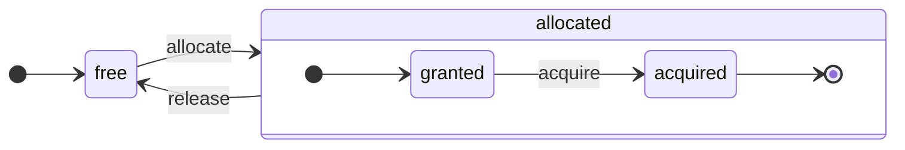

# アーキテクチャの概要

ClickHouseは真の列指向DBMSです。データはカラム単位で格納され、配列（列のベクトルまたはチャンク）の実行中に使用されます。可能な限り、操作は個々の値ではなく、配列に対して割り当てられます。これを「ベクトル化クエリ実行」と呼び、実際のデータ処理のコストを低下させるのに役立ちます。

このアイデアは新しいものではありません。`APL`（プログラミング言語、1957年）およびその子孫である`A +`（APL方言）、`J`（1990年）、`K`（1993年）、および`Q`（Kx Systemsのプログラミング言語、2003年）にさかのぼります。配列プログラミングは科学データ処理で使用されます。このアイデアは、関係データベースでも新しいものではありません。たとえば、`VectorWise`システム（Actian CorporationのActian Vector Analytic Databaseとしても知られる）で使用されています。

クエリ処理を加速するためのアプローチには、ベクトル化クエリ実行とランタイムコード生成の2つの異なる方法があります。後者はすべての間接呼び出しと動的ディスパッチを取り除きます。これらのアプローチは、厳密にどちらが優れているというわけではありません。ランタイムコード生成は、多くの操作を統合する場合に優れ、CPU実行ユニットとパイプラインを完全に活用します。ベクトル化クエリ実行は、一時的なベクトルをキャッシュに書き込み、再度読み取る必要があるため、実用的でないことがあります。一時データがL2キャッシュに収まらない場合は、これが問題になります。しかし、ベクトル化クエリ実行はCPUのSIMD機能をより簡単に活用できます。[こちらの研究論文](http://15721.courses.cs.cmu.edu/spring2016/papers/p5-sompolski.pdf)が、両方のアプローチの組み合わせが最も効果的であることを示しています。ClickHouseはベクトル化クエリ実行を使用し、初期的に限られたランタイムコード生成のサポートを提供しています。
## カラム {#columns}

`IColumn`インターフェイスは、メモリ内のカラム（実際にはカラムのチャンク）を表すために使用されます。このインターフェイスは、さまざまな関係演算子の実装のための補助メソッドを提供します。ほぼすべての操作は不変であり、元のカラムを変更することなく、新しい変更されたものを作成します。たとえば、`IColumn::filter`メソッドはフィルターバイトマスクを受け取ります。これは`WHERE`および`HAVING`関係演算子に使用されます。追加の例としては、`ORDER BY`をサポートするための`IColumn::permute`メソッドや、`LIMIT`をサポートするための`IColumn::cut`メソッドがあります。

さまざまな`IColumn`実装（`ColumnUInt8`、`ColumnString`など）は、カラムのメモリレイアウトを担当します。メモリレイアウトは通常、連続した配列です。整数型のカラムの場合、それは単一の連続配列（`std::vector`のよう）です。`String`および`Array`カラムの場合、それはすべての配列要素を連続して配置した1つのベクトルと、各配列の開始位置へのオフセットを格納する2番目のベクトルから構成されます。`ColumnConst`もあり、メモリに単一の値を格納しますが、カラムのように見えます。
## フィールド {#field}

それにもかかわらず、個々の値で作業することもできます。個々の値を表すために、`Field`が使用されます。`Field`は、`UInt64`、`Int64`、`Float64`、`String`、および`Array`の識別されたユニオンです。`IColumn`にはn番目の値を`Field`として取得するための`operator []`メソッドと、カラムの末尾に`Field`を追加するための`insert`メソッドがあります。これらのメソッドはあまり効率的ではなく、個々の値を表す一時的な`Field`オブジェクトを扱う必要があります。`insertFrom`、`insertRangeFrom`などのより効率的なメソッドがあります。

`Field`はテーブルの特定のデータ型に関する情報が不十分です。たとえば、`UInt8`、`UInt16`、`UInt32`、および`UInt64`は、すべて`Field`内では`UInt64`として表されます。
## 漏れ出る抽象 {#leaky-abstractions}

`IColumn`には、データの一般的な関係変換のためのメソッドがありますが、それではすべてのニーズには応えません。たとえば、`ColumnUInt64`には2つのカラムの合計を計算するメソッドがなく、`ColumnString`には部分文字列検索を実行するメソッドがありません。これらの無数のルーチンは`IColumn`の外で実装されています。

カラムに対するさまざまな関数は、`IColumn`メソッドを使用して`Field`値を抽出する一般的で効率的でない方法で実装することも、特定の`IColumn`実装の内部メモリレイアウトの知識を使用して専門的に実装することもできます。後者は、関数を特定の`IColumn`型にキャストし、内部表現を直接扱うことが実装されています。たとえば、`ColumnUInt64`には内部配列への参照を返す`getData`メソッドがあり、その後に別のルーチンがその配列を直接読み込んだり埋めたりします。我々は、さまざまなルーチンの効率的な専門化を許可するために「漏れ出る抽象」を持っています。
## データ型 {#data_types}

`IDataType`は、シリアル化およびデシリアル化を担当します。これは、カラムのチャンクまたは個々の値をバイナリ形式またはテキスト形式で読み書きすることを含みます。`IDataType`は、テーブル内のデータ型に直接対応します。たとえば、`DataTypeUInt32`、`DataTypeDateTime`、`DataTypeString`などがあります。

`IDataType`と`IColumn`は、お互いに緩やかに関連しています。異なるデータ型が同じ`IColumn`実装のメモリ内で表現されることがあります。たとえば、`DataTypeUInt32`と`DataTypeDateTime`は、どちらも`ColumnUInt32`または`ColumnConstUInt32`によって表されます。さらに、同じデータ型が異なる`IColumn`実装によって表されることがあります。たとえば、`DataTypeUInt8`は`ColumnUInt8`または`ColumnConstUInt8`によって表される可能性があります。

`IDataType`はメタデータのみを保持します。たとえば、`DataTypeUInt8`は何も保持しません（仮想ポインタ`vptr`を除く）し、`DataTypeFixedString`は固定サイズの文字列のサイズ`N`のみを保持します。

`IDataType`には、さまざまなデータ形式の補助メソッドがあります。例として、引用符を使用して値をシリアル化するメソッド、JSON用に値をシリアル化するメソッド、XML形式で値をシリアル化するメソッドなどがあります。データ形式に直接対応するものはありません。たとえば、異なるデータ形式`Pretty`および`TabSeparated`は、`IDataType`インターフェイスの`serializeTextEscaped`補助メソッドを共用することができます。
## ブロック {#block}

`Block`は、メモリ内のテーブルのサブセット（チャンク）を表すコンテナです。これは単に三重のセットであり、`(IColumn, IDataType, カラム名)`です。クエリの実行中、データは`Block`によって処理されます。`Block`が存在する場合、`IColumn`オブジェクト内にデータがあり、カラムの扱い方を教えるその型に関する情報が`IDataType`にあり、カラム名もあります。これは、テーブルからの元のカラム名である場合もあれば、計算の一時的結果を取得するために付与された人工的な名前である場合もあります。

ブロック内のカラムに対して関数を計算すると、その結果を持つ別のカラムをブロックに追加し、操作は不変であるため関数の引数のカラムには触れません。後で不要になったカラムはブロックから削除できますが、変更はできません。これは一般的な部分式の排除に便利です。

ブロックは、処理されるデータの各チャンクに対して作成されます。同じ計算に対して、カラム名と型は異なるブロック間で同じであり、カラムデータだけが変化します。ブロックのデータをブロックヘッダーから分割することが望ましいのは、ブロックのサイズが小さいときに、共有ポインタやカラム名のコピーのための一時文字列のオーバーヘッドが高くなるためです。
## プロセッサ {#processors}

[こちら](https://github.com/ClickHouse/ClickHouse/blob/master/src/Processors/IProcessor.h)を参照してください。
## フォーマット {#formats}

データフォーマットはプロセッサで実装されます。
## 入出力 {#io}

バイト指向の入出力には、`ReadBuffer`および`WriteBuffer`の抽象クラスがあります。これらはC++の`iostream`の代わりに使用されます。心配しないでください。成熟したC++プロジェクトは、良い理由から`iostream`の他の何かを使用しています。

`ReadBuffer`と`WriteBuffer`は、連続したバッファと、そのバッファ内の位置を指すカーソルです。実装は、バッファのメモリを所有することも、所有しないこともあります。バッファに次のデータを入力するための仮想メソッド（`ReadBuffer`用）または、バッファをどこかにフラッシュするための仮想メソッド（`WriteBuffer`用）があります。仮想メソッドはあまり呼び出されません。

`ReadBuffer`/`WriteBuffer`の実装は、ファイルやファイルディスクリプタ、ネットワークソケットと連携して作業するため、圧縮を実装するため（`CompressedWriteBuffer`は別のWriteBufferで初期化され、データを書き込む前に圧縮を行います）や他の目的で使用されます。`ConcatReadBuffer`、`LimitReadBuffer`、および`HashingWriteBuffer`という名前は、それ自体が自己説明的です。

Read/WriteBuffersは、バイトの処理のみを扱います。入力/出力のフォーマットを助けるために`ReadHelpers`および`WriteHelpers`ヘッダーファイルの関数があります。たとえば、10進形式の数を記述するためのヘルパーがあります。

結果セットを`JSON`形式で標準出力に書き出そうとしたときに何が起こるかを見てみましょう。プル形式の`QueryPipeline`からフェッチする準備が整った結果セットがあります。まず、バイトを標準出力に書き込むために`WriteBufferFromFileDescriptor(STDOUT_FILENO)`を作成します。次に、クエリパイプラインの結果を`JSONRowOutputFormat`に接続します。`WriteBuffer`を初期化し、行を`JSON`形式で標準出力に書き込むようにします。これは、プル形式の`QueryPipeline`を完了した`QueryPipeline`に変換する`complete`メソッドを介して行われます。内部的に、`JSONRowOutputFormat`はさまざまなJSON区切り記号を書き込み、`IDataType::serializeTextJSON`メソッドを`IColumn`への参照と行番号を引数として呼び出します。結果として、`IDataType::serializeTextJSON`は`WriteHelpers.h`のメソッドを呼び出します。たとえば、数値型には`writeText`、`DataTypeString`には`writeJSONString`があります。
## テーブル {#tables}

`IStorage`インターフェイスはテーブルを表現します。このインターフェイスの異なる実装は異なるテーブルエンジンです。例としては`StorageMergeTree`、`StorageMemory`などがあります。これらのクラスのインスタンスは単なるテーブルです。

`IStorage`の主要なメソッドは`read`および`write`であり、`alter`、`rename`、および`drop`などのメソッドがあります。`read`メソッドは、テーブルから読み取るカラムのセット、考慮すべき`AST`クエリ、希望するストリームの数を引数として受け取ります。`Pipe`を返します。

ほとんどの場合、readメソッドは、テーブルから指定されたカラムのみを読み取る責任がありますが、さらなるデータ処理については考慮されません。すべての後続のデータ処理は、`IStorage`の責任の範囲外にあるパイプラインの別の部分で処理されます。

ただし、注目すべき例外があります：

- ASTクエリは`read`メソッドに渡され、テーブルエンジンはそれを使用してインデックスの使用を導き、テーブルからデータを少なく読み取ることができます。
- 時には、テーブルエンジンが特定のステージにデータを処理することがあります。たとえば、`StorageDistributed`はリモートサーバーにクエリを送り、データを異なるリモートサーバーから統合できるステージまで処理するように依頼し、その前処理されたデータを返します。その後、クエリインタープリターがデータの処理を完了します。

テーブルの`read`メソッドは、複数の`Processors`からなる`Pipe`を返すことができます。これらの`Processors`はテーブルから並列にデータを読み取ることができます。このようにして、さまざまな他の変換（式の評価やフィルタリングなど）と接続でき、独立して計算することができます。そして、その上に`QueryPipeline`を作成し、`PipelineExecutor`を介して実行します。

`TableFunction`もあります。これは、クエリの`FROM`句で使用するための一時的な`IStorage`オブジェクトを返す関数です。

あなたのテーブルエンジンを実装する方法の概要を迅速に理解するために、`StorageMemory`や`StorageTinyLog`のようなシンプルなものを見てください。

> `read`メソッドの結果、`IStorage`は`QueryProcessingStage`を返します。これは、ストレージ内で既に計算されたクエリのどの部分に関する情報です。
## パーサー {#parsers}

手書きの再帰的下降パーサーがクエリを解析します。たとえば、`ParserSelectQuery`は、クエリのさまざまな部分に対して基礎となるパーサーを再帰的に呼び出すだけです。パーサーは`AST`を作成します。`AST`はノードとして表示され、`IAST`のインスタンスです。

> パーサージェネレーターは、歴史的な理由から使用されていません。
## インタープリター {#interpreters}

インタープリターは、ASTからクエリ実行パイプラインを作成する責任があります。`InterpreterExistsQuery`や`InterpreterDropQuery`のようなシンプルなインタープリターと、より洗練された`InterpreterSelectQuery`があります。

クエリ実行パイプラインは、チャンク（特定のタイプのカラムのセット）を消費し、生成するプロセッサの組み合わせです。プロセッサはポートを介して通信し、複数の入力ポートと複数の出力ポートを持つことができます。詳細な説明は[こちら](https://github.com/ClickHouse/ClickHouse/blob/master/src/Processors/IProcessor.h)で確認できます。

たとえば、`SELECT`クエリの解釈の結果は、結果セットを読み取るための特別な出力ポートを持つ「プル型」`QueryPipeline`です。`INSERT`クエリの結果は、データを挿入するための入力ポートを持つ「プッシュ型」`QueryPipeline`です。そして、`INSERT SELECT`クエリを解釈した結果は、入力または出力がない「完了した」`QueryPipeline`であり、同時に`SELECT`から`INSERT`にデータをコピーします。

`InterpreterSelectQuery`は、クエリ分析と変換のために`ExpressionAnalyzer`と`ExpressionActions`の仕組みを使用します。ここで、ほとんどのルールに基づくクエリ最適化が実施されます。`ExpressionAnalyzer`は非常に複雑であり、再構築が必要です。さまざまなクエリ変換と最適化は、モジュール式のクエリ変換を可能にするため、別のクラスに抽出されるべきです。

インタープリター内の問題に対処するため、新しい`InterpreterSelectQueryAnalyzer`が開発されました。これは新しいバージョンの`InterpreterSelectQuery`であり、`ExpressionAnalyzer`を使用せず、`AST`と`QueryPipeline`の間に`QueryTree`と呼ばれる追加の抽象層を導入します。これは本番環境での使用に完全に準備が整っていますが、万が一のために、`enable_analyzer`設定の値を`false`に設定することでオフにできます。
## 関数 {#functions}

通常の関数と集約関数があります。集約関数については次のセクションを参照してください。

通常の関数は行数を変更しません。つまり、各行を独立して処理しているかのように動作します。実際に、関数は個々の行ではなく、データの`Block`に対して呼び出され、ベクトル化クエリ実行を実装します。

[blockSize](/sql-reference/functions/other-functions#blockSize)、[rowNumberInBlock](/sql-reference/functions/other-functions#rowNumberInBlock)、および[runningAccumulate](/sql-reference/functions/other-functions#runningaccumulate)のような、一部の雑多な関数は、ブロック処理を利用し、行の独立性を侵害します。

ClickHouseは強い型付けを持っているため、暗黙の型変換はありません。特定の型の組み合わせをサポートしない関数は例外をスローします。しかし、関数は多くの異なる型の組み合わせに対して動作（オーバーロード）できます。たとえば、`plus`関数（`+`演算子を実装するため）は、いかなる組み合わせの数値型でも動作します：`UInt8` + `Float32`、`UInt16` + `Int8`など。また、一部の可変長引数関数は、任意の数の引数を受け入れることができます。たとえば、`concat`関数です。

関数を実装するのは少し面倒です。というのも、関数はサポートされるデータ型及びサポートされる`IColumns`を明示的にディスパッチします。たとえば、`plus`関数は、各組み合わせの数値型及び、定数または非定数の左、右引数のためにC++テンプレートをインスタンス化することによって生成されたコードを持っています。

これは、テンプレートコードの膨張を避けるためにランタイムコード生成を実装するのに適しています。また、融合した乗算加法や、1回のループイテレーションで複数の比較を行うための関数を追加することを可能にします。

ベクトル化クエリ実行のため、関数は短絡されません。たとえば、`WHERE f(x) AND g(y)`と記述した場合、両方が計算されます。たとえ`f(x)`がゼロであっても（ただし`f(x)`がゼロの定数式である場合を除く）。しかし、`f(x)`条件の選択性が高く、`f(x)`の計算が`g(y)`よりもはるかに安価な場合は、マルチパス計算を実装する方が良いでしょう。最初に`f(x)`を計算し、次に結果によってカラムをフィルタリングし、最後に、フィルタリングされた小さなデータチャンクに対してのみ`g(y)`を計算します。
## 集約関数 {#aggregate-functions}

集約関数は状態を持つ関数です。受け取った値をある状態に蓄積し、その状態から結果を取得できるようにします。それらは`IAggregateFunction`インターフェイスによって管理されます。状態は非常に単純なもの（`AggregateFunctionCount`の状態は単一の`UInt64`値）から非常に複雑なもの（`AggregateFunctionUniqCombined`の状態は線形配列、ハッシュテーブル、および`HyperLogLog`確率データ構造の組み合わせ）までさまざまです。

状態は`Arena`（メモリプール）内に割り当てられ、高カーディナリティの`GROUP BY`クエリを実行する際に複数の状態を処理します。状態は非自明なコンストラクタとデストラクタを持つ場合もあります。たとえば、複雑な集約状態は追加メモリを自分自身で割り当てることがあります。状態の生成と破壊、及び所有権と破壊順序を適切に渡すことに注意が必要です。

集約状態は、分散クエリ実行中にネットワークを越えて渡すためにシリアル化およびデシリアル化されるか、RAMが不十分な場所にディスクに書き込まれることがあります。これらは、データの段階的な集約を可能にするために`DataTypeAggregateFunction`を持つテーブルに保存することさえできます。

> 集約関数の状態のシリアル化データ形式は、現在バージョン管理されていません。集約状態が一時的にのみ保存されている場合は問題ありません。しかし、私たちは段階的な集約のために`AggregatingMergeTree`テーブルエンジンを持ち、すでに生産環境で使用しています。将来的にいかなる集約関数のシリアル化形式を変更する際には、後方互換性が必要な理由です。
## サーバー {#server}

サーバーはいくつかの異なるインターフェイスを実装しています：

- 外部クライアント向けのHTTPインターフェイス。
- ネイティブClickHouseクライアントおよび分散クエリ実行中のサーバー間通信のためのTCPインターフェイス。
- レプリケーション用のデータ転送インターフェイス。

内部的には、コルーチンやファイバーなしのプライミティブなマルチスレッドサーバーです。サーバーは、高いレートの単純なクエリを処理するために設計されてはいません。相対的に低いレートで複雑なクエリを処理するために設計されています。各クエリは、分析のために膨大なデータを処理できます。

サーバーは、クエリ実行に必要な環境である`Context`クラスを初期化します。この環境には、利用可能なデータベースのリスト、ユーザーとアクセス権、設定、クラスタ、プロセスリスト、クエリログなどが含まれています。インタープリターはこの環境を使用します。

サーバーのTCPプロトコルに対して完全な前方後方互換性を維持します。古いクライアントは新しいサーバーと対話でき、新しいクライアントは古いサーバーと対話できます。しかし、永遠にこれを維持したくはなく、約1年後に古いバージョンのサポートを削除します。

:::note
ほとんどの外部アプリケーションに対して、HTTPインターフェイスの使用を推奨します。これはシンプルで使いやすいからです。TCPプロトコルは内部データ構造により密接にリンクされており、データブロックを渡すために内部フォーマットを使用し、圧縮データのためにカスタムフレーミングを使用します。このプロトコルのためのCライブラリはリリースしていません。多くのClickHouseコードベースをリンクさせる必要があるため、実用的ではありません。
:::
## 設定 {#configuration}

ClickHouseサーバーはPOCO C++ライブラリに基づき、`Poco::Util::AbstractConfiguration`を使用してその設定を表現します。設定は、`DaemonBase`クラスから継承される`Poco::Util::ServerApplication`クラスで保持され、さらには`clickhouse-server`自体を実装する`DB::Server`クラスによって継承されます。したがって、設定は`ServerApplication::config()`メソッドでアクセスできます。

設定は複数のファイル（XMLまたはYAML形式）から読み込まれ、`ConfigProcessor`クラスによって単一の`AbstractConfiguration`に統合されます。設定はサーバーの起動時に読み込まれ、設定ファイルのいずれかが更新、削除、または追加された場合に再読み込みされることがあります。`ConfigReloader`クラスは、これらの変更を定期的にモニタリングし、再読み込み手続きを責任を持って実行します。また、`SYSTEM RELOAD CONFIG`クエリも設定を再読み込みするトリガーとなります。

`Server`設定以外のクエリやサブシステムに対しては、`Context::getConfigRef()`メソッドを使用して設定にアクセスできます。サーバーの再起動なしで設定を再読み込みできるサブシステムは、`Server::main()`メソッド内の再読み込みコールバックに自ら登録する必要があります。新しい設定にエラーがある場合、大部分のサブシステムは新しい設定を無視し、警告メッセージをログに記録し、以前に読み込まれた設定で作動し続けます。`AbstractConfiguration`の性質上、特定のセクションへの参照を渡すことはできないため、`String config_prefix`が一般的に使用されます。
## スレッドとジョブ {#threads-and-jobs}

クエリを実行し、サイドアクティビティを行うために、ClickHouseはスレッドプールのいずれかからスレッドを割り当て、スレッドの頻繁な生成と破壊を避けます。目的やジョブの構造に応じていくつかのスレッドプールがあります：
* クライアントセッションのためのサーバープール。
* 一般的なジョブ、バックグラウンドアクティビティ、スタンドアロンスレッドのためのグローバルスレッドプール。
* 主にIOでブロックされ、CPU負荷が少ないジョブのためのIOスレッドプール。
* 定期的なタスクのためのバックグラウンドプール。
* ステップに分割可能なプリエンプティブタスクのためのプール。

サーバープールは`Server::main()`メソッドで定義された`Poco::ThreadPool`クラスのインスタンスです。これは最大`max_connection`スレッドを持つことができます。各スレッドは単一のアクティブ接続に専念します。

グローバルスレッドプールは`GlobalThreadPool`シングルトンクラスです。そこからスレッドを割り当てるには`ThreadFromGlobalPool`を使用します。このインターフェイスは`std::thread`に類似しており、グローバルプールからスレッドを引き出し、必要な初期化を行います。次の設定で構成されています：
* `max_thread_pool_size` - プール内のスレッド数の制限。
* `max_thread_pool_free_size` - 新しいジョブを待つアイドルスレッドの制限。
* `thread_pool_queue_size` - スケジュールされたジョブ数の制限。

グローバルプールは汎用的であり、以下に示すすべてのプールはその上に実装されています。これらはプールの階層のように考えられます。任意の特化したプールは、`ThreadPool`クラスを使用して、グローバルプールからスレッドを取得します。したがって、特化したプールの主な目的は、同時ジョブの数を制限し、ジョブのスケジューリングを行うことです。プール内のスレッド数よりも多くのジョブがスケジュールされている場合、`ThreadPool`は優先度に応じてジョブをキューに蓄積します。各ジョブには整数の優先度があり、デフォルトの優先度はゼロです。優先度の高いジョブは、優先度の低いジョブよりも前に開始されます。ただし、すでに実行中のジョブには違いはないため、優先度はプールが過負荷になったときのみ重要です。

IOスレッドプールは、`IOThreadPool::get()`メソッドを介してアクセスできる単純な`ThreadPool`として実装されています。これは、`max_io_thread_pool_size`、`max_io_thread_pool_free_size`、および`io_thread_pool_queue_size`設定と同様の方法で構成されます。IOスレッドプールの主な目的は、IOジョブでのグローバルプールの枯渇を避けることで、クエリがCPUを完全に活用できなくなるのを防ぐことです。S3へのバックアップは大量のIO操作を伴い、対話型クエリに対する影響を避けるために、`max_backups_io_thread_pool_size`、`max_backups_io_thread_pool_free_size`、および`backups_io_thread_pool_queue_size`設定で構成された別の`BackupsIOThreadPool`があります。

定期的なタスク実行のために`BackgroundSchedulePool`クラスがあります。`BackgroundSchedulePool::TaskHolder`オブジェクトを使用してタスクを登録できます。このプールは、同時に二つのジョブを実行しないことを保証します。また、特定の未来の瞬間にタスク実行を延期したり、一時的にタスクを非アクティブにすることもできます。グローバル`Context`は、異なる目的のためにこのクラスのインスタンスをいくつか提供します。一般的なタスクには`Context::getSchedulePool()`が使用されます。

プリエンプティブタスクのための特化したスレッドプールもあります。このような`IExecutableTask`は、順序付きのジョブのシーケンスであるステップに分割できます。このタスクをスケジュールするために、短いタスクが長いタスクよりも優先されるように`MergeTreeBackgroundExecutor`が使用されます。名前が示すように、これはバックグラウンドのMergeTree関連の操作（結合、変異、取得、移動など）に使用されます。プールインスタンスは、`Context::getCommonExecutor()`およびその他の類似のメソッドを使用して取得できます。

ジョブにどのプールが使用される場合でも、開始時に`ThreadStatus`インスタンスがこのジョブのために作成されます。このインスタンスは、スレッドごとの情報（スレッドID、クエリID、パフォーマンスカウンター、リソース消費、およびその他多くの有用なデータ）をカプセル化します。ジョブは`CurrentThread::get()`呼び出しを介してスレッドローカルポインタを通じてこれをアクセスできるため、すべての関数に渡す必要はありません。

もしスレッドがクエリ実行に関連している場合、`ThreadStatus`に添付される最も重要なものはクエリコンテキストの`ContextPtr`です。すべてのクエリにはサーバープール内でマスタースレッドがあります。マスタースレッドは`ThreadStatus::QueryScope query_scope(query_context)`オブジェクトを保持することで関連付けを行います。マスタースレッドは、`ThreadGroupStatus`オブジェクトで表されるスレッドグループも作成します。このクエリの実行中に割り当てられる追加のスレッドは、`CurrentThread::attachTo(thread_group)`呼び出しを介してそのスレッドグループに接続されます。スレッドグループは、単一のタスクに専念するすべてのスレッドによって追跡されたメモリ消費を集約するために使用されます（詳細については、`MemoryTracker`および`ProfileEvents::Counters`クラスを参照してください）。
## 同時制御 {#concurrency-control}
並列化できるクエリは、`max_threads`設定を使用して自ら制限します。この設定のデフォルト値は、単一のクエリがCPUコアを最も効率よく活用できるように選択されています。しかし、同時に複数のクエリがあって、それぞれがデフォルトの`max_threads`設定値を使用した場合はどうなるでしょうか？その場合、クエリはCPUリソースを共有します。OSはスレッドを常に切り替えることで公平性を守りますが、これによりパフォーマンスペナルティが導入されます。`ConcurrencyControl`はこのペナルティに対処し、多くのスレッドの割り当てを避けるのに役立ちます。設定`concurrent_threads_soft_limit_num`は、CPU圧力を適用する前に、どれだけの同時スレッドが割り当てられるかを制限するために使用されます。

CPUの`スロット`の概念が導入されています。スロットは同時実行の単位です。スレッドクエリを実行するには、事前にスロットを取得し、スレッドが停止するときに解放しなければなりません。スロットの数はサーバー内でグローバルに制限されています。スロットの総需要がスロットの総数を超える場合、複数の同時クエリがCPUスロットを競います。`ConcurrencyControl`は、公平な方法でCPUスロットのスケジューリングを行うことでこの競争を解決します。

各スロットは次のような独立した状態機械と見なすことができます：
* `free`: スロットはどのクエリにも割り当てられていない利用可能な状態です。
* `granted`: スロットは特定のクエリによって`allocated`されていますが、まだどのスレッドにも取得されていません。
* `acquired`: スロットは特定のクエリによって`allocated`され、スレッドによって取得されています。

`allocated`スロットは二つの異なる状態にあることに注意してください：`granted`と`acquired`。前者は移行状態であり、実際には短いことが期待されます（スロットがクエリに割り当てられてから、クエリのいずれかのスレッドによってアップスケーリング手続きが実行される瞬間まで）。

`ConcurrencyControl`のAPIは次の関数で構成されています：
1. クエリのためにリソース割り当てを作成します：`auto slots = ConcurrencyControl::instance().allocate(1, max_threads);`。これにより、少なくとも1つ、最大`max_threads`スロットが割り当てられます。最初のスロットは即座に付与されますが、残りのスロットは後で付与される場合があります。したがって、制限はソフトです。なぜなら、すべてのクエリは少なくとも1つのスレッドを取得するからです。
2. 各スレッドに対して、割り当てからスロットを取得する必要があります：`while (auto slot = slots->tryAcquire()) spawnThread([slot = std::move(slot)] { ... });`。
3. スロットの総数を更新します：`ConcurrencyControl::setMaxConcurrency(concurrent_threads_soft_limit_num)`。これはランタイム中に、サーバー再起動なしで行えます。

このAPIは、クエリが少なくとも1つのスレッドで開始し（CPU圧力がある場合）、後で`max_threads`までスケールアップすることを可能にします。
## 分散クエリ実行 {#distributed-query-execution}

クラスター構成のサーバーはほとんど独立しています。どのサーバーか全てのサーバー上に`Distributed`テーブルを作成できます。`Distributed`テーブル自体はデータを格納せず、クラスタ内の複数のノードにあるすべてのローカルテーブルへの「ビュー」を提供します。`Distributed`テーブルからSELECTを実行すると、それはクエリを再構成し、負荷分散設定に従ってリモートノードを選択し、クエリを送信します。`Distributed`テーブルはリモートサーバーに、異なるサーバーからの中間結果をマージできるステージまでクエリを処理するように要求します。その後、中間結果を受信し、それらをマージします。分散テーブルは、できるだけ多くの作業をリモートサーバーに分配し、ネットワーク上に多くの中間データを送信しないように努めます。

INまたはJOIN句にサブクエリがあり、それぞれが`Distributed`テーブルを使用している場合、事態はより複雑になります。これらのクエリの実行に異なる戦略があります。

分散クエリ実行に対するグローバルなクエリプランはありません。各ノードには自身の作業の一部に対するローカルクエリプランがあります。単純な一通パス分散クエリ実行のみがあり、リモートノードへのクエリを送り、結果をマージします。しかし、これは高カーディナリティの`GROUP BY`やJOINのために大きな一時データが必要な複雑なクエリには実行可能ではありません。このような場合、サーバー間でデータを「シャッフル」する必要があり、追加の調整が必要です。ClickHouseはその種のクエリ実行をサポートしておらず、取り組む必要があります。

## Merge tree {#merge-tree}

`MergeTree` は、主キーによるインデックスをサポートするストレージエンジンのファミリーです。主キーは、任意のカラムまたは式のタプルであることができます。`MergeTree` テーブル内のデータは「パーツ」として保存されます。各パーツは主キー順にデータを保存するため、データは主キータプルによって辞書式順序で整列されます。テーブルのすべてのカラムは、これらのパーツ内の個別の `column.bin` ファイルに保存されています。ファイルは圧縮されたブロックで構成されています。各ブロックは通常64KBから1MBの非圧縮データで構成され、平均値のサイズに依存します。ブロックは隣接して配置されたカラム値で構成されています。カラム値はすべてのカラムで同じ順序になっているため（主キーが順序を定義します）、複数のカラムを反復処理すると、対応する行の値が得られます。

主キー自体は「スパース」です。すべての行に直接対応するのではなく、データの特定の範囲のみを対象としています。別の `primary.idx` ファイルには、N 番目の行ごとの主キーの値が格納されており、N は `index_granularity` と呼ばれます（通常、N = 8192 です）。また、各カラムには、データファイル内のN番目の行へのオフセットである「マーク」が含まれている `column.mrk` ファイルがあります。各マークは、圧縮ブロックの先頭へのファイル内のオフセットと、非圧縮ブロック内のデータの先頭へのオフセットのペアです。通常、圧縮ブロックはマークによって整列され、非圧縮ブロック内のオフセットはゼロです。`primary.idx` のデータは常にメモリ内に存在し、`column.mrk` ファイルのデータはキャッシュされます。

`MergeTree` のパーツから何かを読み取る場合、`primary.idx` データを見てリクエストされたデータを含む可能性のある範囲を特定し、次に `column.mrk` データを見てそれらの範囲の読み取りを開始するオフセットを計算します。スパースであるため、余分なデータが読み込まれることがあります。ClickHouseは、単純なポイントクエリの高負荷には適していません。なぜなら、各キーに対して `index_granularity` 行の全範囲を読み込む必要があり、各カラムの全圧縮ブロックをデcompression しなければならないからです。私たちは、主キーがスパースであるため、インデックスのメモリ使用量が顕著ではなく、単一のサーバーで数兆の行を維持できるようにするために、インデックスをスパースにしました。また、主キーがスパースであるため、ユニークではありません。INSERT 時にテーブル内のキーの存在をチェックできません。テーブル内に同じキーを持つ多くの行が存在する可能性があります。

`MergeTree` に対してデータを挿入すると、そのデータは主キー順に整列され、新しいパーツを形成します。定期的にいくつかのパーツを選択して1つの整列されたパーツにマージするバックグラウンドスレッドがあります。そのため、`MergeTree` と呼ばれています。もちろん、マージは「書き込みの増幅」を引き起こします。すべてのパーツは不変です。作成されて削除されることはあっても、変更されることはありません。SELECT が実行されると、テーブルのスナップショット（パーツの集合）を保持します。マージ後、障害発生時の回復を容易にするために、古いパーツもしばらく保持されます。したがって、何らかのマージされたパーツが壊れている可能性がある場合は、その元のパーツで置き換えることができます。

`MergeTree` は LSM ツリーではありません。なぜなら、MEMTABLE および LOG を含まないからです。挿入されたデータは直接ファイルシステムに書き込まれます。この動作により、`MergeTree` ではバッチでデータを挿入することがはるかに適しています。そのため、小さな行を頻繁に挿入することは `MergeTree` にとって理想的ではありません。例えば、1秒あたり数行は問題ありませんが、1秒あたり千回行うことは `MergeTree` にとって最適ではありません。しかし、小さな挿入用の非同期挿入モードがあります。この制限を克服するためのものです。私たちは、シンプルさのためにこのようにしました。また、すでにアプリケーションでデータをバッチで挿入しているからです。

バックグラウンドのマージ中に追加の作業を行っている MergeTree エンジンがあります。例として `CollapsingMergeTree` や `AggregatingMergeTree` があります。これは更新の特別なサポートと見なすことができます。これらは実際の更新ではないことに注意してください。なぜなら、ユーザーはバックグラウンドマージが実行される時間を通常制御できず、`MergeTree` テーブル内のデータはほとんど常に一つにマージされた形でなく複数のパーツに保存されるからです。

## Replication {#replication}

ClickHouse でのレプリケーションは、テーブルごとに設定できます。同じサーバー上にレプリケートされたテーブルとレプリケートされていないテーブルを持てます。また、2要素レプリケーションのテーブルや3要素レプリケーションのテーブルなど、異なる方法でレプリケートされたテーブルを持つこともできます。

レプリケーションは、`ReplicatedMergeTree` ストレージエンジンで実装されています。`ZooKeeper` 内のパスは、ストレージエンジンのパラメーターとして指定されます。`ZooKeeper` 内で同じパスを持つすべてのテーブルは互いにレプリカになります。これらはデータを同期し、一貫性を保ちます。レプリカは、テーブルを作成または削除することによって動的に追加および削除できます。

レプリケーションは非同期のマルチマスター方式を使用しています。`ZooKeeper` とセッションを持つ任意のレプリカにデータを挿入することができ、そのデータは非同期で他のすべてのレプリカにレプリケートされます。ClickHouseはUPDATE をサポートしていないため、レプリケーションは競合が発生しません。デフォルトでは、挿入のクォーラムの確認がないため、ノードの1つが故障した場合、挿入されたデータが失われる可能性があります。`insert_quorum` 設定を使用することで、挿入クォーラムを有効にできます。

レプリケーションのメタデータは ZooKeeper に保存されます。どのようなアクションを行うかを示すレプリケーションログがあります。アクションには、パーツを取得する、パーツをマージする、パーティションを削除する、などがあります。各レプリカはレプリケーションログをキューにコピーし、その後にキューからアクションを実行します。例えば、挿入時に「パーツを取得する」アクションがログに作成され、各レプリカがそのパーツをダウンロードします。マージは、バイト単位で同一の結果を得るために、レプリカ間で調整されます。すべてのパーツは、すべてのレプリカで同じ方法でマージされます。リーダーの1つが最初に新しいマージを開始し、「パーツをマージする」アクションをログに書き込みます。複数のレプリカ（またはすべて）が同時にリーダーに可以能です。レプリカがリーダーになるのを防ぐために、`merge_tree` 設定 `replicated_can_become_leader` を使用します。リーダーはバックグラウンドマージのスケジュール設定を担当します。

レプリケーションは物理的です。ノード間で転送されるのは圧縮済みのパーツのみであり、クエリではありません。マージは、ほとんどのケースで各レプリカで独立して処理され、ネットワークの増幅を避けることでネットワークコストを低減します。大きなマージされたパーツは、重大なレプリケーション遅延がある場合にのみネットワーク経由で送信されます。

さらに、各レプリカは、その状態をパーツの集合とそのチェックサムとして ZooKeeper に保存します。ローカルファイルシステムの状態が ZooKeeper の参照状態と異なる場合、レプリカは、一貫性を回復するために、他のレプリカから欠落しているパーツや壊れたパーツをダウンロードします。ローカルファイルシステムに予期しないまたは壊れたデータがある場合、ClickHouse はそれを削除するのではなく、別のディレクトリに移動し、それを忘れます。

:::note
ClickHouse クラスターは独立したシャードで構成されており、各シャードはレプリカで構成されています。クラスターは **エラスティックではありません**。新しいシャードを追加した後、データはシャード間で自動的に再バランスされません。代わりに、クラスターの負荷は不均一になるように調整されることを意図しています。この実装により、より多くの制御が可能になり、数十ノードの比較的小型クラスターには適しています。しかし、私たちが生産で使用している数百ノードのクラスターでは、このアプローチは大きな欠点となります。動的にレプリケーションされた領域を横断し、クラスター間で自動的に分割およびバランスされるテーブルエンジンを実装する必要があります。
:::
