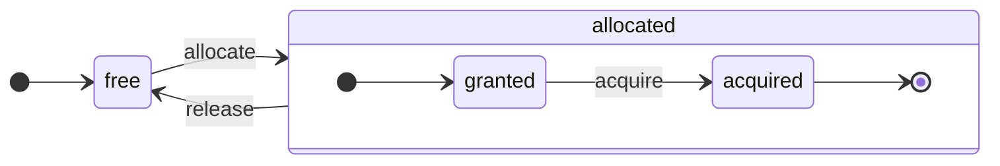

slug: '/development/architecture'
sidebar_label: 'アーキテクチャの概要'
sidebar_position: 50
keywords: 'ClickHouse,アーキテクチャ,DBMS,カラム指向'
description: 'ClickHouseのアーキテクチャに関する詳細な概要です。'
```


# アーキテクチャの概要

ClickHouseは真の列指向DBMSです。データはカラムによって保存され、配列（ベクターやカラムのチャンク）の実行中に処理されます。可能な限り、オペレーションは個々の値ではなく配列に対して行われます。これを「ベクタライズされたクエリ実行」と呼び、実際のデータ処理のコストを低減するのに役立ちます。

このアイデアは新しいものではありません。`APL`（A Programming Language, 1957）やその後継にさかのぼります：`A +`（APLダイアレクト）、`J`（1990）、`K`（1993）、および`Q`（Kx Systemsのプログラミング言語、2003）です。配列プログラミングは科学的データ処理で使用されます。このアイデアは、リレーショナルデータベースにおいても新しいものではありません。例えば、`VectorWise`システム（Actian CorporationのActian Vector Analytic Databaseとも呼ばれます）で使用されています。

クエリ処理を加速するためには、ベクタライズされたクエリ実行とランタイムコード生成の2つのアプローチがあります。後者はあらゆる間接参照と動的ディスパッチを除去します。これらのアプローチは、どちらが優れているかは明確ではありません。ランタイムコード生成は、多くのオペレーションを融合させる場合にはより良い結果を生むことができ、CPUの実行ユニットやパイプラインを完全に利用します。ベクタライズされたクエリ実行は、一時的なベクターを使用するため、L2キャッシュに収まらない場合は問題になりますが、CPUのSIMD機能をより簡単に活用します。友人たちが書いた[研究論文](http://15721.courses.cs.cmu.edu/spring2016/papers/p5-sompolski.pdf)では、両方のアプローチを組み合わせることが望ましいと示しています。ClickHouseは、ベクタライズされたクエリ実行を使用し、ランタイムコード生成に対して限られた初期サポートを持っています。

## カラム {#columns}

`IColumn`インターフェイスは、メモリ内のカラム（実際にはカラムのチャンク）を表すために使用されます。このインターフェイスは、さまざまなリレーショナルオペレーターの実装のためのヘルパーメソッドを提供します。ほとんどすべてのオペレーションは不変であり、元のカラムを変更するのではなく、新しい変更されたカラムを作成します。例えば、`IColumn :: filter`メソッドはフィルタバイトマスクを受け入れ、`WHERE`および`HAVING`リレーショナルオペレーターで使用されます。追加の例として、`IColumn :: permute`メソッドが`ORDER BY`をサポートし、`IColumn :: cut`メソッドが`LIMIT`をサポートします。

さまざまな`IColumn`実装（`ColumnUInt8`、`ColumnString`など）は、カラムのメモリレイアウトに責任を負っています。メモリレイアウトは通常、連続配列です。整数型のカラムの場合、これは単一の連続配列で、`std :: vector`のようになります。`String`や`Array`カラムの場合、これは2つのベクターから構成されます：1つはすべての配列要素を連続して配置し、もう1つは各配列の先頭へのオフセットを含みます。また、`ColumnConst`も存在し、メモリに単一の値を格納しますが、カラムのように見えます。

## フィールド {#field}

それにもかかわらず、個々の値で作業することも可能です。個々の値を表すために、`Field`が使用されます。`Field`は`UInt64`、`Int64`、`Float64`、`String`、および`Array`の効果的なユニオンにすぎません。`IColumn`は、n番目の値を`Field`として取得するための`operator []`メソッドと、`Field`をカラムの末尾に追加するための`insert`メソッドを持っています。これらのメソッドは、個々の値を表す一時的な`Field`オブジェクトを扱う必要があるため、あまり効率的ではありません。`insertFrom`、`insertRangeFrom`など、より効率的なメソッドもあります。

`Field`は、テーブルに対する特定のデータ型に関する十分な情報を持っていません。例えば、`UInt8`、`UInt16`、`UInt32`、および`UInt64`は、すべて`Field`内で`UInt64`として表されます。

## 漏れた抽象化 {#leaky-abstractions}

`IColumn`にはデータの一般的なリレーショナル変換のためのメソッドがありますが、すべてのニーズを満たしているわけではありません。例えば、`ColumnUInt64`には2つのカラムの合計を計算するメソッドがなく、`ColumnString`には部分文字列検索を実行するメソッドがありません。これらの数え切れないルーチンは、`IColumn`の外部で実装されています。

カラム上のさまざまな関数は、`IColumn`メソッドを使用して`Field`値を抽出する一般的で効率的でない方法で実装することも、特定の`IColumn`の実装におけるデータの内部メモリレイアウトの知識を使用して専門的な方法で実装することもできます。これは、特定の`IColumn`型に関数をキャストし、内部表現を直接処理することによって実装されます。例えば、`ColumnUInt64`には、内部配列への参照を返す`getData`メソッドがあり、次に別のルーチンがその配列を直接読み取ったり埋めたりします。我々は、さまざまなルーチンの効率的な特化を可能にする「漏れた抽象化」を持っています。

## データ型 {#data_types}

`IDataType`は、直列化と逆直列化を担当します：カラムのチャンクや個々の値をバイナリまたはテキスト形式で読み書きします。`IDataType`は、テーブル内のデータ型に直接対応しています。例えば、`DataTypeUInt32`、`DataTypeDateTime`、`DataTypeString`などがあります。

`IDataType`と`IColumn`は、互いにゆるやかに関連しています。異なるデータ型は、同じ`IColumn`実装でメモリに表現されることがあります。例えば、`DataTypeUInt32`と`DataTypeDateTime`は、どちらも`ColumnUInt32`または`ColumnConstUInt32`によって表現されます。さらに、同じデータ型は異なる`IColumn`実装によって表現されることがあります。例えば、`DataTypeUInt8`は`ColumnUInt8`または`ColumnConstUInt8`で表現されることができます。

`IDataType`はメタデータのみを格納します。例えば、`DataTypeUInt8`は何も格納しません（仮想ポインタ`vptr`を除く）し、`DataTypeFixedString`は固定サイズの文字列のサイズ`N`のみを格納します。

`IDataType`にはさまざまなデータ形式のヘルパーメソッドがあります。例として、引用符が付く可能性のある値を直列化する方法、JSON用に値を直列化する方法、およびXML形式の一部として値を直列化する方法があります。データ形式には直接対応関係はありません。例えば、異なるデータ形式`Pretty`と`TabSeparated`は、同じ`IDataType`インターフェイスから`serializeTextEscaped`ヘルパーメソッドを使用することができます。

## ブロック {#block}

`Block`は、メモリ内のテーブルのサブセット（チャンク）を表すコンテナです。それは、`(IColumn, IDataType, カラム名)`の三つ組のセットにすぎません。クエリ実行中にデータは`Block`によって処理されます。`Block`を持っている場合、`IColumn`オブジェクト内にデータがあり、そのカラムをどう扱うかを教える`IDataType`に関する情報もあり、カラム名があります。このカラム名は、テーブルの元のカラム名であるか、計算の一時的な結果を取得するために割り当てられた人工的な名前のいずれかです。

ブロック内のカラムに対して関数を計算する際には、その結果を持つ別のカラムをブロックに追加し、関数の引数のカラムには触れません。なぜなら、オペレーションは不変であるからです。後で、不必要なカラムはブロックから削除できますが、変更することはできません。これは共通の部分式を排除するために便利です。

ブロックは、処理されるすべてのデータチャンクのために作成されます。同じ型の計算の場合、異なるブロックに対してカラム名と型はそのまま維持され、カラムデータのみが変更されます。小さなブロックサイズでは、一時的な文字列のコピーや`shared_ptr`およびカラム名のために高いオーバーヘッドがありますので、ブロックデータとブロックヘッダーを分離する方が良いです。

## プロセッサ {#processors}

[https://github.com/ClickHouse/ClickHouse/blob/master/src/Processors/IProcessor.h](https://github.com/ClickHouse/ClickHouse/blob/master/src/Processors/IProcessor.h)の説明を参照してください。

## フォーマット {#formats}

データフォーマットはプロセッサで実装されています。

## I/O {#io}

バイト指向の入出力用に、`ReadBuffer`および`WriteBuffer`の抽象クラスがあります。これらはC++の`iostream`の代わりに使用されます。心配しないでください：成熟したC++プロジェクトでは、良い理由から`iostream`以外の何かが使用されています。

`ReadBuffer`および`WriteBuffer`は、連続バッファと、そのバッファ内の位置を指すカーソルです。実装によっては、バッファのメモリを所有することも、所有しないこともあります。バッファにデータを補充するための仮想メソッド（`ReadBuffer`用）や、どこかにバッファをフラッシュするためのメソッド（`WriteBuffer`用）があります。仮想メソッドはめったに呼び出されません。

`ReadBuffer`/`WriteBuffer`の実装は、ファイルやファイルディスクリプタ、ネットワークソケットでの作業、圧縮の実装（`CompressedWriteBuffer`は別のWriteBufferで初期化され、データを書く前に圧縮を行います）およびその他の目的に使用されます。名称`ConcatReadBuffer`、`LimitReadBuffer`、および`HashingWriteBuffer`はそれぞれ明白です。

Read/WriteBuffersはバイトのみを扱います。入力/出力のフォーマットを助けるために、`ReadHelpers`および`WriteHelpers`ヘッダーファイルからの関数があります。例えば、十進形式で数を記述するためのヘルパーがあります。

`JSON`形式で結果セットをstdoutに書き込もうとするとどうなるかを見てみましょう。
まず、プル型の`QueryPipeline`から取得する準備ができている結果セットがあります。
次に、バイトをstdoutに書き込むために`WriteBufferFromFileDescriptor(STDOUT_FILENO)`を作成します。
次に、クエリパイプラインからの結果を`JSONRowOutputFormat`に接続し、この`WriteBuffer`で初期化して、stdoutに`JSON`形式で行を書くようにします。
これは、プル型の`QueryPipeline`を完了した`QueryPipeline`に変換する`complete`メソッドを通じて行うことができます。
内部的に、`JSONRowOutputFormat`はさまざまなJSON区切りを記述し、`IDataType::serializeTextJSON`メソッドを呼び出し、`IColumn`および行番号を引数として渡します。その結果、`IDataType::serializeTextJSON`は`WriteHelpers.h`からのメソッドを呼び出します：例えば、数値型の`writeText`や、`DataTypeString`用の`writeJSONString`です。

## テーブル {#tables}

`IStorage`インターフェイスは、テーブルを表しています。このインターフェイスの異なる実装は異なるテーブルエンジンです。例には、`StorageMergeTree`、`StorageMemory`などがあります。これらのクラスのインスタンスは、単にテーブルです。

`IStorage`の主要なメソッドは、`read`および`write`、その他の`alter`、`rename`、および`drop`などのメソッドです。`read`メソッドは、次の引数を受け取ります：テーブルから読み取るカラムのセット、考慮すべき`AST`クエリ、および希望するストリームの数です。戻り値は`Pipe`です。

ほとんどの場合、readメソッドは、指定されたカラムをテーブルから読み取ることだけを担当し、それ以上のデータ処理は行いません。すべての後続のデータ処理は、`IStorage`の責任から外れたパイプラインの別の部分によって処理されます。

しかし、顕著な例外があります：

- ASTクエリは`read`メソッドに渡され、テーブルエンジンはそれを使用してインデックスの使用を導出し、テーブルからのデータの読み取り量を削減することができます。
- 時には、テーブルエンジンが特定のステージまでデータを処理することがあります。例えば、`StorageDistributed`はリモートサーバにクエリを送信し、データを異なるリモートサーバからマージできるステージまで処理するように依頼し、その前処理されたデータを返すことができます。クエリインタープリタは、その後データ処理を完了します。

テーブルの`read`メソッドは、複数の`Processors`から構成される`Pipe`を返すことができます。これらの`Processors`は、テーブルから並行してデータを読み取ることができます。次に、これらのプロセッサをさまざまな他の変換（式評価やフィルタリングなど）と接続することができ、これらは独立して計算できます。そして、その上に`QueryPipeline`を作成し、`PipelineExecutor`を介して実行します。

また`TableFunction`もあります。これらは、クエリの`FROM`句で使用するための一時的な`IStorage`オブジェクトを返す関数です。

テーブルエンジンを実装する方法について簡単にアイデアを得るために、`StorageMemory`や`StorageTinyLog`などのシンプルなものを見てください。

> `read`メソッドの結果として、`IStorage`は`QueryProcessingStage`（ストレージ内で既に計算されたクエリの部分に関する情報）を返します。

## パーサ {#parsers}

手動で書かれた再帰的下降パーサがクエリを解析します。例えば、`ParserSelectQuery`は、クエリのさまざまな部分に対して基になるパーサを再帰的に呼び出すだけです。パーサは`AST`を作成します。`AST`は`IAST`のインスタンスであるノードによって表現されます。

> パーサ生成機は歴史的理由から使用されていません。

## インタープリター {#interpreters}

インタープリターは、ASTからクエリ実行パイプラインを作成する責任があります。`InterpreterExistsQuery`や`InterpreterDropQuery`のようなシンプルなインタープリターと、より洗練された`InterpreterSelectQuery`があります。

クエリ実行パイプラインは、チャンク（特定の型のカラムのセット）を消費および生成できるプロセッサの組み合わせです。プロセッサはポートを介して通信し、複数の入力ポートと複数の出力ポートを持つことができます。詳細な説明は、[src/Processors/IProcessor.h](https://github.com/ClickHouse/ClickHouse/blob/master/src/Processors/IProcessor.h)で見つけることができます。

例えば、`SELECT`クエリの解釈結果は、結果セットを読み取るための特別な出力ポートを持つ「プル型」の`QueryPipeline`です。`INSERT`クエリの結果は、挿入のためのデータを書き込むための入力ポートを持つ「プッシュ型」の`QueryPipeline`です。また、`INSERT SELECT`クエリの解釈結果は、入力や出力を持たず、`SELECT`から`INSERT`へのデータを同時にコピーする「完了した」`QueryPipeline`です。

`InterpreterSelectQuery`は、クエリ分析と変換のために`ExpressionAnalyzer`および`ExpressionActions`の仕組みを使用しています。ここで、ほとんどのルールベースのクエリ最適化が実行されます。`ExpressionAnalyzer`は非常に複雑であり、再編成が必要です：さまざまなクエリ変換と最適化を別のクラスに抽出して、クエリのモジュラー変換を可能にする必要があります。

インタープリターに存在する問題に対処するために、新しい`InterpreterSelectQueryAnalyzer`が開発されました。これは、`ExpressionAnalyzer`を使用せず、`AST`と`QueryPipeline`の間に追加の抽象化層（`QueryTree`）を導入する新しいバージョンの`InterpreterSelectQuery`です。生産環境での使用に完全に準備されていますが、必要に応じて、`enable_analyzer`設定の値を`false`に設定することでオフにできます。

## 関数 {#functions}

通常の関数と集約関数があります。集約関数については、次のセクションを参照してください。

通常の関数は行数を変更せず、各行を独立して処理しているかのように動作します。実際には、関数は個々の行ではなく、データの`Block`を処理するために呼び出され、ベクタライズされたクエリ実行を実装します。

`[blockSize](/sql-reference/functions/other-functions#blockSize)`、`[rowNumberInBlock](/sql-reference/functions/other-functions#rowNumberInBlock)`、および`[runningAccumulate](/sql-reference/functions/other-functions#runningaccumulate)`などの雑多な関数は、ブロック処理を利用し、行の独立性を破ります。

ClickHouseは強い型付けを持つため、暗黙の型変換はありません。関数が特定の型の組み合わせをサポートしていない場合、例外がスローされます。しかし、関数は多くの異なる型の組み合わせに対して機能（オーバーロード）することができます。例えば、`plus`関数（`+`演算子を実装するため）は、任意の数値型の組み合わせに対して動作します：`UInt8` + `Float32`、`UInt16` + `Int8`などです。また、可変引数を受け入れる関数もあり、例えば`concat`関数などがあります。

関数を実装することはやや面倒ですが、関数はサポートされたデータ型とサポートされた`IColumns`を明示的にディスパッチします。例えば、`plus`関数は、各数値型の組み合わせ、定数または非定数の左および右の引数に対してC++テンプレートのインスタンス化によって生成されたコードを持っています。

テンプレートコードの膨張を避けるためにランタイムコード生成を実装する良い場所です。また、融合乗算加算のような融合関数を追加したり、1回のループイテレーションで複数の比較を行ったりすることが可能になります。

ベクタライズされたクエリ実行のために、関数は短絡されません。例えば、`WHERE f(x) AND g(y)`と書くと、両方の側が計算されます。`f(x)`がゼロである行に対しても計算されます（`f(x)`がゼロの定数式でない限り）。しかし、`f(x)`条件の選択性が高く、`f(x)`の計算が`g(y)`よりもはるかに安価である場合、マルチパス計算を実装する方が良いです。最初に`f(x)`を計算し、その結果によってカラムをフィルタリングし、次に`g(y)`を小さくフィルタリングされたデータチャンクに対してのみ計算します。

## 集約関数 {#aggregate-functions}

集約関数は状態を持つ関数です。これらは渡された値をいくつかの状態に蓄積し、その状態から結果を取得することができます。これらは`IAggregateFunction`インターフェイスによって管理されます。状態は非常に単純なこと（`AggregateFunctionCount`の状態は単一の`UInt64`値です）から、非常に複雑なこと（`AggregateFunctionUniqCombined`の状態は線形配列、ハッシュテーブル、および`HyperLogLog`確率的データ構造の組み合わせです）まであります。

状態は`Arena`（メモリプール）に割り当てられ、多数の状態を扱って高基数の`GROUP BY`クエリを実行します。状態には非トリビアルなコンストラクタとデストラクタがあることがあります：例えば、複雑な集約状態は、追加のメモリを自ら割り当てることができます。状態の作成と破棄、所有権の適切な渡し方と破棄順序には少し注意が必要です。

集約状態は、分散クエリ実行中にネットワークを介して渡したり、RAMの不足するディスクに書き込んだりするために、直列化および逆直列化することができます。集約データの増分集計を可能にするために、`DataTypeAggregateFunction`を持つテーブルに保存することもできます。

> 集約関数状態の直列化データ形式は、現在はバージョン管理されていません。集約状態が一時的に保存されるだけであるならば問題ありません。しかし、我々は増分集計のための`AggregatingMergeTree`テーブルエンジンを持っており、人々はすでにそれを生産環境で使用しています。これは、今後、任意の集約関数の直列化形式を変更する際に後方互換性が必要な理由です。

## サーバー {#server}

サーバーは、いくつかの異なるインターフェイスを実装しています：

- すべての外部クライアント用のHTTPインターフェイス。
- ネイティブClickHouseクライアントと、分散クエリ実行中のサーバ間通信用のTCPインターフェイス。
- レプリケーション用のデータ転送インターフェイス。

内部的には、コルーチンやファイバーを使用しない原始的なマルチスレッドサーバーにすぎません。サーバーは、高速な単純クエリの処理ではなく、比較的低速の複雑なクエリの処理を目的としていますので、それぞれが分析のために大量のデータを処理できます。

サーバーは、クエリ実行のための必要な環境を持つ`Context`クラスを初期化します：利用可能なデータベース、ユーザーおよびアクセス権、設定、クラスター、プロセスリスト、クエリログなどのリスト。インタープリターはこの環境を使用します。

我々は、サーバーTCPプロトコルの完全な前方および後方互換性を維持しています：古いクライアントは新しいサーバーと対話でき、新しいクライアントは古いサーバーと対話できます。しかし、我々はそれを永遠には維持したくなく、約1年後に古いバージョンのサポートを削除します。

:::note
ほとんどの外部アプリケーションには、HTTPインターフェイスの使用を推奨しています。なぜなら、それは単純で扱いやすいからです。TCPプロトコルは、内部データ構造により密接に保持されます：データブロックを渡すための内部形式を使用し、圧縮データのためにカスタムフレーミングを使用します。我々は、このプロトコル用のCライブラリをリリースしていません。なぜなら、それはClickHouseコードベースのほとんどをリンクする必要があり、実用的ではないからです。
:::

## 設定 {#configuration}

ClickHouse ServerはPOCO C++ライブラリを基にしており、設定を表すために`Poco::Util::AbstractConfiguration`を使用しています。設定は、`DaemonBase`クラスから継承された`Poco::Util::ServerApplication`クラスによって保持され、このクラスは`DB::Server`クラスを実装し、clickhouse-server自体を実装しています。したがって、設定は`ServerApplication::config()`メソッドを介してアクセスできます。

設定は複数のファイル（XMLまたはYAML形式）から読み取られ、`ConfigProcessor`クラスによって単一の`AbstractConfiguration`に統合されます。設定はサーバー起動時に読み込まれ、設定ファイルの1つが更新、削除、または追加された場合に後で再読み込みできます。`ConfigReloader`クラスは、これらの変更を定期的に監視し、再読み込み手順を担当します。`SYSTEM RELOAD CONFIG`クエリも設定の再読み込みをトリガーします。

サーバー設定以外のクエリやサブシステムは、`Context::getConfigRef()`メソッドを使用してアクセスできます。サーバーの再起動なしに設定を再読み込みできるサブシステムは、`Server::main()`メソッドの再読み込みコールバックに登録する必要があります。新しい設定にエラーがある場合、ほとんどのサブシステムは新しい設定を無視し、警告メッセージをログに記録し、以前に読み込まれた設定で動作を続けます。`AbstractConfiguration`の性質により、特定のセクションへの参照を渡すことはできませんので、`String config_prefix`が通常使用されます。

## スレッドとジョブ {#threads-and-jobs}

クエリを実行し、副次的な活動を行うために、ClickHouseは頻繁なスレッドの作成と破棄を避けるために、スレッドプールからスレッドを割り当てます。目的とジョブの構造に応じて、いくつかのスレッドプールがあります：
  * クライアントセッションのためのサーバープール。
  * 一般的なジョブやバックグラウンド活動、スタンドアロンスレッドのためのグローバルスレッドプール。
  * 主にIOでブロックされ、CPU集約的ではないジョブのためのIOスレッドプール。
  * 定期タスクのためのバックグラウンドプール。
  * ステップに分割できる事前割り当て可能なタスクのためのプール。

サーバープールは`Poco::ThreadPool`クラスのインスタンスで、`Server::main()`メソッドで定義されています。最大`max_connection`スレッドを持つことができます。各スレッドは単一のアクティブ接続に専念しています。

グローバルスレッドプールは`GlobalThreadPool`シングルトンクラスです。これからスレッドを割り当てるために`ThreadFromGlobalPool`が使用されます。これは`std::thread`に似たインターフェイスを持っていて、グローバルプールからスレッドを取り出し、必要な初期化を行います。設定は次の条件で構成されます：
  * `max_thread_pool_size` - プール内のスレッド数の制限。
  * `max_thread_pool_free_size` - 新しいジョブを待つアイドルスレッド数の制限。
  * `thread_pool_queue_size` - スケジュールされたジョブの数の制限。

グローバルプールは汎用であり、以下に説明するすべてのプールはそれを基に実装されています。これはプールの階層と考えることができます。あらゆる専門的なプールは、`ThreadPool`クラスを使用してグローバルプールからスレッドを取り出します。このため、任意の専門的なプールの主な目的は、同時ジョブの数を制限し、ジョブスケジューリングを行うことです。スレッドプール内のスレッド数を超える多くのジョブがスケジュールされると、`ThreadPool`は優先順位付きのキューにジョブを蓄積します。各ジョブには整数の優先度があります。デフォルトの優先度はゼロです。優先度が高いジョブは、優先度が低いジョブよりも早く開始されます。ただし、すでに実行中のジョブ間には差はなく、したがって優先度はプールが過負荷のときだけ意味を持ちます。

IOスレッドプールは、`IOThreadPool::get()`メソッドを介してアクセスできる通常の`ThreadPool`として実装されています。これも、`max_io_thread_pool_size`、`max_io_thread_pool_free_size`、`io_thread_pool_queue_size`設定でグローバルプールと同様に構成されています。IOスレッドプールの主な目的は、IOジョブでグローバルプールの枯渇を避け、クエリがCPUを十分に活用できることを確保することです。S3へのバックアップは大量のIO操作を伴い、インタラクティブなクエリへの影響を避けるために、`max_backups_io_thread_pool_size`、`max_backups_io_thread_pool_free_size`、`backups_io_thread_pool_queue_size`設定で構成された別の`BackupsIOThreadPool`があります。

定期タスクの実行には`BackgroundSchedulePool`クラスがあります。これには`BackgroundSchedulePool::TaskHolder`オブジェクトを使用してタスクを登録し、プールは同時に2つのジョブを実行しないことを保証します。また、タスクの実行を将来の特定の瞬間まで延期したり、一時的に無効にしたりすることも可能です。グローバル`Context`は、さまざまな目的に対してこのクラスのいくつかのインスタンスを提供します。一般目的タスクには`Context::getSchedulePool()`が使用されます。

事前割り当て可能なタスクのための特化されたスレッドプールもあります。このような`IExecutableTask`タスクは、順序付きのジョブのシーケンスに分割できる場合があります。このタスクをスケジュールすることで、短いタスクが長いタスクよりも優先されるようにするために`MergeTreeBackgroundExecutor`が使用されます。名前の通り、マージ、ミューテーション、フェッチ、移動などのバックグラウンドMergeTree関連の操作に使用されます。プールのインスタンスは、`Context::getCommonExecutor()`や同様のメソッドを介して使用できます。

ジョブにどのプールが使用されているかに関係なく、開始時にそのジョブのための`ThreadStatus`インスタンスが作成されます。これは、スレッドごとのすべての情報をカプセル化します：スレッドID、クエリID、パフォーマンスカウンター、リソース消費、その他の多くの有用なデータ。ジョブは`CurrentThread::get()`呼び出しを介してスレッドローカルポインタを使用してこれにアクセスできるため、各関数にそれを渡す必要はありません。

スレッドがクエリ実行に関連している場合、`ThreadStatus`に添付される最も重要なことは、クエリコンテキスト`ContextPtr`です。すべてのクエリには、サーバープール内にそのマスタースレッドがあります。マスタースレッドは`ThreadStatus::QueryScope query_scope(query_context)`オブジェクトを保持することでアタッチします。マスタースレッドはまた、`ThreadGroupStatus`オブジェクトで表されるスレッドグループを作成します。このクエリ実行中に割り当てられる追加のスレッドは、`CurrentThread::attachTo(thread_group)`呼び出しによってそのスレッドグループに添付されます。スレッドグループは、プロファイルイベントカウンターを集約し、単一のタスクに専念するすべてのスレッドによるメモリ消費を追跡するために使用されます（詳細については、`MemoryTracker`および`ProfileEvents::Counters`クラスを参照してください）。

## 同時実行制御 {#concurrency-control}

並列化できるクエリは、`max_threads`設定を使用して自らを制限します。この設定のデフォルト値は、単一のクエリがすべてのCPUコアを最適に利用できるように選ばれています。しかし、複数の同時クエリがあり、各クエリがデフォルトの`max_threads`設定値を使用している場合、クエリはCPUリソースを共有します。OSは、公平性を確保するためにスレッドを常に切り替え、これによりパフォーマンスのペナルティが発生します。`ConcurrencyControl`は、このペナルティに対処し、多くのスレッドを割り当てるのを防ぎます。設定項目`concurrent_threads_soft_limit_num`は、どの程度の同時スレッドが割り当てられるかを制限するために使用されます。

CPU `スロット`概念が導入されています。スロットは同時実行性の単位です：スレッドを実行するためには、事前にスロットを取得し、スレッドが停止するとスロットを解放しなければなりません。スロットの数はサーバー内で全体的に制限されています。合計の需要が全体のスロット数を超えると、複数の同時クエリがCPUスロットを競い合います。`ConcurrencyControl`は、この競争を公正に解決することが求められます。

各スロットは、次の状態を持つ独立した状態機械のように見ることができます：
 * `free`：スロットは、任意のクエリによって割り当て可能です。
 * `granted`：スロットは特定のクエリによって`allocated`されていますが、まだいかなるスレッドにも取得されていません。
 * `acquired`：スロットは特定のクエリによって`allocated`され、スレッドによって取得されています。

なお、`allocated`スロットは、`granted`と`acquired`の2つの異なる状態のどちらかにある場合があります。前者は遷移状態であり、実際には短いはずです（スロットがクエリに割り当てられた瞬間から、他のスレッドによってアップスケーリングプロシージャが実行されるまでの間）。



`ConcurrencyControl`のAPIは、次の関数から構成されます：
1. クエリのためのリソース割り当てを作成します：`auto slots = ConcurrencyControl::instance().allocate(1, max_threads);`。これは、少なくとも1つ、最大で`max_threads`のスロットを割り当てます。最初のスロットは即座に付与されますが、残りのスロットは後で付与される場合があります。したがって、制限はソフトであり、すべてのクエリは少なくとも1つのスレッドを取得します。
2. 各スレッドは、割り当てからスロットを取得する必要があります：`while (auto slot = slots->tryAcquire()) spawnThread([slot = std::move(slot)] { ... });`。
3. スロットの全体の量を更新します：`ConcurrencyControl::setMaxConcurrency(concurrent_threads_soft_limit_num)`。これは、ランタイム中に行えます。サーバーの再起動は不要です。

このAPIにより、クエリは少なくとも1つのスレッド（CPU圧力がある場合でも）で開始し、その後`max_threads`まで拡張できます。
```
```yaml
title: '分散クエリの実行'
sidebar_label: '分散クエリの実行'
keywords: '分散クエリ, ClickHouse, クラスタ'
description: 'ClickHouseにおける分散クエリの実行に関する詳細な説明'
```

## 分散クエリの実行 {#distributed-query-execution}

クラスタ設定内のサーバーはほとんど独立しています。クラスタ内の1つまたはすべてのサーバーに `Distributed` テーブルを作成できます。`Distributed` テーブル自体はデータを保存せず、クラスタの複数ノード内のすべてのローカルテーブルへの「ビュー」を提供するだけです。`Distributed` テーブルから `SELECT` を行うと、そのクエリは書き換えられ、負荷分散設定に従ってリモートノードを選択し、クエリを送信します。`Distributed` テーブルは、リモートサーバーにクエリを処理させ、異なるサーバーからの中間結果をマージできる段階まで要求します。そして、中間結果を受け取り、それらをマージします。分散テーブルは、可能な限りリモートサーバーに作業を分散させ、大量の中間データをネットワーク上で送信しないようにします。

IN または JOIN 句にサブクエリがあると、事態はさらに複雑になります。それぞれが `Distributed` テーブルを使用しているからです。これらのクエリの実行には異なる戦略があります。

分散クエリの実行に対するグローバルクエリプランはありません。各ノードは、そのタスクの一部に対するローカルクエリプランを持っています。私たちが持っているのは、単純な一様分散クエリ実行のみです：リモートノードにクエリを送信し、次に結果をマージします。しかしこれは、高基数の `GROUP BY` や JOIN に大量の一時データがあるような複雑なクエリには適していません。このような場合、サーバー間でデータを「再シャッフル」する必要があり、追加の調整が必要です。ClickHouseはその種のクエリ実行をサポートしておらず、その改善に取り組む必要があります。

## Merge Tree {#merge-tree}

`MergeTree` は、主キーによるインデックス付けをサポートするストレージエンジンのファミリーです。主キーは、任意のカラムまたは式のタプルであることができます。`MergeTree` テーブル内のデータは「パーツ」に保存されます。各パーツは、主キーの順序でデータを保存するため、データは主キータプルによって辞書順に整列されます。テーブルのすべてのカラムは、これらのパーツ内の別々の `column.bin` ファイルに保存されます。ファイルは圧縮されたブロックで構成されています。各ブロックは通常、平均値サイズに応じて、64 KBから1 MBの未圧縮データで構成されています。ブロックは、カラム値が連続して配置されています。各カラムのカラム値は同じ順序になっているため（主キーが順序を定義します）、多くのカラムをイテレートすると、それに対応する行の値を取得できます。

主キー自体は「スパース」です。すべての行をアドレス指定するのではなく、特定のデータ範囲のみをアドレス指定します。別々の `primary.idx` ファイルには、各N番目の行の主キーの値が含まれており、Nは `index_granularity` と呼ばれます（通常、N = 8192）。また、各カラムについて、データファイル内の各N番目の行へのオフセットである「マーク」を持つ `column.mrk` ファイルがあります。各マークは、圧縮ブロックの先頭へのオフセットと、データの先頭へのオフセットからなるペアです。通常、圧縮ブロックはマークによって整列され、デコンプレッションされたブロック内のオフセットはゼロです。`primary.idx` のデータは常にメモリ内に存在し、`column.mrk` ファイルのデータはキャッシュされます。

`MergeTree` の部分から何かを読み込む予定のとき、`primary.idx` データを見て要求されたデータを含む可能性のある範囲を特定し、次に `column.mrk` データを見てそれらの範囲を読み始めるオフセットを計算します。スパース性のために、余分なデータが読み込まれる可能性があります。ClickHouseは単純なポイントクエリの高負荷には適していません。というのも、各キーについて、`index_granularity` 行の全範囲を読み込む必要があり、各カラムについて全圧縮ブロックをデコンプレッションする必要があるからです。私たちは、主キーのスパース性により、目立つメモリ消費なしでトリリオン行を単一サーバーごとに維持できる必要があるため、インデックスをスパースにしました。また、主キーはスパースであるため、一意ではなく、INSERT時にテーブル内のキーの存在をチェックできません。テーブル内に同じキーを持つ多くの行が存在する可能性があります。

`MergeTree` に大量のデータを `INSERT` すると、そのバッチは主キー順でソートされ、新しいパーツを形成します。バックグラウンドスレッドは、定期的にいくつかのパーツを選択し、それらを1つのソートされたパーツにマージして、パーツの数を比較的低く保ちます。だからこそ、`MergeTree` と呼ばれています。もちろん、マージは「書き込みの増幅」を引き起こします。すべてのパーツは不変です：それらは新しく作成され、削除されるだけで、変更されません。SELECTが実行されると、テーブルのスナップショット（パーツのセット）を保持します。マージ後、障害からの回復を容易にするために、古いパーツもしばらく保持されます。したがって、マージされたパーツが破損している可能性があると判断された場合、そのパーツをソースパーツで置き換えることができます。

`MergeTree` は LSM ツリーではありません。なぜなら、MEMTABLE や LOG を含まず、挿入されたデータがファイルシステムに直接書き込まれるからです。この動作は、バッチでデータを挿入するのに `MergeTree` がより適していることを意味します。そのため、少量の行を頻繁に挿入するのは `MergeTree` にとって理想的ではありません。例えば、1秒あたり数行は問題ありませんが、1秒あたり千回挿入するのは最適ではありません。しかし、小規模挿入を克服するための非同期挿入モードがあります。私たちはこの方法を採用したのは、シンプルさのためであり、すでにアプリケーションでバッチ挿入を行っているからです。

バックグラウンドマージの間に追加作業を行う MergeTree エンジンもあります。例としては、`CollapsingMergeTree` や `AggregatingMergeTree` があります。これは、更新を特別にサポートするものと見なされる場合があります。これらはリアルな更新ではないことに注意してください。なぜなら、ユーザーは通常、バックグラウンドマージが実行される時間を制御できず、`MergeTree` テーブルのデータはほとんど常に1つ以上のパーツに保存され、完全にマージされた形ではないからです。

## レプリケーション {#replication}

ClickHouseにおけるレプリケーションは、テーブルごとに設定できます。同じサーバー上で、一部のテーブルをレプリケートし、一部のテーブルをレプリケートしないということが可能です。また、2要素レプリケーションのテーブルと3要素レプリケーションのテーブルなど、異なる方法でレプリケートされたテーブルも持つことができます。

レプリケーションは、`ReplicatedMergeTree` ストレージエンジンで実装されています。`ZooKeeper` 内のパスは、ストレージエンジンのパラメータとして指定されます。`ZooKeeper` 内で同じパスを持つすべてのテーブルは互いのレプリカとなり、データを同期し、一貫性を維持します。レプリカは、テーブルを作成または削除することによって動的に追加および削除できます。

レプリケーションは非同期のマルチマスター方式を使用しています。`ZooKeeper` とセッションがある任意のレプリカにデータを挿入でき、データは非同期で他のすべてのレプリカにレプリケートされます。ClickHouseはUPDATEをサポートしていないため、レプリケーションは競合がありません。デフォルトでは挿入についての多数決の承認がないため、あるノードが失敗した場合、直近に挿入されたデータが失われる可能性があります。`insert_quorum` 設定を使用することで挿入のクォーラムを有効にできます。

レプリケーションのメタデータはZooKeeperに保存されています。どのようなアクションを行うべきかを示すレプリケーションログがあります。アクションには、パーツの取得、パーツのマージ、パーティションの削除などがあります。各レプリカは、レプリケーションログをキューにコピーし、次にそのキューからアクションを実行します。例えば、挿入時に「パーツを取得する」というアクションがログに作成され、すべてのレプリカがそのパーツをダウンロードします。マージは、バイト同一の結果を得るためにレプリカ間で調整されます。すべてのパーツは、すべてのレプリカで同じ方法でマージされます。一部のリーダーは、新しいマージを最初に開始し、「パーツをマージする」アクションをログに書き込みます。複数のレプリカ（またはすべて）が同時にリーダーになることができます。レプリカがリーダーになるのを防ぐために、`merge_tree` 設定 `replicated_can_become_leader` を使用できます。リーダーはバックグラウンドマージのスケジュールを管理します。

レプリケーションは物理的です。ノード間で転送されるのは圧縮されたパーツのみで、クエリは転送されません。マージは、ほとんどのケースで各レプリカで独立して処理され、ネットワークの増幅を回避することによってネットワークコストを低下させます。大きなマージパーツは、重要なレプリケーション遅延がある場合にのみネットワークを介して送信されます。

加えて、各レプリカは、自身の状態を ZooKeeper にパーツのセットとそのチェックサムとして保存します。ローカルファイルシステムの状態が ZooKeeper の参照状態と異なる場合、レプリカは他のレプリカから欠落または破損したパーツをダウンロードして、一貫性を回復します。ローカルファイルシステムに予期しないまたは破損したデータがある場合、ClickHouseはそれを削除せず、別のディレクトリに移動して忘れます。

:::note
ClickHouse クラスタは独立したシャードで構成され、各シャードはレプリカで構成されています。このクラスタは**弾力的ではなく**、新しいシャードを追加した後、データはシャード間で自動的に再バランスされません。むしろ、クラスタの負荷は不均等に調整されることが想定されています。この実装により、より多くの制御を得ることができ、数十のノードのような比較的小さなクラスタには適しています。しかし、私たちが本番環境で使用している数百のノードを持つクラスタにとっては、このアプローチは大きな欠点となります。私たちは、動的にレプリケートされた領域を持ち、シャード間で自動的に分割およびバランスされるテーブルエンジンを実装する必要があります。
:::
