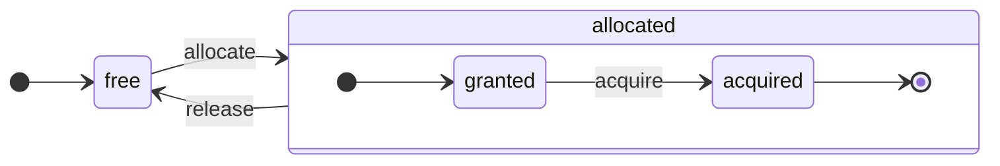

description: 'ClickHouseアーキテクチャとその列指向設計の包括的な概要'
sidebar_label: 'アーキテクチャの概要'
sidebar_position: 50
slug: /development/architecture
title: 'アーキテクチャの概要'
```


# アーキテクチャの概要

ClickHouseは真の列指向DBMSです。データはカラムごとに保存され、配列（カラムのベクトルまたはチャンク）の実行中に処理されます。
可能な限り、操作は個々の値ではなく、配列に対して分配されます。
これは「ベクトル化クエリ実行」と呼ばれ、実際のデータ処理コストを削減するのに役立ちます。

このアイデアは新しいものではありません。
`APL`（プログラミング言語、1957年）やその子孫、`A +`（APL方言）、`J`（1990年）、`K`（1993年）、および`Q`（Kx Systemsのプログラミング言語、2003年）にまで遡ります。
アレイプログラミングは科学的データ処理に使用されます。このアイデアはリレーショナルデータベースにおいても新しいものではありません。たとえば、`VectorWise`システム（Actian CorporationによるActian Vector Analytics Databaseとも呼ばれる）で使用されています。

クエリ処理を高速化するための二つの異なるアプローチがあります：ベクトル化クエリ実行とランタイムコード生成です。後者はすべての間接参照と動的ディスパッチを排除します。これらのアプローチのいずれかが他よりも優れているというわけではありません。ランタイムコード生成は、多くの操作を融合し、CPU実行ユニットとパイプラインを完全に活用する場合には優れていることがあります。ベクトル化クエリ実行は一時的なベクトルを扱うため、L2キャッシュに収まらない場合に問題が生じることがあります。しかし、ベクトル化クエリ実行はCPUのSIMD機能をより容易に活用することができます。友人たちが書いた[研究論文](http://15721.courses.cs.cmu.edu/spring2016/papers/p5-sompolski.pdf)は、両方のアプローチを組み合わせることがより良いことを示しています。ClickHouseはベクトル化クエリ実行を使用し、ランタイムコード生成の初期サポートを限られた形で持っています。

## カラム {#columns}

`IColumn`インターフェースはメモリ内のカラム（実際にはカラムのチャンク）を表現するために使用されます。このインターフェースは、さまざまなリレーショナル演算子の実装のためのヘルパーメソッドを提供します。ほとんどの操作は不変であり、元のカラムを変更するのではなく、新しい修正されたカラムを作成します。たとえば、`IColumn :: filter`メソッドはフィルタバイトマスクを受け取ります。これは`WHERE`や`HAVING`リレーショナル演算子で使用されます。追加の例として、`ORDER BY`をサポートするための`IColumn :: permute`メソッド、`LIMIT`をサポートするための`IColumn :: cut`メソッドがあります。

さまざまな`IColumn`の実装（`ColumnUInt8`、`ColumnString`など）は、カラムのメモリレイアウトを担当します。メモリレイアウトは通常、連続した配列です。整数型のカラムの場合、それは一つの連続配列、`std :: vector`のようなものです。`String`や`Array`のカラムの場合、すべての配列要素を連続して配置する一つのベクトルと、各配列の始まりへのオフセットのための第二のベクトルの二つになります。また、メモリにただ一つの値を保存する`ColumnConst`もありますが、カラムのように見えます。

## フィールド {#field}

とはいえ、個々の値を扱うことも可能です。個々の値を表すために、`Field`が使用されます。`Field`は`UInt64`、`Int64`、`Float64`、`String`、および`Array`の裁別された和です。`IColumn`は、n番目の値を`Field`として取得するための`operator []`メソッドを持ち、カラムの末尾に`Field`を追加するための`insert`メソッドを持っています。これらのメソッドは、個々の値を表す一時的な`Field`オブジェクトを扱うため、あまり効率的ではありません。`insertFrom`、`insertRangeFrom`などのより効率的なメソッドがあります。

`Field`はテーブルの特定のデータ型に関する十分な情報を持っていません。例えば、`UInt8`、`UInt16`、`UInt32`、`UInt64`はすべて`Field`内で`UInt64`として表されます。

## 漏れ出る抽象 {#leaky-abstractions}

`IColumn`にはデータの一般的なリレーショナル変換のためのメソッドがありますが、それらはすべてのニーズを満たすわけではありません。例えば、`ColumnUInt64`には二つのカラムの合計を計算するメソッドがなく、`ColumnString`には部分文字列検索を実行するメソッドがありません。これらの無数のルーチンは`IColumn`の外部で実装されています。

カラムに対するさまざまな関数は、`IColumn`メソッドを使用して`Field`値を抽出する一般的かつ非効率的な方法で、または特定の`IColumn`実装のデータの内部メモリレイアウトの知識を使用して専門的に実装できます。これは、特定の`IColumn`型にキャストされた関数を通じて行われ、内部表現を直接扱います。たとえば、`ColumnUInt64`には内部配列への参照を返す`getData`メソッドがあり、その後、別のルーチンがその配列を直接読み取ったり填補したりします。我々には、さまざまなルーチンの効率的な特化を可能にする「漏れ出る抽象」があります。

## データ型 {#data_types}

`IDataType`はシリアル化とデシリアル化を担当します。カラムのチャンクまたは個々の値をバイナリまたはテキスト形式で読み書きすることです。`IDataType`はテーブル内のデータ型に直接対応しています。例えば、`DataTypeUInt32`、`DataTypeDateTime`、`DataTypeString`などです。

`IDataType`と`IColumn`は互いに緩く関連しています。異なるデータ型は同じ`IColumn`実装によってメモリ内に表現されることがあります。例えば、`DataTypeUInt32`と`DataTypeDateTime`はどちらも`ColumnUInt32`または`ColumnConstUInt32`によって表されます。また、同じデータ型は異なる`IColumn`実装によって表される場合があります。例えば、`DataTypeUInt8`は`ColumnUInt8`または`ColumnConstUInt8`によって表されることがあります。

`IDataType`はメタデータのみを保持します。例えば、`DataTypeUInt8`は何も保存せず（仮想ポインタ`vptr`を除く）、`DataTypeFixedString`は固定サイズの文字列のサイズ`N`を保存します。

`IDataType`にはさまざまなデータ形式のためのヘルパーメソッドがあります。例として、値を可能なクオートをつけてシリアル化するメソッド、JSONのために値をシリアル化するメソッド、XML形式の一部として値をシリアル化するメソッドがあります。データ形式には直接の対応はありません。例えば、異なるデータ形式`Pretty`と`TabSeparated`は、`IDataType`インターフェースから同じ`serializeTextEscaped`ヘルパーメソッドを使用することができます。

## ブロック {#block}

`Block`は、メモリ内のテーブルのサブセット（チャンク）を表すコンテナです。これは単に三つ組のセットです：`(IColumn, IDataType, カラム名)`。クエリ実行中、データは`Block`によって処理されます。`Block`があると、データ（`IColumn`オブジェクト内）、その型に関する情報（`IDataType`内）、そしてカラム名があります。それはテーブルからの元のカラム名または計算の一時的な結果を得るために割り当てられた人工的な名前のいずれかです。

ブロック内のカラムに対して関数を計算する場合、ブロックにその結果を持つ別のカラムを追加し、関数の引数であるカラムには手を触れません。操作は不変だからです。後で不要なカラムをブロックから削除できますが、変更することはできません。これは共通の部分式を排除するのに便利です。

ブロックは処理されたデータの各チャンクごとに作成されます。同じタイプの計算に対しては、カラム名と型が異なるブロックに対して同じままとなり、カラムデータのみが変更されます。ブロックデータとブロックヘッダーを分割することが望ましいです。小さなブロックサイズには、shared_ptrやカラム名のコピーに対する一時的な文字列の高いオーバーヘッドがあります。

## プロセッサ {#processors}

[https://github.com/ClickHouse/ClickHouse/blob/master/src/Processors/IProcessor.h](https://github.com/ClickHouse/ClickHouse/blob/master/src/Processors/IProcessor.h)での説明を参照してください。

## フォーマット {#formats}

データフォーマットはプロセッサで実装されています。

## I/O {#io}

バイト指向の入出力用に、`ReadBuffer`と`WriteBuffer`の抽象クラスがあります。これらはC++の`iostream`の代わりに使用されます。心配しないでください：すべての成熟したC++プロジェクトは良い理由から`iostream`以外の何かを使用しています。

`ReadBuffer`と`WriteBuffer`は、連続バッファとそのバッファ内の位置を指し示すカーソルに過ぎません。実装がバッファのためのメモリを所有する場合もない場合もあります。バッファを次のデータで満たすための仮想メソッド（`ReadBuffer`用）または、どこかにバッファをフラッシュするためのメソッド（`WriteBuffer`用）があります。仮想メソッドはまれに呼び出されます。

`ReadBuffer`/`WriteBuffer`の実装は、ファイルやファイルディスクリプタ、ネットワークソケットでの作業、圧縮の実装（`CompressedWriteBuffer`は別のWriteBufferで初期化され、データを書き込む前に圧縮を行います）、および他の目的のために使用されます。`ConcatReadBuffer`、`LimitReadBuffer`、および`HashingWriteBuffer`という名前はそれ自体が示す通りです。

Read/WriteBuffersはバイトだけを扱います。入力/出力のフォーマットを支援するための`ReadHelpers`および`WriteHelpers`ヘッダーファイルからの関数があります。たとえば、数値を10進形式で書き込むためのヘルパーがあります。

`JSON`形式で結果セットを`stdout`に書き込もうとした場合に何が起きるかを確認しましょう。
まず、クエリパイプラインからフェッチする準備が整った結果セットがあります。
次に、`WriteBufferFromFileDescriptor(STDOUT_FILENO)`を作成し、`stdout`にバイトを書き込みます。
次に、クエリパイプラインからの結果を、`JSONRowOutputFormat`に接続します。これはその`WriteBuffer`で初期化され、`stdout`に`JSON`形式で行を書き込みます。
これは、プル型の`QueryPipeline`を完了された`QueryPipeline`に変える`complete`メソッドを通じて行うことができます。
内部的に、`JSONRowOutputFormat`はさまざまなJSON区切りをから書き込み、`IDataType::serializeTextJSON`メソッドを`IColumn`への参照および行番号を引数として呼び出します。結果として、`IDataType::serializeTextJSON`は`WriteHelpers.h`のメソッドを呼び出します：例えば、数値型の場合は`writeText`、`DataTypeString`の場合は`writeJSONString`です。

## テーブル {#tables}

`IStorage`インターフェースはテーブルを表現します。このインターフェースの異なる実装は異なるテーブルエンジンです。例としては`StorageMergeTree`、`StorageMemory`などがあります。これらのクラスのインスタンスはテーブルに過ぎません。

`IStorage`の主要なメソッドは`read`と`write`であり、`alter`、`rename`、`drop`などの他のメソッドもあります。`read`メソッドは、テーブルから読み取るカラムのセット、考慮する`AST`クエリ、および希望するストリームの数という引数を受け取ります。戻り値は`Pipe`です。

ほとんどの場合、readメソッドはテーブルから指定されたカラムを読み取ることだけを担当し、その後のデータ処理は`IStorage`の責任の範囲外で行われます。

しかし、顕著な例外もあります：

- ASTクエリは`read`メソッドに渡され、テーブルエンジンはこれを使用してインデックスの使用を導き出し、テーブルからより少ないデータを読み取ることができます。
- 時には、テーブルエンジンが特定のステージまでデータを自分で処理することがあります。たとえば、`StorageDistributed`はリモートサーバーにクエリを送信し、異なるリモートサーバーからのデータをマージすることができるステージまで処理を依頼し、その前処理済みデータを返します。その後、クエリインタープリターがデータ処理を完了します。

テーブルの`read`メソッドは、複数の`Processors`から成る`Pipe`を返すことがあります。これらの`Processors`はテーブルから並行して読み取ることができます。
その後、さまざまな他の変換（式評価やフィルタリングなど）と接続でき、それらは独立して計算できます。
そして、それらの上に`QueryPipeline`を作成し、`PipelineExecutor`を介して実行します。

また、`TableFunction`もあります。これらは、クエリの`FROM`句で使用するための一時的な`IStorage`オブジェクトを返す関数です。

テーブルエンジンを実装する方法のアイデアを得るために、シンプルな何か、例えば`StorageMemory`や`StorageTinyLog`を見てください。

> `read`メソッドの結果として、`IStorage`は`QueryProcessingStage`を返します - ストレージ内で既に計算されたクエリの部分に関する情報です。

## パーサー {#parsers}

手書きの再帰的下降パーサーがクエリをパースします。例えば、`ParserSelectQuery`は単にクエリのさまざまな部分のための基礎となるパーサーを再帰的に呼び出します。パーサーは`AST`を作成します。`AST`はノードによって表現され、これらは`IAST`のインスタンスです。

> パーサ生成器は歴史的な理由から使用されません。

## インタープリター {#interpreters}

インタープリターはASTからクエリ実行パイプラインを作成する責任があります。`InterpreterExistsQuery`や`InterpreterDropQuery`のような単純なインタープリターもあれば、より高度な`InterpreterSelectQuery`もあります。

クエリ実行パイプラインは、チャンク（特定の型のカラムのセット）を消費したり生産したりできるプロセッサの組み合わせです。
プロセッサはポートを介して通信し、複数の入力ポートと複数の出力ポートを持つことができます。
より詳細な説明は[src/Processors/IProcessor.h](https://github.com/ClickHouse/ClickHouse/blob/master/src/Processors/IProcessor.h)にあります。

例えば、`SELECT`クエリの解釈の結果は、結果セットを読み取るための特別な出力ポートを持つ「プル型」の`QueryPipeline`です。
`INSERT`クエリの結果は、挿入のためのデータを書くための入力ポートを持つ「プッシュ型」の`QueryPipeline`です。
そして、`INSERT SELECT`クエリの解釈の結果は、入力や出力がない「完了した」`QueryPipeline`で、同時に`SELECT`から`INSERT`にデータをコピーします。

`InterpreterSelectQuery`は、クエリ分析と変換のために`ExpressionAnalyzer`と`ExpressionActions`を使用します。ここで、ほとんどのルールベースのクエリ最適化が行われます。`ExpressionAnalyzer`は非常に煩雑で、書き直す必要があります：さまざまなクエリの変換と最適化は、クエリのモジュール化された変換を可能にするために、別のクラスに抽出されるべきです。

インタープリターに存在する問題に対処するために、新しい`InterpreterSelectQueryAnalyzer`が開発されました。これは、`ExpressionAnalyzer`を使用せず、`AST`と`QueryPipeline`の間に`QueryTree`と呼ばれる追加の抽象レイヤーを導入した、`InterpreterSelectQuery`の新しいバージョンです。これは、実稼働環境で使う準備が整っていますが、`enable_analyzer`設定の値を`false`に設定することでオフにすることができます。

## 関数 {#functions}

普通の関数と集約関数があります。集約関数については次のセクションを参照してください。

普通の関数は行数を変更しない - 各行を独立して処理しているかのように動作します。実際、関数は個々の行ではなく、ベクトル化クエリ実行を実現するためにデータの`Block`に対して呼び出されます。

[blockSize](/sql-reference/functions/other-functions#blockSize)、[rowNumberInBlock](/sql-reference/functions/other-functions#rowNumberInBlock)、および[runningAccumulate](/sql-reference/functions/other-functions#runningaccumulate)のような雑多な関数より、ブロック処理を利用し、行の独立性を破ることがあります。

ClickHouseは強い型付けを持っているため、暗黙の型変換はありません。関数が特定の型の組み合わせをサポートしない場合、例外がスローされます。しかし、関数は多くの異なる型の組み合わせで動作することができます。たとえば、`plus`関数（`+`演算子を実装するため）は、任意の数値型の組み合わせで動作します：`UInt8` + `Float32`、`UInt16` + `Int8`などです。また、可変長引数を受け入れる関数もあり、`concat`関数がその一つです。

関数を実装することは、サポートされているデータ型とサポートされている`IColumns`を明示的にディスパッチするため、少し不便です。たとえば、`plus`関数は数値型の各組み合わせ、および定数または非定数の左辺と右辺の引数のためにC++テンプレートのインスタンス化によって生成されたコードを持っています。

これは、テンプレートコードの膨張を避けるためのランタイムコード生成を実装するには素晴らしい場所です。また、融合された関数の追加や、1回のループ反復で複数の比較を行うことを可能にします。

ベクトル化クエリ実行のため、関数はショートサーキットされません。たとえば、`WHERE f(x) AND g(y)`と書いた場合、両方の側が計算されます。`f(x)`がゼロの行でも（`f(x)`がゼロ定数式でない限り）。しかし、`f(x)`条件の選択性が高く、`f(x)`の計算が`g(y)`よりもずっと安価である場合は、マルチパス計算を実装する方が良いです。最初に`f(x)`を計算し、その結果に基づいてカラムをフィルタリングし、次に小さなフィルタリングされたデータチャンクに対してのみ`g(y)`を計算します。

## 集約関数 {#aggregate-functions}

集約関数は状態を持つ関数です。受け取った値をいくつかの状態に蓄積し、その状態から結果を取得できるようにします。これらは`IAggregateFunction`インターフェースによって管理されます。状態は非常に単純なもの（`AggregateFunctionCount`の状態は単一の`UInt64`値に過ぎません）である場合もあれば、かなり複雑なもの（`AggregateFunctionUniqCombined`の状態は、線形配列、ハッシュテーブル、および`HyperLogLog`確率データ構造の組み合わせです）である場合もあります。

状態は`Arena`（メモリプール）に割り当てられ、高次元の`GROUP BY`クエリを実行する際に複数の状態を処理します。状態には、非自明なコンストラクタとデストラクタがある場合があります。たとえば、複雑な集約状態は追加のメモリを自分で割り当てる場合があります。状態を作成し破棄すること、および所有権と破棄順序を適切に渡すことに注意が必要です。

集約状態は、分散クエリ実行中にネットワークを通じて渡したり、十分なRAMがないディスク上に書き込んだりするためにシリアル化およびデシリアル化できます。データをインクリメンタルに集計することを可能にするために、`DataTypeAggregateFunction`を持つテーブルに格納することさえできます。

> 集約関数の状態に対するシリアライズデータ形式は、現在バージョン管理されていません。集約状態が一時的にのみ保存されている場合は問題ありません。しかし、我々はインクリメンタル集約のための`AggregatingMergeTree`テーブルエンジンを持っており、人々はすでにそれを実稼働環境で使用しています。将来、任意の集約関数のシリアライズ形式を変更する際は、後方互換性が要求される理由です。

## サーバー {#server}

サーバーは以下の複数の異なるインターフェースを実装します：

- 外部クライアント向けのHTTPインターフェース。
- ネイティブClickHouseクライアントおよび分散クエリ実行中のサーバー間通信のためのTCPインターフェース。
- レプリケーションのためのデータ転送インターフェース。

内部的には、これはコルーチンやファイバーなしの単純なマルチスレッドサーバーです。サーバーは、高い率の単純なクエリを処理するためには設計されておらず、比較的低い率の複雑なクエリを処理するために設計されているため、各クエリは分析のために膨大なデータを処理できます。

サーバーは、クエリ実行に必要な環境（使用可能なデータベースのリスト、ユーザー及びアクセス権、設定、クラスタ、プロセスのリスト、クエリログなど）で`Context`クラスを初期化します。インタープリターはこの環境を使用します。

サーバーTCPプロトコルに対して、完全な前方および後方互換性を維持します：古いクライアントは新しいサーバーと対話でき、新しいクライアントは古いサーバーと対話できます。しかし、永遠にこの互換性を維持するつもりはなく、古いバージョンのサポートは約1年後に削除されます。

:::note
ほとんどの外部アプリケーションに対して、HTTPインターフェースの使用をお勧めします。なぜなら、これはシンプルで使いやすいからです。TCPプロトコルは内部データ構造により密接に結びついています：データブロックを渡すために内部フォーマットを使用し、圧縮データのためにカスタムフレーミングを使用します。このプロトコルにはCライブラリはリリースされていません。なぜなら、ClickHouseコードベースのほとんどをリンクする必要があり、それは実用的ではないからです。
:::

## 設定 {#configuration}

ClickHouse ServerはPOCO C++ライブラリに基づいており、`Poco::Util::AbstractConfiguration`を使用してその設定を表現します。設定は、`DaemonBase`クラスから継承された`Poco::Util::ServerApplication`クラスによって保持され、これはさらに`clickhouse-server`自体を実装する`DB::Server`クラスから継承されます。したがって、設定は`ServerApplication::config()`メソッドを介してアクセスできます。

設定は複数のファイル（XMLまたはYAML形式）から読み込まれ、`ConfigProcessor`クラスによって単一の`AbstractConfiguration`にマージされます。設定はサーバー起動時に読み込まれ、設定ファイルが更新、削除、または追加された場合に再読み込みされることがあります。`ConfigReloader`クラスは、これらの変更の定期的な監視および再読み込み手順を担当します。また、`SYSTEM RELOAD CONFIG`クエリも設定の再読み込みをトリガーします。

クエリやサーバー以外のサブシステムに対しては、`Context::getConfigRef()`メソッドを使用して設定にアクセスできます。サーバー再起動なしに設定を再読み込みできるサブシステムは、`Server::main()`メソッドの再読み込みコールバックに登録する必要があります。注意すべきは、新しい設定にエラーがある場合、ほとんどのサブシステムは新しい設定を無視し、警告メッセージをログに記録し、以前に読み込まれた設定で動作し続けることです。`AbstractConfiguration`の特性により、特定のセクションへの参照を渡すことは不可能であるため、通常`String config_prefix`が使用されます。

## スレッドとジョブ {#threads-and-jobs}

クエリを実行し、副活動を行うために、ClickHouseはスレッドプールのいずれかからスレッドを割り当て、頻繁なスレッドの作成と破棄を避けます。目的とジョブの構造に応じて選択されるいくつかのスレッドプールがあります：
  * 入力クライアントセッション用のサーバープール。
  * 一般的なジョブ、バックグラウンド活動、およびスタンドアロンスレッド用のグローバルスレッドプール。
  * 主にIOでブロックされており、CPU集約型でないジョブ用のIOスレッドプール。
  * 定期的なタスク用のバックグラウンドプール。
  * 段階に分割できる先取り可能なタスク用のプール。

サーバープールは、`Server::main()`メソッドで定義された`Poco::ThreadPool`クラスのインスタンスです。最大`max_connection`スレッドを持つことができます。各スレッドは単一のアクティブ接続に専念します。

グローバルスレッドプールは`GlobalThreadPool`シングルトンクラスです。スレッドを割り当てるために`ThreadFromGlobalPool`が使用されます。これは`std::thread`に類似したインターフェースを持ちますが、グローバルプールからスレッドをプルし、必要な初期化を行います。以下の設定で構成されています：
  * `max_thread_pool_size` - プール内のスレッド数の制限。
  * `max_thread_pool_free_size` - 新しいジョブを待機しているアイドルスレッド数の制限。
  * `thread_pool_queue_size` - スケジュールされたジョブ数の制限。

グローバルプールは普遍的であり、以下に記載されているすべてのプールはこれを基に実装されています。これはプールの階層であると考えることができます。任意の専門プールは、`ThreadPool`クラスを使用してグローバルプールからスレッドを取得します。したがって、任意の専門プールの主な目的は、同時ジョブの数に対して制限を適用し、ジョブスケジューリングを行うことです。プール内のスレッドよりも多くのジョブがスケジュールされている場合、`ThreadPool`は優先度に従ってキューにジョブを蓄積します。各ジョブには整数の優先度があります。デフォルトの優先度はゼロです。より高い優先度値を持つジョブは、より低い優先度値のジョブよりも先に開始されます。しかし、すでに実行中のジョブの間には違いがないため、優先度はプールがオーバーロードしているときのみ重要です。

IOスレッドプールは、`IOThreadPool::get()`メソッドを介してアクセス可能な単純な`ThreadPool`として実装されています。`max_io_thread_pool_size`、`max_io_thread_pool_free_size`、および`io_thread_pool_queue_size`設定でグローバルプールと同様に構成されます。IOスレッドプールの主な目的は、IOジョブでグローバルプールが枯渇するのを防ぎ、それがクエリによるCPUの完全活用を妨げないようにすることです。S3へのバックアップはかなりの量のIO操作を伴い、インタラクティブクエリに影響を与えないように、`max_backups_io_thread_pool_size`、`max_backups_io_thread_pool_free_size`、および`backups_io_thread_pool_queue_size`設定を使用して構成された別の`BackupsIOThreadPool`があります。

定期的なタスクを実行するために、`BackgroundSchedulePool`クラスがあります。`BackgroundSchedulePool::TaskHolder`オブジェクトを使用してタスクを登録でき、このプールは同一のタスクが同時に二つのジョブを実行しないようにします。また、特定の未来の瞬間にタスクの実行を遅延させたり、一時的にタスクを無効にしたりすることもできます。グローバル`Context`は、さまざまな目的のためにこのクラスのいくつかのインスタンスを提供します。一般的な目的のタスクには、`Context::getSchedulePool()`が使用されます。

また、先取り可能なタスク用に専門のスレッドプールもあります。そのような`IExecutableTask`タスクは、仕事の順序付けたシーケンスであるステップに分割できます。これらのタスクを、短いタスクに優先順位を付ける方法でスケジュールするために、`MergeTreeBackgroundExecutor`が使用されます。名前が示すように、これにはマージ、変異、フェッチ、および移動などのバックグラウンドのMergeTree関連操作が含まれます。プールのインスタンスは、`Context::getCommonExecutor()`やその他の類似のメソッドを介して利用可能です。

ジョブに使用されるプールに関係なく、開始時に`ThreadStatus`インスタンスがこのジョブのために作成されます。これは、スレッドごとの情報をカプセル化します：スレッドID、クエリID、パフォーマンスカウンター、リソース消費、および他の多くの有用なデータ。ジョブは、`CurrentThread::get()`呼び出しによってスレッドローカルポインタを介してこれにアクセスできるため、すべての関数に渡す必要はありません。

スレッドがクエリ実行に関連している場合、`ThreadStatus`に添付されている最も重要なものはクエリコンテキスト`ContextPtr`です。すべてのクエリには、サーバープール内のマスタースレッドがあります。マスタースレッドは、`ThreadStatus::QueryScope query_scope(query_context)`オブジェクトを保持することによってアタッチメントを行います。マスタースレッドは、`ThreadGroupStatus`オブジェクトで表されるスレッドグループも作成します。このクエリ実行中に割り当てられた追加のスレッドは、`CurrentThread::attachTo(thread_group)`呼び出しによってそのスレッドグループに接続されます。スレッドグループは、すべてのスレッドが単一のタスクに専念する際のプロファイルイベントカウンターを集約し、メモリ消費を追跡するために使用されます（詳細は`MemoryTracker`および`ProfileEvents::Counters`クラスを参照してください）。

## 同時実行制御 {#concurrency-control}

並行化できるクエリは、`max_threads`設定を使用して制限されます。この設定のデフォルト値は、単一のクエリがすべてのCPUコアを最適に活用できるように選択されています。しかし、複数の同時クエリがあり、それぞれがデフォルトの`max_threads`設定値を使用している場合はどうでしょうか？その場合、クエリはCPUリソースを共有します。OSはスレッドを常に切り替えることによって公平性を確保し、これがいくつかのパフォーマンスペナルティを引き起こします。`ConcurrencyControl`は、このペナルティに対処し、多くのスレッドを割り当てるのを避けるのに役立ちます。設定`concurrent_threads_soft_limit_num`は、どのくらいの同時スレッドが割り当て可能かを制限するために使用されます。

CPUの`スロット`の概念が導入されます。スロットは同時実行の単位です：スレッドを実行するには、スレッドが事前にスロットを取得し、スレッドが停止するときにそれを解放する必要があります。スロットの数は、サーバー全体で制限されています。複数の同時クエリは、需要がスロットの総数を超える場合、CPUスロットを競うことになります。`ConcurrencyControl`は、この競争を解決し、公平な方法でCPUスロットのスケジューリングを行います。

各スロットは独立した状態機械として見ることができます。以下の状態を持ちます：
 * `free`：スロットは任意のクエリによって割り当て可能です。
 * `granted`：スロットは特定のクエリによって`allocated`されていますが、まだ任意のスレッドによって取得されていません。
 * `acquired`：スロットは特定のクエリによって`allocated`され、スレッドによって取得されています。

注意すべきは、`allocated`スロットは`granted`および`acquired`の二つの異なる状態を持つことができる点です。前者は遷移状態であり、実際には短いはずです（スロットがクエリに割り当てられた瞬間から、そのクエリのいずれかのスレッドによってアップスケーリング手続きが実行されるまで）。



`ConcurrencyControl`のAPIは、以下の関数で構成されています：
1. クエリのためのリソース割り当てを作成します：`auto slots = ConcurrencyControl::instance().allocate(1, max_threads);`。これは、少なくとも1つ、最大`max_threads`のスロットを割り当てます。最初のスロットは即座に付与されますが、残りのスロットは後で付与される場合があります。したがって、この制限はソフトです。すべてのクエリは、少なくとも1つのスレッドを取得します。
2. 各スレッドが割り当てからスロットを取得する必要があります：`while (auto slot = slots->tryAcquire()) spawnThread([slot = std::move(slot)] { ... });`。
3. スロットの総数を更新します：`ConcurrencyControl::setMaxConcurrency(concurrent_threads_soft_limit_num)`。これはランタイムで、サーバーの再起動なしに実行できます。

このAPIにより、クエリは（CPUプレッシャーが存在する場合でも）少なくとも1つのスレッドで開始でき、その後`max_threads`までスケールアップできます。
```
## 分散クエリ実行 {#distributed-query-execution}

クラスター構成のサーバーはほとんど独立しています。クラスター内の1つまたはすべてのサーバーに`Distributed`テーブルを作成できます。`Distributed`テーブル自体はデータを保存せず、クラスターの複数のノードにあるすべてのローカルテーブルへの「ビュー」を提供するだけです。`Distributed`テーブルからSELECTを実行すると、そのクエリが書き換えられ、負荷分散設定に基づいてリモートノードが選択され、そのノードにクエリが送信されます。`Distributed`テーブルは、異なるサーバーからの中間結果をマージできる段階までクエリを処理するようリモートサーバーに要求します。それから中間結果を受け取り、マージします。分散テーブルは可能な限り多くの作業をリモートサーバーに分散し、ネットワーク越しに多くの中間データを送信しません。

INまたはJOIN句にサブクエリが含まれ、それぞれが`Distributed`テーブルを使用する場合、状況はさらに複雑になります。これらのクエリを実行するための異なる戦略があります。

分散クエリ実行に対するグローバルなクエリプランはありません。各ノードには、その部分のジョブのためのローカルクエリプランがあります。シンプルな一回通過の分散クエリ実行のみがあり、リモートノードにクエリを送信し、結果をマージするだけです。しかし、複雑なクエリで高いカーディナリティの`GROUP BY`がある場合や、JOINのための大量の一時データがある場合、この方法は実現できません。このような場合、サーバー間でデータを「リシャッフル」する必要があり、追加の調整が必要です。ClickHouseはそのようなクエリ実行をサポートしていませんので、この点については今後の作業が必要です。

## Merge Tree {#merge-tree}

`MergeTree`は、主キーによるインデックスをサポートするストレージエンジンのファミリーです。主キーは任意のカラムまたは式のタプルであることができます。`MergeTree`テーブルのデータは「パーツ」に格納されます。各パーツは主キー順にデータを保存し、データは主キーのタプルによって辞書式に整列されます。テーブルのすべてのカラムは、これらのパーツ内の個別の`column.bin`ファイルに保存されます。ファイルは圧縮されたブロックで構成されており、各ブロックは平均値のサイズに応じて通常64 KBから1 MBの非圧縮データです。ブロックは、カラム値が連続して配置されています。カラム値はすべてのカラムで同じ順序（主キーが順序を定義）であるため、多くのカラムを反復して取得すると、対応する行の値が得られます。

主キー自体は「スパース」です。これはすべての行を扱うのではなく、特定の範囲のデータのみを扱います。別の`primary.idx`ファイルには、主キーの値がN番目の行ごとに格納されています。ここでNは`index_granularity`と呼ばれ、通常N = 8192です。また、各カラムには、データファイル内の各N番目の行へのオフセットである「マーク」を含む`column.mrk`ファイルがあります。各マークはペアで、圧縮ブロックの先頭へのオフセットと、データの先頭へのオフセットを含みます。通常、圧縮ブロックはマークによって整列されており、デコンプレッションされたブロック内のオフセットはゼロです。`primary.idx`のデータは常にメモリ内に存在し、`column.mrk`ファイルのデータはキャッシュされます。

`MergeTree`のパーツから何かを読み込む場合、`primary.idx`データを見てリクエストされたデータを含む可能性のある範囲を特定し、次に`column.mrk`データを見てこれらの範囲を読み込む開始位置を計算します。スパース性のため、余分なデータが読み取られることがあります。ClickHouseは高負荷の単純なポイントクエリには適していません。なぜなら、各キーに対して`index_granularity`行の全範囲を読み込む必要があり、各カラムごとに全圧縮ブロックをデコンプレッションしなければならないからです。インデックスをスパースにしたのは、単一のサーバーで数兆行を目立ったメモリ消費なしに維持できる必要があったからです。また、主キーがスパースであるため、それは一意ではありません。INSERT時にテーブル内のキーの存在を確認できません。テーブル内には同じキーの行が多く存在する可能性があります。

`MergeTree`にデータのバッチを`INSERT`すると、そのバッチは主キー順にソートされ、新しいパーツを形成します。バックグラウンドスレッドが定期的にいくつかのパーツを選択し、これらを単一のソートされたパーツにマージし、パーツの数を比較的少なく保ちます。これが`MergeTree`と呼ばれる理由です。もちろん、マージは「書き込み増幅」を引き起こします。すべてのパーツは不変で、作成と削除のみが行われ、変更は行われません。SELECTが実行されると、テーブルのスナップショット（パーツのセット）を保持します。マージ後、失敗後の復元を容易にするために、古いパーツをしばらく保持し、マージされたパーツが破損した可能性がある場合、そのソースパーツで置き換えることができます。

`MergeTree`はLSMツリーではなく、MEMTABLEやLOGが含まれていません。挿入したデータはファイルシステムに直接書き込まれます。この動作により、MergeTreeはデータをバッチで挿入するのに非常に適しています。したがって、少量の行を頻繁に挿入するのはMergeTreeには理想的ではありません。たとえば、1秒ごとに数行挿入するのは問題ありませんが、1秒間に千回行うのは最適ではありません。しかし、小さな挿入用の非同期挿入モードがあり、この制限を克服できます。これは、シンプルさのため、またすでにアプリケーションでデータをバッチで挿入しているため、こうしました。

バックグラウンドマージ中に追加の作業を行うMergeTreeエンジンもあります。例えば、`CollapsingMergeTree`や`AggregatingMergeTree`があります。これは更新に対する特別なサポートと見なすことができます。これらは実際の更新ではないことに注意してください。なぜなら、ユーザーは通常、バックグラウンドマージが実行される時間を制御できず、`MergeTree`テーブルのデータはほぼ常に1つ以上のパーツに保存され、完全にマージされた形ではないからです。

## レプリケーション {#replication}

ClickHouseのレプリケーションは、テーブルごとに設定できます。同じサーバーに複製されたテーブルと非複製されたテーブルを持つことができます。また、1つのテーブルが二要素レプリケーションされ、別のテーブルが三要素レプリケーションされるなど、異なる方法でレプリケーションを行うこともできます。

レプリケーションは、`ReplicatedMergeTree`ストレージエンジンで実装されています。`ZooKeeper`内のパスはストレージエンジンのパラメータとして指定されます。`ZooKeeper`内に同じパスがあるすべてのテーブルは、お互いのレプリカとなります。これによりデータが同期され、一貫性が維持されます。レプリカは、テーブルの作成または削除を行うことで、動的に追加または削除できます。

レプリケーションは非同期のマルチマスター方式で実装されています。`ZooKeeper`とのセッションを持つ任意のレプリカにデータを挿入でき、データは他のすべてのレプリカに非同期で複製されます。ClickHouseはUPDATEをサポートしないため、レプリケーションは競合がありません。デフォルトで挿入の過半数の確認がないため、ノードが故障した場合、挿入されたばかりのデータが失われる可能性があります。挿入の過半数は`insert_quorum`設定を使用して有効にできます。

レプリケーションのメタデータはZooKeeperに保存されます。実行すべきアクションをリストするレプリケーションログがあります。アクションには、パーツの取得、パーツのマージ、パーティションの削除などがあります。各レプリカは、レプリケーションログをキューにコピーし、キューからアクションを実行します。たとえば、挿入時には「パーツを取得する」アクションがログに作成され、各レプリカはそのパーツをダウンロードします。マージは、バイト単位の同一結果を得るためにレプリカ間で調整されます。すべてのパーツは、すべてのレプリカで同じ方法でマージされます。リーダーの1つが最初に新しいマージを開始し、ログに「パーツをマージする」アクションを書き込みます。複数のレプリカ（またはすべて）が同時にリーダーになることができます。レプリカがリーダーになるのを防ぐには、`merge_tree`設定の`replicated_can_become_leader`を使用します。リーダーはバックグラウンドマージのスケジューリングを担当しています。

レプリケーションは物理的です。ノード間で転送されるのは圧縮されたパーツのみで、クエリは転送されません。ほとんどの場合、マージは各レプリカで独立して処理され、ネットワーク増幅を回避することでネットワークコストを低減します。大きなマージパーツは、重要なレプリケーションの遅延がある場合のみネットワークを介して送信されます。

さらに、各レプリカはZooKeeper内にその状態としてパーツのセットとそのチェックサムを保存します。ローカルファイルシステムの状態がZooKeeperの参照状態と異なる場合、レプリカは一貫性を回復するために、他のレプリカから欠落している壊れたパーツをダウンロードします。ローカルファイルシステムに予期しないまたは壊れたデータがある場合、ClickHouseはそれを削除せず、別のディレクトリに移動して忘れます。

:::note
ClickHouseクラスターは独立したシャードから構成され、各シャードはレプリカで構成されています。クラスターは**エラスティックではなく**、新しいシャードを追加した後にデータが自動的にシャード間で再バランスされることはありません。代わりに、クラスターの負荷は不均一に調整されることを想定しています。この実装により、より多くの制御が可能となり、比較的小規模なクラスター（数十ノードなど）では問題ありません。しかし、私たちが本番環境で使用している数百ノードのクラスターでは、このアプローチが大きな欠点となります。動的に複製された領域を持ち、クラスター間で自動的に分割およびバランスを取ることができるテーブルエンジンを実装する必要があります。
:::
