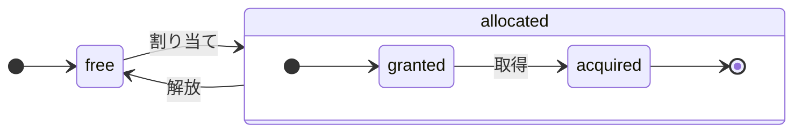

# アーキテクチャ概要

ClickHouse は真のカラム指向 DBMS です。データはカラム単位で格納され、クエリ実行時には配列（ベクターまたはカラムのチャンク）単位で処理されます。
可能な限り、個々の値ではなく配列に対して演算が行われます。
これは「ベクタ化クエリ実行」と呼ばれ、実際のデータ処理コストを低減するのに役立ちます。

この考え方自体は新しいものではありません。
その起源は `APL`（A Programming Language, 1957）とその後継である `A +`（APL 方言）、`J`（1990）、`K`（1993）、および `Q`（Kx Systems によるプログラミング言語, 2003）にさかのぼります。
配列プログラミングは科学データ処理で用いられています。また、この考え方はリレーショナルデータベースにおいても新しいものではありません。たとえば、`VectorWise` システム（Actian Corporation による Actian Vector Analytic Database としても知られる）で利用されています。

クエリ処理を高速化するには、ベクタ化クエリ実行とランタイムコード生成という 2 つの異なるアプローチがあります。後者はすべての間接参照と動的ディスパッチを排除します。どちらのアプローチも一方が他方より常に優れているわけではありません。ランタイムコード生成は、多数の演算を融合させて CPU の実行ユニットとパイプラインを最大限活用できる場合に有利となり得ます。ベクタ化クエリ実行は、一時ベクターをキャッシュに書き込み、再度読み出す必要があるため、実用面では劣ることがあります。一時データが L2 キャッシュに収まりきらない場合、これは問題になります。しかし、ベクタ化クエリ実行の方が CPU の SIMD 機能を利用しやすいという利点があります。私たちの友人による [研究論文](http://15721.courses.cs.cmu.edu/spring2016/papers/p5-sompolski.pdf) は、これら 2 つのアプローチを組み合わせる方が望ましいことを示しています。ClickHouse はベクタ化クエリ実行を採用しており、ランタイムコード生成については限定的な初期サポートを備えています。

## カラム {#columns}

`IColumn`インターフェースは、メモリ内のカラム(実際にはカラムのチャンク)を表現するために使用されます。このインターフェースは、さまざまな関係演算子の実装のためのヘルパーメソッドを提供します。ほぼすべての操作はイミュータブルです。つまり、元のカラムを変更せず、新しく変更されたカラムを作成します。例えば、`IColumn::filter`メソッドはフィルタバイトマスクを受け取ります。これは`WHERE`および`HAVING`関係演算子で使用されます。その他の例として、`ORDER BY`をサポートする`IColumn::permute`メソッド、`LIMIT`をサポートする`IColumn::cut`メソッドがあります。

さまざまな`IColumn`実装(`ColumnUInt8`、`ColumnString`など)は、カラムのメモリレイアウトを担当します。メモリレイアウトは通常、連続した配列です。整数型のカラムの場合、`std::vector`のような単一の連続した配列です。`String`および`Array`カラムの場合、2つのベクトルで構成されます。1つはすべての配列要素を連続して配置したもの、もう1つは各配列の先頭へのオフセットです。また、メモリ内に1つの値のみを格納しながらカラムのように振る舞う`ColumnConst`もあります。

## Field {#field}

それでも、個々の値を扱うことも可能です。個々の値を表現するために、`Field` が使用されます。`Field` は、`UInt64`、`Int64`、`Float64`、`String`、`Array` のタグ付き共用体(discriminated union)です。`IColumn` には、n番目の値を `Field` として取得する `operator []` メソッドと、カラムの末尾に `Field` を追加する `insert` メソッドがあります。これらのメソッドは、個々の値を表す一時的な `Field` オブジェクトを扱う必要があるため、効率的ではありません。`insertFrom`、`insertRangeFrom` などのより効率的なメソッドが存在します。

`Field` には、テーブルの特定のデータ型に関する十分な情報が含まれていません。例えば、`UInt8`、`UInt16`、`UInt32`、`UInt64` は、すべて `Field` 内では `UInt64` として表現されます。

## リーキー抽象化 {#leaky-abstractions}

`IColumn`はデータの一般的なリレーショナル変換のためのメソッドを持っていますが、すべてのニーズを満たすわけではありません。例えば、`ColumnUInt64`には2つのカラムの合計を計算するメソッドがなく、`ColumnString`には部分文字列検索を実行するメソッドがありません。これらの無数のルーチンは`IColumn`の外部で実装されています。

カラムに対する様々な関数は、`IColumn`のメソッドを使用して`Field`値を抽出する汎用的で非効率的な方法で実装することも、特定の`IColumn`実装におけるデータの内部メモリレイアウトの知識を利用した特化された方法で実装することもできます。これは、関数を特定の`IColumn`型にキャストし、内部表現を直接扱うことで実装されます。例えば、`ColumnUInt64`には内部配列への参照を返す`getData`メソッドがあり、別のルーチンがその配列を直接読み取ったり書き込んだりします。様々なルーチンの効率的な特化を可能にするために、「リーキー抽象化」を採用しています。

## データ型 {#data_types}

`IDataType`はシリアライゼーションとデシリアライゼーションを担当します。具体的には、カラムのチャンクや個々の値をバイナリ形式またはテキスト形式で読み書きします。`IDataType`はテーブル内のデータ型に直接対応します。例えば、`DataTypeUInt32`、`DataTypeDateTime`、`DataTypeString`などがあります。

`IDataType`と`IColumn`は互いに疎結合の関係にあります。異なるデータ型が、同じ`IColumn`実装によってメモリ上で表現されることがあります。例えば、`DataTypeUInt32`と`DataTypeDateTime`は、どちらも`ColumnUInt32`または`ColumnConstUInt32`によって表現されます。また、同じデータ型が異なる`IColumn`実装によって表現されることもあります。例えば、`DataTypeUInt8`は`ColumnUInt8`または`ColumnConstUInt8`によって表現できます。

`IDataType`はメタデータのみを格納します。例えば、`DataTypeUInt8`は何も格納しません(仮想ポインタ`vptr`を除く)。また、`DataTypeFixedString`は`N`(固定長文字列のサイズ)のみを格納します。

`IDataType`は、さまざまなデータ形式のためのヘルパーメソッドを持っています。例えば、引用符を含めて値をシリアライズするメソッド、JSON用に値をシリアライズするメソッド、XML形式の一部として値をシリアライズするメソッドなどがあります。データ形式との直接的な対応関係はありません。例えば、異なるデータ形式である`Pretty`と`TabSeparated`は、`IDataType`インターフェースの同じ`serializeTextEscaped`ヘルパーメソッドを使用できます。

## ブロック {#block}

`Block`は、メモリ内のテーブルのサブセット（チャンク）を表すコンテナです。これは単に3つ組のセット`(IColumn, IDataType, column name)`です。クエリ実行中、データは`Block`によって処理されます。`Block`があれば、データ（`IColumn`オブジェクト内）、その型に関する情報（`IDataType`内）があり、これによってその列をどのように扱うかがわかり、さらに列名があります。これは、テーブルからの元の列名か、計算の一時的な結果を取得するために割り当てられた人工的な名前のいずれかです。

ブロック内の列に対して何らかの関数を計算する際、その結果を持つ別の列をブロックに追加しますが、操作は不変であるため、関数の引数となる列には触れません。後で、不要な列はブロックから削除できますが、変更はできません。これは共通部分式の除去に便利です。

ブロックは処理されるデータのチャンクごとに作成されます。同じ種類の計算では、列名と型は異なるブロック間で同じままであり、列データのみが変化することに注意してください。小さなブロックサイズでは、shared_ptrと列名をコピーするための一時的な文字列のオーバーヘッドが高いため、ブロックデータをブロックヘッダーから分離する方が良いです。

## プロセッサ {#processors}

説明については [https://github.com/ClickHouse/ClickHouse/blob/master/src/Processors/IProcessor.h](https://github.com/ClickHouse/ClickHouse/blob/master/src/Processors/IProcessor.h) を参照してください。

## フォーマット {#formats}

データフォーマットはプロセッサによって実装されています。

## I/O {#io}

バイト指向の入出力には、`ReadBuffer`と`WriteBuffer`という抽象クラスがあります。これらはC++の`iostream`の代わりに使用されます。心配は不要です。成熟したC++プロジェクトは、正当な理由により`iostream`以外のものを使用しています。

`ReadBuffer`と`WriteBuffer`は、連続したバッファとそのバッファ内の位置を指すカーソルに過ぎません。実装はバッファのメモリを所有する場合と所有しない場合があります。バッファに後続のデータを充填する(`ReadBuffer`の場合)、またはバッファをどこかにフラッシュする(`WriteBuffer`の場合)仮想メソッドがあります。これらの仮想メソッドが呼び出されることは稀です。

`ReadBuffer`/`WriteBuffer`の実装は、ファイルやファイルディスクリプタ、ネットワークソケットの操作、圧縮の実装(`CompressedWriteBuffer`は別のWriteBufferで初期化され、データを書き込む前に圧縮を実行します)、その他の目的に使用されます。`ConcatReadBuffer`、`LimitReadBuffer`、`HashingWriteBuffer`という名前が、それぞれの役割を物語っています。

Read/WriteBuffersはバイトのみを扱います。入出力のフォーマット処理を支援する関数が`ReadHelpers`と`WriteHelpers`ヘッダーファイルに用意されています。例えば、数値を10進数形式で書き込むヘルパー関数があります。

結果セットを`JSON`形式で標準出力に書き込む場合に何が起こるかを見てみましょう。
プル型の`QueryPipeline`から取得可能な結果セットがあるとします。
まず、標準出力にバイトを書き込むために`WriteBufferFromFileDescriptor(STDOUT_FILENO)`を作成します。
次に、クエリパイプラインからの結果を`JSONRowOutputFormat`に接続します。これはその`WriteBuffer`で初期化され、行を`JSON`形式で標準出力に書き込みます。
これは`complete`メソッドを介して実行でき、プル型の`QueryPipeline`を完了した`QueryPipeline`に変換します。
内部的には、`JSONRowOutputFormat`は様々なJSON区切り文字を書き込み、`IColumn`への参照と行番号を引数として`IDataType::serializeTextJSON`メソッドを呼び出します。その結果、`IDataType::serializeTextJSON`は`WriteHelpers.h`のメソッドを呼び出します。例えば、数値型には`writeText`、`DataTypeString`には`writeJSONString`が使用されます。

## テーブル {#tables}

`IStorage`インターフェースはテーブルを表します。このインターフェースの異なる実装が、異なるテーブルエンジンとなります。例えば、`StorageMergeTree`、`StorageMemory`などがあります。これらのクラスのインスタンスがテーブルそのものです。

`IStorage`の主要なメソッドは`read`と`write`であり、その他に`alter`、`rename`、`drop`などがあります。`read`メソッドは次の引数を受け取ります:テーブルから読み取るカラムのセット、考慮すべき`AST`クエリ、および希望するストリーム数。このメソッドは`Pipe`を返します。

ほとんどの場合、readメソッドはテーブルから指定されたカラムを読み取ることのみを担当し、それ以降のデータ処理は行いません。
その後のすべてのデータ処理は、パイプラインの別の部分によって処理され、`IStorage`の責任範囲外となります。

ただし、注目すべき例外があります:

- ASTクエリは`read`メソッドに渡され、テーブルエンジンはこれを使用してインデックスの使用を判断し、テーブルから読み取るデータ量を削減できます。
- テーブルエンジンが特定の段階までデータを自ら処理できる場合があります。例えば、`StorageDistributed`はクエリをリモートサーバーに送信し、異なるリモートサーバーからのデータをマージできる段階までデータを処理するよう依頼し、その前処理されたデータを返すことができます。その後、クエリインタープリターがデータの処理を完了します。

テーブルの`read`メソッドは、複数の`Processors`で構成される`Pipe`を返すことができます。これらの`Processors`は、テーブルから並列に読み取ることができます。
その後、これらのプロセッサーを様々な他の変換(式の評価やフィルタリングなど)と接続でき、これらは独立して計算できます。
そして、それらの上に`QueryPipeline`を作成し、`PipelineExecutor`を介して実行します。

`TableFunction`もあります。これらは、クエリの`FROM`句で使用する一時的な`IStorage`オブジェクトを返す関数です。

テーブルエンジンの実装方法を素早く理解するには、`StorageMemory`や`StorageTinyLog`のようなシンプルなものを参照してください。

> `read`メソッドの結果として、`IStorage`は`QueryProcessingStage`を返します。これは、クエリのどの部分がストレージ内で既に計算されたかに関する情報です。

## パーサー {#parsers}

手書きの再帰下降パーサーがクエリを解析します。例えば、`ParserSelectQuery`はクエリの各部分に対応する下位パーサーを再帰的に呼び出します。パーサーは`AST`を生成します。`AST`はノードで表現され、各ノードは`IAST`のインスタンスです。

> 歴史的な理由により、パーサージェネレーターは使用されていません。

## インタープリタ {#interpreters}

インタープリタは、ASTからクエリ実行パイプラインを生成する役割を担います。`InterpreterExistsQuery`や`InterpreterDropQuery`のようなシンプルなインタープリタもあれば、より高度な`InterpreterSelectQuery`のようなものもあります。

クエリ実行パイプラインは、チャンク(特定の型を持つカラムのセット)を消費および生成できるプロセッサの組み合わせです。
プロセッサはポートを介して通信し、複数の入力ポートと複数の出力ポートを持つことができます。
より詳細な説明は[src/Processors/IProcessor.h](https://github.com/ClickHouse/ClickHouse/blob/master/src/Processors/IProcessor.h)を参照してください。

例えば、`SELECT`クエリを解釈した結果は、結果セットを読み取るための特別な出力ポートを持つ「プル型」の`QueryPipeline`です。
`INSERT`クエリの結果は、挿入するデータを書き込むための入力ポートを持つ「プッシュ型」の`QueryPipeline`です。
そして、`INSERT SELECT`クエリを解釈した結果は、入力も出力も持たず、`SELECT`から`INSERT`へ同時にデータをコピーする「完了型」の`QueryPipeline`です。

`InterpreterSelectQuery`は、クエリの解析と変換に`ExpressionAnalyzer`と`ExpressionActions`の仕組みを使用します。ここで、ルールベースのクエリ最適化の大部分が実行されます。`ExpressionAnalyzer`は非常に複雑であり、書き直す必要があります。様々なクエリ変換と最適化は、クエリのモジュール化された変換を可能にするために、個別のクラスに抽出されるべきです。

インタープリタに存在する問題に対処するため、新しい`InterpreterSelectQueryAnalyzer`が開発されました。これは`InterpreterSelectQuery`の新バージョンであり、`ExpressionAnalyzer`を使用せず、`AST`と`QueryPipeline`の間に`QueryTree`と呼ばれる追加の抽象化層を導入します。本番環境での使用に完全に対応していますが、念のため`enable_analyzer`設定を`false`に設定することで無効化できます。

## 関数 {#functions}

通常の関数と集約関数があります。集約関数については次のセクションを参照してください。

通常の関数は行数を変更しません。各行を独立して処理しているかのように動作します。実際には、関数は個々の行に対してではなく、ベクトル化されたクエリ実行を実装するためにデータの`Block`に対して呼び出されます。

[blockSize](/sql-reference/functions/other-functions#blockSize)、[rowNumberInBlock](/sql-reference/functions/other-functions#rowNumberInBlock)、[runningAccumulate](/sql-reference/functions/other-functions#runningAccumulate)など、ブロック処理を利用して行の独立性を破る特殊な関数もいくつか存在します。

ClickHouseは強い型付けを採用しているため、暗黙的な型変換は行われません。関数が特定の型の組み合わせをサポートしていない場合は例外をスローします。ただし、関数は多くの異なる型の組み合わせに対して動作する(オーバーロードされる)ことができます。例えば、`plus`関数(`+`演算子を実装)は、任意の数値型の組み合わせに対して動作します:`UInt8` + `Float32`、`UInt16` + `Int8`など。また、`concat`関数のように、可変長引数関数の中には任意の数の引数を受け入れられるものもあります。

関数の実装は、サポートするデータ型とサポートする`IColumns`を明示的にディスパッチする必要があるため、やや煩雑になる場合があります。例えば、`plus`関数は、数値型の各組み合わせ、および定数または非定数の左右の引数に対してC++テンプレートをインスタンス化することでコードが生成されます。

これは、テンプレートコードの肥大化を避けるために実行時コード生成を実装する絶好の場所です。また、積和演算のような融合関数を追加したり、1回のループ反復で複数の比較を行うことも可能になります。

ベクトル化されたクエリ実行により、関数は短絡評価されません。例えば、`WHERE f(x) AND g(y)`と記述した場合、`f(x)`がゼロである行に対しても両辺が計算されます(`f(x)`がゼロ定数式である場合を除く)。ただし、`f(x)`条件の選択性が高く、`f(x)`の計算が`g(y)`よりもはるかに低コストである場合は、複数パス計算を実装する方が効率的です。まず`f(x)`を計算し、その結果で列をフィルタリングした後、フィルタリングされた小さなデータチャンクに対してのみ`g(y)`を計算します。

## 集約関数 {#aggregate-functions}

集約関数はステートフルな関数です。渡された値を内部状態に蓄積し、その状態から結果を取得できるようにします。これらは`IAggregateFunction`インターフェースで管理されます。状態は比較的単純な場合もあれば(`AggregateFunctionCount`の状態は単一の`UInt64`値のみ)、非常に複雑な場合もあります(`AggregateFunctionUniqCombined`の状態は線形配列、ハッシュテーブル、および`HyperLogLog`確率的データ構造の組み合わせ)。

状態は、高カーディナリティの`GROUP BY`クエリを実行する際に複数の状態を扱うため、`Arena`(メモリプール)に割り当てられます。状態は自明でないコンストラクタとデストラクタを持つことができます。例えば、複雑な集約状態は追加のメモリを自ら割り当てることができます。そのため、状態の作成と破棄、およびその所有権と破棄順序を適切に管理することに注意が必要です。

集約状態は、分散クエリ実行中にネットワーク経由で渡すため、またはRAMが不足している場合にディスクに書き込むために、シリアライズおよびデシリアライズできます。データの増分集約を可能にするため、`DataTypeAggregateFunction`を使用してテーブルに保存することもできます。

> 集約関数の状態のシリアライズされたデータ形式は、現在バージョン管理されていません。集約状態が一時的にのみ保存される場合は問題ありません。しかし、増分集約のための`AggregatingMergeTree`テーブルエンジンがあり、すでに本番環境で使用されています。そのため、将来的に集約関数のシリアライズ形式を変更する際には後方互換性が必要とされます。

## サーバー {#server}

サーバーは複数の異なるインターフェースを実装しています:

- 外部クライアント用のHTTPインターフェース
- ネイティブClickHouseクライアント用、および分散クエリ実行時のサーバー間通信用のTCPインターフェース
- レプリケーション用のデータ転送インターフェース

内部的には、コルーチンやファイバーを使用しないシンプルなマルチスレッドサーバーです。サーバーは高頻度の単純なクエリを処理するのではなく、比較的低頻度の複雑なクエリを処理するように設計されているため、各クエリは分析用の膨大な量のデータを処理できます。

サーバーは、クエリ実行に必要な環境を持つ`Context`クラスを初期化します。これには、利用可能なデータベースのリスト、ユーザーとアクセス権、設定、クラスター、プロセスリスト、クエリログなどが含まれます。インタープリターはこの環境を使用します。

サーバーのTCPプロトコルについては、完全な後方互換性と前方互換性を維持しています。古いクライアントは新しいサーバーと通信でき、新しいクライアントは古いサーバーと通信できます。ただし、これを永続的に維持するつもりはなく、約1年後には古いバージョンのサポートを終了しています。

:::note
ほとんどの外部アプリケーションには、シンプルで使いやすいHTTPインターフェースの使用を推奨します。TCPプロトコルは内部データ構造とより密接に結びついています。データブロックの受け渡しに内部形式を使用し、圧縮データには独自のフレーミングを使用します。このプロトコル用のCライブラリはリリースしていません。ClickHouseコードベースの大部分をリンクする必要があり、実用的ではないためです。
:::

## 設定 {#configuration}

ClickHouse ServerはPOCO C++ライブラリをベースとしており、設定の表現に`Poco::Util::AbstractConfiguration`を使用しています。設定は`Poco::Util::ServerApplication`クラスによって保持され、このクラスは`DaemonBase`クラスに継承され、さらにclickhouse-server本体を実装する`DB::Server`クラスに継承されています。そのため、設定には`ServerApplication::config()`メソッドでアクセスできます。

設定は複数のファイル(XMLまたはYAML形式)から読み込まれ、`ConfigProcessor`クラスによって単一の`AbstractConfiguration`にマージされます。設定はサーバー起動時に読み込まれ、設定ファイルのいずれかが更新、削除、または追加された場合は後から再読み込みできます。`ConfigReloader`クラスは、これらの変更の定期的な監視と再読み込み処理を担当します。また、`SYSTEM RELOAD CONFIG`クエリでも設定の再読み込みがトリガーされます。

`Server`以外のクエリおよびサブシステムでは、`Context::getConfigRef()`メソッドを使用して設定にアクセスできます。サーバーを再起動せずに設定を再読み込み可能なすべてのサブシステムは、`Server::main()`メソッド内の再読み込みコールバックに自身を登録する必要があります。なお、新しい設定にエラーがある場合、ほとんどのサブシステムは新しい設定を無視し、警告メッセージをログに記録した上で、以前に読み込まれた設定で動作を継続します。`AbstractConfiguration`の性質上、特定のセクションへの参照を渡すことができないため、通常は代わりに`String config_prefix`が使用されます。

## スレッドとジョブ {#threads-and-jobs}

クエリの実行と付随処理を行うため、ClickHouseは頻繁なスレッドの生成と破棄を避けるべく、いずれかのスレッドプールからスレッドを割り当てます。ジョブの目的と構造に応じて選択される、いくつかのスレッドプールが存在します:

- 受信クライアントセッション用のサーバープール。
- 汎用ジョブ、バックグラウンド処理、およびスタンドアロンスレッド用のグローバルスレッドプール。
- 主にIOでブロックされ、CPU集約的でないジョブ用のIOスレッドプール。
- 定期的なタスク用のバックグラウンドプール。
- ステップに分割可能なプリエンプト可能タスク用のプール。

サーバープールは、`Server::main()`メソッドで定義された`Poco::ThreadPool`クラスのインスタンスです。最大で`max_connection`個のスレッドを持つことができます。各スレッドは単一のアクティブな接続専用です。

グローバルスレッドプールは`GlobalThreadPool`シングルトンクラスです。そこからスレッドを割り当てるには`ThreadFromGlobalPool`を使用します。これは`std::thread`に似たインターフェースを持ちますが、グローバルプールからスレッドを取得し、必要な初期化をすべて実行します。以下の設定で構成されます:

- `max_thread_pool_size` - プール内のスレッド数の上限。
- `max_thread_pool_free_size` - 新しいジョブを待機しているアイドルスレッド数の上限。
- `thread_pool_queue_size` - スケジュールされたジョブ数の上限。

グローバルプールは汎用的であり、以下で説明するすべてのプールはその上に実装されています。これはプールの階層構造として考えることができます。特化されたプールはすべて、`ThreadPool`クラスを使用してグローバルプールからスレッドを取得します。したがって、特化されたプールの主な目的は、同時実行ジョブ数に制限を適用し、ジョブスケジューリングを行うことです。プール内のスレッド数よりも多くのジョブがスケジュールされている場合、`ThreadPool`は優先度付きキューにジョブを蓄積します。各ジョブは整数の優先度を持ちます。デフォルトの優先度はゼロです。優先度の値が高いすべてのジョブは、優先度の値が低いジョブよりも先に開始されます。ただし、既に実行中のジョブ間には違いがないため、優先度はプールが過負荷状態の場合にのみ重要になります。

IOスレッドプールは、`IOThreadPool::get()`メソッドを介してアクセス可能な通常の`ThreadPool`として実装されています。グローバルプールと同様に、`max_io_thread_pool_size`、`max_io_thread_pool_free_size`、および`io_thread_pool_queue_size`の設定で構成されます。IOスレッドプールの主な目的は、IOジョブによるグローバルプールの枯渇を回避し、クエリがCPUを完全に活用できなくなることを防ぐことです。S3へのバックアップは大量のIO操作を行うため、対話型クエリへの影響を回避するために、`max_backups_io_thread_pool_size`、`max_backups_io_thread_pool_free_size`、および`backups_io_thread_pool_queue_size`の設定で構成された別個の`BackupsIOThreadPool`が存在します。

定期的なタスク実行のために`BackgroundSchedulePool`クラスが存在します。`BackgroundSchedulePool::TaskHolder`オブジェクトを使用してタスクを登録でき、プールは同じタスクが同時に2つのジョブを実行しないことを保証します。また、タスクの実行を将来の特定の時点まで延期したり、タスクを一時的に無効化したりすることもできます。グローバル`Context`は、異なる目的のためにこのクラスのいくつかのインスタンスを提供します。汎用タスクには`Context::getSchedulePool()`が使用されます。

プリエンプト可能タスク用の特化されたスレッドプールも存在します。このような`IExecutableTask`タスクは、ステップと呼ばれる順序付けられたジョブのシーケンスに分割できます。短いタスクを長いタスクよりも優先できる方法でこれらのタスクをスケジュールするために、`MergeTreeBackgroundExecutor`が使用されます。名前が示すように、マージ、ミューテーション、フェッチ、移動などのバックグラウンドMergeTree関連操作に使用されます。プールインスタンスは、`Context::getCommonExecutor()`およびその他の類似メソッドを使用して利用できます。

ジョブにどのプールが使用されるかに関わらず、開始時にこのジョブ用の`ThreadStatus`インスタンスが作成されます。これは、スレッドID、クエリID、パフォーマンスカウンタ、リソース消費量、その他多くの有用なデータなど、すべてのスレッドごとの情報をカプセル化します。ジョブは`CurrentThread::get()`呼び出しによってスレッドローカルポインタを介してこれにアクセスできるため、すべての関数に渡す必要はありません。

スレッドがクエリ実行に関連している場合、`ThreadStatus`に付加される最も重要なものはクエリコンテキスト`ContextPtr`です。すべてのクエリは、サーバープール内にマスタースレッドを持ちます。マスタースレッドは、`ThreadStatus::QueryScope query_scope(query_context)`オブジェクトを保持することで付加を行います。マスタースレッドは、`ThreadGroupStatus`オブジェクトで表されるスレッドグループも作成します。このクエリ実行中に割り当てられるすべての追加スレッドは、`CurrentThread::attachTo(thread_group)`呼び出しによってそのスレッドグループに付加されます。スレッドグループは、プロファイルイベントカウンタを集約し、単一のタスクに専念するすべてのスレッドによるメモリ消費量を追跡するために使用されます(詳細については`MemoryTracker`および`ProfileEvents::Counters`クラスを参照してください)。

## 同時実行制御 {#concurrency-control}

並列化可能なクエリは、`max_threads`設定を使用して自身を制限します。この設定のデフォルト値は、単一のクエリがすべてのCPUコアを最適に活用できるように選択されています。しかし、複数の同時実行クエリが存在し、それぞれがデフォルトの`max_threads`設定値を使用している場合はどうなるでしょうか。その場合、クエリはCPUリソースを共有することになります。OSはスレッドを常に切り替えることで公平性を確保しますが、これによりパフォーマンスペナルティが発生します。`ConcurrencyControl`は、このペナルティに対処し、大量のスレッドの割り当てを回避するのに役立ちます。設定項目`concurrent_threads_soft_limit_num`は、CPU負荷を適用する前に割り当て可能な同時実行スレッド数を制限するために使用されます。

CPU`スロット`の概念が導入されています。スロットは同時実行の単位です。スレッドを実行するには、クエリは事前にスロットを取得し、スレッドが停止したときにそれを解放する必要があります。スロットの数はサーバー全体で制限されています。総需要が総スロット数を超える場合、複数の同時実行クエリがCPUスロットを競合します。`ConcurrencyControl`は、公平な方法でCPUスロットスケジューリングを行うことにより、この競合を解決する責任を負います。

各スロットは、以下の状態を持つ独立したステートマシンとして見ることができます。

- `free`: スロットは任意のクエリによって割り当て可能です。
- `granted`: スロットは特定のクエリによって`割り当て`られていますが、まだどのスレッドにも取得されていません。
- `acquired`: スロットは特定のクエリによって`割り当て`られ、スレッドによって取得されています。

`割り当て済み`スロットは、`granted`と`acquired`の2つの異なる状態を取り得ることに注意してください。前者は遷移状態であり、実際には短時間であるべきです(スロットがクエリに割り当てられた瞬間から、そのクエリのいずれかのスレッドによってスケールアップ手順が実行される瞬間まで)。

`ConcurrencyControl`のAPIは、以下の関数で構成されています。

1. クエリのリソース割り当てを作成する: `auto slots = ConcurrencyControl::instance().allocate(1, max_threads);`。これにより、最低1つ、最大`max_threads`個のスロットが割り当てられます。最初のスロットは即座に付与されますが、残りのスロットは後で付与される可能性があることに注意してください。したがって、制限はソフトです。すべてのクエリが少なくとも1つのスレッドを取得するためです。
2. すべてのスレッドについて、割り当てからスロットを取得する必要があります: `while (auto slot = slots->tryAcquire()) spawnThread([slot = std::move(slot)] { ... });`。
3. スロットの総数を更新する: `ConcurrencyControl::setMaxConcurrency(concurrent_threads_soft_limit_num)`。サーバーを再起動せずに実行時に実行できます。

このAPIにより、クエリは(CPU負荷が存在する場合でも)少なくとも1つのスレッドで開始し、後で`max_threads`までスケールアップすることができます。

## 分散クエリ実行 {#distributed-query-execution}

クラスタ構成内のサーバーは、ほぼ独立して動作します。クラスタ内の1つまたはすべてのサーバーに`Distributed`テーブルを作成できます。`Distributed`テーブルはデータ自体を保存せず、クラスタの複数ノード上のすべてのローカルテーブルへの「ビュー」を提供するだけです。`Distributed`テーブルからSELECTを実行すると、クエリが書き換えられ、負荷分散設定に従ってリモートノードが選択され、それらにクエリが送信されます。`Distributed`テーブルは、異なるサーバーからの中間結果をマージできる段階まで、リモートサーバーにクエリの処理を要求します。その後、中間結果を受け取り、それらをマージします。分散テーブルは、可能な限り多くの処理をリモートサーバーに分散させ、ネットワーク経由で送信される中間データを最小限に抑えます。

INまたはJOIN句にサブクエリがあり、それぞれが`Distributed`テーブルを使用している場合、状況はより複雑になります。これらのクエリの実行には、異なる戦略が用意されています。

分散クエリ実行のためのグローバルなクエリプランは存在しません。各ノードは、その担当部分に対するローカルなクエリプランを持ちます。利用可能なのは単純な1パスの分散クエリ実行のみです。つまり、リモートノードにクエリを送信し、その後結果をマージします。しかし、高カーディナリティの`GROUP BY`や、JOINのための大量の一時データを伴う複雑なクエリには、この方法は適していません。このような場合、サーバー間でデータを「再配置」する必要があり、追加の調整が必要になります。ClickHouseは現在この種のクエリ実行をサポートしておらず、今後取り組む必要があります。

## マージツリー {#merge-tree}

`MergeTree`は、プライマリキーによるインデックス作成をサポートするストレージエンジンファミリーです。プライマリキーは、任意のカラムまたは式のタプルとして定義できます。`MergeTree`テーブルのデータは「パート」に格納されます。各パートはプライマリキーの順序でデータを格納するため、データはプライマリキータプルによって辞書順にソートされます。すべてのテーブルカラムは、これらのパート内の個別の`column.bin`ファイルに格納されます。ファイルは圧縮されたブロックで構成されています。各ブロックは通常、平均値サイズに応じて、非圧縮データで64 KBから1 MBです。ブロックは、連続して配置されたカラム値で構成されています。カラム値は各カラムで同じ順序になっており（プライマリキーが順序を定義します）、複数のカラムを反復処理すると、対応する行の値が取得されます。

プライマリキー自体は「スパース」です。すべての行を対象とするのではなく、一部のデータ範囲のみを対象とします。個別の`primary.idx`ファイルには、N番目ごとの行のプライマリキーの値が格納されており、このNは`index_granularity`と呼ばれます（通常、N = 8192）。また、各カラムには「マーク」を含む`column.mrk`ファイルがあり、これはデータファイル内のN番目ごとの行へのオフセットです。各マークはペアになっており、ファイル内の圧縮ブロックの先頭へのオフセットと、展開されたブロック内のデータの先頭へのオフセットです。通常、圧縮ブロックはマークによって整列されており、展開されたブロック内のオフセットはゼロです。`primary.idx`のデータは常にメモリに常駐し、`column.mrk`ファイルのデータはキャッシュされます。

`MergeTree`のパートから何かを読み取る際には、`primary.idx`データを参照して要求されたデータを含む可能性のある範囲を特定し、次に`column.mrk`データを参照してそれらの範囲の読み取りを開始する位置のオフセットを計算します。スパース性のため、余分なデータが読み取られる可能性があります。ClickHouseは、単純なポイントクエリの高負荷には適していません。なぜなら、各キーに対して`index_granularity`行を含む範囲全体を読み取る必要があり、各カラムに対して圧縮ブロック全体を展開する必要があるためです。インデックスをスパースにしたのは、単一サーバーあたり数兆行を維持できるようにする必要があり、インデックスのメモリ消費を目立たないようにするためです。また、プライマリキーはスパースであるため、一意ではありません。INSERT時にテーブル内のキーの存在を確認することはできません。テーブル内に同じキーを持つ多数の行が存在する可能性があります。

`MergeTree`に大量のデータを`INSERT`すると、そのデータはプライマリキーの順序でソートされ、新しいパートを形成します。バックグラウンドスレッドが定期的にいくつかのパートを選択し、それらを単一のソート済みパートにマージして、パート数を比較的少なく保ちます。これが`MergeTree`と呼ばれる理由です。もちろん、マージは「書き込み増幅」につながります。すべてのパートは不変です。作成と削除のみが行われ、変更されることはありません。SELECTが実行されると、テーブルのスナップショット（パートのセット）が保持されます。マージ後も、障害後の復旧を容易にするために古いパートをしばらく保持します。そのため、マージされたパートが破損している可能性がある場合、そのソースパートで置き換えることができます。

`MergeTree`はLSMツリーではありません。MEMTABLEとLOGを含まず、挿入されたデータはファイルシステムに直接書き込まれます。この動作により、MergeTreeはバッチでデータを挿入するのに非常に適しています。したがって、少量の行を頻繁に挿入することは、MergeTreeには理想的ではありません。たとえば、1秒あたり数行であれば問題ありませんが、1秒あたり1000回行うことはMergeTreeには最適ではありません。ただし、この制限を克服するために、小規模な挿入用の非同期挿入モードがあります。このようにしたのは、シンプルさのためであり、また、アプリケーションですでにバッチでデータを挿入しているためです。

バックグラウンドマージ中に追加の処理を行うMergeTreeエンジンがあります。例としては、`CollapsingMergeTree`と`AggregatingMergeTree`があります。これは更新の特別なサポートとして扱うことができます。これらは真の更新ではないことに注意してください。なぜなら、ユーザーは通常、バックグラウンドマージが実行される時間を制御できず、`MergeTree`テーブルのデータは完全にマージされた形式ではなく、ほぼ常に複数のパートに格納されているためです。

## レプリケーション {#replication}

ClickHouseのレプリケーションはテーブル単位で設定できます。同じサーバー上にレプリケートされたテーブルとレプリケートされていないテーブルを混在させることができます。また、あるテーブルは2ファクターレプリケーション、別のテーブルは3ファクターレプリケーションというように、異なる方法でレプリケートすることも可能です。

レプリケーションは`ReplicatedMergeTree`ストレージエンジンに実装されています。`ZooKeeper`内のパスはストレージエンジンのパラメータとして指定されます。`ZooKeeper`内で同じパスを持つすべてのテーブルは互いのレプリカとなり、データを同期して整合性を維持します。レプリカは、テーブルを作成または削除するだけで動的に追加・削除できます。

レプリケーションは非同期マルチマスター方式を使用します。`ZooKeeper`とのセッションを持つ任意のレプリカにデータを挿入でき、データは他のすべてのレプリカに非同期でレプリケートされます。ClickHouseはUPDATEをサポートしていないため、レプリケーションは競合フリーです。デフォルトでは挿入のクォーラム確認がないため、1つのノードが故障すると挿入直後のデータが失われる可能性があります。挿入クォーラムは`insert_quorum`設定を使用して有効にできます。

レプリケーションのメタデータはZooKeeperに保存されます。実行すべきアクションを列挙するレプリケーションログが存在します。アクションには、パートの取得、パートのマージ、パーティションの削除などがあります。各レプリカはレプリケーションログを自身のキューにコピーし、キューからアクションを実行します。例えば、挿入時には「パートを取得する」アクションがログに作成され、すべてのレプリカがそのパートをダウンロードします。マージはバイト単位で同一の結果を得るためにレプリカ間で調整されます。すべてのパートは全レプリカで同じ方法でマージされます。リーダーの1つが最初に新しいマージを開始し、「パートをマージする」アクションをログに書き込みます。複数のレプリカ(またはすべて)が同時にリーダーになることができます。レプリカがリーダーになることを防ぐには、`merge_tree`設定の`replicated_can_become_leader`を使用します。リーダーはバックグラウンドマージのスケジューリングを担当します。

レプリケーションは物理的です。ノード間で転送されるのは圧縮されたパートのみであり、クエリは転送されません。ネットワーク増幅を回避してネットワークコストを削減するため、ほとんどの場合、マージは各レプリカで独立して処理されます。大きなマージ済みパートがネットワーク経由で送信されるのは、レプリケーション遅延が著しい場合のみです。

さらに、各レプリカは自身の状態をパートのセットとそのチェックサムとしてZooKeeperに保存します。ローカルファイルシステム上の状態がZooKeeper内の参照状態と異なる場合、レプリカは他のレプリカから欠落または破損したパートをダウンロードして整合性を復元します。ローカルファイルシステムに予期しないデータや破損したデータがある場合、ClickHouseはそれを削除せず、別のディレクトリに移動して無視します。

:::note
ClickHouseクラスタは独立したシャードで構成され、各シャードはレプリカで構成されます。クラスタは**弾力的ではない**ため、新しいシャードを追加した後、データはシャード間で自動的に再バランスされません。代わりに、クラスタの負荷は不均等になるように調整されることが想定されています。この実装により、より多くの制御が可能になり、数十ノード程度の比較的小規模なクラスタには適しています。しかし、本番環境で使用している数百ノードのクラスタでは、このアプローチは大きな欠点となります。動的にレプリケートされた領域を持ち、クラスタ間で自動的に分割およびバランスできる、クラスタ全体にまたがるテーブルエンジンを実装する必要があります。
:::
